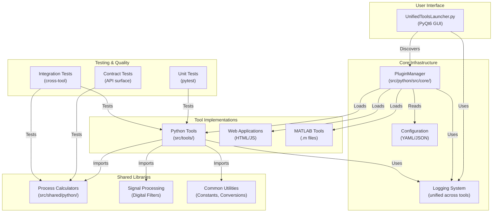
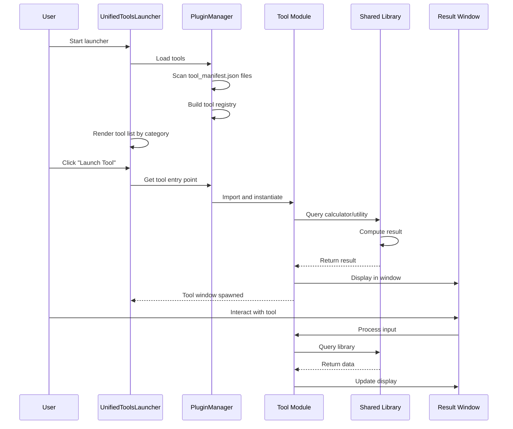

# Tools Repository - Architecture Overview

**Version:** 2.0  
**Last Updated:** April 2026  
**Status:** Production

---

## Table of Contents

1. [High-Level System Design](#high-level-system-design)
2. [Component Architecture](#component-architecture)
3. [Data Flow](#data-flow)
4. [Plugin Discovery System](#plugin-discovery-system)
5. [Tool Types](#tool-types)
6. [File Organization](#file-organization)
7. [Shared Library Architecture](#shared-library-architecture)
8. [Dependencies](#dependencies)
9. [Links to Detailed Documentation](#links-to-detailed-documentation)

---

## High-Level System Design

The Tools repository is a **unified platform for scientific and engineering utilities**, organized as a monorepo with:

- **Core Launcher** (PyQt6 GUI) - Single entry point for all tools
- **Plugin System** - Automatic tool discovery via manifests
- **Shared Libraries** - Fleet-wide calculators and signal processing utilities
- **Tool Implementations** - Self-contained Python, MATLAB, and web tools
- **Test Suite** - Comprehensive unit, integration, and contract tests

### Architecture Philosophy

```
┌─────────────────────────────────────────────────────────────┐
│                    "One Brain, Many Tools"                   │
├─────────────────────────────────────────────────────────────┤
│                                                              │
│  • Single launcher (UnifiedToolsLauncher) coordinates all   │
│  • Plugin system automatically discovers tools              │
│  • Tools are isolated and independently launchable          │
│  • Shared libraries reduce code duplication                 │
│  • No inter-tool dependencies (loose coupling)              │
│                                                              │
└─────────────────────────────────────────────────────────────┘
```

---

## Component Architecture

### System Component Diagram



---

## Data Flow

### User → Launcher → Tool → Result



### Data Flow Architecture

```
┌─────────────────────────────────────────────────────────────┐
│                      USER                                   │
└─────────────────────────────────────────────────────────────┘
                          │
                          │ (1) Click "Launch Tool"
                          ▼
┌─────────────────────────────────────────────────────────────┐
│              UnifiedToolsLauncher (PyQt6)                   │
│  • Tabbed interface by category (Data, Scientific, etc.)   │
│  • Tool registry from PluginManager                         │
│  • Spawn subprocess for each tool launch                    │
└─────────────────────────────────────────────────────────────┘
                          │
                          │ (2) Get tool metadata + entry point
                          ▼
┌─────────────────────────────────────────────────────────────┐
│                   Plugin Manager                            │
│  • Reads tools.json (centralized registry)                  │
│  • Scans for tool_manifest.json (auto-discovery)            │
│  • Validates paths and entry points                         │
│  • Merges both registries                                   │
└─────────────────────────────────────────────────────────────┘
                          │
                          │ (3) Import tool module
                          ▼
┌─────────────────────────────────────────────────────────────┐
│              Tool Module (Python/Web/MATLAB)                │
│  • Parse user input (GUI widgets / web form / CLI args)     │
│  • Call shared libraries as needed                          │
│  • Format and display results                               │
└─────────────────────────────────────────────────────────────┘
                          │
                          │ (4) Query/compute
                          ▼
┌─────────────────────────────────────────────────────────────┐
│           Shared Libraries (src/shared/python/)             │
│  • Process calculators (pressure, flow, thermal, etc.)      │
│  • Signal processing (filters, transformations)             │
│  • Utilities (constants, unit conversions)                  │
│  • NO external API calls (self-contained)                   │
└─────────────────────────────────────────────────────────────┘
                          │
                          │ (5) Return result
                          ▼
┌─────────────────────────────────────────────────────────────┐
│                   Result Display                            │
│  • Formatted output to user                                 │
│  • Charts, tables, files as applicable                      │
│  • Error messages with suggestions                          │
└─────────────────────────────────────────────────────────────┘
```

---

## Plugin Discovery System

The Tools repository uses a **hybrid discovery system** for maximum flexibility:

### 1. Centralized Registry (`tools.json`)

Located at repository root. Manual, explicit tool registration.

```json
{
  "tools": [
    {
      "name": "Unit Converter",
      "path": "src/web_applications/unit_converter/app.py",
      "type": "python",
      "description": "Convert between units",
      "category": "Web Applications"
    }
  ]
}
```

**When to use:** Tools with complex setup or legacy configurations.

### 2. Automatic Discovery (`tool_manifest.json`)

Placed in each tool's root directory. Self-documenting, version-controlled.

```json
{
  "name": "My Tool",
  "description": "What it does",
  "path": "main.py",
  "type": "python",
  "category": "Utilities"
}
```

**When to use:** All new tools (preferred approach).

### Discovery Process

```python
# 1. Load tools.json (explicit)
centralized_tools = PluginManager.load_from_json()

# 2. Scan directory tree for tool_manifest.json files
discovered_tools = PluginManager.scan_for_manifests()

# 3. Merge both registries (discovered takes precedence if duplicate)
all_tools = merge(centralized_tools, discovered_tools)

# 4. Validate paths and entry points
validated_tools = validate_all(all_tools)

# 5. Return to launcher for rendering
return validated_tools
```

---

## Tool Types

The repository supports four tool execution types:

| Type              | Execution              | Example           | Entry Point               |
| ----------------- | ---------------------- | ----------------- | ------------------------- |
| **python**        | Subprocess with Python | PyQt6 GUI tool    | `def main()` function     |
| **web**           | Browser via Flask/Node | HTML/JS dashboard | `app.run()` or npm server |
| **matlab**        | MATLAB engine or file  | `.m` script       | Executable `.m` file      |
| **bat** / **cmd** | Windows batch / shell  | Utility script    | Executable script         |

### Python Tool Example

```python
# src/tools/my_tool/main.py
from PyQt6.QtWidgets import QMainWindow

class MyToolWindow(QMainWindow):
    """Tool GUI."""
    def __init__(self):
        super().__init__()
        self.init_ui()

    def init_ui(self):
        self.setWindowTitle("My Tool")
        # ... layout ...

def main():
    """Entry point for launcher."""
    app = QApplication(sys.argv)
    window = MyToolWindow()
    window.show()
    sys.exit(app.exec())

if __name__ == "__main__":
    main()
```

### Tool Manifest Example

```json
{
  "name": "My Tool",
  "path": "main.py",
  "type": "python",
  "description": "Does something useful",
  "category": "Development Tools"
}
```

---

## File Organization

### Repository Root Structure

```
Tools/
├── UnifiedToolsLauncher.py         ← Main entry point (PyQt6)
├── tools.json                       ← Centralized tool registry
├── requirements.txt                 ← Core dependencies
├── pyproject.toml                   ← Package metadata
├── setup.py                         ← Installation config
├── CLAUDE.md                        ← Governance rules
├── README.md                        ← Getting started
├── QUICKSTART.md                    ← Quick reference
│
├── src/
│   ├── python/src/
│   │   ├── core/
│   │   │   ├── plugin_manager.py   ← Tool discovery engine
│   │   │   └── launcher.py         ← Legacy launcher
│   │   └── utils/
│   │       ├── compatibility.py    ← Python 3.10 shims
│   │       └── logger.py           ← Unified logging
│   │
│   ├── shared/python/
│   │   └── upstream_drift_tools/   ← Fleet-wide libraries
│   │       ├── process_calculators/
│   │       ├── signal_toolkit/
│   │       └── utils/
│   │
│   └── tools/                       ← Individual tool implementations
│       ├── temperature_converter/
│       │   ├── converter.py
│       │   ├── temperature_gui.py
│       │   └── tool_manifest.json
│       ├── folder_tool/
│       └── ... (30+ more tools)
│
├── tests/
│   ├── test_plugin_manager.py       ← Core system tests
│   ├── test_launcher.py
│   ├── unit/                        ← Unit tests by tool
│   ├── contract/                    ← API contract tests
│   └── integration/                 ← Cross-tool tests
│
└── docs/
    ├── ONBOARDING.md                ← Developer setup guide
    ├── BUILD_A_TOOL.md              ← Tool creation tutorial
    ├── ARCHITECTURE_OVERVIEW.md     ← This file
    ├── architecture/
    │   ├── PLUGIN_SYSTEM.md
    │   ├── FLEET_ARCHITECTURE.md
    │   ├── JULES_ARCHITECTURE.md
    │   └── ...
    └── adr/                         ← Architecture Decision Records
```

---

## Shared Library Architecture

### Purpose

Reduce code duplication across the Tools repository and downstream repos (UpstreamDrift, Gasification_Model).

### Location

```
src/shared/python/upstream_drift_tools/
```

### Core Components

#### 1. Process Calculators

Engineering calculators for thermodynamic, fluid dynamics, and financial analysis:

- `process_calculators/` — Pressure drop, flow, thermal, scrubber sizing, etc.
- No external API calls (self-contained)
- Tested with unit + contract tests

```python
from src.shared.python.upstream_drift_tools.process_calculators import PressureDropCalculator

calc = PressureDropCalculator()
drop = calc.calculate(diameter=0.1, velocity=2.0, length=10.0)
```

#### 2. Signal Processing Toolkit

Digital signal processing with filters, transformations, and analysis:

- `signal_toolkit/` — Butterworth, Chebyshev filters, FFT, windowing
- PyQt6 interactive visualization widget
- Full documentation and examples

```python
from src.shared.python.upstream_drift_tools.signal_toolkit import Signal, Butterworth

sig = Signal(frequency=100)
filt = Butterworth(order=4, cutoff=10)
filtered = sig.apply_filter(filt)
```

#### 3. Utilities

Common constants, conversions, and helpers:

- `unit_constants.py` — NIST physical constants
- Unit conversion functions
- Data validation helpers

```python
from src.shared.python.upstream_drift_tools.utils import GRAVITY, celsius_to_fahrenheit

print(f"g = {GRAVITY} m/s²")
print(f"0°C = {celsius_to_fahrenheit(0)}°F")
```

### Dependency Graph

```
Tool (e.g., Temperature Converter)
    ↓
    ├── Imports from shared libraries
    │   ├── process_calculators
    │   ├── signal_toolkit
    │   └── utils
    │
    └── NO inter-tool imports
        (Loose coupling for maintainability)
```

### Governance Rules

- **Public API stability:** Breaking changes require coordinated PRs in downstream repos
- **Contract tests:** All public functions must have API contract tests
- **Input validation:** All functions validate types and ranges (TypeError/ValueError)
- **Documentation:** Docstrings with Args, Returns, Raises sections
- **No print():** Use logging instead for production code

See [CLAUDE.md](../CLAUDE.md) for full governance.

---

## Dependencies

### Core Dependencies

| Package        | Purpose              | Version |
| -------------- | -------------------- | ------- |
| **PyQt6**      | GUI framework        | ≥6.6.0  |
| **pytest**     | Testing framework    | ≥8.2.0  |
| **ruff**       | Linting & formatting | Latest  |
| **mypy**       | Type checking        | Latest  |
| **numpy**      | Numerical computing  | Latest  |
| **scipy**      | Scientific functions | Latest  |
| **pandas**     | Data processing      | Latest  |
| **matplotlib** | Plotting             | Latest  |

### Development Dependencies

See `requirements.txt` and `pyproject.toml` for complete list.

### Python Version Support

- **Minimum:** Python 3.10 (with compatibility shims)
- **Recommended:** Python 3.11 or 3.12
- **Tested:** Python 3.10, 3.11, 3.12 (in CI)

---

## Links to Detailed Documentation

### Getting Started

- **[ONBOARDING.md](ONBOARDING.md)** — Developer setup (< 30 min)
- **[BUILD_A_TOOL.md](BUILD_A_TOOL.md)** — Create your first tool (1.5 hours)
- **[QUICKSTART.md](../QUICKSTART.md)** — Quick reference for common commands

### Architecture & Design

- **[PLUGIN_SYSTEM.md](architecture/PLUGIN_SYSTEM.md)** — Tool discovery mechanism
- **[FLEET_ARCHITECTURE.md](architecture/FLEET_ARCHITECTURE.md)** — Multi-repo architecture
- **[LAUNCHERS.md](architecture/LAUNCHERS.md)** — Launcher comparison & history
- **[JULES_ARCHITECTURE.md](architecture/JULES_ARCHITECTURE.md)** — CI/CD orchestration

### Development Standards

- **[CLAUDE.md](../CLAUDE.md)** — Governance, CI requirements, coding standards
- **[CONTRIBUTING.md](../CONTRIBUTING.md)** — Contribution workflow
- **[GUARDRAILS_GUIDELINES.md](development/GUARDRAILS_GUIDELINES.md)** — Best practices
- **[BRANCHING_WORKFLOW_RULE.md](development/BRANCHING_WORKFLOW_RULE.md)** — Git workflow

### Reference

- **[README.md](../README.md)** — Repository overview & troubleshooting
- **[ADR (Architecture Decision Records)](adr/)** — Why we made key choices

---

## Key Design Patterns

### 1. Plugin Architecture

**Rationale:** Decouple tool implementations from launcher  
**Implementation:** PluginManager scans for tool_manifest.json  
**Benefit:** New tools don't require launcher code changes

### 2. Shared Libraries (DRY)

**Rationale:** Reduce duplication across Tools and downstream repos  
**Implementation:** Centralized calculators in `src/shared/python/`  
**Benefit:** Single source of truth for algorithms

### 3. Contract Testing

**Rationale:** Detect breaking changes to public APIs  
**Implementation:** `@pytest.mark.contract` for API surface tests  
**Benefit:** Prevents silent API breakage affecting downstream users

### 4. Design by Contract (DbC)

**Rationale:** Catch invalid inputs early with clear errors  
**Implementation:** Type validation + ValueError/TypeError  
**Benefit:** Fail fast, easier debugging

### 5. Loose Coupling

**Rationale:** Tools are independent, testable, launchable  
**Implementation:** No cross-tool imports  
**Benefit:** Tools can be added/removed without affecting others

---

## Deployment Architecture

```
┌─────────────────────────────────────────────┐
│     GitHub Repository (main branch)         │
│  • Source code                              │
│  • Tests                                    │
│  • Documentation                            │
└────────────────────┬────────────────────────┘
                     │
                     │ (1) Developer pushes
                     │
                     ▼
┌─────────────────────────────────────────────┐
│      CI/CD Pipeline (GitHub Actions)        │
│  • Ruff formatting & linting                │
│  • pytest with coverage (10% minimum)       │
│  • Contract tests (API validation)          │
│  • Manifest validation                      │
└────────────────────┬────────────────────────┘
                     │
                     │ (2) All checks pass
                     │
                     ▼
┌─────────────────────────────────────────────┐
│        Developer Local Installation         │
│  • git clone <repo>                         │
│  • python -m venv venv                      │
│  • pip install -r requirements.txt          │
│  • python UnifiedToolsLauncher.py           │
└─────────────────────────────────────────────┘
```

---

## Troubleshooting Architecture Issues

### Launcher Won't Start

**Check:** Does PluginManager find tools?

```bash
python -c "from src.python.src.core.plugin_manager import PluginManager; \
           pm = PluginManager('.'); \
           tools = pm.load_tools_with_discovery(); \
           print(f'Found {len(tools)} tools')"
```

### Tool Doesn't Appear

**Check:** Is tool_manifest.json in the right place?

```bash
find . -name tool_manifest.json | head -20
```

**Check:** Is the path correct (relative to repo root)?

```bash
cat src/tools/my_tool/tool_manifest.json | grep path
```

### Contract Tests Failing

**Check:** Did you break the public API?

```bash
python -m pytest tests/ -m contract -v
```

Review the test failure and either:

1. Revert the breaking change, OR
2. Bump the version and coordinate PRs in downstream repos

---

## Contributing to the Architecture

### Adding a New Tool

1. Create directory: `src/tools/my_tool/`
2. Add tool_manifest.json
3. Implement tool logic
4. Write tests (unit + contract)
5. Submit PR — CI validates manifest and tests

### Modifying Shared Libraries

**CRITICAL:** Shared libraries are consumed by multiple repos.

1. Check what imports your changes
2. If breaking: coordinate PRs in downstream repos
3. Update contract tests first
4. Reference GitHub issue in commit message

### Proposing Architecture Changes

1. Create an Architecture Decision Record (ADR) in `docs/adr/`
2. Link to related issues/discussions
3. Update ARCHITECTURE_OVERVIEW.md once approved

---

## Summary

The Tools repository follows a **modular, plugin-based architecture** designed for:

- **Ease of use:** Single launcher (PyQt6)
- **Ease of development:** Plugin system, auto-discovery
- **Code reuse:** Shared libraries (DRY)
- **Stability:** Contract tests prevent breaking changes
- **Testability:** Every component independently testable
- **Scalability:** Add tools without touching launcher code

This architecture enables the Tools repo to serve as a **shared library** for the broader fleet (UpstreamDrift, Gasification_Model) while remaining easy to develop and extend.

---

**Next Steps:**

1. **New developer?** Start with [ONBOARDING.md](ONBOARDING.md)
2. **Building a tool?** Follow [BUILD_A_TOOL.md](BUILD_A_TOOL.md)
3. **Want details?** Read [PLUGIN_SYSTEM.md](architecture/PLUGIN_SYSTEM.md) or [FLEET_ARCHITECTURE.md](architecture/FLEET_ARCHITECTURE.md)
4. **Questions?** Check [CLAUDE.md](../CLAUDE.md) for governance and standards

---

**Document Status:**  
Created: April 2026  
Last Updated: April 2026  
Maintainer: Development Team
