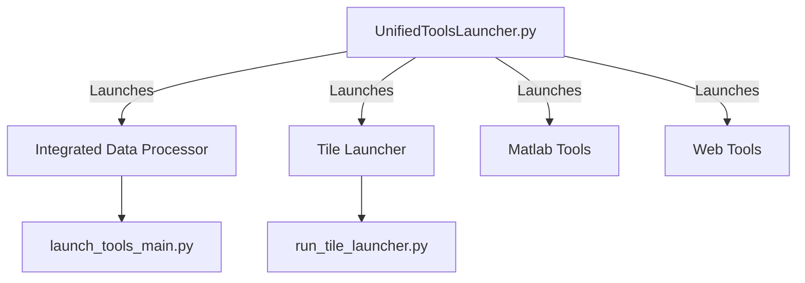

# Launcher Hierarchy & Guide

This repository contains multiple entry points for launching tools. This document clarifies the purpose of each launcher and the recommended hierarchy.

## 🚀 Primary Launcher

### `UnifiedToolsLauncher.py` (Recommended)
This is the **canonical entry point** for the entire repository.
- **Technology:** PyQt6 (Modern GUI)
- **Features:**
  - Tabbed interface for all tools.
  - Robust error handling.
  - Python 3.11+ requirement check.
  - Launches other tools as subprocesses or integrated windows.

## ⚠️ Legacy / Integrated Launchers

### `launch_tools_main.py`
This script launches the **Integrated Data Processor** application directly.
- **Technology:** Tkinter / CustomTkinter
- **Purpose:** Specifically for the Data Processor toolset (CSV processing, plotting).
- **Status:** Maintained as a sub-component, but users should prefer `UnifiedToolsLauncher.py`.

### `run_tile_launcher.py` / `src/python/src/tile_launcher/main.py`
A tile-based launcher interface.
- **Technology:** PyQt6
- **Purpose:** Visual grid of available tools.
- **Status:** Integrated into the Unified Launcher.

### `Launcher.py`
Legacy entry point. **Deprecated**.
- **Status:** Do not use. Redirects or fails.

## Launcher Architecture



## Usage

To start the tools suite:

```bash
# Ensure you are in the repository root
python UnifiedToolsLauncher.py
```
