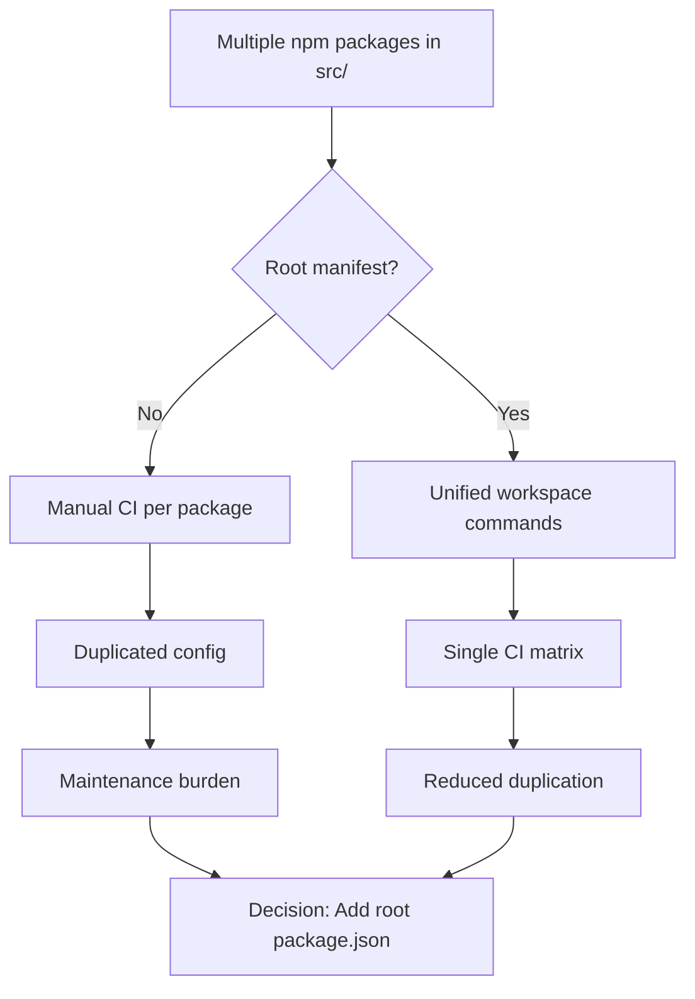
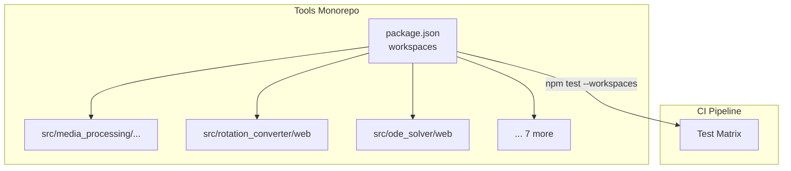

# ADR-001: Monorepo Workspace Structure

- Status: Accepted
- Date: 2026-04-28
- Decision Makers: Tools maintainers
- Related Issues/PRs: #2357

## Context

The Tools repository contains multiple independent web applications
(scientific calculators, simulators, media processors) each with its own
npm package.  Previously there was no root package.json, preventing
workspace-aware commands like `npm test --workspaces` and making CI
matrix generation manual.

## Decision Flow

## Decision

Add a root `package.json` with `workspaces` array enumerating all npm
packages under `src/`.  Mark the root as `"private": true` to prevent
accidental publishing of an umbrella package.

## Alternatives Considered

1. **Keep individual packages**: Rejected because CI duplication is high.
2. **Use pnpm workspaces in separate `pnpm-workspace.yaml`**: Rejected to
   stay within npm ecosystem and reduce toolchain dependencies.

## Component / Deployment Diagram

## Consequences

- Positive: Unified install, test, and build commands across all packages.
- Negative: Requires Node >= 18 for modern workspace support.
- Follow-up actions: Add workspace-aware lint and build CI jobs.