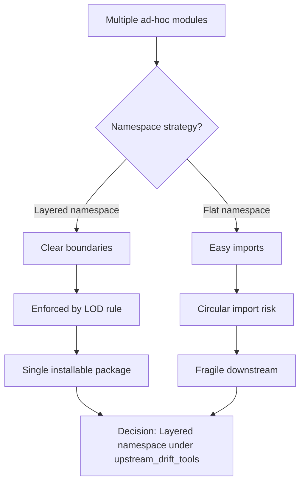
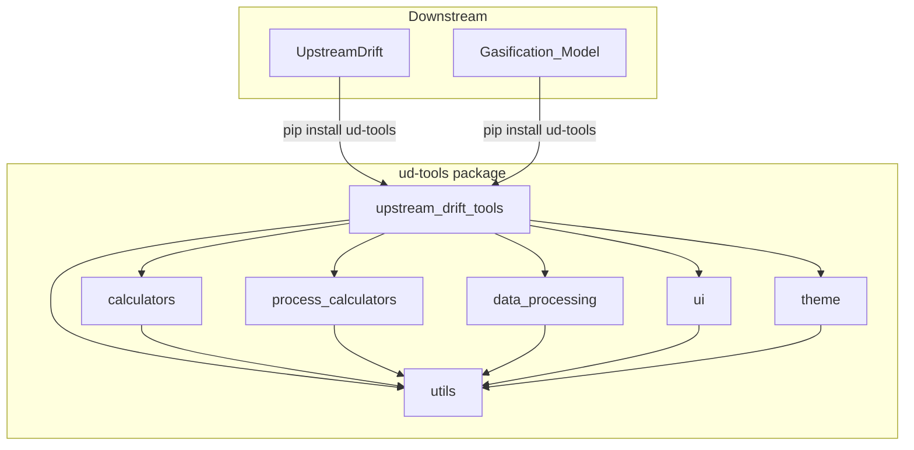

# ADR-002: Shared Library and Module Namespace Structure

- Status: Accepted
- Date: 2026-05-01
- Decision Makers: Tools maintainers
- Related Issues/PRs: #2421, #2405

## Context

Tools is a shared engineering library consumed by two downstream repos:
UpstreamDrift and Gasification_Model. Early development placed utilities
in ad-hoc locations across the repository, creating ambiguous import paths
and frequent import collisions when downstream repos updated their
`sys.path` configurations.

The key tensions were:

1. **Discoverability vs. encapsulation** — a flat namespace is easy to
   browse but invites circular imports across domains (e.g.
   `signal_processing` pulling from `calculators`).
2. **Monorepo convenience vs. package discipline** — developers naturally
   reach for relative imports, but downstream consumers install the package
   via `pip install ud-tools` and cannot rely on repo-relative paths.
3. **Single package vs. multiple packages** — splitting into many packages
   (one per domain) would enforce boundaries mechanically but increases
   distribution and versioning overhead.

## Decision Flow

## Decision

All shared library code lives under
`src/shared/python/upstream_drift_tools/` and is distributed as the
`ud-tools` pip package. The namespace is structured by domain:

- `upstream_drift_tools.calculators` — unit-conversion and thermo calcs
- `upstream_drift_tools.process_calculators` — process engineering calcs
- `upstream_drift_tools.data_processing` — data IO and transformation
- `upstream_drift_tools.utils` — cross-cutting utilities (logging, env)
- `upstream_drift_tools.ui` — shared PyQt6 widgets and mixins
- `upstream_drift_tools.theme` — plotting and visualization themes

Modules within a domain may import from `upstream_drift_tools.utils` but
must not import across domain boundaries (e.g. `calculators` must not
import from `process_calculators`). This is the Law of Demeter (LOD)
enforcement documented in CLAUDE.md.

A top-level `contracts.py` re-exports the full Design-by-Contract (DbC)
API so callers use `from contracts import require` without depending on
internal paths.

## Alternatives Considered

1. **Multiple pip packages** (one per domain): Rejected — downstream repos
   would need to manage independent version pins for each domain, and
   cross-domain utility sharing would require a separate `tools-core`
   package, increasing coordination overhead.
2. **Flat single-level namespace**: Rejected — demonstrated in early
   prototypes to cause circular import failures as the codebase grew past
   20 modules.
3. **Namespace packages (no `__init__.py`)**: Rejected — implicit namespace
   packages make it harder to enforce `__all__` exports and break mypy's
   type-stub discovery.

## Component Diagram

## Consequences

- Positive: Downstream repos use stable `upstream_drift_tools.*` import
  paths; `pip install ud-tools` gives them the whole library at a single
  version.
- Positive: LOD boundaries are checkable in CI via import-graph tests
  (`tests/architecture/test_layer_boundaries.py`).
- Negative: Adding a new domain requires creating a subdirectory,
  `__init__.py`, a manifest entry, and a `py.typed` marker — more ceremony
  than ad-hoc file additions.
- Follow-up: Manifest CI validation (`manifests/`) ensures new modules are
  registered before they reach downstream consumers. See #2405.

## Validation

- `tests/test_cross_repo_import_compatibility.py` — verifies every symbol
  in `upstream_drift_tools.__all__` is importable.
- `tests/architecture/test_layer_boundaries.py` — enforces that cross-domain
  imports violating LOD are absent.
- `pytest -m contract` — guards public API surface against regressions.
