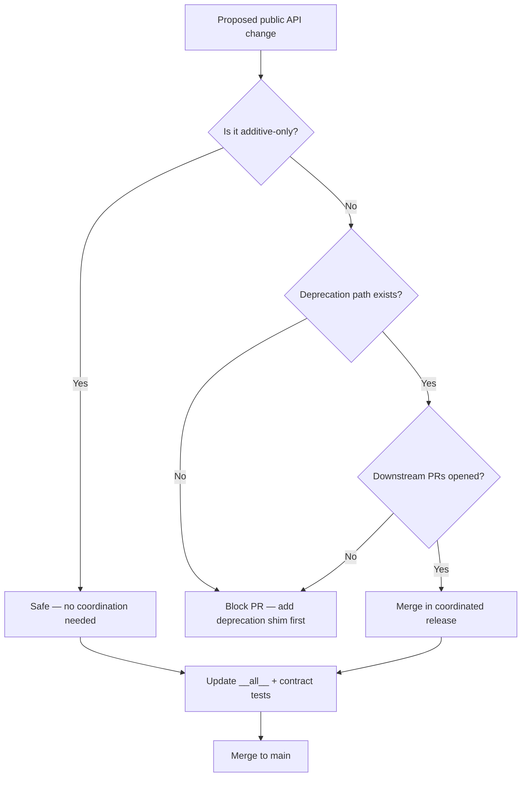

# ADR-003: API Stability and Backwards-Compatibility Policy

- Status: Accepted
- Date: 2026-05-01
- Decision Makers: Tools maintainers
- Related Issues/PRs: #2421, #2420

## Context

Tools is a shared library with two active downstream consumers
(UpstreamDrift and Gasification_Model) that cannot always update
simultaneously. Any change to a public function signature, return type, or
exception behaviour is a breaking change for at least one downstream repo.

Before this ADR there was no documented policy for:

- What counts as a breaking change.
- How long a deprecation period must last before removal.
- How downstream repos are notified and coordinated.
- How the API surface is mechanically tested.

The result was accidental regressions discovered only when downstream CI
failed after a Tools update was merged.

## Decision Flow

## Decision

### What Counts as a Breaking Change

Any of the following to a symbol listed in `upstream_drift_tools.__all__`
or exported from `src/contracts.py`:

- Removing or renaming a function, class, or module.
- Adding a required parameter to a function.
- Changing a return type incompatibly (e.g. `float` → `list[float]`).
- Changing an exception type raised for a documented error condition.
- Removing a field from a Pydantic model used as a return type.

Additive changes (new optional parameters with defaults, new fields in
response models, new symbols in `__all__`) are not breaking.

### Deprecation Protocol

1. Add a `DeprecationWarning` shim that calls the new implementation.
2. Update the docstring: `.. deprecated:: <version> Use <replacement>.`
3. Keep the shim for **at least one minor release cycle** (one sprint).
4. Open tracking issues in UpstreamDrift and Gasification_Model.
5. Link those issues in the Tools PR description.
6. Merge the removal PR only after downstream PRs are merged and closed.

### Contract Tests

Every public API function must have a `@pytest.mark.contract` test that:

- Verifies the function is importable from `upstream_drift_tools`.
- Calls the function with valid inputs and checks the return type.
- Verifies expected exceptions are raised for invalid inputs.

Contract tests live in `tests/contract/` or alongside the module in a
`tests/` subdirectory. They run in CI as a required check.

### Mechanical Enforcement

The file `tool_surface_contract.json` snapshots all public API signatures.
CI compares the current snapshot to `main` and fails if a signature has
been removed or modified without a corresponding deprecation shim.

## Alternatives Considered

1. **Semantic Versioning with major bumps for breakage**: Rejected for a
   shared library pinned by path/symlink rather than PyPI version — bumping
   a major version does not automatically force downstream update.
2. **No formal policy (rely on developer discipline)**: Rejected — caused
   at least three uncoordinated regressions in the six months before this
   ADR.
3. **API freeze (no changes ever)**: Rejected — the library is actively
   developed and the cost of a freeze outweighs the stability benefit.

## Consequences

- Positive: Downstream repos can trust that `pytest -m contract` passing
  on Tools main means they will not break on update.
- Positive: Deprecation shims give downstream teams a clear migration path
  with a concrete deadline.
- Negative: PR authors must open issues in two other repos for every
  breaking change — more coordination overhead.
- Negative: The `tool_surface_contract.json` snapshot must be regenerated
  whenever a new public symbol is added, creating a small maintenance task.
- Follow-up: Automate snapshot regeneration in a pre-commit hook. See #2420.

## Validation

- `pytest -m contract` — must pass on every PR.
- `tool_surface_contract.json` diff check in CI — blocks any PR that
  silently removes or renames a public symbol.
- Cross-repo integration tests (`tests/integration/test_cross_repo_contracts.py`)
  — import and call key APIs to catch signature drift before downstream CI runs.
