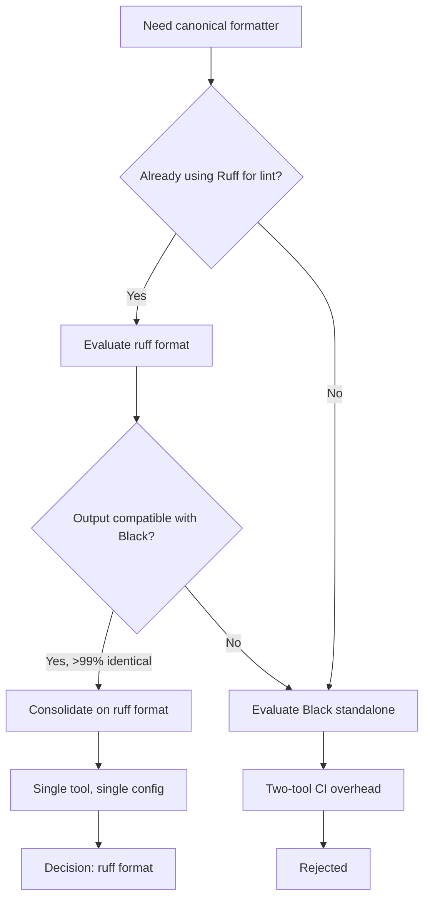

# ADR-004: Ruff Format Over Black for Code Formatting

- Status: Accepted
- Date: 2026-05-01
- Decision Makers: Tools maintainers
- Related Issues/PRs: #2421

## Context

Python formatting tooling was previously a mix of Black (in some CI
checks) and ad-hoc style guidelines (in others), leading to spurious diffs
on every PR when contributors used different local formatters.

The repository also uses Ruff as its primary linter (`ruff check`). Having
two separate tools — Ruff for linting and Black for formatting — meant two
separate installs, two separate CI steps, and two separate configuration
files (`pyproject.toml` for Black settings, `ruff.toml` for lint rules).

Black 24.x and Ruff format target the same 88-character line length and
produce near-identical output for the overwhelming majority of code. The
question was whether to consolidate on Ruff format or keep Black.

## Decision Flow



## Decision

Use `ruff format` (not Black) as the sole Python formatter across the
entire repository. Configuration lives in `ruff.toml`:

```toml
[format]
quote-style = "double"
indent-style = "space"
skip-magic-trailing-comma = false
line-ending = "auto"
```

Line length is 88 characters (matches historical Black default).

CI runs two separate Ruff steps:

1. `ruff check .` — linting (zero violations required).
2. `ruff format --check .` — formatting (zero diffs required).

Both steps must pass before a PR is mergeable.

## Alternatives Considered

1. **Black**: Near-identical output but requires a separate install and
   `pyproject.toml` `[tool.black]` section. Rejected to eliminate
   redundancy — Ruff format is already present as a dependency of
   `ruff check`.
2. **autopep8**: More conservative formatter; does not enforce a consistent
   style for blank lines and trailing commas. Rejected — produces more
   reviewer noise than opinionated formatters.
3. **No enforced formatter (manual style)**: Rejected — proven by
   experience to produce style debates in PR reviews and non-reproducible
   diffs.
4. **YAPF**: Highly configurable but slower and less integrated with the
   existing Ruff toolchain. Rejected.

## Consequences

- Positive: Single tool (`ruff`) for both linting and formatting; one
  config file (`ruff.toml`); one `pip install ruff` in CI.
- Positive: `ruff format` is significantly faster than Black on large
  files, reducing CI wall-clock time.
- Positive: Output is Black-compatible, so contributors familiar with
  Black see no surprises.
- Negative: A small number of edge-case formatting differences between
  Ruff format and Black exist (mainly around magic trailing commas and
  string normalization). Contributors switching from Black projects may see
  minor diffs on first run.
- Negative: Ruff format is newer and its output may change across Ruff
  versions — pinning `ruff` in `requirements-lock.txt` mitigates churn.
- Follow-up: Pin `ruff` version in CI to avoid unexpected formatting
  changes on Ruff upgrades.

## Validation

- `ruff format --check .` in CI — zero-diff requirement enforced on every
  PR.
- Pre-commit hook (optional, local): `ruff format .` before commit to avoid
  CI failures.
- `ruff check .` — linting step validates that `T201` (no `print()` in
  `src/`) and other rules remain clean after formatting.
