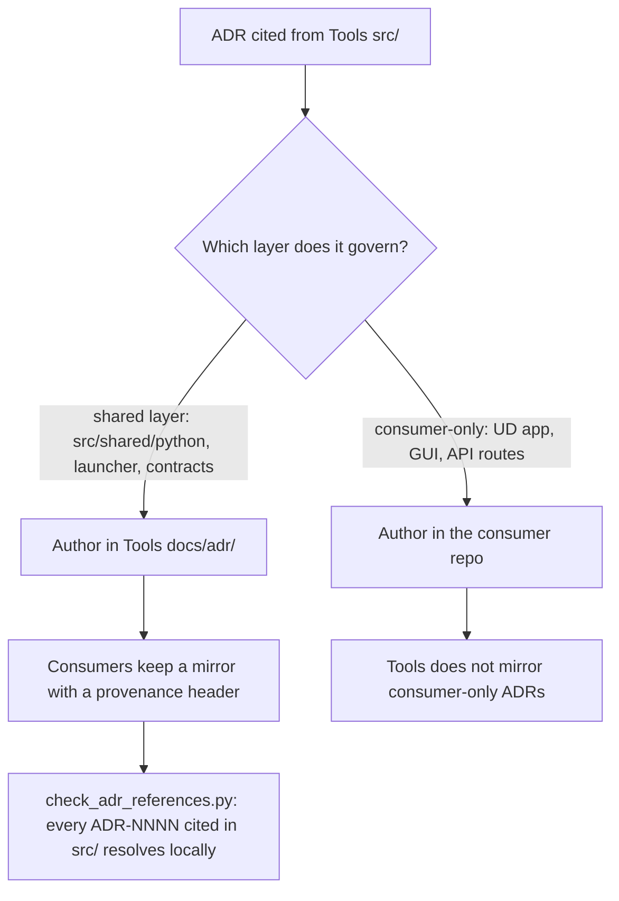

# ADR-0049: Fleet ADR Home — Shared-Layer ADRs Live in Tools, Consumers Mirror Them

- Status: Accepted
- Date: 2026-09-03
- Decision Makers: repo owner (Fleet Readiness Program, D-sorganization/Repository_Management#1505)
- Related Issues/PRs: Tools#4914 (supersedes #4494), UpstreamDrift#9406 (seam epic), ADR-0045, ADR-0046, ADR-0047, ADR-0048

## Context

Tools is the declared canonical source for the fleet's shared Python layer
(`src/shared/python/`), and the modules ported there under ADR-0046 Stage 1
cite the governing decisions by number: as of 2026-09-02 `git grep -o
"ADR-[0-9]\{4\}" src | sort | uniq -c` reports ADR-0046 ×75, ADR-0047 ×17,
ADR-0048 ×16, ADR-0045 ×11, ADR-0022 ×4, ADR-0031 ×4 and ADR-0016 ×2. None of
those seven records existed in this repository; every one lived only in
UpstreamDrift `docs/adr/`. The design authority for modules Tools is canonical
for therefore lived in a consumer of Tools, which inverts the dependency
direction (#4494) and leaves a Tools reader with dead references.

`docs/adr/` also carried two records numbered ADR-007 and an index row that
linked to a non-existent `ADR-008-...` file, so even the local numbering was
not a reliable key.

## Decision Flow

## Decision

1. **Home.** Architecture decisions that govern the shared layer (anything a
   downstream repo consumes from Tools: `src/shared/python/**`, the tool
   registry and launchers, cross-repo contracts) are authored and amended in
   Tools `docs/adr/`. Consumer-side decisions (UpstreamDrift application
   surfaces, its API routes, Gasification_Model GUIs) stay in the consumer.
2. **Mirrors.** A repository that cites a shared-layer ADR keeps a mirror
   under its own `docs/adr/` with a provenance header naming the source
   path, the source commit, the mirror date and the canonical home. The
   mirror body is the source text unchanged; amendments land in the canonical
   home first and are carried to mirrors in a paired PR.
3. **Numbering.** Fleet ADR numbers are four digits (`ADR-NNNN`), shared
   across repositories: a number is never reused, and a mirror keeps the
   source number. Tools' pre-existing three-digit records (ADR-001 … ADR-008)
   keep their numbers; new Tools ADRs continue the four-digit fleet sequence
   from ADR-0049.
4. **Gate.** `scripts/check_adr_references.py` (run by
   `scripts/check_docs_governance.py`, i.e. the Docs Governance workflow)
   fails when an `ADR-NNNN` cited anywhere under `src/` has no
   `docs/adr/ADR-NNNN-*.md`, and it regenerates the Records table of
   `docs/adr/README.md` from the files present (`--write`) so the index cannot
   link to a record that does not exist.

The first application of this decision mirrors ADR-0016, ADR-0022, ADR-0031,
ADR-0045, ADR-0046, ADR-0047 and ADR-0048 from UpstreamDrift commit
`27b6eeadbbd9` and renumbers the second ADR-007 (markerless-mocap authority)
to ADR-008, which is the number its index row already used.

## Alternatives Considered

- **A `Repository_Management/adr/` fleet directory with mirrors everywhere.**
  Rejected for now: it adds a third repository to every shared-layer change
  and no tooling reads RM from CI in Tools or UpstreamDrift. It remains the
  natural next step if a third consumer starts citing shared-layer ADRs.
- **Leave the ADRs in UpstreamDrift and link across repositories.** Rejected:
  Tools' docstrings, tests and the module inventory
  (`traceability.adr_paths`) resolve ADR citations to local files, and a
  consumer cannot be the design authority for its provider.
- **Move without mirroring (delete the UpstreamDrift copies).** Rejected for
  Phase 1: UpstreamDrift's own code, tests and `docs/adr/README.md` cite these
  numbers; the reciprocal header on the UpstreamDrift side is Phase 2 work
  tracked on UpstreamDrift#9406.

## Consequences

- Positive: every `ADR-NNNN` in `src/` resolves locally; the module inventory's
  `adr_paths` traceability now maps ADR-0045..0048 citations to real files;
  ADR numbering is unique.
- Negative: a shared-layer ADR amendment is a two-PR change (canonical home plus
  mirror) until UpstreamDrift consumes the Tools wheel and can vendor
  `docs/adr/` with it.
- Follow-ups: UpstreamDrift adds the reciprocal provenance header to its
  copies of 0045–0048 (Phase 2, UpstreamDrift#9406); a future RM-level index
  if a third consumer appears.

## Validation

- `python scripts/check_adr_references.py` exits 0 on this tree and non-zero
  when any cited number is removed from `docs/adr/` (unit-tested in
  `tests/scripts/test_check_adr_references.py`).
- `python scripts/check_docs_governance.py` runs the reference check.
- `git grep -o "ADR-[0-9]\{4\}" src | sort -u` — every listed number has a
  matching `docs/adr/ADR-NNNN-*.md`.
