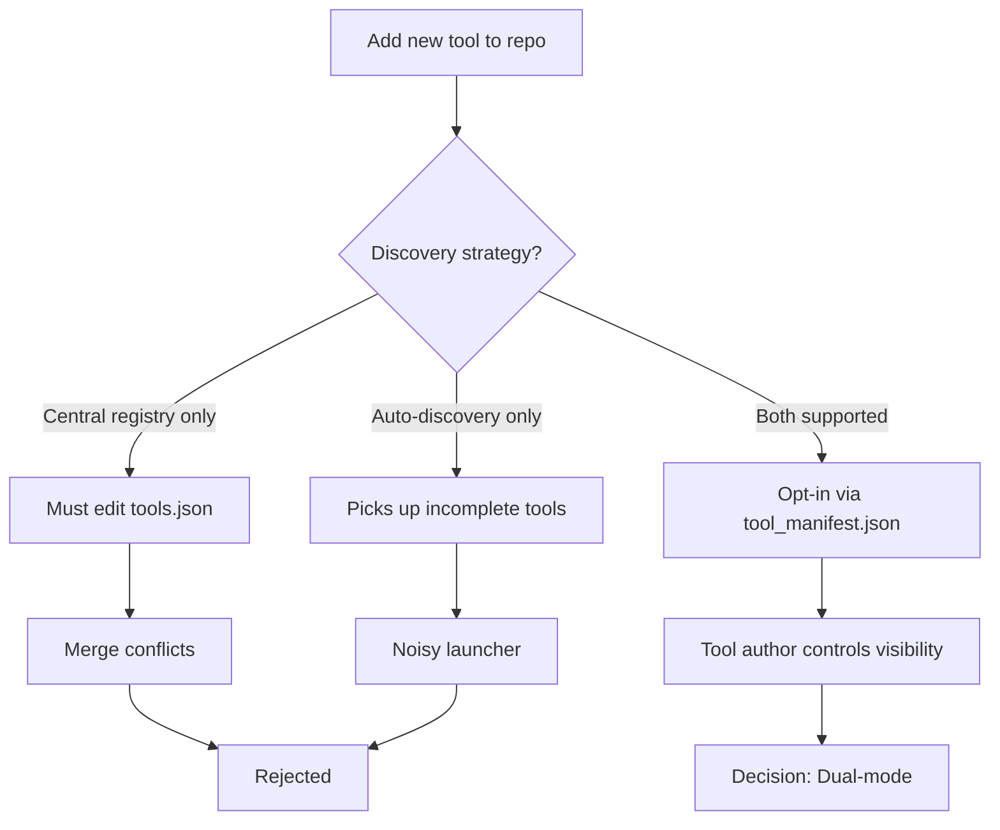
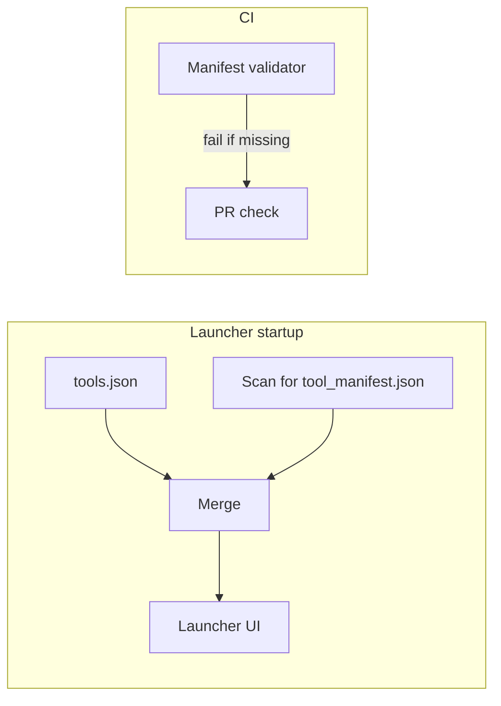

# ADR-005: Plugin Discovery vs. Centralized Registry

- Status: Accepted
- Date: 2026-05-01
- Decision Makers: Tools maintainers
- Related Issues/PRs: #2421

## Context

The Tools launcher must present every available tool in its UI. Early
versions used a single hand-maintained `tools.json` file that catalogued
every tool with its launch path, type, and description.

As the repository grew to 30+ tools, `tools.json` became a merge-conflict
hot-spot: every new tool required a PR that touched the registry file,
conflicting with other in-flight PRs. Tool authors also frequently forgot
to update the registry, leading to tools that existed in `src/` but were
invisible to the launcher.

The alternative — automatic filesystem discovery — risks picking up
in-progress or incomplete tools that are not ready to surface.

## Decision Flow

## Decision

Support two registration modes simultaneously, merged at launcher startup:

1. **Centralized registry** (`tools.json` in repo root) — explicit,
   manually maintained, grouped by category. Used for stable tools and for
   overriding display metadata.
2. **Per-tool manifest** (`tool_manifest.json` in each tool's root
   directory) — opt-in auto-discovery. A tool is discovered if and only if
   it provides this file.

Discovered tools are merged with `tools.json` at startup. If both sources
contain an entry for the same tool (matched by launch path), the
`tools.json` entry takes precedence, allowing global overrides of
descriptions and categories without modifying per-tool files.

Manifest CI validation (the `manifests/` directory and associated CI check)
ensures that any new Python module added to `src/` either has a
`tool_manifest.json` or an entry in `tools.json` before the PR is merged.

## Alternatives Considered

1. **Centralized registry only**: The original approach. Rejected because
   it required every tool author to touch a shared file, creating merge
   conflicts and forgotten registrations.
2. **Auto-discovery only**: Rejected because incomplete or experimental
   tools in `src/` would appear in the launcher before they are ready.
3. **Entry-point plugins** (Python `importlib.metadata` entry points):
   Rejected — requires `pip install -e .` for every tool, which is
   incompatible with the current symlink-based development workflow.

## Component Diagram

## Consequences

- Positive: New tools opt in to discovery by adding a single JSON file;
  no shared file to conflict on.
- Positive: `tools.json` remains the authoritative override for
  display metadata, keeping global consistency without per-tool churn.
- Positive: Manifest CI check prevents invisible tools and enforces
  documentation discipline.
- Negative: Two discovery mechanisms means the launcher code must handle
  merge-conflict resolution logic (path-based deduplication).
- Negative: Developers must remember that adding a `tool_manifest.json`
  immediately makes the tool visible to all launcher users — premature
  exposure is possible.
- Follow-up: Add a `"status": "experimental"` field to `tool_manifest.json`
  to allow hiding incomplete tools from the default launcher view.

## Validation

- Manifest CI check in `.github/workflows/` — rejects PRs adding modules
  without a manifest or `tools.json` entry.
- Launcher startup test — verifies merged tool list contains expected
  entries and has no duplicates.
