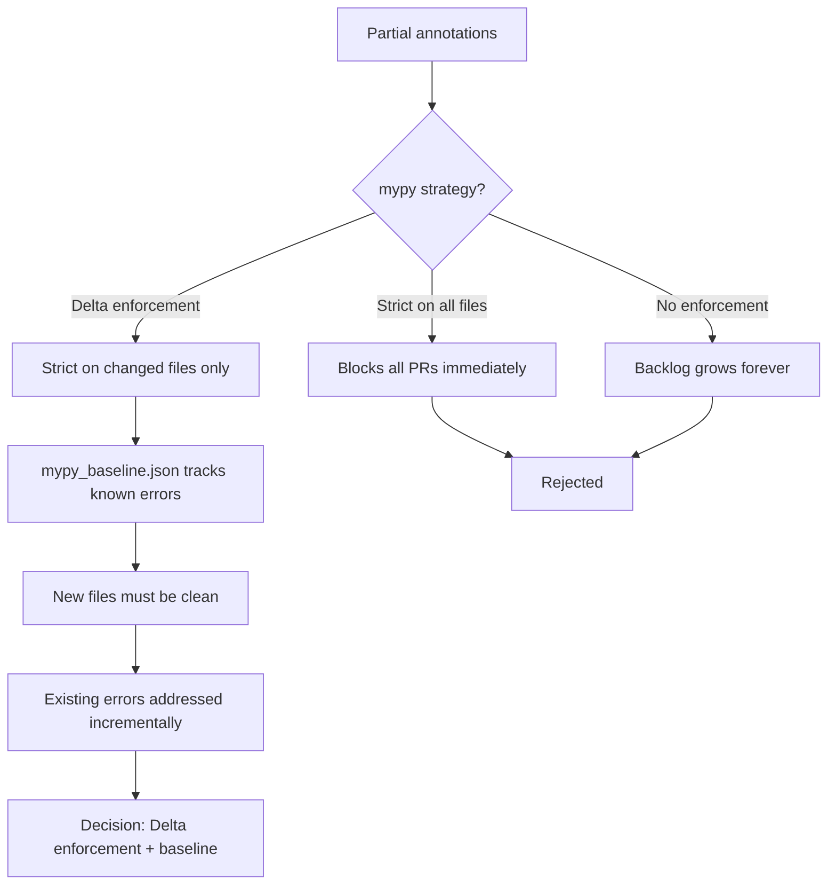

# ADR-006: Type Safety Enforcement with mypy and py.typed

- Status: Accepted
- Date: 2026-05-01
- Decision Makers: Tools maintainers
- Related Issues/PRs: #2421

## Context

Tools is a shared library. Downstream repos (UpstreamDrift,
Gasification_Model) increasingly use type checkers (mypy, pyright) in
their own CI pipelines. Without a `py.typed` marker and accurate type
annotations in Tools, downstream type checkers treat the entire package as
untyped (`Any`), silently losing type safety at the boundary.

The codebase had partial annotations applied inconsistently — some modules
were fully annotated, others had none. Running mypy in strict mode on the
full repo produced hundreds of errors.

The dilemma: requiring strict mode immediately would block all PRs until
every file was annotated (months of work), but leaving type checking
optional meant the annotation backlog would grow indefinitely.

## Decision Flow

## Decision

Adopt a **delta enforcement** model:

1. `src/py.typed` marker is present — downstream type checkers treat the
   package as typed.
2. mypy runs in strict mode on **changed files only** (delta CI step).
   A PR that modifies a file must leave that file mypy-clean.
3. `mypy_baseline.json` tracks known pre-existing errors in unmodified
   files. The baseline count must not increase on any PR.
4. New files added to `src/` must pass mypy strict with zero errors — no
   grandfathering for new code.
5. Pydantic models are used for all public API request/response types
   (`calc_backend/contracts/`). Pydantic's runtime validation and
   mypy plugin integration give both static and runtime type safety at API
   boundaries.

The `mypy.ini` configuration enables strict mode with a small set of
pragmatic exclusions for third-party libraries that lack stubs.

## Alternatives Considered

1. **Full strict mode immediately**: Rejected — would have required 3+
   months of annotation work before any feature PRs could merge.
2. **No type checking**: Rejected — downstream repos began seeing `Any`
   bleed from Tools into their own type graphs, masking real bugs.
3. **pyright instead of mypy**: Evaluated — pyright is faster and stricter,
   but mypy has broader plugin support (Pydantic, SQLAlchemy) and is the
   tool most contributors already have configured locally. Deferred; can
   revisit after annotation coverage improves.
4. **Gradual typing with `# type: ignore` annotations**: Rejected as a
   primary strategy — suppression comments mask errors permanently rather
   than tracking them transparently.

## Consequences

- Positive: `py.typed` marker means downstream repos get accurate type
  information from Tools immediately.
- Positive: Delta enforcement keeps the PR review loop fast while
  preventing the annotation debt from growing.
- Positive: Pydantic models at API boundaries catch type mismatches at
  runtime even if static analysis is incomplete.
- Negative: The baseline mechanism requires discipline — developers must
  not artificially inflate `mypy_baseline.json` to hide new errors.
- Negative: `mypy --strict` on some older modules produces cascading
  errors from missing `Optional` annotations; touched files require
  non-trivial annotation work.
- Follow-up: Track annotation coverage with `mypy --txt-report` in CI;
  set a coverage floor that must not regress. See `MYPY_BASELINE_REPORT.md`.

## Validation

- `mypy --strict` on changed files — enforced as a required CI step.
- `mypy_baseline.json` error count check — PR fails if count increases.
- `pytest -m contract` — Pydantic validation errors surface at test time
  if API model types drift.
- `src/py.typed` presence — verified by packaging tests to ensure
  downstream type checkers activate typed mode.
