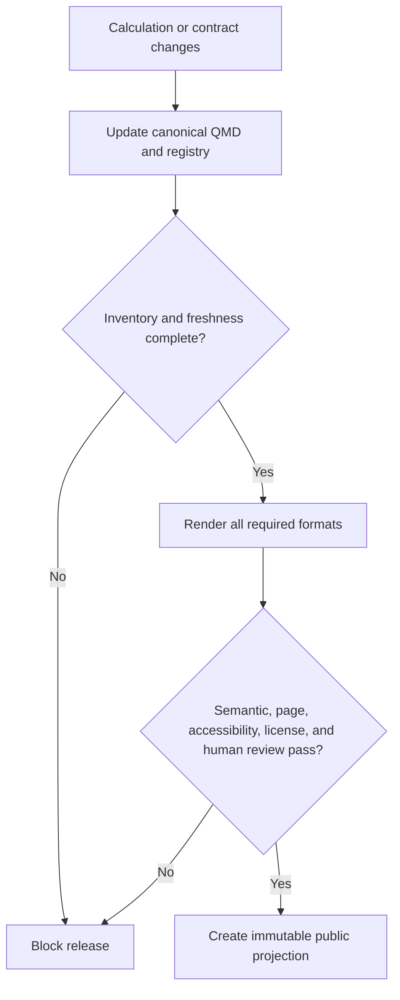

# ADR-007: Engineering Design Manual Authority and Release Boundary

- Status: Accepted
- Date: 2026-08-25
- Decision Makers: Tools maintainers
- Related Issues/PRs: #4707, #4709

## Context

Tools owns shared public calculations and interchange contracts consumed by
UpstreamDrift, Gasification_Model, and other projects. Its existing user guides,
ADRs, API documentation, and package-specific manuals do not provide one
calculation-level path from theory through code, tests, uncertainty, and public
artifact approval. Multiple editable source formats would drift, while copying
the program schemas here would create competing cross-repository authorities.

## Decision Flow

## Decision

`manuals/tools` QMD is the sole editable engineering design-manual authority.
The repository consumes versioned calculation-registry and publication-
projection contracts owned by `D-sorganization/Engineering-Design-Manuals`;
it does not copy their schemas. Generated HTML, LaTeX, PDF, and DOCX are
non-editable release artifacts.

The initial registry is intentionally empty and release-blocked. TOOLS-D1 owns
the inventory, TOOLS-D2 the deterministic renderer, TOOLS-D3 the chapter
contract, TOOLS-D4 and TOOLS-D5 the manuals and coverage, TOOLS-D6 freshness,
TOOLS-D7 render and accessibility qualification, and TOOLS-D8 the immutable
public projection. Approval defaults to deny. Private Tools_Private material
may not cross into this public authority without explicit public authorization.

## Alternatives Considered

1. Treat existing product docs as implicit manual authority. Rejected because
   they have distinct audiences and no complete calculation traceability.
2. Maintain QMD, LaTeX, and Word as peer editable sources. Rejected because
   bidirectional synchronization is not deterministic.
3. Copy the program schemas into Tools. Rejected because DRY ownership and
   version compatibility would become ambiguous.

## Consequences

- Positive: one editable authority, explicit license boundary, deterministic
  failure states, and reusable external contracts.
- Negative: no manual artifact can be called released until later subepics
  supply inventory, renderer, freshness, inspection, and approval evidence.
- Follow-up: complete TOOLS-D1 through TOOLS-D9 in dependency order and update
  repository rules, SPEC, and handoff at every delivery boundary.

## Validation

`python -m scripts.check_design_manual_governance` rejects alternate authority,
unsafe paths, copied schemas, mutable artifacts, incomplete approval evidence,
private-content permission, and an unapproved projection. Contract tests mutate
the policy and registry to prove fail-closed behavior. CI and pre-commit run the
same offline verifier.
