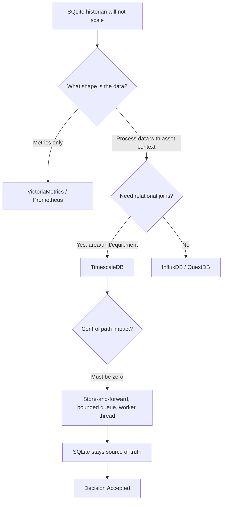
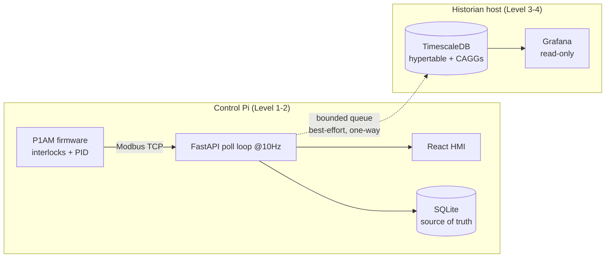

# ADR-007: TimescaleDB + Grafana as the P1AM plant historian

- Status: Accepted
- Date: 2026-07-31
- Decision Makers: Dieter Olson
- Related Issues/PRs: [#4046](https://github.com/D-sorganization/Tools/issues/4046) (epic), #4047–#4052, #4054–#4056

## Context

The P1AM control system persists process data to a single SQLite file
(`dcs_scada.db`). That file is well-tuned for a bench rig — WAL journaling,
`synchronous=NORMAL`, bulk insert per scan, a composite `(tag_name, timestamp)`
index, and a byte-capped auto-purge. It does not extend to a plant.

Measured before this work:

- Poll loop runs at 10 Hz (`P1AM_POLL_INTERVAL_S=0.1`).
- Historian writes are throttled to one per `P1AM_CAPTURE_INTERVAL_S`
  (default `5.0`), so at 32 tags the steady-state write rate is ~6.4 rows/s.
  With the throttle disabled it is ~320 rows/s (~27.6M rows/day).
- Retention is a byte-cap sweep that **deletes** oldest samples. There is no
  downsampling, so long-horizon history is destroyed rather than aggregated.

Gaps that matter at plant scale:

1. **No downsampling.** Losing six-month trends to a byte cap is the wrong
   trade; process engineering needs multi-year 1-minute rollups.
2. **No compression.** Float series compress 10–20x; we store them raw.
3. **Tag cardinality.** A real chemical plant is 5k–50k tags. At 1 Hz that is
   ~10k rows/s, which SQLite on a Pi will not sustain beside a 10 Hz control
   loop.
4. **Bespoke analytics.** `data_explorer_{router,service,expression,stats,
signals,models,enums}.py` re-implements query/transform/statistics that an
   off-the-shelf tool provides, and we own that maintenance permanently.
5. **Single point of loss.** The historian shares storage with the controller.

Hard constraint: **the control path may not be affected.** The 10 Hz scan loop
drives alarm evaluation, the HMI broadcast, and the E-stop re-engage path.
Anything that can add latency there is a safety regression, not a performance
one.

## Decision Flow

## Decision

Add a **Level 3/4 information layer** above the control system:

- **TimescaleDB** as the plant historian.
- **Grafana** as the read-only visualisation and engineering-alerting surface.
- **Store-and-forward** from the control node: SQLite remains the authoritative
  local record; forwarding is additive, best-effort, and at-most-once.
- Both run on a **separate host** from the control Pi.

Why TimescaleDB specifically:

1. **It is Postgres.** The existing SQLAlchemy/SQLModel layer ports with modest
   effort rather than a rewrite.
2. **It is relational.** `PlantArea` → `PlantUnit` → `PlantEquipment` →
   `TagDefinition` live in the same database and can be `JOIN`ed onto samples.
   This is the decisive factor: for process data the analysis question is
   "which reactor, which campaign, which charge", and a pure metrics store
   cannot answer it without duplicating the asset model into labels.
3. **Compression and continuous aggregates** give the standard historian
   pattern — raw for 90 days, 1-minute rollups for 2 years, 1-hour forever —
   declaratively rather than as cron jobs.

## Alternatives Considered

1. **Stay on SQLite.** Zero migration cost, and adequate today at 32 tags and a
   5 s capture interval. Rejected because it forecloses plant scale and because
   its retention destroys history rather than downsampling it.

2. **InfluxDB.** Purpose-built for time series. Rejected: non-relational, so the
   asset hierarchy has to be flattened into tags; Flux is deprecated, leaving
   the query-language story unsettled; v3 Core's free tier constrains retention.

3. **VictoriaMetrics.** Genuinely Apache-2, excellent compression and
   high-cardinality handling. Rejected as primary: it is Prometheus-shaped, with
   no relational joins and no natural home for quality codes or batch context.
   **This is the fallback if the Timescale licence becomes unacceptable.**

4. **QuestDB.** Apache-2, SQL, very fast ingest, real Grafana support. A
   legitimate contender; rejected on ecosystem depth and the weaker relational
   story relative to Postgres.

5. **Prometheus.** Rejected outright as a historian. Pull-based, infra-metrics
   oriented, ~2 weeks typical retention. Appropriate for monitoring the Pi's CPU
   and disk; wrong for a process record.

6. **Ignition (Inductive Automation).** What the industry actually uses, and
   what a plant integrator would recommend: SCADA + historian + alarming + MES
   in one, with a genuine ISA-18.2 alarm model and unlimited-tag licensing.
   Rejected for now because the hard parts specific to this system — safety
   state machine, MPC, PID tuning, Alicat and power-supply integration — are
   already built here and would not transfer. **Revisit if this becomes a
   commercial plant**; the licence cost is likely smaller than the cost of
   maintaining a bespoke SCADA stack.

7. **Superset / Metabase.** BI tools. Wrong shape for operational time series.

## Licensing (deliberate, and a real constraint)

- **Grafana is AGPLv3.** Internal plant use is fine. Shipping Grafana as part of
  a customer deliverable raises a network-copyleft question. This repo feeds
  customer-facing work, so the boundary matters: we deploy Grafana, we do not
  redistribute it.
- **TimescaleDB is split-licensed**: Apache-2 core, Timescale License (TSL) for
  compression and continuous aggregates — precisely the two features this
  design depends on. Free to self-host, but **source-available, not OSI-open**,
  with a restriction on offering it as a competing managed service. Terms have
  shifted more than once; verify current text before any commercial commitment.
- If strict OSI-open becomes a hard requirement, migrate to VictoriaMetrics or
  QuestDB and accept the loss of relational asset joins.

## Consequences

**Positive**

- Multi-year history at usable resolution instead of a byte-capped window.
- 10–20x storage reduction on aged data.
- Off-box durability for the process record.
- Alarm-performance analytics (EEMUA 191 / ISA-18.2) become possible; these are
  aggregate and retrospective, which a live HMI cannot do.
- A path to retiring bespoke `data_explorer_*` maintenance, if it proves out.

**Negative**

- A second host to operate, back up, and patch.
- A licence question that must be re-checked rather than assumed.
- Two sources of truth for reads, with the attendant risk that someone treats a
  Grafana panel as authoritative. Mitigated by documentation and by keeping
  Grafana on read-only credentials.
- At-most-once forwarding means the remote may have gaps the local store does
  not. Mitigated by the ingest-health dashboard so gaps are visible as gaps.

## Non-negotiables encoded in the implementation

- Grafana is **never** in the control path; read-only DB role, no write-back.
- Operator alarms stay in `alarm_processing.py`. Grafana alerting has no
  ISA-18.2 shelving/priority/ack model and is for engineering notification only.
- The shipper **cannot** block the poll loop: bounded queue, `put_nowait`,
  worker thread owning all socket I/O, every remote exception swallowed.
- Nothing runs on the control Pi.
- Forwarding defaults to **off**; enabling it without a DSN fails at startup.

## Component Diagram

## Validation & Monitoring

- `GET /api/historian/shipper` — queue depth, lag, drop and ship counters.
- _Historian Health (ingest)_ dashboard — measures arrival at the destination,
  so it catches shipper outages, network partitions, and a stopped control node
  alike.
- Compression ratio and continuous-aggregate job status are both surfaced; a
  stalled aggregate combined with an active retention policy is the one failure
  mode that destroys history, and it is monitored explicitly.

## Revisit If

- The plant becomes commercial and an integrator-supported stack is warranted
  (→ Ignition).
- Timescale licence terms change unacceptably (→ VictoriaMetrics / QuestDB).
- More than one controller or a second vendor appears (→ add MQTT Sparkplug B
  and a broker; the schema does not foreclose this).
