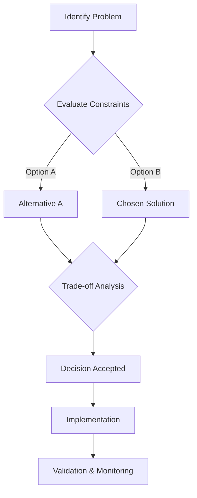
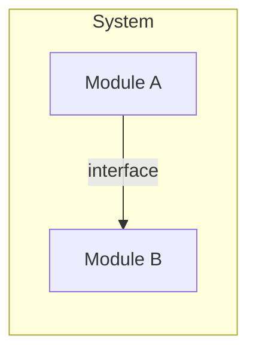

# ADR-XXXX: <Title>

- Status: Proposed | Accepted | Superseded
- Date: YYYY-MM-DD
- Decision Makers: <names/roles>
- Related Issues/PRs: <links>

## Context

Architecture-impacting problem and constraints.

## Decision Flow

## Decision

Chosen architectural direction.

## Alternatives Considered

1. <Alternative A>
2. <Alternative B>

## Component / Deployment Diagram (Optional)

## Consequences

- Positive:
- Negative:
- Follow-up actions:

## Validation

How this decision is validated in CI, tests, and operation.
