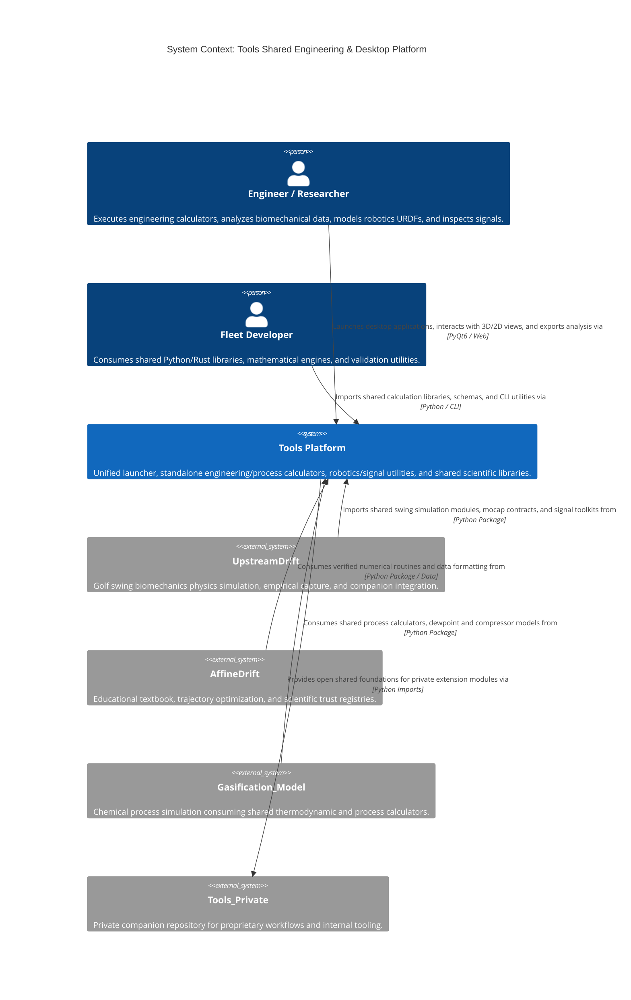
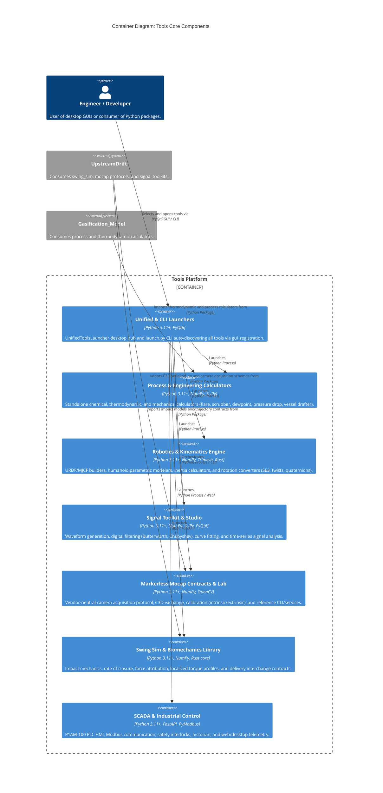

# Tools Architecture Map

## 1. System Context View (C4Context)

## 2. Container View (C4Container)

## Feature Map

| Capability                          | Component                                                                                                            | Interface                      | Evidence                                                                                                                     |
| ----------------------------------- | -------------------------------------------------------------------------------------------------------------------- | ------------------------------ | ---------------------------------------------------------------------------------------------------------------------------- |
| Unified GUI & CLI Tool Discovery    | Unified & CLI Launchers (`UnifiedToolsLauncher.py`, `launch.py`, `src/tools/gui/`)                                   | PyQt6 GUI / Python CLI         | `tests/test_launch_py.py`, `tests/test_unified_launcher.py`                                                                  |
| Standalone Process Calculators      | Process Calculators (`src/shared/python/upstream_drift_tools/process_calculators/`, `src/pressure_drop_calculator/`) | Python Module / PyQt6 / Web    | `tests/test_process_calculators.py`, `tests/test_pressure_drop.py`                                                           |
| Robotics URDF & Rotation Systems    | Robotics Engine (`src/shared/python/model_generation/`, `src/rotation_converter/`)                                   | Python API / CLI / PyQt6       | `tests/shared/python/model_generation/`, `tests/rotation_converter/`                                                         |
| Signal Processing & Waveform Studio | Signal Toolkit (`src/shared/python/signal_toolkit/`, `src/signal_processing_studio/`)                                | Python API / PyQt6 GUI         | `tests/shared/python/signal_toolkit/test_core.py`, `tests/shared/python/signal_toolkit/test_filters.py`                      |
| Markerless Mocap & C3D Interchange  | Mocap Lab (`src/shared/python/sidekick/lab/mocap/`)                                                                  | Headless CLI / Service / C3D   | `tests/shared/python/sidekick/lab/mocap/test_cli_service_contracts.py`, `tests/architecture/test_mocap_authority_program.py` |
| Biomechanics & Swing Simulation     | Swing Sim (`src/shared/python/swing_sim/`, `src/rate_of_closure/`)                                                   | Python API / Rust Facade / Web | `tests/shared/python/swing_sim/`, `tests/rate_of_closure/`                                                                   |
| SCADA Telemetry & PLC Interlocks    | SCADA System (`src/p1am_control_system/`)                                                                            | FastAPI / Modbus / Web         | `tests/p1am_control_system/`                                                                                                 |

## Architecture Change Log

| Date       | PR / Issue | Description                                                                                                      |
| ---------- | ---------- | ---------------------------------------------------------------------------------------------------------------- |
| 2026-09-10 | #1614      | Baseline adoption of maintainable Mermaid C4 architecture maps (C4Context, C4Container, Feature Map, Change Log) |
