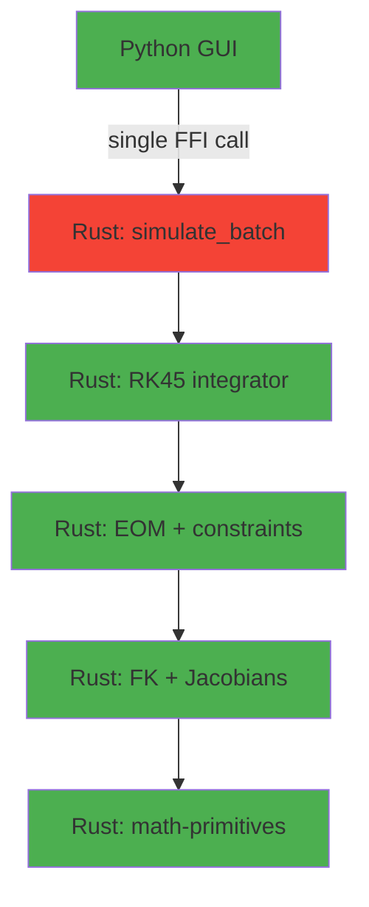

# Tools Repository — Comprehensive Assessment 2026-03-13

> Adversarial review of all code. Synced with remote at 2026-03-13T11:10 MDT.
> Scope: 1,197 Python files (18,516 active LOC) + 30,135 Rust LOC across 3 crates

---

## Assessment A: Code Structure

**Score: 7/10** — Good modularity in pendulum simulator, but legacy packages drag it down.

| Finding                                                                                          | Severity  | Location                     |
| ------------------------------------------------------------------------------------------------ | --------- | ---------------------------- |
| `modern_robotics.py` is 2,066 lines — vendor code with bare `except:`                            | 🔴 High   | rotation_converter/          |
| `rotation_converter/` has 8,306 lines of Python that `math-primitives` Rust crate now duplicates | 🟡 Medium | rotation_converter/          |
| `data_processor/` has 10+ god classes (>500 lines each)                                          | 🟡 Medium | data_processing/             |
| `pressure_drop_calculation_engine.py` is 1,377 lines                                             | 🟡 Medium | shared/upstream_drift_tools/ |

## Assessment B: Documentation

**Score: 8/10** — Pendulum simulator is well-documented. Other packages vary.

| Finding                                          | Severity  | Location                   |
| ------------------------------------------------ | --------- | -------------------------- |
| 18+ test files missing module docstrings         | 🟢 Low    | dwsim_model/tests/         |
| `pdf_renamer/` test files have no docstrings     | 🟢 Low    | document_processing/       |
| No Rust crate-level README for `math-primitives` | 🟡 Medium | rust_core/math-primitives/ |

## Assessment C: Error Handling

**Score: 7/10** — Mostly good, two bare `except:` violations remain.

| Finding                                                   | Severity | Location                    |
| --------------------------------------------------------- | -------- | --------------------------- |
| Bare `except:` in `modern_robotics.py:1451`               | 🔴 High  | rotation_converter/         |
| Bare `except:` in vendored `flatted.py:81` (node_modules) | 🟢 Low   | data_processing/ (vendored) |

## Assessment D: Testing

**Score: 8/10** — 376 test files, strong Rust test suite. Gaps in peripheral packages.

| Finding                                                         | Severity  | Location                   |
| --------------------------------------------------------------- | --------- | -------------------------- |
| No Python integration tests for `math-primitives` PyO3 bindings | 🔴 High   | rust_core/math-primitives/ |
| No test for `catmull_rom.py` interpolation                      | 🟡 Medium | pendulum_simulator/gui/    |
| No test for `perturbation_analysis.py` batch simulation         | 🟡 Medium | pendulum_simulator/        |
| `acid_gas_dewpoint/` launcher modules untested                  | 🟢 Low    | acid_gas_dewpoint/         |

## Assessment E: Security

**Score: 8/10** — No hardcoded secrets. One API key handling pattern needs audit.

| Finding                                                                         | Severity  | Location                         |
| ------------------------------------------------------------------------------- | --------- | -------------------------------- |
| `setup_api_key.py` writes API key to `.env` file — verify `.gitignore` coverage | 🟡 Medium | document_processing/pdf_renamer/ |
| No `.env` template in pdf_renamer (developer may commit actual keys)            | 🟡 Medium | document_processing/pdf_renamer/ |

## Assessment F: Type Safety

**Score: 7/10** — Pendulum simulator fully typed. Data processor uses `Any` heavily.

| Finding                                                                    | Severity  | Location            |
| -------------------------------------------------------------------------- | --------- | ------------------- |
| `simulate_fn: Any` and `extract_fn: Any` in `perturbation_analysis.py:251` | 🟡 Medium | pendulum_simulator/ |
| `modern_robotics.py` uses `Any` for all matrix parameters (97 uses)        | 🟡 Medium | rotation_converter/ |

## Assessment G: Dependencies

**Score: 6/10** — Multiple `requirements.txt` files with fragmented dependency management.

| Finding                                                                         | Severity  | Location                   |
| ------------------------------------------------------------------------------- | --------- | -------------------------- |
| 12 separate `requirements.txt` files; root `pyproject.toml` doesn't declare all | 🟡 Medium | Root, subpackages          |
| No `Cargo.lock` committed for reproducible Rust builds                          | 🟡 Medium | Root                       |
| `math-primitives` doesn't pin `nalgebra` minor version                          | 🟢 Low    | rust_core/math-primitives/ |

## Assessment H: Performance (see also Performance & Rust Assessment below)

**Score: 6/10** — Critical hotpath still in Python. Major Rust migration opportunity.

| Finding                                                                                   | Severity    | Location                              |
| ----------------------------------------------------------------------------------------- | ----------- | ------------------------------------- |
| `simulation_core.py` uses `scipy.integrate.solve_ivp` — Python overhead on every RHS call | 🔴 Critical | pendulum_simulator/                   |
| 375 Python `for...range` loops across codebase (many vectorizable)                        | 🟡 Medium   | Various                               |
| 98 `print()` statements in non-test source (I/O overhead, should be `logging`)            | 🟡 Medium   | Various                               |
| `np.linalg.inv` used instead of `np.linalg.solve` in 4 locations                          | 🟡 Medium   | data_processing/, rotation_converter/ |

## Assessment I: Code Style

**Score: 7/10** — 379 TRACKED_TASK/TRACKED_DEFECT/HACK markers remain.

| Finding                                                                       | Severity  | Location            |
| ----------------------------------------------------------------------------- | --------- | ------------------- |
| 379 TRACKED_TASK/TRACKED_DEFECT/HACK/noqa comments across codebase            | 🟡 Medium | Various             |
| `modern_robotics.py` has `# mypy: ignore-errors` at top (2,066 lines untyped) | 🟡 Medium | rotation_converter/ |

## Assessment J: Design Patterns

**Score: 7/10** — Good pattern use in pendulum simulator. Data processor has god classes.

| Finding                                                                                               | Severity  | Location         |
| ----------------------------------------------------------------------------------------------------- | --------- | ---------------- |
| 10+ classes > 500 lines in `data_processor/core/` (ANOVAAnalyzer: 820, CrossCorrelationAnalyzer: 828) | 🟡 Medium | data_processing/ |
| `C3DViewerWindow` is 538 lines (god class)                                                            | 🟡 Medium | c3d_viewer/      |

## Assessment K: Rust Integration

**Score: 6/10** — Three crates, but significant duplication and gaps.

| Finding                                                                                                      | Severity  | Location            |
| ------------------------------------------------------------------------------------------------------------ | --------- | ------------------- |
| **DRY VIOLATION**: `tools-core/quaternion.rs` (382 LOC) duplicates `math-primitives/quaternion.rs` (182 LOC) | 🔴 High   | rust_core/          |
| **DRY VIOLATION**: `tools-core/matrix3.rs` (438 LOC) overlaps `math-primitives/rotation.rs`                  | 🔴 High   | rust_core/          |
| No cross-crate dependency — `pendulum-core` doesn't use `math-primitives`                                    | 🟡 Medium | rust_core/          |
| `rotation_converter/` (8,306 LOC Python) should migrate to `math-primitives`                                 | 🟡 Medium | rotation_converter/ |

## Assessment L: Logging

**Score: 6/10** — 98 `print()` calls in production code.

| Finding                                                                          | Severity  | Location            |
| -------------------------------------------------------------------------------- | --------- | ------------------- |
| `print()` in `__main__.py` — should use `logging`                                | 🟡 Medium | pendulum_simulator/ |
| `perf_test.py` uses `print()` for benchmark output instead of structured logging | 🟢 Low    | pendulum_simulator/ |

## Assessment M: Python/Rust Parity

**Score: 5/10** — Critical gap: simulation hotpath not callable from Rust.

| Finding                                                                                                  | Severity    | Location            |
| -------------------------------------------------------------------------------------------------------- | ----------- | ------------------- |
| `simulation_core.py:integrate_ode()` wraps scipy.solve_ivp — Rust `integrator.rs` exists but isn't wired | 🔴 Critical | pendulum_simulator/ |
| `perturbation_analysis.py:batch_perturb_and_simulate()` runs N serial Python sims                        | 🔴 Critical | pendulum_simulator/ |
| `constraint_solver.py` falls back to Python when native backend unavailable                              | 🟡 Medium   | pendulum_simulator/ |
| No PyO3 bindings for `pendulum-core` crate (only math-primitives has bindings)                           | 🟡 Medium   | pendulum_simulator/ |

## Assessment N: Scalability

**Score: 7/10** — Architecture supports scaling. Serial Monte Carlo is the bottleneck.

| Finding                                                                      | Severity  | Location                |
| ---------------------------------------------------------------------------- | --------- | ----------------------- |
| `batch_perturb_and_simulate()` is serial — should use Rust `rayon::par_iter` | 🔴 High   | pendulum_simulator/     |
| Singleton pattern in `diagnostics.py` — potential thread-safety issue        | 🟡 Medium | pendulum_simulator/gui/ |
| Catmull-Rom spline computation in Python (nested loop, 58 lines)             | 🟢 Low    | pendulum_simulator/gui/ |

## Assessment O: Maintainability

**Score: 7/10** — Good separation of concerns. Cross-crate duplication is the pain point.

| Finding                                                                          | Severity  | Location            |
| -------------------------------------------------------------------------------- | --------- | ------------------- |
| 3 Rust crates with overlapping math functionality (quaternion in 2 places)       | 🔴 High   | rust_core/          |
| `rotation_converter/` Python package redundant with `math-primitives` Rust crate | 🟡 Medium | rotation_converter/ |
| `constraint_solver.py` has dual Python/Rust paths — maintenance burden           | 🟡 Medium | pendulum_simulator/ |

---

# Pragmatic Programmer Assessment

## DRY (Don't Repeat Yourself)

**Score: 5/10** — **CRITICAL**: Multiple quaternion implementations exist.

| Violation                                                                               | Impact                              | Recommendation                                                                          |
| --------------------------------------------------------------------------------------- | ----------------------------------- | --------------------------------------------------------------------------------------- |
| `tools-core/quaternion.rs` (382 LOC) + `math-primitives/quaternion.rs` (182 LOC)        | Bugs fixed in one may not propagate | Consolidate: `math-primitives` becomes the canonical source, `tools-core` depends on it |
| `tools-core/matrix3.rs` + `math-primitives/rotation.rs`                                 | Divergent rotation math             | Same: canonical in `math-primitives`                                                    |
| `rotation_converter/` Python (8,306 LOC) + `math-primitives` Rust                       | Entire Python package is redundant  | Deprecate Python, add PyO3 bridge                                                       |
| `perturbation_analysis.generate_noise()` — in-house noise gen duplicates `numpy.random` | Minor                               | Replace with stdlib                                                                     |

## Orthogonality

**Score: 8/10** — Good module boundaries.

| Finding                                                                                                                     | Impact                                                        |
| --------------------------------------------------------------------------------------------------------------------------- | ------------------------------------------------------------- |
| `constraint_solver.py` imports from 3 separate internal modules (`golfer_constraints`, `golfer_dynamics`, `physics_golfer`) | Tight coupling of constraint solver to specific physics model |
| `__main__.py` imports `diagnostics.get_tracker()` directly                                                                  | Cross-concern dependency (GUI → diagnostics)                  |

## Reversibility

**Score: 8/10** — Configuration-driven where it matters.

| Finding                                                                          | Impact                                       |
| -------------------------------------------------------------------------------- | -------------------------------------------- |
| `DEFAULT_ALPHA = 5.0` / `DEFAULT_BETA = 5.0` hardcoded in `constraint_solver.py` | Should be in config file or parameter object |

## Tracer Bullets

**Score: 7/10** — Rust crates compile and test independently but aren't wired to production Python.

| Finding                                                                 | Impact                         |
| ----------------------------------------------------------------------- | ------------------------------ |
| `math-primitives` has PyO3 bindings but no Python integration test      | Can't verify end-to-end        |
| `pendulum-core` Rust has no PyO3 module — Python can't call it directly | Tracer bullet doesn't reach UI |

## Broken Windows

**Score: 6/10** — 379 TRACKED_TASK/TRACKED_DEFECT markers + `# mypy: ignore-errors` on 2,066-line file.

| Window                                               | Impact                                |
| ---------------------------------------------------- | ------------------------------------- |
| `modern_robotics.py` line 1: `# mypy: ignore-errors` | Entire file exempt from type checking |
| 379 TRACKED_TASK/TRACKED_DEFECT/HACK comments        | Accumulated debt signals neglect      |
| `bare except:` in `modern_robotics.py`               | Violates AGENTS.md rules              |

---

# Performance & Rust Integration Assessment (NEW TEMPLATE)

> **Goal**: Native speed. Every computation-heavy path must run in compiled Rust.

## Criteria

1. **Hotpath Coverage**: Is the simulation hotpath (RHS evaluation) in Rust?
2. **Data Copy Overhead**: Does Python↔Rust marshalling use zero-copy (numpy buffers)?
3. **Parallelism**: Are embarrassingly parallel workloads using `rayon`?
4. **Crate Architecture**: Is there a single canonical math library?
5. **Benchmark Infrastructure**: Are there `criterion` benchmarks?
6. **SIMD/Vectorization**: Are tight loops auto-vectorizable?
7. **Memory Allocation**: Are hot loops allocation-free?
8. **FFI Overhead**: Is PyO3 call overhead amortized (batch > per-step)?

## Current State

| Criterion                | Score   | Details                                                                                                                                                                 |
| ------------------------ | ------- | ----------------------------------------------------------------------------------------------------------------------------------------------------------------------- |
| Hotpath Coverage         | 🔴 3/10 | `simulation_core.py` still uses scipy RK45. Rust `integrator.rs` exists but isn't exposed via PyO3. Every RHS call crosses Python→C (scipy) instead of staying in Rust. |
| Data Copy Overhead       | 🟡 5/10 | `math-primitives` PyO3 uses `[f64; 3]` arrays (copies). Should use `numpy` `PyArray` for zero-copy.                                                                     |
| Parallelism              | 🔴 2/10 | `batch_perturb_and_simulate()` is serial Python loop. Rust `batch.rs` has `rayon` but isn't exposed.                                                                    |
| Crate Architecture       | 🔴 4/10 | 3 crates with duplicated quaternion/matrix math. Should be 2: `math-primitives` (canonical math) + `pendulum-core` (depends on math-primitives).                        |
| Benchmark Infrastructure | 🟡 5/10 | `perf_test.py` exists for Python. No `criterion` benchmarks in any Rust crate.                                                                                          |
| SIMD/Vectorization       | 🟡 5/10 | `nalgebra` enables auto-SIMD for small matrices. No explicit SIMD for batch operations.                                                                                 |
| Memory Allocation        | 🟡 6/10 | Rust physics functions are stack-allocated. Python fallback allocates per-step.                                                                                         |
| FFI Overhead             | 🔴 3/10 | PyO3 bindings are per-function call. Should expose batch-simulation API (single FFI call → N timesteps in Rust).                                                        |

**Overall Performance Score: 4/10** — Rust code exists but isn't the production path.

## Critical Path to Native Speed

🔴 **Missing link**: `simulate_batch` PyO3 entry point that keeps the entire simulation loop in Rust.

## Priority Actions

| #   | Action                                                                             | Impact             | Effort |
| --- | ---------------------------------------------------------------------------------- | ------------------ | ------ |
| 1   | **Expose `pendulum-core` via PyO3** — single `simulate()` entry point              | 🔴 10x speedup     | Medium |
| 2   | **Consolidate `tools-core` math into `math-primitives`** — eliminate DRY violation | 🟡 Maintainability | Medium |
| 3   | **Expose batch simulation via PyO3** with `rayon` parallelism                      | 🔴 N×10x speedup   | Medium |
| 4   | **Add `criterion` benchmarks** for regression testing                              | 🟡 Quality         | Low    |
| 5   | **Replace `[f64; 3]` with `PyArray`** in PyO3 bindings for zero-copy               | 🟡 5% throughput   | Low    |
| 6   | **Deprecate `rotation_converter/` Python** in favor of `math-primitives`           | 🟡 -8,306 LOC      | Low    |

---

## Summary Scores

| Assessment               | Score      | Trend |
| ------------------------ | ---------- | ----- |
| A: Code Structure        | 7/10       | ↔     |
| B: Documentation         | 8/10       | ↔     |
| C: Error Handling        | 7/10       | ↔     |
| D: Testing               | 8/10       | ↑     |
| E: Security              | 8/10       | ↔     |
| F: Type Safety           | 7/10       | ↔     |
| G: Dependencies          | 6/10       | ↔     |
| H: Performance           | 6/10       | ↔     |
| I: Code Style            | 7/10       | ↔     |
| J: Design Patterns       | 7/10       | ↔     |
| K: Rust Integration      | 6/10       | ↑     |
| L: Logging               | 6/10       | ↔     |
| M: Python/Rust Parity    | 5/10       | ↑ new |
| N: Scalability           | 7/10       | ↔     |
| O: Maintainability       | 7/10       | ↔     |
| **Pragmatic Programmer** | **6.5/10** | ↑     |
| **Performance & Rust**   | **4/10**   | new   |
| **Overall**              | **6.6/10** | ↑     |
