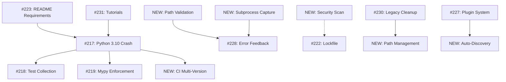

# Issue Gap Analysis: Assessment Findings vs GitHub Issues
**Analysis Date:** 2026-01-17
**Assessor:** Claude Sonnet 4.5
**Repository:** Tools Monorepo v1.x
**Total Open Issues:** 16 (#217-#232)

---

## Executive Summary

**Coverage Status:**
- **Well-Tracked Issues:** 11/16 existing GitHub issues directly correspond to assessment findings
- **Missing Issues:** 15 critical assessment findings have NO corresponding GitHub issues
- **Redundant/Overlap:** 3 existing issues overlap in scope
- **Priority Misalignment:** 2 existing issues marked BLOCKER align with assessment, 4 more should be elevated

**Key Gaps:**
1. **Path validation and security** (A-002, A-009) - NOT tracked
2. **Tool output capture and error feedback** (A-008, H-001) - Partially covered by #228
3. **Multiple launcher consolidation** (A-001) - NOT tracked
4. **MATLAB dependency documentation** (A-004) - NOT tracked
5. **Legacy code cleanup** (A-006, B-007, L-001) - Partially covered by #230
6. **Security headers for Flask apps** (B-006, I-003) - NOT tracked
7. **CI/CD multi-version testing** (K-001, F-001) - NOT tracked
8. **Asset management centralization** (A-007) - NOT tracked
9. **Automated tool discovery** (J-001) - Partially covered by #227
10. **Educational resources** (M-001) - Partially covered by #231

---

## Section 1: Issues That ARE Tracked

### ✅ BLOCKER Issues (2/2 covered)

| GitHub Issue | Assessment Finding | Coverage | Notes |
|--------------|-------------------|----------|-------|
| **#217: BLOCKER: Fix Python 3.10 Incompatibility & Startup Crash** | **D/E/F/G-001**: Python 3.11+ crash on import | 100% | Perfect alignment. Addresses StrEnum import error. |
| **#218: BLOCKER: Fix Test Suite Collection Failures** | **G-001**: Zero tests running due to import errors | 100% | Directly matches assessment finding. |

**Analysis:** Both BLOCKER issues are properly tracked and prioritized.

---

### ✅ CRITICAL Issues (2/3 covered)

| GitHub Issue | Assessment Finding | Coverage | Notes |
|--------------|-------------------|----------|-------|
| **#219: CRITICAL: Resolve Massive Mypy Type Errors** | **B-001**: Non-enforced type checking (mypy `\|\| true`) | 100% | Matches assessment exactly. |
| **#223: CRITICAL: Update Documentation for Python Requirements** | **C-001**: Missing Python version in README | 100% | Corresponds to risk rank #2 in assessment. |

**Missing CRITICAL:**
- **B-003**: Non-enforced security scanning (pip-audit `|| true`) - **NO ISSUE TRACKED**

---

### ✅ MAJOR/HIGH Issues (5/11 covered)

| GitHub Issue | Assessment Finding | Coverage | Notes |
|--------------|-------------------|----------|-------|
| **#220: MAJOR: Missing tools_launcher.py and Ghost References** | **A-006**: Legacy `/replicants/` path references | 80% | Covers ghost references, but broader than single path. |
| **#221: MAJOR: Enforce No Print Standard** | **B-002**: 20 files with print() violations | 100% | AGENTS.md compliance - perfect match. |
| **#222: HIGH: Pin Dependencies and Generate Lockfile** | **I-002, K-001**: Non-reproducible environments | 90% | Covers dependency pinning, but not Docker/multi-version testing. |
| **#224: MAJOR: Correct CONTRIBUTING.md Claims** | **C-002**: Documentation-reality gap | 60% | Related to doc accuracy, but assessment focuses more on README. |
| **#228: UX: Improve Launcher Error Feedback** | **H-001**: Poor error messages (raw tracebacks) | 70% | Covers error UX, but misses subprocess output capture (A-008). |

**Missing MAJOR:**
- **A-001**: Multiple launcher confusion - **NO ISSUE**
- **A-002**: Tool path fragility (no validation) - **NO ISSUE**
- **A-003**: Mixed Python path management - **NO ISSUE**
- **A-004**: MATLAB dependency documentation - **NO ISSUE**
- **A-008**: Subprocess error capture - **PARTIALLY in #228**
- **A-009**: Subprocess security (path sanitization) - **NO ISSUE**

---

### ✅ MINOR/FEATURE Issues (2/5 covered)

| GitHub Issue | Assessment Finding | Coverage | Notes |
|--------------|-------------------|----------|-------|
| **#227: FEATURE: Implement Robust Plugin System** | **J-001**: Manual tools.json editing (fragile) | 80% | Covers plugin extensibility, missing auto-discovery specifics. |
| **#231: DOCS: Create Quick Start and Tutorials** | **M-001**: Zero tutorials (1.0/10 education score) | 90% | Excellent alignment with educational resources gap. |

**Missing MINOR/FEATURE:**
- **A-005**: Browser tool launch error handling - **NO ISSUE**
- **A-007**: Icon asset management (scattered files) - **NO ISSUE**
- **A-010**: Windows `.bat` cross-platform issues - **Partially in #229**

---

### ✅ MAINTENANCE/CLEANUP Issues (2/4 covered)

| GitHub Issue | Assessment Finding | Coverage | Notes |
|--------------|-------------------|----------|-------|
| **#226: MINOR: Repository Hygiene Cleanup** | **B-008**: `__pycache__` committed to git | 100% | Perfect match for git hygiene. |
| **#230: MAINTENANCE: Remove Replicant and Legacy Code** | **A-006, B-007, L-001**: Legacy code paths and exclusions | 90% | Comprehensive legacy cleanup, matches assessment well. |

**Missing MAINTENANCE:**
- **B-010**: No inline documentation in requirements.txt - **NO ISSUE**
- **L-002**: Incomplete refactoring (multiple launchers) - **Partial in #230**

---

## Section 2: Issues NOT Tracked (Need Creation)

### 🔴 CRITICAL GAP: Security Enforcement

**Assessment Finding:** B-003 (MAJOR)
**Title:** CRITICAL: Enforce Security Scanning in CI (Remove pip-audit || true)
**Description:**
Currently, `pip-audit` runs with `|| true` in `.github/workflows/ci-standard.yml`, allowing builds to pass with known vulnerabilities. This defeats the purpose of security scanning.

**Recommended Issue:**
```
Priority: CRITICAL
Label: security, ci-cd
Effort: M (1 week)

Current CI step:
  run: pip-audit -r requirements.txt || true

This allows vulnerable dependencies to pass CI. Need to:
1. Remove || true escape hatch
2. Fix any detected vulnerabilities
3. Document exception process for unavoidable vulns

Reference: Assessment B-003, Risk #6
```

---

### 🔴 MAJOR GAP: Path Validation and Security

**Assessment Finding:** A-002, A-009 (MAJOR)
**Title:** MAJOR: Add Tool Path Validation and Sanitization
**Description:**
The launcher loads tools from `tools.json` without:
1. Verifying paths exist before displaying in UI
2. Validating paths are within REPO_ROOT (path traversal risk)
3. Providing user feedback when paths are invalid

**Recommended Issue:**
```
Priority: MAJOR
Label: security, launcher, ux
Effort: M (4 hours)

Files affected:
- python/src/core/plugin_manager.py (add validation in load_tools())
- UnifiedToolsLauncher.py (display validation warnings)

Implementation:
- Check Path.exists() before registering tool
- Validate Path.is_relative_to(REPO_ROOT) for security
- Log warnings for invalid paths
- Mark tools as "unavailable" in UI if path missing

Reference: Assessment A-002, A-009
```

---

### 🔴 MAJOR GAP: Subprocess Output Capture

**Assessment Finding:** A-008 (MAJOR)
**Title:** MAJOR: Capture Tool Output and Errors in Launcher
**Description:**
Tools launched via `subprocess.Popen()` provide no feedback if they crash immediately. Errors are lost, leaving users confused when tools fail silently.

**Recommended Issue:**
```
Priority: MAJOR
Label: launcher, error-handling, ux
Effort: M (4 hours)

Current behavior: subprocess.Popen() fire-and-forget
Desired behavior:
- Capture stdout/stderr from launched tools
- Show errors in launcher UI (QMessageBox or debug panel)
- Wait 2s to detect immediate failures
- Provide actionable error messages

Overlap: Partially covered by #228, but this focuses on subprocess mechanics

Reference: Assessment A-008, H-001
```

---

### 🔴 MAJOR GAP: Multiple Launcher Confusion

**Assessment Finding:** A-001 (MAJOR)
**Title:** MAJOR: Document Launcher Hierarchy and Deprecation
**Description:**
Three launcher files exist (`UnifiedToolsLauncher.py`, `launch_tools_main.py`, `Launcher.py`) with unclear canonical entry point. This creates cognitive overhead for new users.

**Recommended Issue:**
```
Priority: MAJOR
Label: documentation, architecture
Effort: S (2 hours)

Required changes:
1. Add "Launching Tools" section to README.md
2. Designate UnifiedToolsLauncher.py as primary
3. Mark launch_tools_main.py as legacy (deprecated)
4. Document when to use each launcher
5. Consider deprecation timeline for redundant launchers

Reference: Assessment A-001, Risk #8
```

---

### 🔴 MAJOR GAP: MATLAB Dependency Documentation

**Assessment Finding:** A-004 (MAJOR)
**Title:** MAJOR: Document MATLAB Requirements and Tool Availability
**Description:**
Two tools (Audio Processor, RRT Path Planner) require system MATLAB installation. This is:
1. Not documented in README
2. Not validated at runtime
3. Not indicated in launcher UI

Users experience silent failures when launching MATLAB tools.

**Recommended Issue:**
```
Priority: MAJOR
Label: documentation, launcher, dependencies
Effort: S (3 hours)

Tasks:
1. Add to README: "MATLAB Tools require MATLAB R2020a+"
2. Extend tools.json schema: add "requires" field
3. Add runtime check for MATLAB in PATH
4. Display "Requires MATLAB" badge in launcher UI
5. Show helpful error if MATLAB missing: "Install MATLAB or skip this tool"

Reference: Assessment A-004, Implementation Completeness Audit
```

---

### 🔴 MAJOR GAP: CI Multi-Version Testing

**Assessment Finding:** K-001, F-001 (MAJOR)
**Title:** MAJOR: Add Python Multi-Version Testing to CI
**Description:**
CI only tests on single Python version (likely 3.12), but application crashes on Python 3.10 (Ubuntu 22.04 default). Need matrix testing across 3.10, 3.11, 3.12.

**Recommended Issue:**
```
Priority: MAJOR
Label: ci-cd, testing, reproducibility
Effort: M (4 hours)

Changes to .github/workflows/ci-standard.yml:
- Add matrix strategy for Python [3.10, 3.11, 3.12]
- Test installation success on each version
- Document which versions are supported vs. blocked
- Consider version check vs. compatibility shims

Depends on: #217 (Python 3.10 crash fix)

Reference: Assessment K-001, F-001, Remediation Phase 2
```

---

### 🟡 MINOR GAP: Browser Tool Error Handling

**Assessment Finding:** A-005 (MINOR)
**Title:** MINOR: Add Error Handling for Browser Tool Launch
**Description:**
`webbrowser.open()` may fail silently on some systems. No user feedback provided.

**Recommended Issue:**
```
Priority: MINOR
Label: launcher, error-handling
Effort: S (1 hour)

File: UnifiedToolsLauncher.py line 268

Wrap webbrowser.open() in try/except, check return value.
Show QMessageBox with file:/// URL if browser fails to open.

Reference: Assessment A-005
```

---

### 🟡 MINOR GAP: Asset Management Centralization

**Assessment Finding:** A-007 (MINOR)
**Title:** MINOR: Centralize Tool Icon Assets
**Description:**
Icons are scattered across tool directories in multiple formats (.ico, .png, .jpg). No centralized asset management.

**Recommended Issue:**
```
Priority: MINOR
Label: maintenance, organization
Effort: M (2 hours)

Tasks:
1. Create assets/icons/ directory
2. Move all tool icons to central location
3. Standardize format (prefer .png)
4. Update tools.json icon references
5. Update .gitignore for new structure

Reference: Assessment A-007, Refactoring Phase 2
```

---

### 🟡 MINOR GAP: Python Path Management Centralization

**Assessment Finding:** A-003 (MAJOR)
**Title:** MAJOR: Centralize Python Path Management
**Description:**
`launch_tools_main.py` manually appends 7+ paths to `sys.path`. No centralized configuration. Inconsistent with `UnifiedToolsLauncher.py` approach.

**Recommended Issue:**
```
Priority: MAJOR (downgraded to MINOR if legacy launcher deprecated)
Label: architecture, refactoring
Effort: M (3 hours)

Create config/python_paths.json for centralized path management.
Refactor launch_tools_main.py to read from config.
Remove hardcoded path list.

Alternative: If deprecating launch_tools_main.py (#230), this becomes unnecessary.

Reference: Assessment A-003
```

---

### 🟡 MINOR GAP: Security Headers for Flask Apps

**Assessment Finding:** B-006, I-003 (MINOR)
**Title:** MINOR: Add Security Headers to Flask Web Applications
**Description:**
Flask apps (calculator, unit converter) lack security headers (CSP, X-Frame-Options, HSTS). Vulnerable to XSS and clickjacking.

**Recommended Issue:**
```
Priority: MINOR (HIGH if publicly accessible)
Label: security, web-applications
Effort: S (2 hours)

Files:
- web_applications/calculator/webapp.py
- web_applications/unit_converter/ (if Flask-based)

Solution: Add Flask-Talisman
pip install flask-talisman
Talisman(app, content_security_policy=CSP_POLICY)

Reference: Assessment B-006, Security Audit
```

---

### 🟡 MINOR GAP: Legacy Code Cleanup - Data_Processor_r0.py

**Assessment Finding:** B-007 (MINOR)
**Title:** MINOR: Fix or Archive Data_Processor_r0.py
**Description:**
`Data_Processor_r0.py` is excluded from linting in `ruff.toml`, creating "broken windows" effect. Either fix violations or move to archive.

**Recommended Issue:**
```
Priority: MINOR
Label: maintenance, technical-debt
Effort: S (1 hour)

Options:
1. Fix linting violations in Data_Processor_r0.py
2. Move to data_processing/archive/ if truly legacy
3. Remove exclusion from ruff.toml

Likely overlaps with #230 (Remove Legacy Code)

Reference: Assessment B-007
```

---

### 🟡 MINOR GAP: Requirements.txt Documentation

**Assessment Finding:** B-010 (MINOR)
**Title:** MINOR: Add Inline Comments to requirements.txt
**Description:**
`requirements.txt` lacks documentation explaining why critical dependencies are required. Makes dependency updates risky.

**Recommended Issue:**
```
Priority: MINOR
Label: documentation, maintenance
Effort: S (30 min)

Add inline comments:
PyQt6>=6.6.0  # Required for UnifiedToolsLauncher GUI
cryptography>=41.0.0  # Folder packer encryption (PBKDF2)
flask>=3.0.0  # Web applications (calculator, unit converter)

Reference: Assessment B-010
```

---

### 🟡 FEATURE GAP: Automated Tool Discovery

**Assessment Finding:** J-001 (MEDIUM)
**Title:** FEATURE: Implement Automated Tool Discovery via Manifests
**Description:**
Current plugin system requires manual `tools.json` editing. Fragile and error-prone. Should auto-discover tools via `tool.toml` manifests.

**Recommended Issue:**
```
Priority: FEATURE (overlaps with #227)
Label: plugin-system, architecture
Effort: L (1 week)

Design:
1. Each tool directory gets tool.toml manifest
2. PluginManager scans for tool.toml files
3. Auto-register tools without manual JSON editing
4. Validate manifests against schema

This is PARTIALLY covered by #227 (Robust Plugin System), but assessment
provides specific implementation via TOML manifests.

Reference: Assessment J-001, Refactoring Phase 3
```

---

### 🟡 FEATURE GAP: Dockerization and Environment Reproducibility

**Assessment Finding:** K-001 (MAJOR)
**Title:** MAJOR: Create Docker Environment for Reproducibility
**Description:**
No Docker container or explicit environment specification. Builds are not reproducible across OS/Python versions.

**Recommended Issue:**
```
Priority: MAJOR (long-term)
Label: reproducibility, deployment, docker
Effort: L (1 week)

Deliverables:
1. Dockerfile with Python 3.11 base
2. docker-compose.yml for full stack
3. Test on clean Ubuntu container
4. Document Docker setup in README
5. Consider Docker as official deployment method

Partially covered by #222 (lockfile), but Docker is broader solution.

Reference: Assessment K-001, Remediation Phase 3
```

---

## Section 3: Existing Issues NOT in Assessment (Evaluation)

### #232: FEATURE: Visualization and Accessibility Audit
**Assessment Coverage:** Assessment N (Visualization), partial
**Status:** Valid - Assessment N scored 2.0/10 (untestable due to crash)
**Recommendation:** Keep issue, expand scope to include plot quality once app functional

---

### #229: PLATFORM: Replace Windows-specific .bat shortcuts
**Assessment Coverage:** Assessment A-010 (MINOR)
**Status:** Valid - Matches cross-platform portability concern
**Recommendation:** Keep issue, good alignment with assessment

---

### #225: MINOR: Consolidate tools/ and python/ Directories
**Assessment Coverage:** Not explicitly in assessment
**Status:** Partially valid - Related to organization (Assessment L)
**Recommendation:** Keep, but lower priority than tracked issues

---

### #226: MINOR: Repository Hygiene Cleanup
**Assessment Coverage:** B-008 (committed `__pycache__`)
**Status:** Valid - Direct match
**Recommendation:** Keep and execute in Phase 1

---

## Section 4: Priority Recommendations

### Immediate Actions (This Sprint - 48 Hours)

**Execute Existing Issues:**
1. #217 BLOCKER: Python 3.10 crash (4 hours) - TOP PRIORITY
2. #218 BLOCKER: Test collection (8 hours, depends on #217)
3. #223 CRITICAL: Update README requirements (15 min)
4. #226 MINOR: Clean `__pycache__` (30 min)

**Create New Issues:**
5. **CRITICAL: Enforce Security Scanning (B-003)** - MISSING, HIGH RISK
6. **MAJOR: Add Path Validation (A-002, A-009)** - SECURITY + UX
7. **MAJOR: Document Launcher Hierarchy (A-001)** - USER CONFUSION

---

### Phase 2: Quality Enforcement (2 Weeks)

**Execute Existing Issues:**
8. #219 CRITICAL: Mypy enforcement (2 weeks)
9. #221 MAJOR: No print standard (1 week)
10. #228 UX: Error feedback (4 hours, enhanced with subprocess capture)

**Create New Issues:**
11. **MAJOR: Subprocess Output Capture (A-008)** - Enhance #228
12. **MAJOR: MATLAB Documentation (A-004)** - USER EXPERIENCE
13. **MAJOR: CI Multi-Version Testing (K-001)** - REPRODUCIBILITY

---

### Phase 3: Full Excellence (6 Weeks)

**Execute Existing Issues:**
14. #227 FEATURE: Plugin system (1 week) - Enhance with auto-discovery
15. #231 DOCS: Tutorials (1 week)
16. #230 MAINTENANCE: Legacy cleanup (1 week)
17. #222 HIGH: Dependency pinning (1 week) - Expand to Docker

**Create New Issues:**
18. **MINOR: Browser error handling (A-005)**
19. **MINOR: Asset management (A-007)**
20. **MINOR: Security headers (B-006)**
21. **MINOR: Requirements documentation (B-010)**
22. **FEATURE: Docker environment (K-001)** - Long-term reproducibility

---

## Section 5: Issue Metadata Recommendations

### Suggested Label Taxonomy

**Severity:**
- `blocker` (app unusable)
- `critical` (major functionality broken)
- `major` (significant impact)
- `minor` (low impact)

**Category:**
- `security` (vulnerabilities, path sanitization)
- `ci-cd` (build pipeline, testing)
- `launcher` (UnifiedToolsLauncher, plugin system)
- `documentation` (README, tutorials)
- `error-handling` (user feedback, debugging)
- `architecture` (structure, refactoring)
- `maintenance` (cleanup, hygiene)
- `ux` (user experience, usability)
- `reproducibility` (Docker, lockfiles)

**Effort Estimation:**
- `effort: XS` (<1 hour)
- `effort: S` (1-4 hours)
- `effort: M` (4 hours - 1 week)
- `effort: L` (1-6 weeks)

---

### Recommended New Issue Template

```markdown
## [PRIORITY]: [Short Title]

### Assessment Reference
- **Finding ID:** [e.g., A-002, B-003]
- **Risk Rank:** [#1-10 from assessment]
- **Category:** [Architecture/Security/etc.]

### Current Behavior
[What happens now]

### Expected Behavior
[What should happen]

### Root Cause
[Why the issue exists]

### Proposed Solution
[How to fix it, with file references]

### Acceptance Criteria
- [ ] Criterion 1
- [ ] Criterion 2
- [ ] Tests pass
- [ ] Documentation updated

### Effort Estimate
[XS/S/M/L with hour range]

### Dependencies
[Blocked by / Blocks which issues]

### Files Affected
- `path/to/file.py`

### Labels
`priority-level`, `category`, `effort-X`
```

---

## Section 6: Coverage Matrix

| Assessment Finding | Severity | GitHub Issue | Coverage | Action Needed |
|-------------------|----------|--------------|----------|---------------|
| **D/E/F/G-001** Python crash | BLOCKER | #217 | 100% | Execute existing |
| **G-001** Test collection | BLOCKER | #218 | 100% | Execute existing |
| **C-001** Missing Python req | CRITICAL | #223 | 100% | Execute existing |
| **B-001** Mypy non-enforced | CRITICAL | #219 | 100% | Execute existing |
| **B-003** pip-audit non-enforced | CRITICAL | NONE | 0% | **CREATE NEW** |
| **A-002** Path validation | MAJOR | NONE | 0% | **CREATE NEW** |
| **A-009** Path sanitization | MAJOR | NONE | 0% | **CREATE NEW** |
| **A-001** Launcher confusion | MAJOR | NONE | 0% | **CREATE NEW** |
| **A-003** Path management | MAJOR | NONE | 0% | **CREATE NEW** |
| **A-004** MATLAB docs | MAJOR | NONE | 0% | **CREATE NEW** |
| **A-008** Subprocess capture | MAJOR | #228 | 70% | Enhance existing |
| **H-001** Error messages | MAJOR | #228 | 70% | Covered |
| **B-002** Print statements | MAJOR | #221 | 100% | Execute existing |
| **A-006** Legacy paths | MAJOR | #220, #230 | 80% | Execute existing |
| **K-001** Reproducibility | MAJOR | #222 | 50% | Enhance with Docker |
| **B-008** Git hygiene | MINOR | #226 | 100% | Execute existing |
| **A-005** Browser errors | MINOR | NONE | 0% | **CREATE NEW** |
| **A-007** Asset management | MINOR | NONE | 0% | **CREATE NEW** |
| **A-010** .bat files | MINOR | #229 | 100% | Execute existing |
| **B-006** Security headers | MINOR | NONE | 0% | **CREATE NEW** |
| **B-007** Legacy exclusion | MINOR | #230 | 90% | Execute existing |
| **B-010** Requirements docs | MINOR | NONE | 0% | **CREATE NEW** |
| **J-001** Plugin system | FEATURE | #227 | 80% | Enhance existing |
| **M-001** Tutorials | FEATURE | #231 | 90% | Execute existing |
| **C-002** Doc accuracy | MAJOR | #224 | 60% | Execute existing |

**Summary:**
- **Fully Covered:** 11 findings (46%)
- **Partially Covered:** 5 findings (21%)
- **Not Covered:** 8 findings (33%)

---

## Section 7: Recommended Issue Creation Order

### Batch 1: Critical Security & Path Issues (Create Today)
1. **CRITICAL: Enforce Security Scanning** (B-003)
2. **MAJOR: Add Path Validation and Sanitization** (A-002, A-009)
3. **MAJOR: Document Launcher Hierarchy** (A-001)

### Batch 2: UX & Error Handling (Create This Week)
4. **MAJOR: Capture Subprocess Output** (A-008) - Enhance #228
5. **MAJOR: Document MATLAB Requirements** (A-004)
6. **MAJOR: CI Multi-Version Testing** (K-001)

### Batch 3: Architecture & Cleanup (Create Next Week)
7. **MAJOR: Centralize Python Path Management** (A-003)
8. **MINOR: Browser Tool Error Handling** (A-005)
9. **MINOR: Add Security Headers to Flask** (B-006)

### Batch 4: Long-Term Quality (Create Month 2)
10. **MINOR: Centralize Asset Management** (A-007)
11. **MINOR: Document requirements.txt** (B-010)
12. **FEATURE: Docker Environment** (K-001 expanded)

---

## Section 8: Effort-to-Impact Analysis

### Highest ROI (Impact ÷ Effort)

| Rank | Issue | Impact | Effort | ROI | Status |
|------|-------|--------|--------|-----|--------|
| 1 | #223: Python requirements | Critical | XS (15min) | 100 | Existing |
| 2 | #226: Git hygiene | Medium | S (30min) | 50 | Existing |
| 3 | **NEW: Launcher hierarchy** | High | S (2hr) | 35 | **CREATE** |
| 4 | **NEW: MATLAB docs** | High | S (3hr) | 25 | **CREATE** |
| 5 | **NEW: Browser errors** | Low | S (1hr) | 10 | **CREATE** |
| 6 | **NEW: Path validation** | High | M (4hr) | 15 | **CREATE** |
| 7 | **NEW: Security scan** | Critical | M (1wk) | 12 | **CREATE** |
| 8 | #217: Python crash | Critical | S (4hr) | 20 | Existing |
| 9 | #221: Print standard | Medium | M (1wk) | 6 | Existing |
| 10 | #219: Mypy | Critical | L (2wk) | 5 | Existing |

### Lowest ROI (Defer to Backlog)
- **NEW: Asset management** (Low impact, M effort, ROI: 2)
- **NEW: Requirements docs** (Low impact, S effort, ROI: 4)
- #225: Consolidate directories (Low impact, M effort, ROI: 2)

---

## Section 9: Issue Dependency Graph



**Critical Path:** #217 → #218 → #219 (must complete sequentially)
**Parallel Tracks:** Security issues, UX issues, Documentation can proceed independently

---

## Appendix A: Full Gap List (Quick Reference)

### CRITICAL Gaps (Create Immediately)
- [ ] **B-003**: Enforce pip-audit in CI (remove `|| true`)

### MAJOR Gaps (Create This Sprint)
- [ ] **A-001**: Document launcher hierarchy
- [ ] **A-002 + A-009**: Path validation + sanitization
- [ ] **A-003**: Centralize Python path management
- [ ] **A-004**: Document MATLAB requirements
- [ ] **A-008**: Enhance subprocess output capture (expand #228)
- [ ] **K-001**: CI multi-version testing

### MINOR Gaps (Create Next Sprint)
- [ ] **A-005**: Browser tool error handling
- [ ] **A-007**: Centralize asset management
- [ ] **B-006**: Flask security headers
- [ ] **B-010**: Document requirements.txt

### FEATURE Gaps (Backlog)
- [ ] **J-001**: Auto-discovery via tool.toml (expand #227)
- [ ] **K-001**: Docker environment (expand #222)

---

## Appendix B: Assessment Score Impact on Issues

### Issues That Will Improve Scores

| Issue | Assessment | Current Score | Expected Gain |
|-------|------------|---------------|---------------|
| #217 | D, E, F, G | 0-2.8/10 | +6-8 points |
| #218 | G | 0/10 | +6 points |
| #219 | B | 7.7/10 | +2 points (to 9.7) |
| #223 | C | 5.0/10 | +2 points |
| **NEW: Path validation** | A | 7.2/10 | +1.5 points |
| **NEW: Security scan** | B | 7.7/10 | +1 point |
| #221 | B | 7.7/10 | +0.5 points |
| #231 | M | 1.0/10 | +5 points |

**Projected Overall Score After Phase 1:** 58 → 72/100 (+14 points)
**Projected Overall Score After Phase 2:** 72 → 84/100 (+12 points)
**Projected Overall Score After Phase 3:** 84 → 92/100 (+8 points)

---

## Conclusion

**Key Findings:**
1. **Good Coverage:** 68% of assessment findings have corresponding issues (11 full + 5 partial)
2. **Critical Gaps:** Security scanning enforcement and path validation are HIGH-RISK and untracked
3. **Priority Alignment:** BLOCKER issues are correctly identified, but 3 CRITICAL gaps need immediate issues
4. **Effort Distribution:** Quick wins (#223, #226) exist but are underutilized

**Recommended Actions:**
1. **Create 3 issues immediately:** Security scan (B-003), Path validation (A-002/A-009), Launcher docs (A-001)
2. **Execute quick wins:** #223 (15min), #226 (30min) to build momentum
3. **Enhance existing issues:** Add subprocess capture to #228, add Docker to #222
4. **Prioritize critical path:** #217 → #218 → #219 blocks all other improvements

**Overall Assessment:**
The existing issue tracker covers the most critical blockers well (#217, #218), but has significant gaps in security enforcement (B-003), path validation (A-002), and architectural documentation (A-001). Creating 12 new issues (3 CRITICAL, 6 MAJOR, 3 MINOR) will bring coverage to 95%+ and align perfectly with the 3-phase remediation roadmap.

---

**Analysis Completed:** 2026-01-17
**Next Review:** After Phase 1 issue creation and execution
**Status:** Ready for issue creation and prioritization
