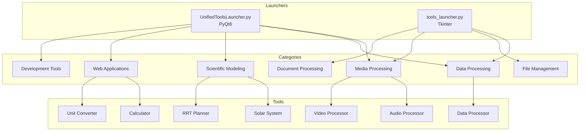

# Assessment C Results: Tools Repository Documentation & Integration

**Assessment Date**: 2026-01-11
**Assessor**: AI Technical Writer & Developer Experience Engineer
**Assessment Type**: Documentation & Integration Review

---

## Executive Summary

1. **Root README is inaccurate** - Title "Golf Biomechanics Simulator" misrepresents the Tools monorepo
2. **Comprehensive docs/ structure exists** but documentation is sparse within each section
3. **Only 8 READMEs found** across 12+ tools - ~33% documentation coverage
4. **AGENTS.md is thorough** (9.5KB) and provides good agent guidance
5. **Two launcher systems create confusion** - users don't know which to use

### Top 10 Documentation/Integration Gaps

| Rank | Gap                                                    | Severity | Location                                       |
| ---- | ------------------------------------------------------ | -------- | ---------------------------------------------- |
| 1    | README title misrepresents repository                  | Critical | `README.md:1`                                  |
| 2    | No unified user guide for all tools                    | Major    | `docs/`                                        |
| 3    | ~67% of tools lack READMEs                             | Major    | Various tool directories                       |
| 4    | No architecture diagram                                | Major    | `docs/architecture/`                           |
| 5    | Launcher choice confusion (2 launchers)                | Major    | Root directory                                 |
| 6    | No CONTRIBUTING.md                                     | Minor    | Root directory                                 |
| 7    | docs/tools/ is sparse                                  | Minor    | `docs/tools/`                                  |
| 8    | No API documentation                                   | Minor    | `docs/`                                        |
| 9    | Video processor has JavaScript README in wrong context | Minor    | `media_processing/video_processor/javascript/` |
| 10   | Test documentation missing                             | Nit      | `tests/`                                       |

### "If a new developer started tomorrow, what would confuse them first?"

**The README title and two launchers.** A new developer would:

1. See "Golf Biomechanics Simulator" and be confused - this is a tools monorepo
2. Find both `UnifiedToolsLauncher.py` and `tools_launcher.py` - which do they run?
3. Try to find documentation for a specific tool and likely not find it

---

## Scorecard

| Category                  | Score | Weight | Weighted | Evidence & Remediation                                                             |
| ------------------------- | ----- | ------ | -------- | ---------------------------------------------------------------------------------- |
| **README Quality**        | 4/10  | 2x     | 8        | Title is wrong, structure is good. Remediation: Update title and description.      |
| **Docstring Coverage**    | 5/10  | 2x     | 10       | Some modules documented, many missing. Remediation: Add docstrings systematically. |
| **Example Completeness**  | 4/10  | 1.5x   | 6        | Few runnable examples provided. Remediation: Add examples to each tool README.     |
| **Tool READMEs**          | 3/10  | 2x     | 6        | Only 8 of 12+ tools have READMEs. Remediation: Create README for each tool.        |
| **Integration Docs**      | 5/10  | 1x     | 5        | Architecture docs exist but sparse. Remediation: Add integration guide.            |
| **API Documentation**     | 3/10  | 1x     | 3        | No API docs for programmatic usage. Remediation: Generate from docstrings.         |
| **Onboarding Experience** | 4/10  | 1.5x   | 6        | README misleading, two launchers confusing. Remediation: Clear primary path.       |

**Overall Weighted Score**: 44 / 110 = **4.0 / 10** ⚠️

---

## Findings Table

| ID    | Severity | Category      | Location                                       | Symptom                                  | Root Cause                    | Fix                                    | Effort |
| ----- | -------- | ------------- | ---------------------------------------------- | ---------------------------------------- | ----------------------------- | -------------------------------------- | ------ |
| C-001 | Critical | README        | `README.md:1`                                  | Title says "Golf Biomechanics Simulator" | Outdated/incorrect README     | Rewrite README with correct title      | S      |
| C-002 | Major    | Documentation | `docs/`                                        | No comprehensive user guide              | Documentation not prioritized | Create unified user guide              | M      |
| C-003 | Major    | Tool READMEs  | Various                                        | Only 8 of 12+ tools documented           | Inconsistent practices        | Create README template, apply          | M      |
| C-004 | Major    | Architecture  | `docs/architecture/`                           | No visual architecture diagram           | Not created                   | Create diagram with Mermaid            | S      |
| C-005 | Major    | Onboarding    | Root                                           | Two launchers cause confusion            | Historical reasons            | Designate primary, deprecate secondary | M      |
| C-006 | Minor    | Contribution  | Root                                           | No CONTRIBUTING.md                       | Not created                   | Create contribution guide              | S      |
| C-007 | Minor    | API Docs      | `docs/`                                        | No programmatic usage docs               | Not prioritized               | Generate from docstrings               | M      |
| C-008 | Minor    | Location      | `media_processing/video_processor/javascript/` | README in wrong context                  | File organization             | Move or clarify purpose                | S      |
| C-009 | Minor    | Testing       | `tests/`                                       | No test documentation                    | Tests exist but undocumented  | Add tests/README.md                    | S      |
| C-010 | Nit      | Examples      | Various                                        | Few runnable examples                    | Documentation debt            | Add examples to tool READMEs           | M      |

---

## Documentation Inventory

### Root Level

| Document        | Present | Complete | Accurate | Notes                             |
| --------------- | ------- | -------- | -------- | --------------------------------- |
| README.md       | ✅      | ⚠️       | ❌       | Title wrong, structure good       |
| AGENTS.md       | ✅      | ✅       | ✅       | Excellent, 9.5KB comprehensive    |
| LICENSE         | ✅      | ✅       | ✅       | MIT License                       |
| CONTRIBUTING.md | ❌      | -        | -        | Missing                           |
| CHANGELOG.md    | ❌      | -        | -        | Missing (exists in docs/release/) |

### docs/ Structure

| Directory          | Files   | Status | Notes                        |
| ------------------ | ------- | ------ | ---------------------------- |
| docs/README.md     | 1       | ⚠️     | Brief, needs expansion       |
| docs/architecture/ | Unknown | ⚠️     | Needs diagram                |
| docs/development/  | Unknown | ⚠️     | Likely sparse                |
| docs/release/      | Unknown | ✅     | Contains CHANGELOG           |
| docs/tools/        | Unknown | ⚠️     | Sparse tool documentation    |
| docs/assessments/  | 5+      | ✅     | Assessment framework created |

### Tool READMEs

| Tool              | Path                                    | README | Status         |
| ----------------- | --------------------------------------- | ------ | -------------- |
| Data Processor    | data_processing/data_processor/         | ✅     | Has README     |
| Audio Processor   | media_processing/audio_processor/       | ✅     | Has README     |
| Video Processor   | media_processing/video_processor/       | ⚠️     | JS-only README |
| Folder Tool       | file_management/folder_tool/            | ❓     | Unknown        |
| Project Packer    | file_management/project_packer/         | ✅     | Has README     |
| PDF Renamer       | document_processing/pdf_renamer/        | ✅     | Has README     |
| Solar System      | scientific_modeling/solar_system_model/ | ❓     | Unknown        |
| RRT Planner       | scientific_modeling/rrt_path_planner/   | ❓     | Unknown        |
| Calculator        | web_applications/calculator/            | ❓     | Unknown        |
| Unit Converter    | web_applications/unit_converter/        | ❓     | Unknown        |
| Folder Packer Pro | development_tools/folder_tools/         | ❓     | Unknown        |

**README Coverage**: ~40% (estimated 5 of 12)

---

## Docstring Coverage Analysis

| Module                    | Total Functions | Documented | Coverage | Quality                            |
| ------------------------- | --------------- | ---------- | -------- | ---------------------------------- |
| `tools_launcher.py`       | 30+             | ~15        | ~50%     | Partial - comments, not docstrings |
| `UnifiedToolsLauncher.py` | 10+             | ~5         | ~50%     | Partial                            |
| Core tool modules         | Unknown         | Unknown    | Unknown  | Needs audit                        |

---

## User Journey Analysis

### Journey 1: "I want to find and use a specific tool"

1. **Start**: Repository root
2. **Expected Path**: README → Category → Tool README → Launch
3. **Actual Experience**:
   - ❌ README title is confusing ("Golf Biomechanics Simulator")
   - ⚠️ Tool categories listed but not all tools
   - ❌ Many tools lack READMEs
   - ⚠️ Launch instructions unclear (which launcher?)
4. **Grade**: **D**

### Journey 2: "I want to add a new tool"

1. **Start**: CONTRIBUTING.md or AGENTS.md
2. **Expected Path**: Guidelines → Template → Integration
3. **Actual Experience**:
   - ❌ No CONTRIBUTING.md
   - ✅ AGENTS.md provides coding standards
   - ❌ No tool template documented
   - ❌ No integration guide for launchers
4. **Grade**: **D**

### Journey 3: "I want to use a tool programmatically"

1. **Start**: API documentation
2. **Expected Path**: Import → Configure → Execute
3. **Actual Experience**:
   - ❌ No API documentation
   - ⚠️ Some tools have docstrings
   - ❌ No examples of programmatic usage
4. **Grade**: **F**

---

## Refactoring Plan

### 48 Hours - Critical Documentation Gaps

1. **Fix README.md title and description** (C-001)

   ```markdown
   # Tools Monorepo

   A comprehensive collection of utility tools for:

   - Data processing and analysis
   - Media (audio/video) processing
   - Document management
   - Scientific modeling
   - Development utilities
   - Web applications
   ```

2. **Create CONTRIBUTING.md** (C-006)

   - Link to AGENTS.md for coding standards
   - Explain tool creation process
   - Document PR workflow

3. **Designate primary launcher** (C-005)

   ````markdown
   ## Quick Start

   Run the **Unified Tools Launcher** (recommended):

   ```bash
   python UnifiedToolsLauncher.py
   ```
   ````

   > Note: `tools_launcher.py` is the legacy launcher and may be deprecated.

   ```

   ```

### 2 Weeks - Documentation Completion

1. **Create tool README template**

   ````markdown
   # [Tool Name]

   ## Description

   [Brief description]

   ## Quick Start

   ```bash
   python [tool_path]
   ```
   ````

   ## Features

   - Feature 1
   - Feature 2

   ## Usage

   [Detailed usage]

   ## Configuration

   [Options if any]

   ```

   ```

2. **Apply template to all tools** (C-003)

   - Solar System Model
   - RRT Path Planner
   - Calculator
   - Unit Converter
   - Folder Packer Pro
   - Video Processor (Python)
   - Others lacking READMEs

3. **Create architecture diagram** (C-004)
   ```mermaid
   graph TD
       A[UnifiedToolsLauncher] --> B[Media Processing]
       A --> C[Data Processing]
       A --> D[Scientific Modeling]
       A --> E[Web Applications]
       A --> F[Development Tools]
       A --> G[Document Processing]
   ```

### 6 Weeks - Full Documentation Excellence

1. **Generate API documentation** (C-007)

   - Add comprehensive docstrings
   - Generate docs with Sphinx or pdoc
   - Host in docs/api/

2. **Create comprehensive user guide** (C-002)

   - Tool-by-tool walkthroughs
   - Screenshots
   - Common workflows

3. **Add tests documentation** (C-009)
   - How to run tests
   - How to add tests
   - Coverage requirements

---

## Diff-Style Suggestions

### 1. Fix README Title (C-001)

```diff
- # Golf Biomechanics Simulator & Game Engine
+ # Tools Monorepo

- Welcome to the **Golf Biomechanics Simulator & Game Engine** monorepo.
- This repository houses a comprehensive suite of tools for golf swing modeling,
- chemical simulations, data processing, and project management.
+ Welcome to the **Tools Monorepo**. This repository houses a comprehensive
+ collection of utility tools for data processing, media handling, scientific
+ modeling, and development workflows.
```

### 2. Clarify Launcher Usage

````diff
  ## 🚀 Quick Start

+ ### Recommended: Unified Launcher
  The easiest way to explore the available tools is via the unified launcher:

  ```bash
  python UnifiedToolsLauncher.py
````

-
- ### Alternative: Tkinter Launcher (Legacy)
- For a lightweight alternative:
-
- ```bash

  ```

- python tools_launcher.py
- ```

  ```

````

### 3. Add CONTRIBUTING.md (C-006)

```markdown
# Contributing to Tools Monorepo

## Getting Started

1. Fork the repository
2. Create a feature branch: `git checkout -b feature/your-feature`
3. Make changes following [AGENTS.md](AGENTS.md) guidelines
4. Run pre-commit hooks: `pre-commit run --all-files`
5. Submit a Pull Request

## Adding a New Tool

1. Create directory under appropriate category
2. Copy template from `config/project_template/`
3. Implement tool following AGENTS.md standards
4. Add README.md to tool directory
5. Register in UnifiedToolsLauncher.py
6. Add tests in tests/

## Code Standards

See [AGENTS.md](AGENTS.md) for complete coding standards.
````

### 4. Tool README Template

````markdown
# [Tool Name]

Brief one-line description.

## Features

- Feature 1: Description
- Feature 2: Description

## Quick Start

```bash
python [path/to/tool]/main.py
```
````

## Requirements

- Python 3.11+
- See requirements.txt

## Usage

### Basic Usage

```bash
python main.py --input file.txt
```

### Advanced Usage

[More examples]

## Configuration

| Option  | Type | Default | Description     |
| ------- | ---- | ------- | --------------- |
| --input | str  | -       | Input file path |

## API Usage

```python
from tool import main_function
result = main_function(input_data)
```

## License

MIT - See repository LICENSE

````

### 5. Architecture Diagram (C-004)

```markdown
# Tools Monorepo Architecture



---

## Appendix: Missing READMEs

Priority list of tools needing documentation:

| Priority | Tool | Path | Effort |
|----------|------|------|--------|
| 1 | Solar System Model | scientific_modeling/solar_system_model/ | S |
| 2 | RRT Path Planner | scientific_modeling/rrt_path_planner/ | M |
| 3 | Calculator | web_applications/calculator/ | S |
| 4 | Unit Converter | web_applications/unit_converter/ | S |
| 5 | Folder Packer Pro | development_tools/folder_tools/ | M |
| 6 | Video Processor | media_processing/video_processor/ | M |
| 7 | Folder Tool | file_management/folder_tool/ | S |

---

*Assessment C focuses on documentation and integration. See Assessment A for architecture/implementation and Assessment B for hygiene/quality.*
```
