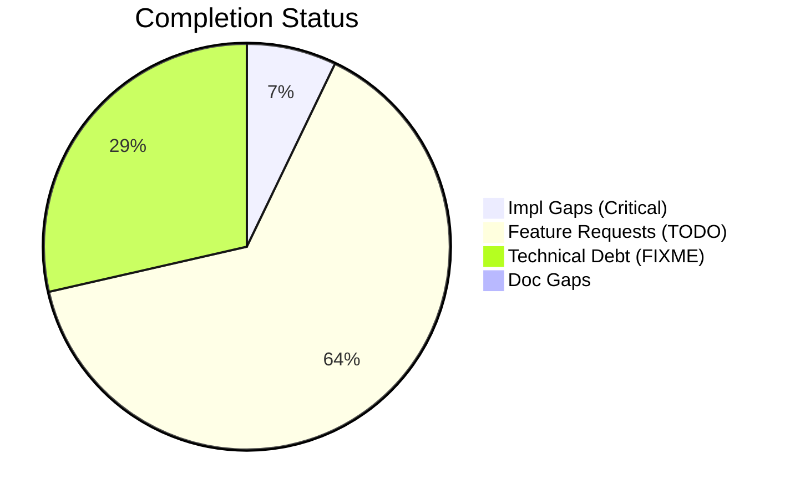
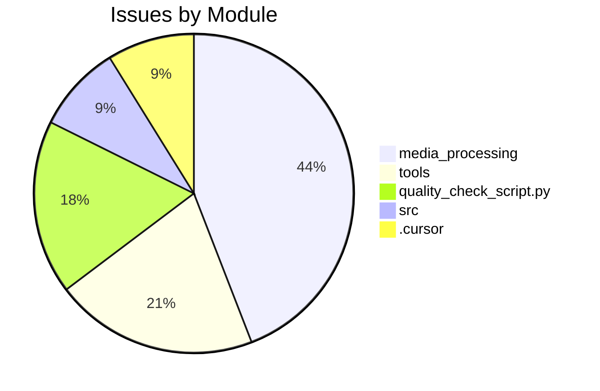

# Completist Report: 2026-03-01

## Executive Summary
- **Critical Gaps**: 3
- **Feature Gaps (TODO)**: 27
- **Technical Debt**: 12
- **Documentation Gaps**: 0

## Visualization
### Status Overview

### Top Impacted Modules

## Critical Incomplete (Top 50)
| File | Line | Type | Impact | Coverage | Complexity |
|---|---|---|---|---|---|
| `./src/shared/python/signal_toolkit/io.py` | 543 | NotImplementedError | 5 | 3 | 4 |
| `./src/shared/python/model_generation/converters/format_utils.py` | 161 | NotImplementedError | 5 | 3 | 4 |
| `./src/tools/quality_utils.py` | 37 | NotImplementedError | 3 | 2 | 4 |

## Feature Gap Matrix
| Module | Feature Gap | Type |
|---|---|---|
| `./config/project_template/tools/code_quality_check.py` | (re.compile(r"\bTODO\b"), "TODO placeholder found"), | TODO |
| `./.cursor/rules/.cursorrules.md` | - **NEVER USE PLACEHOLDERS** → No `TODO`, `FIXME`, `...`, `pass`, `NotImplementedError`, `<your-valu | TODO |
| `./.cursor/rules/.cursorrules.md` | - [X] Zero TODO/FIXME/pass in diff | TODO |
| `./.cursor/rules/.cursorrules.md` | # TODO: implement this properly | TODO |
| `./tools/README.md` | - **Banned Patterns**: TODO, FIXME, placeholders, NotImplementedError | TODO |
| `./tools/matlab_utilities/README.md` | - TODO, FIXME, HACK, XXX placeholders | TODO |
| `./tools/matlab_utilities/scripts/matlab_quality_check.py` | (r"\bTODO\b", "TODO placeholder found"), | TODO |
| `./tools/code_quality_check.py` | (re.compile(r"\bTODO\b"), "TODO placeholder found"), | TODO |
| `./quality_check_script.py` | (re.compile(r"\bTODO\b"), "TODO placeholder found"), | TODO |
| `./quality_check_script.py` | re.compile(r"<[^<>]*TODO[^<>]*>", re.IGNORECASE), | TODO |
| `./quality_check_script.py` | "Angle bracket TODO placeholder", | TODO |
| `./drafts/Jules-Code-Quality-Reviewer.yml` | 5. **Placeholders**: Identify placeholder code (TODO, FIXME, NotImplemented, pass statements) | TODO |
| `./scripts/quality-check.py` | (re.compile(r"\bTODO\b"), "TODO placeholder found"), | TODO |
| `./scripts/quality-check.py` | # Note: Angle bracket TODO/FIXME patterns removed to avoid false positives in regex | TODO |
| `./media_processing/video_processor/tools/matlab_utilities/scripts/matlab_quality_check.py` | (r"\bTODO\b", "TODO placeholder found"), | TODO |
| `./media_processing/video_processor/tools/code_quality_check.py` | (re.compile(r"\bTODO\b"), "TODO placeholder found"), | TODO |
| `./media_processing/video_processor/apps/web/app/page.tsx` | // TODO: Move fps to client-side config or use from video metadata | TODO |
| `./media_processing/video_processor/apps/web/app/page.tsx` | // TODO: Save to database when backend is ready | TODO |
| `./media_processing/video_processor/apps/web/app/page.tsx` | // TODO: Save pose data to state or database when ready | TODO |
| `./media_processing/video_processor/apps/web/lib/sanitize.ts` | * TODO: Add DOMPurify when ready for production. | TODO |
| `./media_processing/video_processor/apps/web/lib/sanitize.ts` | // TODO: Use DOMPurify to allow safe HTML tags | TODO |
| `./media_processing/video_processor/apps/web/lib/sanitize.ts` | // TODO: Parse and validate RGB values | TODO |
| `./media_processing/video_processor/apps/web/lib/logger.ts` | * TODO: Add pino when ready for production. | TODO |
| `./media_processing/video_processor/JULES_ARCHITECTURE.md` | if grep -r "TODO\\|FIXME" --include="*.py" src/; then | TODO |
| `./media_processing/video_processor/matlab/models/pendulum_model.m` | % TODO: Implement pendulum model | TODO |
| `./media_processing/video_processor/javascript/README.md` | - No placeholders (no TODO, FIXME, etc.) | TODO |
| `./data_processing/data_processor/tools/code_quality_check.py` | (re.compile(r"\bTODO\b"), "TODO placeholder found"), | TODO |

## Technical Debt Register
| File | Line | Issue | Type |
|---|---|---|---|
| `./config/project_template/tools/code_quality_check.py` | 35 | (re.compile(r"\bFIXME\b"), "FIXME placeholder found"), | FIXME |
| `./tools/matlab_utilities/scripts/matlab_quality_check.py` | 311 | (r"\bFIXME\b", "FIXME placeholder found"), | FIXME |
| `./tools/matlab_utilities/scripts/matlab_quality_check.py` | 313 | (r"\bXXX\b", "XXX comment found"), | XXX |
| `./tools/code_quality_check.py` | 35 | (re.compile(r"\bFIXME\b"), "FIXME placeholder found"), | FIXME |
| `./quality_check_script.py` | 12 | (re.compile(r"\bFIXME\b"), "FIXME placeholder found"), | FIXME |
| `./quality_check_script.py` | 25 | re.compile(r"<[^<>]*FIXME[^<>]*>", re.IGNORECASE), | FIXME |
| `./quality_check_script.py` | 26 | "Angle bracket FIXME placeholder", | FIXME |
| `./scripts/quality-check.py` | 12 | (re.compile(r"\bFIXME\b"), "FIXME placeholder found"), | FIXME |
| `./media_processing/video_processor/tools/matlab_utilities/scripts/matlab_quality_check.py` | 309 | (r"\bFIXME\b", "FIXME placeholder found"), | FIXME |
| `./media_processing/video_processor/tools/matlab_utilities/scripts/matlab_quality_check.py` | 311 | (r"\bXXX\b", "XXX comment found"), | XXX |
| `./media_processing/video_processor/tools/code_quality_check.py` | 35 | (re.compile(r"\bFIXME\b"), "FIXME placeholder found"), | FIXME |
| `./data_processing/data_processor/tools/code_quality_check.py` | 35 | (re.compile(r"\bFIXME\b"), "FIXME placeholder found"), | FIXME |

## Recommended Implementation Order
Prioritized by Impact (High) and Complexity (Low).
| Priority | File | Issue | Metrics (I/C/C) |
|---|---|---|---|
| 1 | `./src/shared/python/signal_toolkit/io.py` | raise NotImplementedError(msg) | 5/3/4 |
| 2 | `./src/shared/python/model_generation/converters/format_utils.py` | raise NotImplementedError( | 5/3/4 |
| 3 | `./config/project_template/tools/code_quality_check.py` | (re.compile(r"\bTODO\b"), "TODO placeholder found"), | 3/2/3 |
| 4 | `./tools/README.md` | - **Banned Patterns**: TODO, FIXME, placeholders, NotImplementedError | 3/2/3 |
| 5 | `./tools/matlab_utilities/README.md` | - TODO, FIXME, HACK, XXX placeholders | 3/2/3 |
| 6 | `./tools/matlab_utilities/scripts/matlab_quality_check.py` | (r"\bTODO\b", "TODO placeholder found"), | 3/2/3 |
| 7 | `./tools/code_quality_check.py` | (re.compile(r"\bTODO\b"), "TODO placeholder found"), | 3/2/3 |
| 8 | `./media_processing/video_processor/tools/matlab_utilities/scripts/matlab_quality_check.py` | (r"\bTODO\b", "TODO placeholder found"), | 3/2/3 |
| 9 | `./media_processing/video_processor/tools/code_quality_check.py` | (re.compile(r"\bTODO\b"), "TODO placeholder found"), | 3/2/3 |
| 10 | `./data_processing/data_processor/tools/code_quality_check.py` | (re.compile(r"\bTODO\b"), "TODO placeholder found"), | 3/2/3 |
| 11 | `./src/tools/quality_utils.py` | (re.compile(r"NotImplementedError"), "NotImplementedError placeholder"), | 3/2/4 |
| 12 | `./.cursor/rules/.cursorrules.md` | - **NEVER USE PLACEHOLDERS** → No `TODO`, `FIXME`, `...`, `pass`, `NotImplemente | 1/2/3 |
| 13 | `./.cursor/rules/.cursorrules.md` | - [X] Zero TODO/FIXME/pass in diff | 1/2/3 |
| 14 | `./.cursor/rules/.cursorrules.md` | # TODO: implement this properly | 1/2/3 |
| 15 | `./quality_check_script.py` | (re.compile(r"\bTODO\b"), "TODO placeholder found"), | 1/2/3 |
| 16 | `./quality_check_script.py` | re.compile(r"<[^<>]*TODO[^<>]*>", re.IGNORECASE), | 1/2/3 |
| 17 | `./quality_check_script.py` | "Angle bracket TODO placeholder", | 1/2/3 |
| 18 | `./drafts/Jules-Code-Quality-Reviewer.yml` | 5. **Placeholders**: Identify placeholder code (TODO, FIXME, NotImplemented, pas | 1/2/3 |
| 19 | `./scripts/quality-check.py` | (re.compile(r"\bTODO\b"), "TODO placeholder found"), | 1/2/3 |
| 20 | `./scripts/quality-check.py` | # Note: Angle bracket TODO/FIXME patterns removed to avoid false positives in re | 1/2/3 |

## Issues Created
- Created `docs/assessments/issues/Issue_2027_Incomplete_NotImplementedError_in_io_py_543.md`
- Created `docs/assessments/issues/Issue_2028_Incomplete_NotImplementedError_in_format_utils_py_161.md`