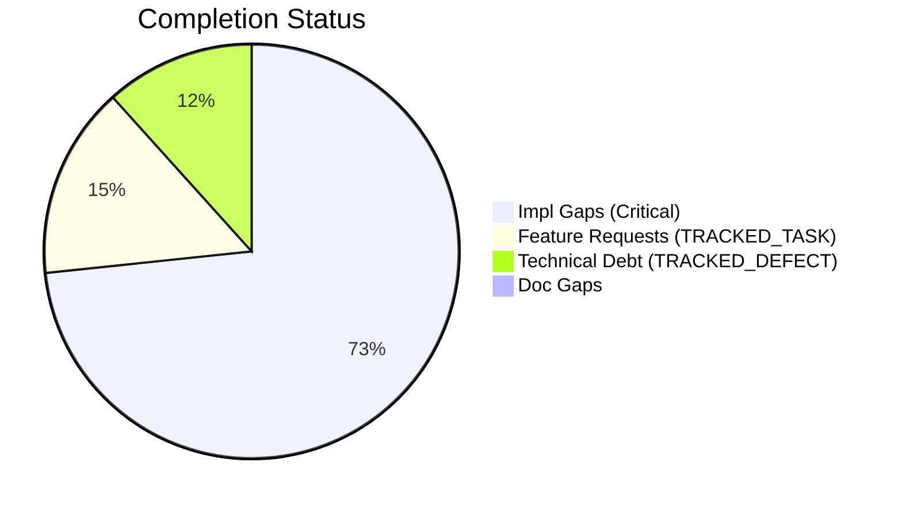
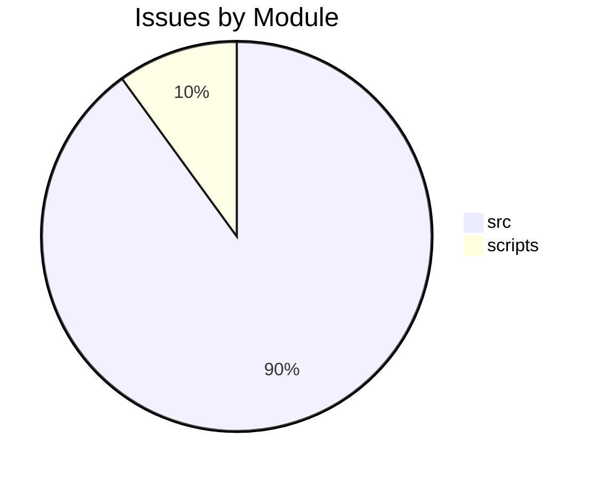

# Completist Report: 2026-05-17

## Executive Summary

- **Critical Gaps**: 44
- **Feature Gaps (TRACKED_TASK)**: 9
- **Technical Debt**: 7
- **Documentation Gaps**: 0

## Visualization

### Status Overview

### Top Impacted Modules

## Critical Incomplete (Top 50)

| File                                                                                         | Line | Type                | Impact | Coverage | Complexity |
| -------------------------------------------------------------------------------------------- | ---- | ------------------- | ------ | -------- | ---------- |
| `./src/shared/python/model_generation/explorer/model_explorer.py`                            | 59   | NotImplementedError | 5      | 3        | 4          |
| `./src/shared/python/chat/router_factory.py`                                                 | 300  | NotImplementedError | 5      | 3        | 4          |
| `./src/shared/python/chat/router_factory.py`                                                 | 335  | NotImplementedError | 5      | 3        | 4          |
| `./src/shared/python/chat/service_base.py`                                                   | 321  | NotImplementedError | 5      | 3        | 4          |
| `./src/shared/python/chat/service_base.py`                                                   | 330  | NotImplementedError | 5      | 3        | 4          |
| `./src/shared/python/chat/service_base.py`                                                   | 335  | NotImplementedError | 5      | 3        | 4          |
| `./src/shared/python/chat/service_base.py`                                                   | 347  | NotImplementedError | 5      | 3        | 4          |
| `./src/shared/python/ai/adapters/gemini_adapter.py`                                          | 26   | NotImplementedError | 5      | 3        | 4          |
| `./src/shared/python/ai/adapters/gemini_adapter.py`                                          | 90   | NotImplementedError | 5      | 3        | 4          |
| `./src/shared/python/ai/adapters/gemini_adapter.py`                                          | 167  | NotImplementedError | 5      | 3        | 4          |
| `./src/shared/python/ai/adapters/gemini_adapter.py`                                          | 188  | NotImplementedError | 5      | 3        | 4          |
| `./src/shared/python/ai/adapters/gemini_adapter.py`                                          | 214  | NotImplementedError | 5      | 3        | 4          |
| `./src/shared/python/ai/adapters/base.py`                                                    | 201  | NotImplementedError | 5      | 3        | 4          |
| `./src/shared/python/ai/integrations/obsidian.py`                                            | 4    | NotImplementedError | 5      | 3        | 4          |
| `./src/shared/python/ai/gui/_provider_config_widgets.py`                                     | 66   | NotImplementedError | 5      | 3        | 4          |
| `./src/shared/python/ai/auth/authentication.py`                                              | 15   | NotImplementedError | 5      | 3        | 4          |
| `./src/shared/python/ai/auth/authentication.py`                                              | 324  | NotImplementedError | 5      | 3        | 4          |
| `./src/shared/python/ai/auth/authentication.py`                                              | 327  | NotImplementedError | 5      | 3        | 4          |
| `./src/shared/python/ai/auth/authentication.py`                                              | 338  | NotImplementedError | 5      | 3        | 4          |
| `./src/shared/python/ai/auth/authentication.py`                                              | 352  | NotImplementedError | 5      | 3        | 4          |
| `./src/shared/python/ai/auth/authentication.py`                                              | 355  | NotImplementedError | 5      | 3        | 4          |
| `./src/shared/python/ai/auth/authentication.py`                                              | 366  | NotImplementedError | 5      | 3        | 4          |
| `./src/shared/python/ai/auth/authentication.py`                                              | 395  | NotImplementedError | 5      | 3        | 4          |
| `./src/shared/python/sidekick/ui/tools_sidebar/tab_popout.py`                                | 27   | NotImplementedError | 5      | 3        | 4          |
| `./src/shared/python/sidekick/ui/tools_sidebar/tab_popout.py`                                | 30   | NotImplementedError | 5      | 3        | 4          |
| `./src/shared/python/sidekick/ui/tools_sidebar/tab_popout.py`                                | 33   | NotImplementedError | 5      | 3        | 4          |
| `./src/shared/python/sidekick/ui/tools_sidebar/tab_popout.py`                                | 36   | NotImplementedError | 5      | 3        | 4          |
| `./src/shared/python/sidekick/ui/tools_sidebar/tab_popout.py`                                | 39   | NotImplementedError | 5      | 3        | 4          |
| `./src/shared/python/sidekick/ui/tools_sidebar/tab_popout.py`                                | 42   | NotImplementedError | 5      | 3        | 4          |
| `./src/shared/python/sidekick/ui/tools_sidebar/tab_display_names.py`                         | 74   | NotImplementedError | 5      | 3        | 4          |
| `./src/tools/quality_utils.py`                                                               | 39   | NotImplementedError | 3      | 2        | 4          |
| `./scripts/legacy_tools/code_quality_check.py`                                               | 37   | NotImplementedError | 3      | 2        | 4          |
| `./src/pendulum_simulator/src/double_pendulum_golf/gui/simulation_panel/_export_mixin.py`    | 318  | NotImplementedError | 1      | 2        | 4          |
| `./src/pendulum_simulator/src/double_pendulum_golf/gui/simulation_panel/_lifecycle_mixin.py` | 311  | NotImplementedError | 1      | 2        | 4          |
| `./src/pendulum_simulator/src/double_pendulum_golf/gui/simulation_panel/_lifecycle_mixin.py` | 317  | NotImplementedError | 1      | 2        | 4          |
| `./src/pendulum_simulator/src/double_pendulum_golf/gui/simulation_panel/_lifecycle_mixin.py` | 320  | NotImplementedError | 1      | 2        | 4          |
| `./src/pendulum_simulator/pendulum-core/python/physics_native.py`                            | 8    | NotImplementedError | 1      | 2        | 4          |
| `./src/pendulum_simulator/pendulum-core/python/physics_native.py`                            | 20   | NotImplementedError | 1      | 2        | 4          |
| `./src/pendulum_simulator/pendulum-core/python/physics_native.py`                            | 22   | NotImplementedError | 1      | 2        | 4          |
| `./src/pendulum_simulator/pendulum-core/python/physics_native.py`                            | 436  | NotImplementedError | 1      | 2        | 4          |
| `./src/pendulum_simulator/pendulum-core/python/physics_native.py`                            | 459  | NotImplementedError | 1      | 2        | 4          |
| `./src/pendulum_simulator/pendulum-core/python/physics_native.py`                            | 482  | NotImplementedError | 1      | 2        | 4          |
| `./src/pendulum_simulator/pendulum-core/python/physics_native.py`                            | 501  | NotImplementedError | 1      | 2        | 4          |
| `./src/pendulum_simulator/pendulum-core/python/physics_native.py`                            | 520  | NotImplementedError | 1      | 2        | 4          |

## Feature Gap Matrix

| Module                                                                                | Feature Gap                                                                | Type         |
| ------------------------------------------------------------------------------------- | -------------------------------------------------------------------------- | ------------ |
| `./src/data_processing/data_processor/python/data_processor/core/script_generator.py` | # The "TODO" below is intentional generated-script content for the user    | TRACKED_TASK |
| `./src/shared/python/ai/adapters/gemini_adapter.py`                                   | A future PR (TODO(#2764)) should implement option A: translate             | TRACKED_TASK |
| `./src/shared/python/ai/adapters/gemini_adapter.py`                                   | TODO(#2764): replace this with a real translation from                     | TRACKED_TASK |
| `./src/shared/python/ai/auth/authentication.py`                                       | f"OAuth login for provider {provider!r} is not implemented (TODO #5227). " | TRACKED_TASK |
| `./src/shared/python/ai/auth/authentication.py`                                       | f"Email/password login for {email!r} is not implemented (TODO #5227). "    | TRACKED_TASK |
| `./src/shared/python/ai/auth/authentication.py`                                       | # TODO(#5227): Exchange refresh token for new access token                 | TRACKED_TASK |
| `./scripts/generate_comprehensive_assessment.py`                                      | stats["todos"] += content.count("TODO")                                    | TRACKED_TASK |
| `./scripts/generate_comprehensive_assessment.py`                                      | grades["O"] = (max(0, score_o), f"Technical Debt (TODO+FIXME): {debt}")    | TRACKED_TASK |
| `./scripts/generate_comprehensive_assessment.py`                                      | stats["todos"] += content.count("TODO")                                    | TRACKED_TASK |

## Technical Debt Register

| File                                             | Line | Issue                                                                               | Type  |
| ------------------------------------------------ | ---- | ----------------------------------------------------------------------------------- | ----- |
| `./src/shared/python/chat/terminal_runtime.py`   | 46   | "TEMP",                                                                             | TEMP  |
| `./src/shared/python/ai/mcp/client.py`           | 45   | \_ALLOWLIST_ENV_KEYS = ("PATH", "HOME", "USERPROFILE", "SYSTEMROOT", "TEMP", "TMP") | TEMP  |
| `./src/tools/matlab_quality_utils.py`            | 324  | """Check for TRACKED_TASK, TRACKED_DEFECT, HACK, XXX, and placeholders."""          | XXX   |
| `./src/tools/matlab_quality_utils.py`            | 333  | (r"\bHACK\b", "HACK comment found"),                                                | HACK  |
| `./src/tools/matlab_quality_utils.py`            | 334  | (r"\bXXX\b", "XXX comment found"),                                                  | XXX   |
| `./scripts/generate_comprehensive_assessment.py` | 143  | stats["fixmes"] += content.count("FIXME")                                           | FIXME |
| `./scripts/generate_comprehensive_assessment.py` | 121  | stats["fixmes"] += content.count("FIXME")                                           | FIXME |

## Recommended Implementation Order

Prioritized by Impact (High) and Complexity (Low).
| Priority | File | Issue | Metrics (I/C/C) |
|---|---|---|---|
| 1 | `./src/shared/python/ai/adapters/gemini_adapter.py` | A future PR (TODO(#2764)) should implement option A: translate | 5/3/3 |
| 2 | `./src/shared/python/ai/adapters/gemini_adapter.py` | TODO(#2764): replace this with a real translation from | 5/3/3 |
| 3 | `./src/shared/python/ai/auth/authentication.py` | f"OAuth login for provider {provider!r} is not implemented (TODO #5227). " | 5/3/3 |
| 4 | `./src/shared/python/ai/auth/authentication.py` | f"Email/password login for {email!r} is not implemented (TODO #5227). " | 5/3/3 |
| 5 | `./src/shared/python/ai/auth/authentication.py` | # TODO(#5227): Exchange refresh token for new access token | 5/3/3 |
| 6 | `./src/shared/python/model_generation/explorer/model_explorer.py` | class ModelFileSelectionRequiredError(NotImplementedError): | 5/3/4 |
| 7 | `./src/shared/python/chat/router_factory.py` | except NotImplementedError as exc: | 5/3/4 |
| 8 | `./src/shared/python/chat/router_factory.py` | except NotImplementedError as exc: | 5/3/4 |
| 9 | `./src/shared/python/chat/service_base.py` | Default implementation raises `NotImplementedError`. Subclasses | 5/3/4 |
| 10 | `./src/shared/python/chat/service_base.py` | raise NotImplementedError("refresh_models must be implemented by subclass") | 5/3/4 |
| 11 | `./src/shared/python/chat/service_base.py` | Default implementation raises `NotImplementedError`. Subclasses | 5/3/4 |
| 12 | `./src/shared/python/chat/service_base.py` | raise NotImplementedError("index_codebase must be implemented by subclass") | 5/3/4 |
| 13 | `./src/shared/python/ai/adapters/gemini_adapter.py` | \* raise :class:`NotImplementedError` if a caller passes a non-empty | 5/3/4 |
| 14 | `./src/shared/python/ai/adapters/gemini_adapter.py` | non-empty `tools` argument raises :class:`NotImplementedError` rather | 5/3/4 |
| 15 | `./src/shared/python/ai/adapters/gemini_adapter.py` | raise NotImplementedError( | 5/3/4 |
| 16 | `./src/shared/python/ai/adapters/gemini_adapter.py` | NotImplementedError: If `tools` is non-empty (see issue #2764). | 5/3/4 |
| 17 | `./src/shared/python/ai/adapters/gemini_adapter.py` | NotImplementedError: If `tools` is non-empty (see issue #2764). | 5/3/4 |
| 18 | `./src/shared/python/ai/adapters/base.py` | # sufficient. The default implementations raise NotImplementedError | 5/3/4 |
| 19 | `./src/shared/python/ai/integrations/obsidian.py` | This module replaces the previous `NotImplementedError` stubs with a real | 5/3/4 |
| 20 | `./src/shared/python/ai/gui/_provider_config_widgets.py` | raise NotImplementedError | 5/3/4 |

## Issues Created

- Created `docs/assessments/issues/Issue_234714_Incomplete_NotImplementedError_in_model_explorer_py_59.md`
- Created `docs/assessments/issues/Issue_234716_Incomplete_NotImplementedError_in_router_factory_py_300.md`
- Created `docs/assessments/issues/Issue_234717_Incomplete_NotImplementedError_in_router_factory_py_335.md`
- Created `docs/assessments/issues/Issue_234718_Incomplete_NotImplementedError_in_service_base_py_321.md`
- Created `docs/assessments/issues/Issue_234719_Incomplete_NotImplementedError_in_service_base_py_330.md`
- Created `docs/assessments/issues/Issue_234720_Incomplete_NotImplementedError_in_service_base_py_335.md`
- Created `docs/assessments/issues/Issue_234721_Incomplete_NotImplementedError_in_service_base_py_347.md`
- Created `docs/assessments/issues/Issue_234722_Incomplete_NotImplementedError_in_gemini_adapter_py_26.md`
- Created `docs/assessments/issues/Issue_234723_Incomplete_NotImplementedError_in_gemini_adapter_py_90.md`
- Created `docs/assessments/issues/Issue_234724_Incomplete_NotImplementedError_in_gemini_adapter_py_167.md`
