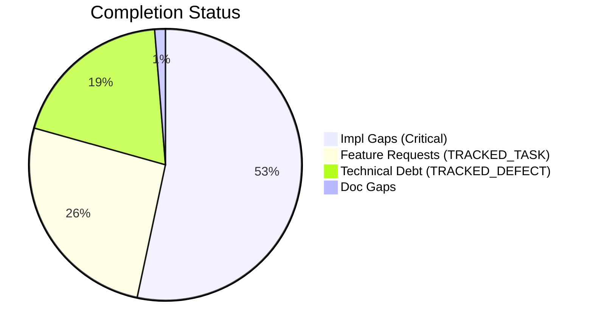
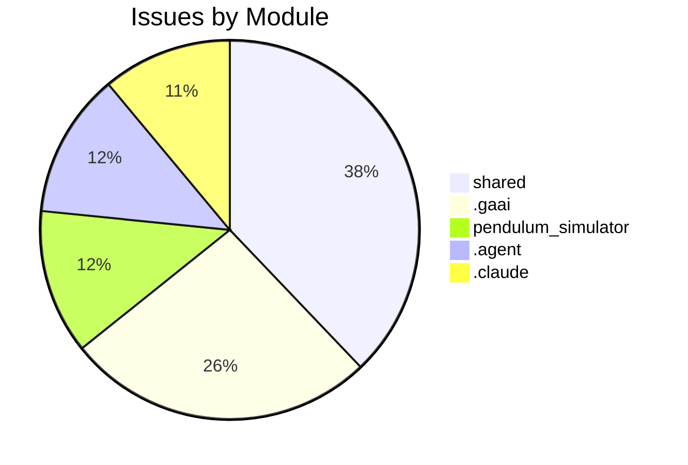

# Completist Report: 2026-07-26

## Executive Summary
- **Critical Gaps**: 168
- **Feature Gaps (TRACKED_TASK)**: 82
- **Technical Debt**: 61
- **Documentation Gaps**: 4

## Visualization
### Status Overview

### Top Impacted Modules

## Critical Incomplete (Top 50)
| File | Line | Type | Impact | Coverage | Complexity |
|---|---|---|---|---|---|
| `src/shared/python/ai/integrations/github_mcp/integration.py` | 36 | Stub | 5 | 3 | 4 |
| `src/shared/python/ai/integrations/github_mcp/integration.py` | 38 | Stub | 5 | 3 | 4 |
| `src/shared/python/ai/mcp/client.py` | 51 | Stub | 5 | 3 | 4 |
| `src/shared/python/ai/mcp/client.py` | 52 | Stub | 5 | 3 | 4 |
| `src/shared/python/ai/mcp/client.py` | 53 | Stub | 5 | 3 | 4 |
| `src/shared/python/ai/mcp/notebooklm_server.py` | 72 | Stub | 5 | 3 | 4 |
| `src/shared/python/ai/mcp/notebooklm_server.py` | 73 | Stub | 5 | 3 | 4 |
| `src/shared/python/ai/mcp/notebooklm_server.py` | 74 | Stub | 5 | 3 | 4 |
| `src/shared/python/ai/mcp/notebooklm_server.py` | 77 | Stub | 5 | 3 | 4 |
| `src/shared/python/ai/mcp/notebooklm_server.py` | 78 | Stub | 5 | 3 | 4 |
| `src/shared/python/ai/mcp/notebooklm_server.py` | 85 | Stub | 5 | 3 | 4 |
| `src/shared/python/ai/mcp/notebooklm_server.py` | 86 | Stub | 5 | 3 | 4 |
| `src/shared/python/ai/mcp/notebooklm_server.py` | 87 | Stub | 5 | 3 | 4 |
| `src/shared/python/ai/mcp/pool.py` | 38 | Stub | 5 | 3 | 4 |
| `src/shared/python/ai/mcp/pool.py` | 39 | Stub | 5 | 3 | 4 |
| `src/shared/python/ai/mcp/pool.py` | 40 | Stub | 5 | 3 | 4 |
| `src/shared/python/ai/mcp/pool.py` | 41 | Stub | 5 | 3 | 4 |
| `src/shared/python/ai/mcp/pool.py` | 42 | Stub | 5 | 3 | 4 |
| `src/shared/python/ai/mcp/pool.py` | 43 | Stub | 5 | 3 | 4 |
| `src/shared/python/ai/mcp/widgets/health_query_api.py` | 68 | Stub | 5 | 3 | 4 |
| `src/shared/python/ai/mcp/widgets/health_query_api.py` | 69 | Stub | 5 | 3 | 4 |
| `src/shared/python/ai/skills/builtin/summarize.py` | 22 | Stub | 5 | 3 | 4 |
| `src/shared/python/ai/skills/registry.py` | 77 | Stub | 5 | 3 | 4 |
| `src/shared/python/chat/condensation/strategy.py` | 32 | Stub | 5 | 3 | 4 |
| `src/shared/python/chat/export/copy_clipboard.py` | 29 | Stub | 5 | 3 | 4 |
| `src/shared/python/model_generation/editor/editor_clipboard.py` | 36 | Stub | 5 | 3 | 4 |
| `src/shared/python/model_generation/editor/editor_modifications.py` | 50 | Stub | 5 | 3 | 4 |
| `src/shared/python/model_generation/editor/editor_modifications.py` | 52 | Stub | 5 | 3 | 4 |
| `src/shared/python/model_generation/editor/editor_modifications.py` | 54 | Stub | 5 | 3 | 4 |
| `src/shared/python/sidekick/ui/tools_sidebar/os_terminal.py` | 97 | Stub | 5 | 3 | 4 |
| `src/shared/python/sidekick/ui/tools_sidebar/os_terminal.py` | 99 | Stub | 5 | 3 | 4 |
| `src/shared/python/sidekick/ui/tools_sidebar/os_terminal.py` | 101 | Stub | 5 | 3 | 4 |
| `src/shared/python/sidekick/ui/tools_sidebar/os_terminal.py` | 103 | Stub | 5 | 3 | 4 |
| `src/shared/python/sidekick/ui/tools_sidebar/os_terminal.py` | 105 | Stub | 5 | 3 | 4 |
| `src/shared/python/sidekick/ui/tools_sidebar/tab_visibility.py` | 25 | Stub | 5 | 3 | 4 |
| `src/shared/python/sidekick/ui/tools_sidebar/tab_visibility.py` | 28 | Stub | 5 | 3 | 4 |
| `src/shared/python/sidekick/ui/widgets/mixins/data_processor_ops.py` | 60 | Stub | 5 | 3 | 4 |
| `src/shared/python/sidekick/ui/widgets/mixins/data_processor_ops.py` | 61 | Stub | 5 | 3 | 4 |
| `src/shared/python/sidekick/ui/widgets/mixins/data_processor_ops.py` | 62 | Stub | 5 | 3 | 4 |
| `src/shared/python/sidekick/ui/widgets/mixins/data_processor_ops.py` | 63 | Stub | 5 | 3 | 4 |
| `src/shared/python/signal_toolkit/widget_protocol.py` | 127 | Stub | 5 | 3 | 4 |
| `src/shared/python/signal_toolkit/widget_protocol.py` | 128 | Stub | 5 | 3 | 4 |
| `src/shared/python/signal_toolkit/widget_protocol.py` | 136 | Stub | 5 | 3 | 4 |
| `src/shared/python/ai/adapters/base.py` | 201 | NotImplementedError | 5 | 3 | 4 |
| `src/shared/python/ai/adapters/gemini_adapter.py` | 28 | NotImplementedError | 5 | 3 | 4 |
| `src/shared/python/ai/adapters/gemini_adapter.py` | 95 | NotImplementedError | 5 | 3 | 4 |
| `src/shared/python/ai/adapters/gemini_adapter.py` | 173 | NotImplementedError | 5 | 3 | 4 |
| `src/shared/python/ai/adapters/gemini_adapter.py` | 194 | NotImplementedError | 5 | 3 | 4 |
| `src/shared/python/ai/adapters/gemini_adapter.py` | 222 | NotImplementedError | 5 | 3 | 4 |
| `src/shared/python/ai/auth/authentication.py` | 15 | NotImplementedError | 5 | 3 | 4 |

## Feature Gap Matrix
| Module | Feature Gap | Type |
|---|---|---|
| `.gaai/core/skills/cross/delivery-readiness-audit/SKILL.md` | - "TODO", "à remplacer", "à migrer" | TRACKED_TASK |
| `.gaai/project/contexts/artefacts/impl-reports/GH1736.impl-report.md` | Resolved the PP-BrokenWindows assessment finding for `src/`. The actual scope in this repo was narro | TRACKED_TASK |
| `.gaai/project/contexts/artefacts/impl-reports/GH1736.impl-report.md` | \| `src/data_processing/data_processor/python/data_processor/core/script_generator.py`        \| Add | TRACKED_TASK |
| `.gaai/project/contexts/artefacts/impl-reports/GH1736.impl-report.md` | - The fleet assessment counted 747 TODOs + 391 FIXMEs across 2529 files (fleet-wide). This repo's `s | TRACKED_TASK |
| `.gaai/project/contexts/artefacts/memory-deltas/GH1736.memory-delta.md` | Fleet assessments (from the discovery daemon) scan the entire fleet. When a broken-window count is l | TRACKED_TASK |
| `.gaai/project/contexts/artefacts/memory-deltas/GH1736.memory-delta.md` | ### Pattern: Generated-code TODO comments | TRACKED_TASK |
| `.gaai/project/contexts/artefacts/memory-deltas/GH1736.memory-delta.md` | String literals in script generators that output TODO comments to generated user-facing files are NO | TRACKED_TASK |
| `.gaai/project/contexts/artefacts/plans/GH1736.execution-plan.md` | Remove or remediate broken-window markers (TODO, FIXME, XXX, NotImplementedError stubs) in `src/` th | TRACKED_TASK |
| `.gaai/project/contexts/artefacts/plans/GH1736.execution-plan.md` | ### TODO/FIXME/XXX markers (actual in src/): | TRACKED_TASK |
| `.gaai/project/contexts/artefacts/plans/GH1736.execution-plan.md` | \| `src/pendulum_simulator/src/double_pendulum_golf/gui/controls_utils.py` \| 83      \| `TODO(#1042 | TRACKED_TASK |
| `.gaai/project/contexts/artefacts/plans/GH1736.execution-plan.md` | \| `src/tools/quality_utils.py`                                            \| 36-51   \| `TODO`/`FIX | TRACKED_TASK |
| `.gaai/project/contexts/artefacts/plans/GH1736.execution-plan.md` | \| `src/tools/matlab_quality_utils.py`                                     \| 319-328 \| `TODO`/`FIX | TRACKED_TASK |
| `.gaai/project/contexts/artefacts/plans/GH1736.execution-plan.md` | \| `src/data_processing/.../script_generator.py`                           \| 559     \| `TODO` in f | TRACKED_TASK |
| `.gaai/project/contexts/artefacts/plans/GH1736.execution-plan.md` | ### Phase 3: Verify script_generator.py template TODO | TRACKED_TASK |
| `.gaai/project/contexts/artefacts/plans/GH1736.execution-plan.md` | The `script_generator.py` generates MATLAB script templates with `# TODO: Implement custom operation | TRACKED_TASK |
| `.gaai/project/contexts/artefacts/plans/GH1736.execution-plan.md` | - No new TODO/FIXME/XXX markers without issue references | TRACKED_TASK |
| `.gaai/project/contexts/artefacts/plans/GH1736.execution-plan.md` | Approach evaluation not required — this is a straightforward documentation/comment improvement. No n | TRACKED_TASK |
| `.gaai/project/contexts/artefacts/qa-reports/GH1463.qa-report.md` | - No TODO/FIXME without issue reference — PASS | TRACKED_TASK |
| `.gaai/project/contexts/artefacts/qa-reports/GH1486.qa-report.md` | - No TODO/FIXME left | TRACKED_TASK |
| `.gaai/project/contexts/artefacts/qa-reports/GH1495.qa-report.md` | - No TODO/FIXME without tracked issue — PASS (none added) | TRACKED_TASK |
| `.gaai/project/contexts/artefacts/qa-reports/GH1496.qa-report.md` | \| No TODO/FIXME without tracked issue \| None added                                             \|  | TRACKED_TASK |
| `.gaai/project/contexts/artefacts/qa-reports/GH1547.qa-report.md` | - No TODO/FIXME introduced | TRACKED_TASK |
| `.gaai/project/contexts/artefacts/qa-reports/GH1587.qa-report.md` | - No TODO/FIXME without tracked issue — PASS (none present) | TRACKED_TASK |
| `.gaai/project/contexts/artefacts/qa-reports/GH1654.qa-report.md` | \| No new TODO/FIXME without issue      \| PASS                              \| | TRACKED_TASK |
| `.gaai/project/contexts/artefacts/qa-reports/GH1694.qa-report.md` | - No `TODO`/`FIXME` without issue tracking | TRACKED_TASK |
| `.gaai/project/contexts/artefacts/qa-reports/GH1695.qa-report.md` | - No TODO/FIXME added without issue reference | TRACKED_TASK |
| `.gaai/project/contexts/artefacts/qa-reports/GH1696.qa-report.md` | - No TODO/FIXME without tracked issue | TRACKED_TASK |
| `.gaai/project/contexts/artefacts/qa-reports/GH1697.qa-report.md` | - No TODO/FIXME without issue references: PASS — none introduced | TRACKED_TASK |
| `.gaai/project/contexts/artefacts/qa-reports/GH1701.qa-report.md` | \| No TODO/FIXME without issue \| PASS — no TODO added                                   \| | TRACKED_TASK |
| `.gaai/project/contexts/artefacts/qa-reports/GH1705.qa-report.md` | - No TODO/FIXME introduced | TRACKED_TASK |
| `.gaai/project/contexts/artefacts/qa-reports/GH1707.qa-report.md` | - No TODO/FIXME added without issue reference: PASS (none added) | TRACKED_TASK |
| `.gaai/project/contexts/artefacts/qa-reports/GH1732.qa-report.md` | - No TODO/FIXME without tracked issue: none added | TRACKED_TASK |
| `.gaai/project/contexts/artefacts/qa-reports/GH1736.qa-report.md` | \| `src/pendulum_simulator/.../controls_utils.py:83`                 \| `TODO(#1042)`                | TRACKED_TASK |
| `.gaai/project/contexts/artefacts/qa-reports/GH1736.qa-report.md` | \| `src/tools/quality_utils.py:36-51`                                \| `TODO`/`FIXME` in string lit | TRACKED_TASK |
| `.gaai/project/contexts/artefacts/qa-reports/GH1736.qa-report.md` | \| `src/tools/matlab_quality_utils.py:319-328`                       \| `TODO`/`FIXME` in string lit | TRACKED_TASK |
| `.gaai/project/contexts/artefacts/qa-reports/GH1736.qa-report.md` | \| `src/data_processing/.../script_generator.py:559`                 \| `TODO` in f-string           | TRACKED_TASK |
| `.gaai/project/contexts/artefacts/qa-reports/GH1736.qa-report.md` | 4. Added a clarifying comment to `script_generator.py` for the template TODO | TRACKED_TASK |
| `.gaai/project/contexts/artefacts/stories/GH1736.story.md` | - TODO markers: 747 | TRACKED_TASK |
| `.gaai/project/contexts/rules/project.rules.md` | 10. No TODO/FIXME comments unless a tracked GitHub issue exists. | TRACKED_TASK |
| `CHANGELOG.md` | - refactor: finalize A+ fleet quality (Zero Bare Except / Zero TODO) (#1829) | TRACKED_TASK |
| `CHANGELOG.md` | - refactor: finalize A+ fleet quality (Zero Bare Except / Zero TODO) (#1750) | TRACKED_TASK |
| `CHANGELOG.md` | - refactor: finalize A+ fleet quality (Zero Bare Except / Zero TODO) (#1829) | TRACKED_TASK |
| `CHANGELOG.md` | - refactor: finalize A+ fleet quality (Zero Bare Except / Zero TODO) (#1750) | TRACKED_TASK |
| `CHANGELOG.md` | - refactor: finalize A+ fleet quality (Zero Bare Except / Zero TODO) (#1829) | TRACKED_TASK |
| `CHANGELOG.md` | - refactor: finalize A+ fleet quality (Zero Bare Except / Zero TODO) (#1750) | TRACKED_TASK |
| `CHANGELOG.md` | - refactor: finalize A+ fleet quality (Zero Bare Except / Zero TODO) (#1829) | TRACKED_TASK |
| `CHANGELOG.md` | - refactor: finalize A+ fleet quality (Zero Bare Except / Zero TODO) (#1750) | TRACKED_TASK |
| `CHANGELOG.md` | - refactor: finalize A+ fleet quality (Zero Bare Except / Zero TODO) (#1829) | TRACKED_TASK |
| `CHANGELOG.md` | - refactor: finalize A+ fleet quality (Zero Bare Except / Zero TODO) (#1750) | TRACKED_TASK |
| `CLAUDE.md` | 8. No TODO/FIXME unless tied to a tracked GitHub issue | TRACKED_TASK |

## Technical Debt Register
| File | Line | Issue | Type |
|---|---|---|---|
| `.agent/skills/issues-10-sequential/SKILL.md` | 105 | \| 1   \| #XXX - Title \| #YYY \| Merged \| | XXX |
| `.agent/skills/issues-10-sequential/SKILL.md` | 106 | \| 2   \| #XXX - Title \| #YYY \| Merged \| | XXX |
| `.agent/skills/issues-5-combined/SKILL.md` | 67 | - #XXX: <brief description> | XXX |
| `.agent/skills/issues-5-combined/SKILL.md` | 68 | - #XXX: <brief description> | XXX |
| `.agent/skills/issues-5-combined/SKILL.md` | 69 | - #XXX: <brief description> | XXX |
| `.agent/skills/issues-5-combined/SKILL.md` | 70 | - #XXX: <brief description> | XXX |
| `.agent/skills/issues-5-combined/SKILL.md` | 71 | - #XXX: <brief description> | XXX |
| `.agent/skills/issues-5-combined/SKILL.md` | 73 | Closes #XXX, closes #XXX, closes #XXX, closes #XXX, closes #XXX | XXX |
| `.agent/skills/issues-5-combined/SKILL.md` | 88 | \| #XXX \| Title \| Brief fix description \| | XXX |
| `.agent/skills/issues-5-combined/SKILL.md` | 89 | \| #XXX \| Title \| Brief fix description \| | XXX |
| `.agent/skills/issues-5-combined/SKILL.md` | 90 | \| #XXX \| Title \| Brief fix description \| | XXX |
| `.agent/skills/issues-5-combined/SKILL.md` | 91 | \| #XXX \| Title \| Brief fix description \| | XXX |
| `.agent/skills/issues-5-combined/SKILL.md` | 92 | \| #XXX \| Title \| Brief fix description \| | XXX |
| `.agent/skills/issues-5-combined/SKILL.md` | 99 | Closes #XXX, closes #XXX, closes #XXX, closes #XXX, closes #XXX" | XXX |
| `.agent/skills/issues-5-combined/SKILL.md` | 145 | \| #XXX  \| Title \| Fixed  \| | XXX |
| `.agent/skills/issues-5-combined/SKILL.md` | 146 | \| #XXX  \| Title \| Fixed  \| | XXX |
| `.agent/skills/issues-5-combined/SKILL.md` | 147 | \| #XXX  \| Title \| Fixed  \| | XXX |
| `.agent/skills/issues-5-combined/SKILL.md` | 148 | \| #XXX  \| Title \| Fixed  \| | XXX |
| `.agent/skills/issues-5-combined/SKILL.md` | 149 | \| #XXX  \| Title \| Fixed  \| | XXX |
| `.agent/skills/lint/SKILL.md` | 33 | - Search for `TRACKED_TASK`, `TRACKED_DEFECT`, `XXX`, `HACK` comments | XXX |
| `.agent/skills/lint/SKILL.md` | 38 | grep -rn "TRACKED_TASK\\|TRACKED_DEFECT\\|XXX\\|HACK\\|NotImplementedError\\|pass$" --include="*.py" | XXX |
| `.agent/skills/update-issues/SKILL.md` | 143 | \| #XXX  \| Title \| High     \| assessment.md \| | XXX |
| `.agent/skills/update-issues/SKILL.md` | 149 | \| #XXX  \| Title \| Fixed in commit abc123 \| | XXX |
| `.agent/skills/update-issues/SKILL.md` | 155 | \| Description \| #XXX           \| | XXX |
| `.agent/workflows/issues-5-combined.md` | 42 | Closes #XXX, closes #XXX, closes #XXX, closes #XXX, closes #XXX | XXX |
| `.agent/workflows/lint.md` | 34 | grep -rn "TRACKED_TASK\\|TRACKED_DEFECT\\|XXX\\|HACK\\|NotImplementedError\\|pass$" --include="*.py" | XXX |
| `.claude/skills/issues-10-sequential/SKILL.md` | 105 | \| 1   \| #XXX - Title \| #YYY \| Merged \| | XXX |
| `.claude/skills/issues-10-sequential/SKILL.md` | 106 | \| 2   \| #XXX - Title \| #YYY \| Merged \| | XXX |
| `.claude/skills/issues-5-combined/SKILL.md` | 67 | - #XXX: <brief description> | XXX |
| `.claude/skills/issues-5-combined/SKILL.md` | 68 | - #XXX: <brief description> | XXX |
| `.claude/skills/issues-5-combined/SKILL.md` | 69 | - #XXX: <brief description> | XXX |
| `.claude/skills/issues-5-combined/SKILL.md` | 70 | - #XXX: <brief description> | XXX |
| `.claude/skills/issues-5-combined/SKILL.md` | 71 | - #XXX: <brief description> | XXX |
| `.claude/skills/issues-5-combined/SKILL.md` | 73 | Closes #XXX, closes #XXX, closes #XXX, closes #XXX, closes #XXX | XXX |
| `.claude/skills/issues-5-combined/SKILL.md` | 88 | \| #XXX \| Title \| Brief fix description \| | XXX |
| `.claude/skills/issues-5-combined/SKILL.md` | 89 | \| #XXX \| Title \| Brief fix description \| | XXX |
| `.claude/skills/issues-5-combined/SKILL.md` | 90 | \| #XXX \| Title \| Brief fix description \| | XXX |
| `.claude/skills/issues-5-combined/SKILL.md` | 91 | \| #XXX \| Title \| Brief fix description \| | XXX |
| `.claude/skills/issues-5-combined/SKILL.md` | 92 | \| #XXX \| Title \| Brief fix description \| | XXX |
| `.claude/skills/issues-5-combined/SKILL.md` | 99 | Closes #XXX, closes #XXX, closes #XXX, closes #XXX, closes #XXX" | XXX |
| `.claude/skills/issues-5-combined/SKILL.md` | 145 | \| #XXX  \| Title \| Fixed  \| | XXX |
| `.claude/skills/issues-5-combined/SKILL.md` | 146 | \| #XXX  \| Title \| Fixed  \| | XXX |
| `.claude/skills/issues-5-combined/SKILL.md` | 147 | \| #XXX  \| Title \| Fixed  \| | XXX |
| `.claude/skills/issues-5-combined/SKILL.md` | 148 | \| #XXX  \| Title \| Fixed  \| | XXX |
| `.claude/skills/issues-5-combined/SKILL.md` | 149 | \| #XXX  \| Title \| Fixed  \| | XXX |
| `.claude/skills/lint/SKILL.md` | 33 | - Search for `TRACKED_TASK`, `TRACKED_DEFECT`, `XXX`, `HACK` comments | XXX |
| `.claude/skills/lint/SKILL.md` | 38 | grep -rn "TRACKED_TASK\\|TRACKED_DEFECT\\|XXX\\|HACK\\|NotImplementedError\\|pass$" --include="*.py" | XXX |
| `.claude/skills/update-issues/SKILL.md` | 143 | \| #XXX  \| Title \| High     \| assessment.md \| | XXX |
| `.claude/skills/update-issues/SKILL.md` | 149 | \| #XXX  \| Title \| Fixed in commit abc123 \| | XXX |
| `.claude/skills/update-issues/SKILL.md` | 155 | \| Description \| #XXX           \| | XXX |
| `.gaai/core/skills/cross/friction-retrospective/SKILL.md` | 63 | - `signal: high` → automatic promotion candidate (CAND-XXX) | XXX |
| `.gaai/core/skills/cross/friction-retrospective/SKILL.md` | 70 | - **High-Signal Events (CAND-XXX):** each candidate with evidence, proposed promotion target, and re | XXX |
| `.gaai/core/skills/cross/friction-retrospective/SKILL.md` | 97 | - Promotion candidates (CAND-XXX) with evidence and recommended targets | XXX |
| `.gaai/core/skills/cross/friction-retrospective/SKILL.md` | 104 | - Every CAND-XXX has at least 2 supporting evidence entries (or 1 with `signal: high`) | XXX |
| `.gaai/project/contexts/artefacts/stories/GH1736.story.md` | 24 | - FIXME/XXX markers: 391 | FIXME |
| `generate_real_assessments.py` | 38 | fixmes = run_cmd("grep -rnw 'FIXME' src/ \| wc -l").strip() | FIXME |
| `scripts/generate_comprehensive_assessment.py` | 143 | stats["fixmes"] += content.count("FIXME") | FIXME |
| `src/tools/matlab_quality_utils.py` | 324 | """Check for TRACKED_TASK, TRACKED_DEFECT, HACK, XXX, and placeholders.""" | XXX |
| `src/tools/matlab_quality_utils.py` | 334 | (r"\bXXX\b", "XXX comment found"), | XXX |
| `src/tools/matlab_utilities/README.md` | 261 | - TRACKED_TASK, TRACKED_DEFECT, HACK, XXX placeholders | XXX |
| `tests/tools/test_matlab_quality_utils.py` | 95 | Path("script.m"), "% FIXME: broken", 3, issues | FIXME |

## Recommended Implementation Order
Prioritized by Impact (High) and Complexity (Low).
| Priority | File | Issue | Metrics (I/C/C) |
|---|---|---|---|
| 1 | `src/shared/python/ai/adapters/gemini_adapter.py` | A future PR (TODO(#2764)) should implement option A: translate | 5/3/3 |
| 2 | `src/shared/python/ai/adapters/gemini_adapter.py` | TODO(#2764): replace this with a real translation from | 5/3/3 |
| 3 | `src/shared/python/ai/auth/authentication.py` | f"OAuth login for provider {provider!r} is not implemented (TODO #5227). " | 5/3/3 |
| 4 | `src/shared/python/ai/auth/authentication.py` | f"Email/password login for {email!r} is not implemented (TODO #5227). " | 5/3/3 |
| 5 | `src/shared/python/ai/auth/authentication.py` | # TODO(#5227): Exchange refresh token for new access token | 5/3/3 |
| 6 | `src/shared/python/ai/integrations/github_mcp/integration.py` | is_started | 5/3/4 |
| 7 | `src/shared/python/ai/integrations/github_mcp/integration.py` | add_server | 5/3/4 |
| 8 | `src/shared/python/ai/mcp/client.py` | start | 5/3/4 |
| 9 | `src/shared/python/ai/mcp/client.py` | stop | 5/3/4 |
| 10 | `src/shared/python/ai/mcp/client.py` | request | 5/3/4 |
| 11 | `src/shared/python/ai/mcp/notebooklm_server.py` | search | 5/3/4 |
| 12 | `src/shared/python/ai/mcp/notebooklm_server.py` | summarize | 5/3/4 |
| 13 | `src/shared/python/ai/mcp/notebooklm_server.py` | metadata | 5/3/4 |
| 14 | `src/shared/python/ai/mcp/notebooklm_server.py` | list_notebooks | 5/3/4 |
| 15 | `src/shared/python/ai/mcp/notebooklm_server.py` | create_notebook | 5/3/4 |
| 16 | `src/shared/python/ai/mcp/notebooklm_server.py` | follow_citation | 5/3/4 |
| 17 | `src/shared/python/ai/mcp/notebooklm_server.py` | attach_to_chat | 5/3/4 |
| 18 | `src/shared/python/ai/mcp/notebooklm_server.py` | read_source | 5/3/4 |
| 19 | `src/shared/python/ai/mcp/pool.py` | is_connected | 5/3/4 |
| 20 | `src/shared/python/ai/mcp/pool.py` | connect | 5/3/4 |

## Issues Created
- Created `docs/assessments/issues/Issue_2027_Incomplete_Stub_in_integration_py_36.md`
- Created `docs/assessments/issues/Issue_2028_Incomplete_Stub_in_integration_py_38.md`
- Created `docs/assessments/issues/Issue_2029_Incomplete_Stub_in_client_py_51.md`
- Created `docs/assessments/issues/Issue_2030_Incomplete_Stub_in_client_py_52.md`
- Created `docs/assessments/issues/Issue_2031_Incomplete_Stub_in_client_py_53.md`
- Created `docs/assessments/issues/Issue_2032_Incomplete_Stub_in_notebooklm_server_py_72.md`
- Created `docs/assessments/issues/Issue_2033_Incomplete_Stub_in_notebooklm_server_py_73.md`
- Created `docs/assessments/issues/Issue_2034_Incomplete_Stub_in_notebooklm_server_py_74.md`
- Created `docs/assessments/issues/Issue_2035_Incomplete_Stub_in_notebooklm_server_py_77.md`
- Created `docs/assessments/issues/Issue_2036_Incomplete_Stub_in_notebooklm_server_py_78.md`
