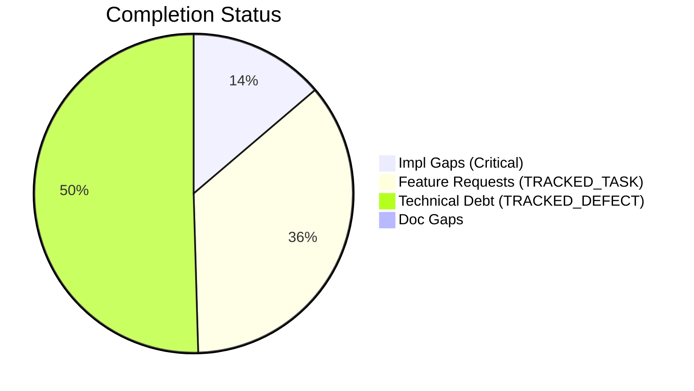
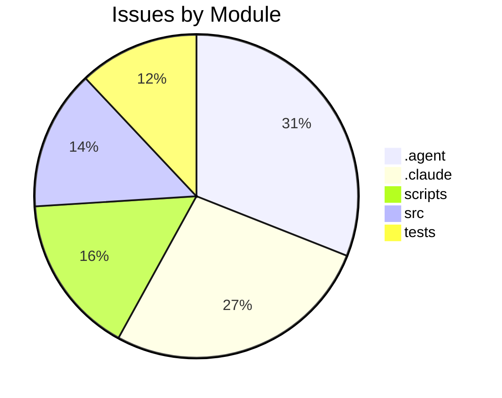

# Completist Report: 2026-03-26

## Executive Summary
- **Critical Gaps**: 15
- **Feature Gaps (TRACKED_TASK)**: 39
- **Technical Debt**: 55
- **Documentation Gaps**: 0

## Visualization
### Status Overview

### Top Impacted Modules

## Critical Incomplete (Top 50)
| File | Line | Type | Impact | Coverage | Complexity |
|---|---|---|---|---|---|
| `./src/tools/quality_utils.py` | 39 | NotImplementedError | 3 | 2 | 4 |
| `./src/tools/README.md` | 26 | NotImplementedError | 3 | 2 | 4 |
| `./scripts/legacy_tools/code_quality_check.py` | 37 | NotImplementedError | 3 | 2 | 4 |
| `./src/pendulum_simulator/pendulum-core/python/physics_native.py` | 339 | NotImplementedError | 1 | 2 | 4 |
| `./src/pendulum_simulator/pendulum-core/python/physics_native.py` | 353 | NotImplementedError | 1 | 2 | 4 |
| `./src/pendulum_simulator/pendulum-core/python/physics_native.py` | 369 | NotImplementedError | 1 | 2 | 4 |
| `./src/pendulum_simulator/pendulum-core/python/physics_native.py` | 384 | NotImplementedError | 1 | 2 | 4 |
| `./src/pendulum_simulator/pendulum-core/python/physics_native.py` | 399 | NotImplementedError | 1 | 2 | 4 |
| `./.agent/workflows/lint.md` | 34 | NotImplementedError | 1 | 2 | 4 |
| `./.agent/skills/lint/SKILL.md` | 34 | NotImplementedError | 1 | 2 | 4 |
| `./.agent/skills/lint/SKILL.md` | 38 | NotImplementedError | 1 | 2 | 4 |
| `./AGENTS.md` | 417 | NotImplementedError | 1 | 2 | 4 |
| `./.cursor/rules/.cursorrules.md` | 14 | NotImplementedError | 1 | 2 | 4 |
| `./.claude/skills/lint/SKILL.md` | 34 | NotImplementedError | 1 | 2 | 4 |
| `./.claude/skills/lint/SKILL.md` | 38 | NotImplementedError | 1 | 2 | 4 |

## Feature Gap Matrix
| Module | Feature Gap | Type |
|---|---|---|
| `./drafts/Jules-Code-Quality-Reviewer.yml` | 5. **Placeholders**: Identify placeholder code (TRACKED_TASK, TRACKED_DEFECT, NotImplemented, pass statements) | TRACKED_TASK |
| `./src/media_processing/video_processor/javascript/README.md` | - No placeholders (no TRACKED_TASK, TRACKED_DEFECT, etc.) | TRACKED_TASK |
| `./src/media_processing/video_processor/JULES_ARCHITECTURE.md` | if grep -r "TRACKED_TASK\\|TRACKED_DEFECT" --include="*.py" src/; then | TRACKED_TASK |
| `./src/tools/matlab_utilities/README.md` | - TRACKED_TASK, TRACKED_DEFECT, HACK, XXX placeholders | TRACKED_TASK |
| `./src/tools/README.md` | - **Banned Patterns**: TRACKED_TASK, TRACKED_DEFECT, placeholders, NotImplementedError | TRACKED_TASK |
| `./scripts/legacy_tools/code_quality_check.py` | (re.compile(r"\bTODO\b"), "TRACKED_TASK placeholder found"), | TRACKED_TASK |
| `./scripts/pragmatic_programmer_review.py` | if "TRACKED_TASK" in content: | TRACKED_TASK |
| `./scripts/pragmatic_programmer_review.py` | "title": f"High TRACKED_TASK count ({len(todos)})", | TRACKED_TASK |
| `./scripts/generate_assessments.py` | - **Markers**: 445 `TRACKED_TASK` and 140 `TRACKED_DEFECT` markers indicate significant unfinished work. | TRACKED_TASK |
| `./scripts/generate_assessments.py` | -   445 `TRACKED_TASK` markers. | TRACKED_TASK |
| `./scripts/generate_assessments.py` | -   Convert valid `TRACKED_TASK` items into GitHub Issues. | TRACKED_TASK |
| `./scripts/generate_assessments.py` | f.write("    - **Issue**: 445 `TRACKED_TASK` markers.\n") | TRACKED_TASK |
| `./scripts/generate_comprehensive_assessment.py` | stats["todos"] += content.count("TRACKED_TASK") | TRACKED_TASK |
| `./scripts/generate_comprehensive_assessment.py` | grades["O"] = (max(0, score_o), f"Technical Debt (TRACKED_TASK+TRACKED_DEFECT): {debt}") | TRACKED_TASK |
| `./scripts/generate_fresh_assessments.py` | stats["todos"] += content.count("TRACKED_TASK") | TRACKED_TASK |
| `./CLAUDE.md` | 8. No TRACKED_TASK/TRACKED_DEFECT unless tied to a tracked GitHub issue | TRACKED_TASK |
| `./.agent/workflows/lint.md` | description: Run linting tools (ruff, black, mypy) and fix placeholder/TRACKED_TASK statements | TRACKED_TASK |
| `./.agent/workflows/lint.md` | grep -rn "TRACKED_TASK\\|TRACKED_DEFECT\\|XXX\\|HACK\\|NotImplementedError\\|pass$" --include="*.py" . | TRACKED_TASK |
| `./.agent/skills/lint/SKILL.md` | description: Run linting tools (ruff, black, mypy) and fix placeholder/TRACKED_TASK statements | TRACKED_TASK |
| `./.agent/skills/lint/SKILL.md` | - Search for `TRACKED_TASK`, `TRACKED_DEFECT`, `XXX`, `HACK` comments | TRACKED_TASK |
| `./.agent/skills/lint/SKILL.md` | grep -rn "TRACKED_TASK\\|TRACKED_DEFECT\\|XXX\\|HACK\\|NotImplementedError\\|pass$" --include="*.py" . | TRACKED_TASK |
| `./AGENTS.md` | - ❌ **DO NOT** leave `TRACKED_TASK`/`TRACKED_DEFECT` markers for more than one sprint. | TRACKED_TASK |
| `./AGENTS.md` | - **Read:** Codebase for TRACKED_TASK, TRACKED_DEFECT, NotImplementedError, pass statements | TRACKED_TASK |
| `./.cursor/rules/.cursorrules.md` | - **NEVER USE PLACEHOLDERS** → No `TRACKED_TASK`, `TRACKED_DEFECT`, `...`, `pass`, `NotImplementedError`, `<your-valu | TRACKED_TASK |
| `./.cursor/rules/.cursorrules.md` | - [X] Zero TRACKED_TASK/TRACKED_DEFECT/pass in diff | TRACKED_TASK |
| `./.cursor/rules/.cursorrules.md` | # TRACKED_TASK: implement this properly | TRACKED_TASK |
| `./.claude/skills/lint/SKILL.md` | description: Run linting tools (ruff, black, mypy) and fix placeholder/TRACKED_TASK statements | TRACKED_TASK |
| `./.claude/skills/lint/SKILL.md` | - Search for `TRACKED_TASK`, `TRACKED_DEFECT`, `XXX`, `HACK` comments | TRACKED_TASK |
| `./.claude/skills/lint/SKILL.md` | grep -rn "TRACKED_TASK\\|TRACKED_DEFECT\\|XXX\\|HACK\\|NotImplementedError\\|pass$" --include="*.py" . | TRACKED_TASK |
| `./tests/tools/test_quality_utils.py` | lines = ["# TRACKED_TASK: fix this eventually"] | TRACKED_TASK |
| `./tests/tools/test_quality_utils.py` | assert "TRACKED_TASK" in issues[0][1] | TRACKED_TASK |
| `./tests/tools/test_quality_utils.py` | lines = ["# TRACKED_TASK: something"] | TRACKED_TASK |
| `./tests/tools/test_quality_utils.py` | f.write_text("# TRACKED_TASK: clean me up\n", encoding="utf-8") | TRACKED_TASK |
| `./tests/tools/test_matlab_quality_utils.py` | Path("script.m"), "% TRACKED_TASK: fix this", 5, issues | TRACKED_TASK |
| `./tests/tools/test_matlab_quality_utils.py` | assert "TRACKED_TASK" in issues[0] | TRACKED_TASK |
| `./tests/tools/test_matlab_quality_utils.py` | "% TRACKED_TASK", | TRACKED_TASK |
| `./tests/tools/test_matlab_quality_utils.py` | """m-file with TRACKED_TASK must produce at least one issue.""" | TRACKED_TASK |
| `./tests/tools/test_matlab_quality_utils.py` | (matlab / "dirty.m").write_text("function y = foo(x)\n% TRACKED_TASK: fix\ny = x;\nend\n") | TRACKED_TASK |
| `./tests/tools/test_matlab_quality_utils.py` | "function bad()\n% TRACKED_TASK: fill in\nglobal myVar\neval('x+1');\nend\n" | TRACKED_TASK |

## Technical Debt Register
| File | Line | Issue | Type |
|---|---|---|---|
| `./src/tools/matlab_quality_utils.py` | 318 | """Check for DEFERRED, REVIEW, HACK, XXX, and placeholders.""" | XXX |
| `./src/tools/matlab_quality_utils.py` | 326 | (r"\bHACK\b", "HACK comment found"), | HACK |
| `./src/tools/matlab_quality_utils.py` | 327 | (r"\bXXX\b", "XXX comment found"), | XXX |
| `./scripts/legacy_tools/code_quality_check.py` | 35 | (re.compile(r"\bFIXME\b"), "TRACKED_DEFECT placeholder found"), | TRACKED_DEFECT |
| `./scripts/generate_assessments.py` | 214 | -   140 `TRACKED_DEFECT` markers. | TRACKED_DEFECT |
| `./scripts/generate_assessments.py` | 217 | -   Audit all `TRACKED_DEFECT` items and resolve high-priority ones. | TRACKED_DEFECT |
| `./scripts/generate_comprehensive_assessment.py` | 143 | stats["fixmes"] += content.count("TRACKED_DEFECT") | TRACKED_DEFECT |
| `./scripts/generate_fresh_assessments.py` | 121 | stats["fixmes"] += content.count("TRACKED_DEFECT") | TRACKED_DEFECT |
| `./.agent/workflows/issues-5-combined.md` | 42 | Closes #XXX, closes #XXX, closes #XXX, closes #XXX, closes #XXX | XXX |
| `./.agent/skills/update-issues/SKILL.md` | 143 | \| #XXX  \| Title \| High     \| assessment.md \| | XXX |
| `./.agent/skills/update-issues/SKILL.md` | 149 | \| #XXX  \| Title \| Fixed in commit abc123 \| | XXX |
| `./.agent/skills/update-issues/SKILL.md` | 155 | \| Description \| #XXX           \| | XXX |
| `./.agent/skills/issues-10-sequential/SKILL.md` | 105 | \| 1   \| #XXX - Title \| #YYY \| Merged \| | XXX |
| `./.agent/skills/issues-10-sequential/SKILL.md` | 106 | \| 2   \| #XXX - Title \| #YYY \| Merged \| | XXX |
| `./.agent/skills/issues-5-combined/SKILL.md` | 67 | - #XXX: <brief description> | XXX |
| `./.agent/skills/issues-5-combined/SKILL.md` | 68 | - #XXX: <brief description> | XXX |
| `./.agent/skills/issues-5-combined/SKILL.md` | 69 | - #XXX: <brief description> | XXX |
| `./.agent/skills/issues-5-combined/SKILL.md` | 70 | - #XXX: <brief description> | XXX |
| `./.agent/skills/issues-5-combined/SKILL.md` | 71 | - #XXX: <brief description> | XXX |
| `./.agent/skills/issues-5-combined/SKILL.md` | 73 | Closes #XXX, closes #XXX, closes #XXX, closes #XXX, closes #XXX | XXX |
| `./.agent/skills/issues-5-combined/SKILL.md` | 88 | \| #XXX \| Title \| Brief fix description \| | XXX |
| `./.agent/skills/issues-5-combined/SKILL.md` | 89 | \| #XXX \| Title \| Brief fix description \| | XXX |
| `./.agent/skills/issues-5-combined/SKILL.md` | 90 | \| #XXX \| Title \| Brief fix description \| | XXX |
| `./.agent/skills/issues-5-combined/SKILL.md` | 91 | \| #XXX \| Title \| Brief fix description \| | XXX |
| `./.agent/skills/issues-5-combined/SKILL.md` | 92 | \| #XXX \| Title \| Brief fix description \| | XXX |
| `./.agent/skills/issues-5-combined/SKILL.md` | 99 | Closes #XXX, closes #XXX, closes #XXX, closes #XXX, closes #XXX" | XXX |
| `./.agent/skills/issues-5-combined/SKILL.md` | 145 | \| #XXX  \| Title \| Fixed  \| | XXX |
| `./.agent/skills/issues-5-combined/SKILL.md` | 146 | \| #XXX  \| Title \| Fixed  \| | XXX |
| `./.agent/skills/issues-5-combined/SKILL.md` | 147 | \| #XXX  \| Title \| Fixed  \| | XXX |
| `./.agent/skills/issues-5-combined/SKILL.md` | 148 | \| #XXX  \| Title \| Fixed  \| | XXX |
| `./.agent/skills/issues-5-combined/SKILL.md` | 149 | \| #XXX  \| Title \| Fixed  \| | XXX |
| `./.claude/skills/update-issues/SKILL.md` | 143 | \| #XXX  \| Title \| High     \| assessment.md \| | XXX |
| `./.claude/skills/update-issues/SKILL.md` | 149 | \| #XXX  \| Title \| Fixed in commit abc123 \| | XXX |
| `./.claude/skills/update-issues/SKILL.md` | 155 | \| Description \| #XXX           \| | XXX |
| `./.claude/skills/issues-10-sequential/SKILL.md` | 105 | \| 1   \| #XXX - Title \| #YYY \| Merged \| | XXX |
| `./.claude/skills/issues-10-sequential/SKILL.md` | 106 | \| 2   \| #XXX - Title \| #YYY \| Merged \| | XXX |
| `./.claude/skills/issues-5-combined/SKILL.md` | 67 | - #XXX: <brief description> | XXX |
| `./.claude/skills/issues-5-combined/SKILL.md` | 68 | - #XXX: <brief description> | XXX |
| `./.claude/skills/issues-5-combined/SKILL.md` | 69 | - #XXX: <brief description> | XXX |
| `./.claude/skills/issues-5-combined/SKILL.md` | 70 | - #XXX: <brief description> | XXX |
| `./.claude/skills/issues-5-combined/SKILL.md` | 71 | - #XXX: <brief description> | XXX |
| `./.claude/skills/issues-5-combined/SKILL.md` | 73 | Closes #XXX, closes #XXX, closes #XXX, closes #XXX, closes #XXX | XXX |
| `./.claude/skills/issues-5-combined/SKILL.md` | 88 | \| #XXX \| Title \| Brief fix description \| | XXX |
| `./.claude/skills/issues-5-combined/SKILL.md` | 89 | \| #XXX \| Title \| Brief fix description \| | XXX |
| `./.claude/skills/issues-5-combined/SKILL.md` | 90 | \| #XXX \| Title \| Brief fix description \| | XXX |
| `./.claude/skills/issues-5-combined/SKILL.md` | 91 | \| #XXX \| Title \| Brief fix description \| | XXX |
| `./.claude/skills/issues-5-combined/SKILL.md` | 92 | \| #XXX \| Title \| Brief fix description \| | XXX |
| `./.claude/skills/issues-5-combined/SKILL.md` | 99 | Closes #XXX, closes #XXX, closes #XXX, closes #XXX, closes #XXX" | XXX |
| `./.claude/skills/issues-5-combined/SKILL.md` | 145 | \| #XXX  \| Title \| Fixed  \| | XXX |
| `./.claude/skills/issues-5-combined/SKILL.md` | 146 | \| #XXX  \| Title \| Fixed  \| | XXX |
| `./.claude/skills/issues-5-combined/SKILL.md` | 147 | \| #XXX  \| Title \| Fixed  \| | XXX |
| `./.claude/skills/issues-5-combined/SKILL.md` | 148 | \| #XXX  \| Title \| Fixed  \| | XXX |
| `./.claude/skills/issues-5-combined/SKILL.md` | 149 | \| #XXX  \| Title \| Fixed  \| | XXX |
| `./tests/tools/test_matlab_quality_utils.py` | 95 | Path("script.m"), "% TRACKED_DEFECT: broken", 3, issues | TRACKED_DEFECT |
| `./tests/tools/test_matlab_quality_utils.py` | 97 | assert any("TRACKED_DEFECT" in i for i in issues) | TRACKED_DEFECT |

## Recommended Implementation Order
Prioritized by Impact (High) and Complexity (Low).
| Priority | File | Issue | Metrics (I/C/C) |
|---|---|---|---|
| 1 | `./src/tools/matlab_utilities/README.md` | - TRACKED_TASK, TRACKED_DEFECT, HACK, XXX placeholders | 3/2/3 |
| 2 | `./src/tools/README.md` | - **Banned Patterns**: TRACKED_TASK, TRACKED_DEFECT, placeholders, NotImplementedError | 3/2/3 |
| 3 | `./scripts/legacy_tools/code_quality_check.py` | (re.compile(r"\bTODO\b"), "TRACKED_TASK placeholder found"), | 3/2/3 |
| 4 | `./tests/tools/test_quality_utils.py` | lines = ["# TRACKED_TASK: fix this eventually"] | 3/5/3 |
| 5 | `./tests/tools/test_quality_utils.py` | assert "TRACKED_TASK" in issues[0][1] | 3/5/3 |
| 6 | `./tests/tools/test_quality_utils.py` | lines = ["# TRACKED_TASK: something"] | 3/5/3 |
| 7 | `./tests/tools/test_quality_utils.py` | f.write_text("# TRACKED_TASK: clean me up\n", encoding="utf-8") | 3/5/3 |
| 8 | `./tests/tools/test_matlab_quality_utils.py` | Path("script.m"), "% TRACKED_TASK: fix this", 5, issues | 3/5/3 |
| 9 | `./tests/tools/test_matlab_quality_utils.py` | assert "TRACKED_TASK" in issues[0] | 3/5/3 |
| 10 | `./tests/tools/test_matlab_quality_utils.py` | "% TRACKED_TASK", | 3/5/3 |
| 11 | `./tests/tools/test_matlab_quality_utils.py` | """m-file with TRACKED_TASK must produce at least one issue.""" | 3/5/3 |
| 12 | `./tests/tools/test_matlab_quality_utils.py` | (matlab / "dirty.m").write_text("function y = foo(x)\n% TRACKED_TASK: fix\ny = x;\nend\n | 3/5/3 |
| 13 | `./tests/tools/test_matlab_quality_utils.py` | "function bad()\n% TRACKED_TASK: fill in\nglobal myVar\neval('x+1');\nend\n" | 3/5/3 |
| 14 | `./src/tools/quality_utils.py` | (re.compile(r"NotImplementedError"), "NotImplementedError placeholder"), | 3/2/4 |
| 15 | `./src/tools/README.md` | - **Banned Patterns**: TRACKED_TASK, TRACKED_DEFECT, placeholders, NotImplementedError | 3/2/4 |
| 16 | `./scripts/legacy_tools/code_quality_check.py` | (re.compile(r"NotImplementedError"), "NotImplementedError placeholder"), | 3/2/4 |
| 17 | `./drafts/Jules-Code-Quality-Reviewer.yml` | 5. **Placeholders**: Identify placeholder code (TRACKED_TASK, TRACKED_DEFECT, NotImplemented, pas | 1/2/3 |
| 18 | `./src/media_processing/video_processor/javascript/README.md` | - No placeholders (no TRACKED_TASK, TRACKED_DEFECT, etc.) | 1/2/3 |
| 19 | `./src/media_processing/video_processor/JULES_ARCHITECTURE.md` | if grep -r "TRACKED_TASK\\|TRACKED_DEFECT" --include="*.py" src/; then | 1/2/3 |
| 20 | `./scripts/pragmatic_programmer_review.py` | if "TRACKED_TASK" in content: | 1/2/3 |

## Issues Created