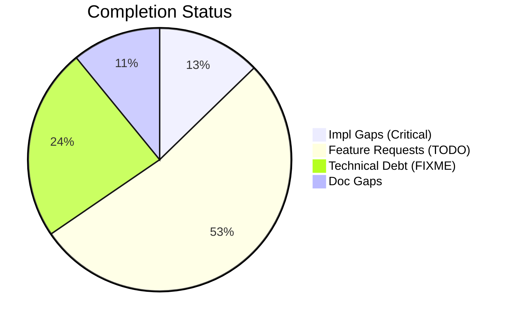
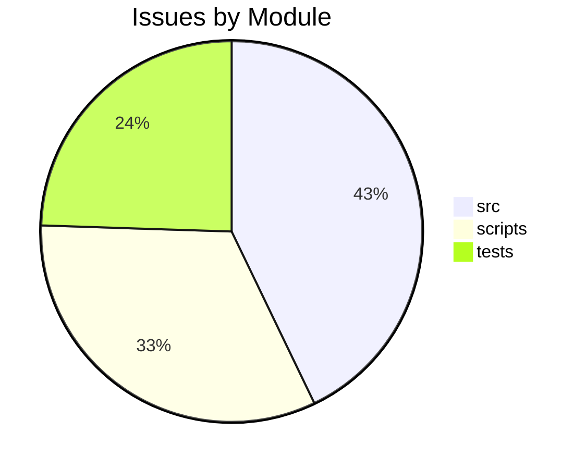

# Completist Report: 2026-03-08

## Executive Summary
- **Critical Gaps**: 7
- **Feature Gaps (TODO)**: 29
- **Technical Debt**: 13
- **Documentation Gaps**: 6

## Visualization
### Status Overview

### Top Impacted Modules

## Critical Incomplete (Top 50)
| File | Line | Type | Impact | Coverage | Complexity |
|---|---|---|---|---|---|
| `./src/tools/quality_utils.py` | 39 | NotImplementedError | 3 | 2 | 4 |
| `./scripts/legacy_tools/code_quality_check.py` | 37 | NotImplementedError | 3 | 2 | 4 |
| `./src/pendulum_simulator/pendulum-core/python/physics_native.py` | 291 | NotImplementedError | 1 | 2 | 4 |
| `./src/pendulum_simulator/pendulum-core/python/physics_native.py` | 304 | NotImplementedError | 1 | 2 | 4 |
| `./src/pendulum_simulator/pendulum-core/python/physics_native.py` | 317 | NotImplementedError | 1 | 2 | 4 |
| `./src/pendulum_simulator/pendulum-core/python/physics_native.py` | 330 | NotImplementedError | 1 | 2 | 4 |
| `./src/pendulum_simulator/pendulum-core/python/physics_native.py` | 343 | NotImplementedError | 1 | 2 | 4 |

## Feature Gap Matrix
| Module | Feature Gap | Type |
|---|---|---|
| `./tests/tools/test_matlab_quality_utils.py` | Path("script.m"), "% TODO: fix this", 5, issues | TODO |
| `./tests/tools/test_matlab_quality_utils.py` | assert "TODO" in issues[0] | TODO |
| `./tests/tools/test_matlab_quality_utils.py` | "% TODO", | TODO |
| `./tests/tools/test_matlab_quality_utils.py` | """m-file with TODO must produce at least one issue.""" | TODO |
| `./tests/tools/test_matlab_quality_utils.py` | (matlab / "dirty.m").write_text("function y = foo(x)\n% TODO: fix\ny = x;\nend\n") | TODO |
| `./tests/tools/test_matlab_quality_utils.py` | "function bad()\n% TODO: fill in\nglobal myVar\neval('x+1');\nend\n" | TODO |
| `./tests/tools/test_quality_utils.py` | lines = ["# TODO: fix this eventually"] | TODO |
| `./tests/tools/test_quality_utils.py` | assert "TODO" in issues[0][1] | TODO |
| `./tests/tools/test_quality_utils.py` | lines = ["# TODO: something"] | TODO |
| `./tests/tools/test_quality_utils.py` | f.write_text("# TODO: clean me up\n", encoding="utf-8") | TODO |
| `./src/media_processing/video_processor/apps/web/lib/golf/swingAnalyzer.ts` | swingType: SwingType.UNKNOWN, // TODO: Implement swing type detection | TODO |
| `./src/media_processing/video_processor/apps/web/lib/golf/swingAnalyzer.ts` | armHang: 'good', // TODO: Implement arm hang detection | TODO |
| `./src/media_processing/video_processor/apps/web/lib/sanitize.ts` | // TODO: Parse and validate RGB values | TODO |
| `./src/data_processing/data_processor/python/data_processor/core/script_generator.py` | f"{prefix}# TODO: Implement custom operation", | TODO |
| `./src/tools/quality_utils.py` | (re.compile(r"\bTODO\b"), "TODO placeholder found"), | TODO |
| `./src/tools/quality_utils.py` | re.compile(r"<[^<>]*TODO[^<>]*>", re.IGNORECASE), | TODO |
| `./src/tools/quality_utils.py` | "Angle bracket TODO placeholder", | TODO |
| `./src/tools/matlab_quality_utils.py` | """Check for TODO, FIXME, HACK, XXX, and placeholders.""" | TODO |
| `./src/tools/matlab_quality_utils.py` | (r"\bTODO\b", "TODO placeholder found"), | TODO |
| `./scripts/pragmatic_programmer_review.py` | if "TODO" in content: | TODO |
| `./scripts/pragmatic_programmer_review.py` | "title": f"High TODO count ({len(todos)})", | TODO |
| `./scripts/generate_comprehensive_assessment.py` | stats["todos"] += content.count("TODO") | TODO |
| `./scripts/generate_comprehensive_assessment.py` | grades["O"] = (max(0, score_o), f"Technical Debt (TODO+FIXME): {debt}") | TODO |
| `./scripts/legacy_tools/code_quality_check.py` | (re.compile(r"\bTODO\b"), "TODO placeholder found"), | TODO |
| `./scripts/generate_fresh_assessments.py` | stats["todos"] += content.count("TODO") | TODO |
| `./scripts/generate_assessments.py` | - **Markers**: 445 `TODO` and 140 `FIXME` markers indicate significant unfinished work. | TODO |
| `./scripts/generate_assessments.py` | -   445 `TODO` markers. | TODO |
| `./scripts/generate_assessments.py` | -   Convert valid `TODO` items into GitHub Issues. | TODO |
| `./scripts/generate_assessments.py` | f.write("    - **Issue**: 445 `TODO` markers.\n") | TODO |

## Technical Debt Register
| File | Line | Issue | Type |
|---|---|---|---|
| `./tests/tools/test_matlab_quality_utils.py` | 95 | Path("script.m"), "% FIXME: broken", 3, issues | FIXME |
| `./tests/tools/test_matlab_quality_utils.py` | 97 | assert any("FIXME" in i for i in issues) | FIXME |
| `./src/tools/quality_utils.py` | 37 | (re.compile(r"\bFIXME\b"), "FIXME placeholder found"), | FIXME |
| `./src/tools/quality_utils.py` | 50 | re.compile(r"<[^<>]*FIXME[^<>]*>", re.IGNORECASE), | FIXME |
| `./src/tools/quality_utils.py` | 51 | "Angle bracket FIXME placeholder", | FIXME |
| `./src/tools/matlab_quality_utils.py` | 320 | (r"\bFIXME\b", "FIXME placeholder found"), | FIXME |
| `./src/tools/matlab_quality_utils.py` | 321 | (r"\bHACK\b", "HACK comment found"), | HACK |
| `./src/tools/matlab_quality_utils.py` | 322 | (r"\bXXX\b", "XXX comment found"), | XXX |
| `./scripts/generate_comprehensive_assessment.py` | 143 | stats["fixmes"] += content.count("FIXME") | FIXME |
| `./scripts/legacy_tools/code_quality_check.py` | 35 | (re.compile(r"\bFIXME\b"), "FIXME placeholder found"), | FIXME |
| `./scripts/generate_fresh_assessments.py` | 121 | stats["fixmes"] += content.count("FIXME") | FIXME |
| `./scripts/generate_assessments.py` | 214 | -   140 `FIXME` markers. | FIXME |
| `./scripts/generate_assessments.py` | 217 | -   Audit all `FIXME` items and resolve high-priority ones. | FIXME |

## Recommended Implementation Order
Prioritized by Impact (High) and Complexity (Low).
| Priority | File | Issue | Metrics (I/C/C) |
|---|---|---|---|
| 1 | `./tests/tools/test_matlab_quality_utils.py` | Path("script.m"), "% TODO: fix this", 5, issues | 3/5/3 |
| 2 | `./tests/tools/test_matlab_quality_utils.py` | assert "TODO" in issues[0] | 3/5/3 |
| 3 | `./tests/tools/test_matlab_quality_utils.py` | "% TODO", | 3/5/3 |
| 4 | `./tests/tools/test_matlab_quality_utils.py` | """m-file with TODO must produce at least one issue.""" | 3/5/3 |
| 5 | `./tests/tools/test_matlab_quality_utils.py` | (matlab / "dirty.m").write_text("function y = foo(x)\n% TODO: fix\ny = x;\nend\n | 3/5/3 |
| 6 | `./tests/tools/test_matlab_quality_utils.py` | "function bad()\n% TODO: fill in\nglobal myVar\neval('x+1');\nend\n" | 3/5/3 |
| 7 | `./tests/tools/test_quality_utils.py` | lines = ["# TODO: fix this eventually"] | 3/5/3 |
| 8 | `./tests/tools/test_quality_utils.py` | assert "TODO" in issues[0][1] | 3/5/3 |
| 9 | `./tests/tools/test_quality_utils.py` | lines = ["# TODO: something"] | 3/5/3 |
| 10 | `./tests/tools/test_quality_utils.py` | f.write_text("# TODO: clean me up\n", encoding="utf-8") | 3/5/3 |
| 11 | `./src/tools/quality_utils.py` | (re.compile(r"\bTODO\b"), "TODO placeholder found"), | 3/2/3 |
| 12 | `./src/tools/quality_utils.py` | re.compile(r"<[^<>]*TODO[^<>]*>", re.IGNORECASE), | 3/2/3 |
| 13 | `./src/tools/quality_utils.py` | "Angle bracket TODO placeholder", | 3/2/3 |
| 14 | `./src/tools/matlab_quality_utils.py` | """Check for TODO, FIXME, HACK, XXX, and placeholders.""" | 3/2/3 |
| 15 | `./src/tools/matlab_quality_utils.py` | (r"\bTODO\b", "TODO placeholder found"), | 3/2/3 |
| 16 | `./scripts/legacy_tools/code_quality_check.py` | (re.compile(r"\bTODO\b"), "TODO placeholder found"), | 3/2/3 |
| 17 | `./src/tools/quality_utils.py` | (re.compile(r"NotImplementedError"), "NotImplementedError placeholder"), | 3/2/4 |
| 18 | `./scripts/legacy_tools/code_quality_check.py` | (re.compile(r"NotImplementedError"), "NotImplementedError placeholder"), | 3/2/4 |
| 19 | `./src/media_processing/video_processor/apps/web/lib/golf/swingAnalyzer.ts` | swingType: SwingType.UNKNOWN, // TODO: Implement swing type detection | 1/2/3 |
| 20 | `./src/media_processing/video_processor/apps/web/lib/golf/swingAnalyzer.ts` | armHang: 'good', // TODO: Implement arm hang detection | 1/2/3 |

## Issues Created