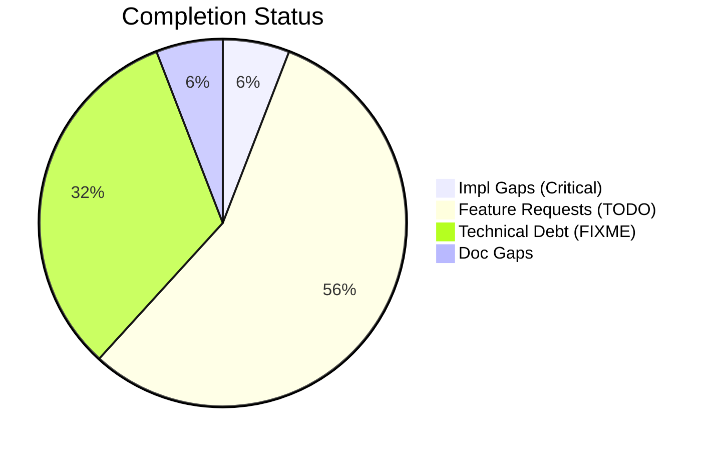
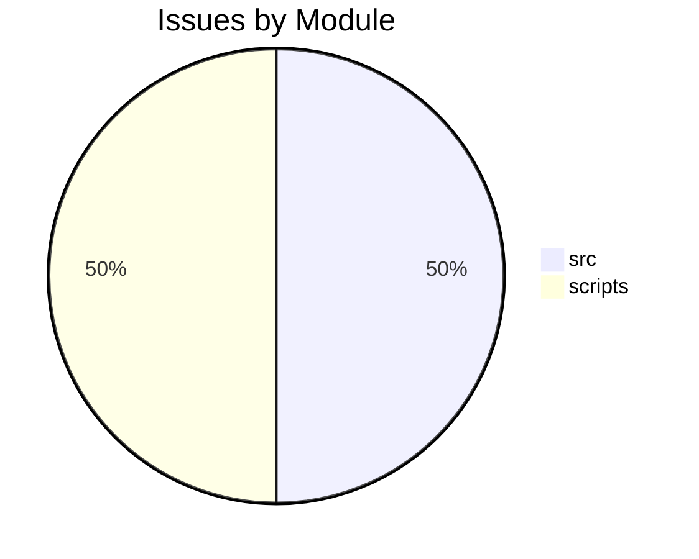

# Completist Report: 2026-02-26

## Executive Summary
- **Critical Gaps**: 2
- **Feature Gaps (TODO)**: 19
- **Technical Debt**: 11
- **Documentation Gaps**: 2

## Visualization
### Status Overview

### Top Impacted Modules

## Critical Incomplete (Top 50)
| File | Line | Type | Impact | Coverage | Complexity |
|---|---|---|---|---|---|
| `./src/tools/quality_utils.py` | 37 | NotImplementedError | 3 | 2 | 4 |
| `./scripts/tools/code_quality_check.py` | 37 | NotImplementedError | 3 | 2 | 4 |

## Feature Gap Matrix
| Module | Feature Gap | Type |
|---|---|---|
| `./src/media_processing/video_processor/apps/web/lib/golf/swingAnalyzer.ts` | swingType: SwingType.UNKNOWN, // TODO: Implement swing type detection | TODO |
| `./src/media_processing/video_processor/apps/web/lib/golf/swingAnalyzer.ts` | armHang: 'good', // TODO: Implement arm hang detection | TODO |
| `./src/media_processing/video_processor/apps/web/lib/sanitize.ts` | // TODO: Parse and validate RGB values | TODO |
| `./src/data_processing/data_processor/python/data_processor/core/script_generator.py` | f"{prefix}# TODO: Implement custom operation", | TODO |
| `./src/tools/quality_utils.py` | (re.compile(r"\bTODO\b"), "TODO placeholder found"), | TODO |
| `./src/tools/quality_utils.py` | re.compile(r"<[^<>]*TODO[^<>]*>", re.IGNORECASE), | TODO |
| `./src/tools/quality_utils.py` | "Angle bracket TODO placeholder", | TODO |
| `./src/tools/matlab_quality_utils.py` | """Check for TODO, FIXME, HACK, XXX, and placeholders.""" | TODO |
| `./src/tools/matlab_quality_utils.py` | (r"\bTODO\b", "TODO placeholder found"), | TODO |
| `./scripts/pragmatic_programmer_review.py` | if "TODO" in content: | TODO |
| `./scripts/pragmatic_programmer_review.py` | "title": f"High TODO count ({len(todos)})", | TODO |
| `./scripts/generate_comprehensive_assessment.py` | stats["todos"] += content.count("TODO") | TODO |
| `./scripts/generate_comprehensive_assessment.py` | grades["O"] = (max(0, score_o), f"Technical Debt (TODO+FIXME): {debt}") | TODO |
| `./scripts/generate_fresh_assessments.py` | stats["todos"] += content.count("TODO") | TODO |
| `./scripts/generate_assessments.py` | - **Markers**: 445 `TODO` and 140 `FIXME` markers indicate significant unfinished work. | TODO |
| `./scripts/generate_assessments.py` | -   445 `TODO` markers. | TODO |
| `./scripts/generate_assessments.py` | -   Convert valid `TODO` items into GitHub Issues. | TODO |
| `./scripts/generate_assessments.py` | f.write("    - **Issue**: 445 `TODO` markers.\n") | TODO |
| `./scripts/tools/code_quality_check.py` | (re.compile(r"\bTODO\b"), "TODO placeholder found"), | TODO |

## Technical Debt Register
| File | Line | Issue | Type |
|---|---|---|---|
| `./src/tools/quality_utils.py` | 35 | (re.compile(r"\bFIXME\b"), "FIXME placeholder found"), | FIXME |
| `./src/tools/quality_utils.py` | 48 | re.compile(r"<[^<>]*FIXME[^<>]*>", re.IGNORECASE), | FIXME |
| `./src/tools/quality_utils.py` | 49 | "Angle bracket FIXME placeholder", | FIXME |
| `./src/tools/matlab_quality_utils.py` | 303 | (r"\bFIXME\b", "FIXME placeholder found"), | FIXME |
| `./src/tools/matlab_quality_utils.py` | 304 | (r"\bHACK\b", "HACK comment found"), | HACK |
| `./src/tools/matlab_quality_utils.py` | 305 | (r"\bXXX\b", "XXX comment found"), | XXX |
| `./scripts/generate_comprehensive_assessment.py` | 143 | stats["fixmes"] += content.count("FIXME") | FIXME |
| `./scripts/generate_fresh_assessments.py` | 121 | stats["fixmes"] += content.count("FIXME") | FIXME |
| `./scripts/generate_assessments.py` | 214 | -   140 `FIXME` markers. | FIXME |
| `./scripts/generate_assessments.py` | 217 | -   Audit all `FIXME` items and resolve high-priority ones. | FIXME |
| `./scripts/tools/code_quality_check.py` | 35 | (re.compile(r"\bFIXME\b"), "FIXME placeholder found"), | FIXME |

## Recommended Implementation Order
Prioritized by Impact (High) and Complexity (Low).
| Priority | File | Issue | Metrics (I/C/C) |
|---|---|---|---|
| 1 | `./src/tools/quality_utils.py` | (re.compile(r"\bTODO\b"), "TODO placeholder found"), | 3/2/3 |
| 2 | `./src/tools/quality_utils.py` | re.compile(r"<[^<>]*TODO[^<>]*>", re.IGNORECASE), | 3/2/3 |
| 3 | `./src/tools/quality_utils.py` | "Angle bracket TODO placeholder", | 3/2/3 |
| 4 | `./src/tools/matlab_quality_utils.py` | """Check for TODO, FIXME, HACK, XXX, and placeholders.""" | 3/2/3 |
| 5 | `./src/tools/matlab_quality_utils.py` | (r"\bTODO\b", "TODO placeholder found"), | 3/2/3 |
| 6 | `./scripts/tools/code_quality_check.py` | (re.compile(r"\bTODO\b"), "TODO placeholder found"), | 3/2/3 |
| 7 | `./src/tools/quality_utils.py` | (re.compile(r"NotImplementedError"), "NotImplementedError placeholder"), | 3/2/4 |
| 8 | `./scripts/tools/code_quality_check.py` | (re.compile(r"NotImplementedError"), "NotImplementedError placeholder"), | 3/2/4 |
| 9 | `./src/media_processing/video_processor/apps/web/lib/golf/swingAnalyzer.ts` | swingType: SwingType.UNKNOWN, // TODO: Implement swing type detection | 1/2/3 |
| 10 | `./src/media_processing/video_processor/apps/web/lib/golf/swingAnalyzer.ts` | armHang: 'good', // TODO: Implement arm hang detection | 1/2/3 |
| 11 | `./src/media_processing/video_processor/apps/web/lib/sanitize.ts` | // TODO: Parse and validate RGB values | 1/2/3 |
| 12 | `./src/data_processing/data_processor/python/data_processor/core/script_generator.py` | f"{prefix}# TODO: Implement custom operation", | 1/2/3 |
| 13 | `./scripts/pragmatic_programmer_review.py` | if "TODO" in content: | 1/2/3 |
| 14 | `./scripts/pragmatic_programmer_review.py` | "title": f"High TODO count ({len(todos)})", | 1/2/3 |
| 15 | `./scripts/generate_comprehensive_assessment.py` | stats["todos"] += content.count("TODO") | 1/2/3 |
| 16 | `./scripts/generate_comprehensive_assessment.py` | grades["O"] = (max(0, score_o), f"Technical Debt (TODO+FIXME): {debt}") | 1/2/3 |
| 17 | `./scripts/generate_fresh_assessments.py` | stats["todos"] += content.count("TODO") | 1/2/3 |
| 18 | `./scripts/generate_assessments.py` | - **Markers**: 445 `TODO` and 140 `FIXME` markers indicate significant unfinishe | 1/2/3 |
| 19 | `./scripts/generate_assessments.py` | -   445 `TODO` markers. | 1/2/3 |
| 20 | `./scripts/generate_assessments.py` | -   Convert valid `TODO` items into GitHub Issues. | 1/2/3 |

## Issues Created