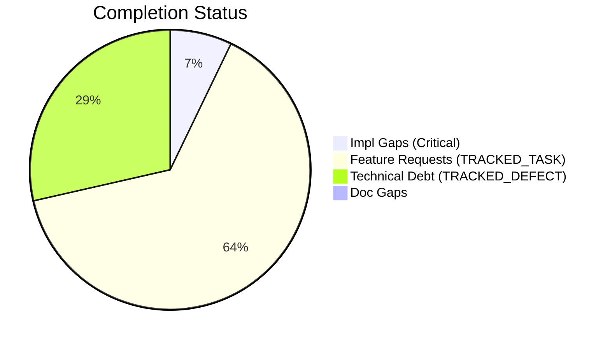
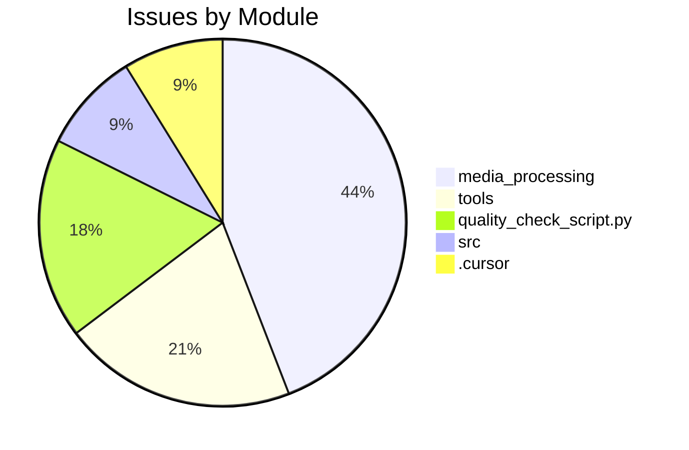

# Completist Report: 2026-03-08

## Executive Summary

- **Critical Gaps**: 3
- **Feature Gaps (TRACKED_TASK)**: 27
- **Technical Debt**: 12
- **Documentation Gaps**: 0

## Visualization

### Status Overview

### Top Impacted Modules

## Critical Incomplete (Top 50)

| File                                                              | Line | Type                | Impact | Coverage | Complexity |
| ----------------------------------------------------------------- | ---- | ------------------- | ------ | -------- | ---------- |
| `./src/shared/python/signal_toolkit/io.py`                        | 543  | NotImplementedError | 5      | 3        | 4          |
| `./src/shared/python/model_generation/converters/format_utils.py` | 161  | NotImplementedError | 5      | 3        | 4          |
| `./src/tools/quality_utils.py`                                    | 37   | NotImplementedError | 3      | 2        | 4          |

## Feature Gap Matrix

| Module                                                                                      | Feature Gap                                                                                                           | Type                                         |
| ------------------------------------------------------------------------------------------- | --------------------------------------------------------------------------------------------------------------------- | -------------------------------------------- | ------------ |
| `./config/project_template/tools/code_quality_check.py`                                     | (re.compile(r"\bTODO\b"), "TRACKED_TASK placeholder found"),                                                          | TRACKED_TASK                                 |
| `./.cursor/rules/.cursorrules.md`                                                           | - **NEVER USE PLACEHOLDERS** → No `TRACKED_TASK`, `TRACKED_DEFECT`, `...`, `pass`, `NotImplementedError`, `<your-valu | TRACKED_TASK                                 |
| `./.cursor/rules/.cursorrules.md`                                                           | - [X] Zero TRACKED_TASK/TRACKED_DEFECT/pass in diff                                                                   | TRACKED_TASK                                 |
| `./.cursor/rules/.cursorrules.md`                                                           | # TRACKED_TASK: implement this properly                                                                               | TRACKED_TASK                                 |
| `./tools/README.md`                                                                         | - **Banned Patterns**: TRACKED_TASK, TRACKED_DEFECT, placeholders, NotImplementedError                                | TRACKED_TASK                                 |
| `./tools/matlab_utilities/README.md`                                                        | - TRACKED_TASK, TRACKED_DEFECT, HACK, XXX placeholders                                                                | TRACKED_TASK                                 |
| `./tools/matlab_utilities/scripts/matlab_quality_check.py`                                  | (r"\bTODO\b", "TRACKED_TASK placeholder found"),                                                                      | TRACKED_TASK                                 |
| `./tools/code_quality_check.py`                                                             | (re.compile(r"\bTODO\b"), "TRACKED_TASK placeholder found"),                                                          | TRACKED_TASK                                 |
| `./quality_check_script.py`                                                                 | (re.compile(r"\bTODO\b"), "TRACKED_TASK placeholder found"),                                                          | TRACKED_TASK                                 |
| `./quality_check_script.py`                                                                 | re.compile(r"<[^<>]_TRACKED_TASK[^<>]_>", re.IGNORECASE),                                                             | TRACKED_TASK                                 |
| `./quality_check_script.py`                                                                 | "Angle bracket TRACKED_TASK placeholder",                                                                             | TRACKED_TASK                                 |
| `./drafts/Jules-Code-Quality-Reviewer.yml`                                                  | 5. **Placeholders**: Identify placeholder code (TRACKED_TASK, TRACKED_DEFECT, NotImplemented, pass statements)        | TRACKED_TASK                                 |
| `./scripts/quality-check.py`                                                                | (re.compile(r"\bTODO\b"), "TRACKED_TASK placeholder found"),                                                          | TRACKED_TASK                                 |
| `./scripts/quality-check.py`                                                                | # Note: Angle bracket TRACKED_TASK/TRACKED_DEFECT patterns removed to avoid false positives in regex                  | TRACKED_TASK                                 |
| `./media_processing/video_processor/tools/matlab_utilities/scripts/matlab_quality_check.py` | (r"\bTODO\b", "TRACKED_TASK placeholder found"),                                                                      | TRACKED_TASK                                 |
| `./media_processing/video_processor/tools/code_quality_check.py`                            | (re.compile(r"\bTODO\b"), "TRACKED_TASK placeholder found"),                                                          | TRACKED_TASK                                 |
| `./media_processing/video_processor/apps/web/app/page.tsx`                                  | // TRACKED_TASK: Move fps to client-side config or use from video metadata                                            | TRACKED_TASK                                 |
| `./media_processing/video_processor/apps/web/app/page.tsx`                                  | // TRACKED_TASK: Save to database when backend is ready                                                               | TRACKED_TASK                                 |
| `./media_processing/video_processor/apps/web/app/page.tsx`                                  | // TRACKED_TASK: Save pose data to state or database when ready                                                       | TRACKED_TASK                                 |
| `./media_processing/video_processor/apps/web/lib/sanitize.ts`                               | \* TRACKED_TASK: Add DOMPurify when ready for production.                                                             | TRACKED_TASK                                 |
| `./media_processing/video_processor/apps/web/lib/sanitize.ts`                               | // TRACKED_TASK: Use DOMPurify to allow safe HTML tags                                                                | TRACKED_TASK                                 |
| `./media_processing/video_processor/apps/web/lib/sanitize.ts`                               | // TRACKED_TASK: Parse and validate RGB values                                                                        | TRACKED_TASK                                 |
| `./media_processing/video_processor/apps/web/lib/logger.ts`                                 | \* TRACKED_TASK: Add pino when ready for production.                                                                  | TRACKED_TASK                                 |
| `./media_processing/video_processor/JULES_ARCHITECTURE.md`                                  | if grep -r "TRACKED_TASK\\                                                                                            | TRACKED_DEFECT" --include="\*.py" src/; then | TRACKED_TASK |
| `./media_processing/video_processor/matlab/models/pendulum_model.m`                         | % TRACKED_TASK: Implement pendulum model                                                                              | TRACKED_TASK                                 |
| `./media_processing/video_processor/javascript/README.md`                                   | - No placeholders (no TRACKED_TASK, TRACKED_DEFECT, etc.)                                                             | TRACKED_TASK                                 |
| `./data_processing/data_processor/tools/code_quality_check.py`                              | (re.compile(r"\bTODO\b"), "TRACKED_TASK placeholder found"),                                                          | TRACKED_TASK                                 |

## Technical Debt Register

| File                                                                                        | Line | Issue                                                           | Type           |
| ------------------------------------------------------------------------------------------- | ---- | --------------------------------------------------------------- | -------------- |
| `./config/project_template/tools/code_quality_check.py`                                     | 35   | (re.compile(r"\bFIXME\b"), "TRACKED_DEFECT placeholder found"), | TRACKED_DEFECT |
| `./tools/matlab_utilities/scripts/matlab_quality_check.py`                                  | 311  | (r"\bFIXME\b", "TRACKED_DEFECT placeholder found"),             | TRACKED_DEFECT |
| `./tools/matlab_utilities/scripts/matlab_quality_check.py`                                  | 313  | (r"\bXXX\b", "XXX comment found"),                              | XXX            |
| `./tools/code_quality_check.py`                                                             | 35   | (re.compile(r"\bFIXME\b"), "TRACKED_DEFECT placeholder found"), | TRACKED_DEFECT |
| `./quality_check_script.py`                                                                 | 12   | (re.compile(r"\bFIXME\b"), "TRACKED_DEFECT placeholder found"), | TRACKED_DEFECT |
| `./quality_check_script.py`                                                                 | 25   | re.compile(r"<[^<>]_TRACKED_DEFECT[^<>]_>", re.IGNORECASE),     | TRACKED_DEFECT |
| `./quality_check_script.py`                                                                 | 26   | "Angle bracket TRACKED_DEFECT placeholder",                     | TRACKED_DEFECT |
| `./scripts/quality-check.py`                                                                | 12   | (re.compile(r"\bFIXME\b"), "TRACKED_DEFECT placeholder found"), | TRACKED_DEFECT |
| `./media_processing/video_processor/tools/matlab_utilities/scripts/matlab_quality_check.py` | 309  | (r"\bFIXME\b", "TRACKED_DEFECT placeholder found"),             | TRACKED_DEFECT |
| `./media_processing/video_processor/tools/matlab_utilities/scripts/matlab_quality_check.py` | 311  | (r"\bXXX\b", "XXX comment found"),                              | XXX            |
| `./media_processing/video_processor/tools/code_quality_check.py`                            | 35   | (re.compile(r"\bFIXME\b"), "TRACKED_DEFECT placeholder found"), | TRACKED_DEFECT |
| `./data_processing/data_processor/tools/code_quality_check.py`                              | 35   | (re.compile(r"\bFIXME\b"), "TRACKED_DEFECT placeholder found"), | TRACKED_DEFECT |

## Recommended Implementation Order

Prioritized by Impact (High) and Complexity (Low).
| Priority | File | Issue | Metrics (I/C/C) |
|---|---|---|---|
| 1 | `./src/shared/python/signal_toolkit/io.py` | raise NotImplementedError(msg) | 5/3/4 |
| 2 | `./src/shared/python/model_generation/converters/format_utils.py` | raise NotImplementedError( | 5/3/4 |
| 3 | `./config/project_template/tools/code_quality_check.py` | (re.compile(r"\bTODO\b"), "TRACKED_TASK placeholder found"), | 3/2/3 |
| 4 | `./tools/README.md` | - **Banned Patterns**: TRACKED_TASK, TRACKED_DEFECT, placeholders, NotImplementedError | 3/2/3 |
| 5 | `./tools/matlab_utilities/README.md` | - TRACKED_TASK, TRACKED_DEFECT, HACK, XXX placeholders | 3/2/3 |
| 6 | `./tools/matlab_utilities/scripts/matlab_quality_check.py` | (r"\bTODO\b", "TRACKED_TASK placeholder found"), | 3/2/3 |
| 7 | `./tools/code_quality_check.py` | (re.compile(r"\bTODO\b"), "TRACKED_TASK placeholder found"), | 3/2/3 |
| 8 | `./media_processing/video_processor/tools/matlab_utilities/scripts/matlab_quality_check.py` | (r"\bTODO\b", "TRACKED_TASK placeholder found"), | 3/2/3 |
| 9 | `./media_processing/video_processor/tools/code_quality_check.py` | (re.compile(r"\bTODO\b"), "TRACKED_TASK placeholder found"), | 3/2/3 |
| 10 | `./data_processing/data_processor/tools/code_quality_check.py` | (re.compile(r"\bTODO\b"), "TRACKED_TASK placeholder found"), | 3/2/3 |
| 11 | `./src/tools/quality_utils.py` | (re.compile(r"NotImplementedError"), "NotImplementedError placeholder"), | 3/2/4 |
| 12 | `./.cursor/rules/.cursorrules.md` | - **NEVER USE PLACEHOLDERS** → No `TRACKED_TASK`, `TRACKED_DEFECT`, `...`, `pass`, `NotImplemente | 1/2/3 |
| 13 | `./.cursor/rules/.cursorrules.md`| - [X] Zero TRACKED_TASK/TRACKED_DEFECT/pass in diff | 1/2/3 |
| 14 |`./.cursor/rules/.cursorrules.md`| # TRACKED_TASK: implement this properly | 1/2/3 |
| 15 |`./quality_check_script.py`| (re.compile(r"\bTODO\b"), "TRACKED_TASK placeholder found"), | 1/2/3 |
| 16 |`./quality_check_script.py`| re.compile(r"<[^<>]*TRACKED_TASK[^<>]*>", re.IGNORECASE), | 1/2/3 |
| 17 |`./quality_check_script.py`| "Angle bracket TRACKED_TASK placeholder", | 1/2/3 |
| 18 |`./drafts/Jules-Code-Quality-Reviewer.yml`| 5. **Placeholders**: Identify placeholder code (TRACKED_TASK, TRACKED_DEFECT, NotImplemented, pas | 1/2/3 |
| 19 |`./scripts/quality-check.py`| (re.compile(r"\bTODO\b"), "TRACKED_TASK placeholder found"), | 1/2/3 |
| 20 |`./scripts/quality-check.py` | # Note: Angle bracket TRACKED_TASK/TRACKED_DEFECT patterns removed to avoid false positives in re | 1/2/3 |

## Issues Created

- Created `docs/assessments/issues/Issue_2027_Incomplete_NotImplementedError_in_io_py_543.md`
- Created `docs/assessments/issues/Issue_2028_Incomplete_NotImplementedError_in_format_utils_py_161.md`
