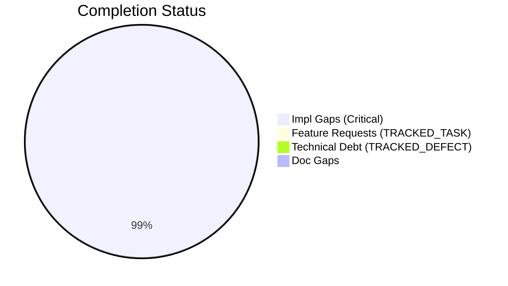
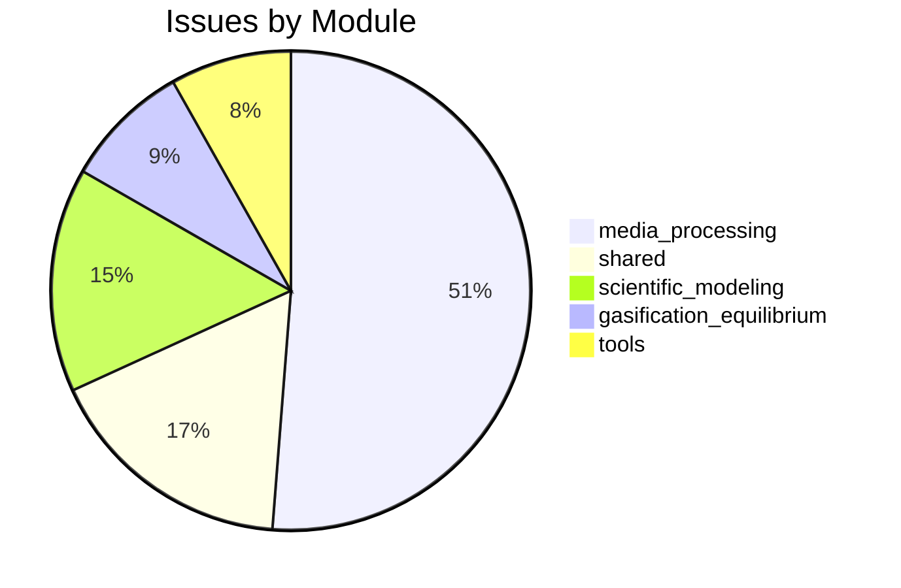

# Completist Report: 2026-03-12

## Executive Summary
- **Critical Gaps**: 2083
- **Feature Gaps (TRACKED_TASK)**: 19
- **Technical Debt**: 4
- **Documentation Gaps**: 0

## Visualization
### Status Overview

### Top Impacted Modules

## Critical Incomplete (Top 50)
| File | Line | Type | Impact | Coverage | Complexity |
|---|---|---|---|---|---|
| `src/shared/python/gui_launcher/launcher.py:478:        npm_args` |  Additional arguments to pass to ``npm run | Stub | 5 | 3 | 4 |
| `src/shared/python/gui_launcher/registry.py:242:            "description"` |  | Stub | 5 | 3 | 4 |
| `src/shared/python/model_generation/converters/mjcf_converter.py:484:        pos` |  tuple[float, | Stub | 5 | 3 | 4 |
| `src/shared/python/model_generation/converters/urdf_parser.py:373:    def _parse_joint_axis(self, elem` |  ET.Element) -> tuple[float, | Stub | 5 | 3 | 4 |
| `src/shared/python/model_generation/converters/simscape/mdl_parser.py:91:        self, default` |  tuple[float, ...] = (0.0, 0.0, | Stub | 5 | 3 | 4 |
| `src/shared/python/model_generation/converters/simscape/mdl_parser.py:92` |     ) -> tuple[float, | Stub | 5 | 3 | 4 |
| `src/shared/python/model_generation/converters/simscape/mdl_parser.py:151:        default` |  tuple[float, ...] = (0.0, 0.0, | Stub | 5 | 3 | 4 |
| `src/shared/python/model_generation/converters/simscape/mdl_parser.py:152` |     ) -> tuple[float, | Stub | 5 | 3 | 4 |
| `src/shared/python/model_generation/api/rest_api.py:1044:            def make_handler(r` |  Route) -> Callable[..., | Stub | 5 | 3 | 4 |
| `src/shared/python/model_generation/api/rest_api.py:1098:            async def make_handler(r` |  Route) -> Callable[..., | Stub | 5 | 3 | 4 |
| `src/shared/python/model_generation/plugins/__init__.py:23` |         | Stub | 5 | 3 | 4 |
| `src/shared/python/model_generation/plugins/__init__.py:29` |         | Stub | 5 | 3 | 4 |
| `src/shared/python/model_generation/plugins/__init__.py:34` |         | Stub | 5 | 3 | 4 |
| `src/shared/python/model_generation/core/types.py:385:    dimensions` |  tuple[float, ...] = | Stub | 5 | 3 | 4 |
| `src/shared/python/model_generation/library/model_library.py:668` |                         | Stub | 5 | 3 | 4 |
| `src/shared/python/model_generation/library/unified_loader.py:133` |                 | Stub | 5 | 3 | 4 |
| `src/shared/python/model_generation/library/repository.py:42` |         | Stub | 5 | 3 | 4 |
| `src/shared/python/model_generation/library/repository.py:48` |         | Stub | 5 | 3 | 4 |
| `src/shared/python/model_generation/library/repository.py:53` |         | Stub | 5 | 3 | 4 |
| `src/shared/python/model_generation/library/repository.py:71` |         | Stub | 5 | 3 | 4 |
| `src/shared/python/model_generation/library/repository.py:303` |             pass  # Meshes not found or not | Stub | 5 | 3 | 4 |
| `src/shared/python/model_generation/editor/editor_clipboard.py:35:    def get_connecting_joint(self, model_id: str, link_name: str) -> Joint | None` |  | Stub | 5 | 3 | 4 |
| `src/shared/python/model_generation/editor/editor_modifications.py:29:    - self._clipboard` |  | Stub | 5 | 3 | 4 |
| `src/shared/python/model_generation/editor/editor_modifications.py:41:    def _save_state(self) -> None` |  | Stub | 5 | 3 | 4 |
| `src/shared/python/model_generation/editor/editor_modifications.py:43:    def get_connecting_joint(self, model_id: str, link_name: str) -> Joint | None` |  | Stub | 5 | 3 | 4 |
| `src/shared/python/model_generation/editor/editor_modifications.py:45:    def copy_subtree(self, model_id: str, root_link: str) -> bool: ...  # type` |  | Stub | 5 | 3 | 4 |
| `src/shared/python/model_generation/editor/editor_modifications.py:49:    ) -> str: ...  # type` |  | Stub | 5 | 3 | 4 |
| `src/shared/python/model_generation/editor/text_editor.py:338:            logger.warning(f"Content not found` |  | Stub | 5 | 3 | 4 |
| `src/shared/python/model_generation/builders/base_builder.py:190` |         | Stub | 5 | 3 | 4 |
| `src/shared/python/model_generation/builders/base_builder.py:195` |         | Stub | 5 | 3 | 4 |
| `src/shared/python/model_generation/mesh/__init__.py:8` |     | Stub | 5 | 3 | 4 |
| `src/shared/python/humanoid_character_builder/core/segment_definitions.py:128:    dimensions` |  tuple[float, ...] = (0.1, 0.1, | Stub | 5 | 3 | 4 |
| `src/shared/python/humanoid_character_builder/mesh/mesh_processor.py:19` |     | Stub | 5 | 3 | 4 |
| `src/shared/python/humanoid_character_builder/mesh/inertia_calculator.py:25` |     pass  # For type hints without runtime | Stub | 5 | 3 | 4 |
| `src/shared/python/humanoid_character_builder/mesh/collision_generator.py:57:    dimensions` |  tuple[float, ...]  # Type-specific | Stub | 5 | 3 | 4 |
| `src/shared/python/humanoid_character_builder/mesh/collision_generator.py:148` |             | Stub | 5 | 3 | 4 |
| `src/shared/python/humanoid_character_builder/mesh/collision_generator.py:155` |             | Stub | 5 | 3 | 4 |
| `src/shared/python/humanoid_character_builder/mesh/collision_generator.py:342` |             | Stub | 5 | 3 | 4 |
| `src/shared/python/humanoid_character_builder/mesh/primitive_inertia.py:272:        dimensions` |  dict[str, float] | tuple[float, | Stub | 5 | 3 | 4 |
| `src/shared/python/humanoid_character_builder/mesh/primitive_inertia.py:282:                - box: (size_x, size_y, size_z) or {'x': ..., 'y': ..., 'z'` |  | Stub | 5 | 3 | 4 |
| `src/shared/python/humanoid_character_builder/mesh/primitive_inertia.py:283:                - cylinder: (radius, length) or {'radius': ..., 'length'` |  | Stub | 5 | 3 | 4 |
| `src/shared/python/humanoid_character_builder/mesh/primitive_inertia.py:284:                - sphere: (radius,) or {'radius'` |  | Stub | 5 | 3 | 4 |
| `src/shared/python/humanoid_character_builder/mesh/primitive_inertia.py:285:                - capsule: (radius, length) or {'radius': ..., 'length'` |  | Stub | 5 | 3 | 4 |
| `src/shared/python/humanoid_character_builder/mesh/primitive_inertia.py:286:                - ellipsoid: (semi_a, semi_b, semi_c) or {'a': ..., 'b': ..., 'c'` |  | Stub | 5 | 3 | 4 |
| `src/shared/python/humanoid_character_builder/mesh/primitive_inertia.py:334:        shape: PrimitiveShape, dims` |  tuple[float, | Stub | 5 | 3 | 4 |
| `src/shared/python/humanoid_character_builder/generators/mesh_generator.py:70` |         | Stub | 5 | 3 | 4 |
| `src/shared/python/humanoid_character_builder/generators/mesh_generator.py:76` |         | Stub | 5 | 3 | 4 |
| `src/shared/python/humanoid_character_builder/generators/mesh_generator.py:96` |         | Stub | 5 | 3 | 4 |
| `src/shared/python/humanoid_character_builder/generators/mesh_generator.py:101` |         | Stub | 5 | 3 | 4 |
| `src/shared/python/plot_engine/protocols.py:31` |         | Stub | 5 | 3 | 4 |

## Feature Gap Matrix
| Module | Feature Gap | Type |
|---|---|---|
| `src/data_processing/data_processor/python/data_processor/core/script_generator.py` | f"{prefix}# TRACKED_TASK: Implement custom operation", | TRACKED_TASK |
| `src/media_processing/video_processor/javascript/README.md` | - No placeholders (no TRACKED_TASK, TRACKED_DEFECT, etc.) | TRACKED_TASK |
| `src/media_processing/video_processor/JULES_ARCHITECTURE.md` | if grep -r "TRACKED_TASK\\|TRACKED_DEFECT" --include="*.py" src/; then | TRACKED_TASK |
| `src/media_processing/video_processor/apps/web/app/page.tsx` | // TRACKED_TASK: Move fps to client-side config or use from video metadata | TRACKED_TASK |
| `src/media_processing/video_processor/apps/web/app/page.tsx` | // TRACKED_TASK(#663): Save to database when backend API is available. | TRACKED_TASK |
| `src/media_processing/video_processor/apps/web/app/page.tsx` | // TRACKED_TASK(#663): Save pose data to database when backend API is available. | TRACKED_TASK |
| `src/media_processing/video_processor/apps/web/lib/golf/swingAnalyzer.ts` | swingType: SwingType.UNKNOWN, // TRACKED_TASK: Implement swing type detection | TRACKED_TASK |
| `src/media_processing/video_processor/apps/web/lib/golf/swingAnalyzer.ts` | armHang: 'good', // TRACKED_TASK: Implement arm hang detection | TRACKED_TASK |
| `src/media_processing/video_processor/apps/web/lib/sanitize.ts` | // TRACKED_TASK: Parse and validate RGB values | TRACKED_TASK |
| `src/pendulum_simulator/src/double_pendulum_golf/gui/main_window.py` | # TRACKED_TASK(#1042): Derive from fleet ThemeManager palette when it's a hard dep. | TRACKED_TASK |
| `src/pendulum_simulator/src/double_pendulum_golf/gui/controls_utils.py` | # TRACKED_TASK(#1042): Derive from fleet ThemeManager palette when it's a hard dep. | TRACKED_TASK |
| `src/glass_bath_fea/matlab/core/applyBoundaryConditions.m` | % TRACKED_TASK: Implement proper face identification based on geometry | TRACKED_TASK |
| `src/tools/matlab_quality_utils.py` | """Check for TRACKED_TASK, TRACKED_DEFECT, HACK, XXX, and placeholders.""" | TRACKED_TASK |
| `src/tools/matlab_quality_utils.py` | (r"\bTODO\b", "TRACKED_TASK placeholder found"), | TRACKED_TASK |
| `src/tools/matlab_utilities/README.md` | - TRACKED_TASK, TRACKED_DEFECT, HACK, XXX placeholders | TRACKED_TASK |
| `src/tools/quality_utils.py` | (re.compile(r"\bTODO\b"), "TRACKED_TASK placeholder found"), | TRACKED_TASK |
| `src/tools/quality_utils.py` | re.compile(r"<[^<>]*TRACKED_TASK[^<>]*>", re.IGNORECASE), | TRACKED_TASK |
| `src/tools/quality_utils.py` | "Angle bracket TRACKED_TASK placeholder", | TRACKED_TASK |
| `src/tools/README.md` | - **Banned Patterns**: TRACKED_TASK, TRACKED_DEFECT, placeholders, NotImplementedError | TRACKED_TASK |

## Technical Debt Register
| File | Line | Issue | Type |
|---|---|---|---|
| `src/tools/matlab_quality_utils.py` | 320 | (r"\bFIXME\b", "TRACKED_DEFECT placeholder found"), | TRACKED_DEFECT |
| `src/tools/quality_utils.py` | 37 | (re.compile(r"\bFIXME\b"), "TRACKED_DEFECT placeholder found"), | TRACKED_DEFECT |
| `src/tools/quality_utils.py` | 50 | re.compile(r"<[^<>]*TRACKED_DEFECT[^<>]*>", re.IGNORECASE), | TRACKED_DEFECT |
| `src/tools/quality_utils.py` | 51 | "Angle bracket TRACKED_DEFECT placeholder", | TRACKED_DEFECT |

## Recommended Implementation Order
Prioritized by Impact (High) and Complexity (Low).
| Priority | File | Issue | Metrics (I/C/C) |
|---|---|---|---|
| 1 | `src/shared/python/gui_launcher/launcher.py:478:        npm_args` | dev``. | 5/3/4 |
| 2 | `src/shared/python/gui_launcher/registry.py:242:            "description"` | "...", | 5/3/4 |
| 3 | `src/shared/python/model_generation/converters/mjcf_converter.py:484:        pos` | ...], | 5/3/4 |
| 4 | `src/shared/python/model_generation/converters/urdf_parser.py:373:    def _parse_joint_axis(self, elem` | ...]: | 5/3/4 |
| 5 | `src/shared/python/model_generation/converters/simscape/mdl_parser.py:91:        self, default` | 0.0) | 5/3/4 |
| 6 | `src/shared/python/model_generation/converters/simscape/mdl_parser.py:92` | ...]: | 5/3/4 |
| 7 | `src/shared/python/model_generation/converters/simscape/mdl_parser.py:151:        default` | 0.0), | 5/3/4 |
| 8 | `src/shared/python/model_generation/converters/simscape/mdl_parser.py:152` | ...]: | 5/3/4 |
| 9 | `src/shared/python/model_generation/api/rest_api.py:1044:            def make_handler(r` | Any]: | 5/3/4 |
| 10 | `src/shared/python/model_generation/api/rest_api.py:1098:            async def make_handler(r` | Any]: | 5/3/4 |
| 11 | `src/shared/python/model_generation/plugins/__init__.py:23` | ... | 5/3/4 |
| 12 | `src/shared/python/model_generation/plugins/__init__.py:29` | ... | 5/3/4 |
| 13 | `src/shared/python/model_generation/plugins/__init__.py:34` | ... | 5/3/4 |
| 14 | `src/shared/python/model_generation/core/types.py:385:    dimensions` | () | 5/3/4 |
| 15 | `src/shared/python/model_generation/library/model_library.py:668` | pass | 5/3/4 |
| 16 | `src/shared/python/model_generation/library/unified_loader.py:133` | pass | 5/3/4 |
| 17 | `src/shared/python/model_generation/library/repository.py:42` | ... | 5/3/4 |
| 18 | `src/shared/python/model_generation/library/repository.py:48` | ... | 5/3/4 |
| 19 | `src/shared/python/model_generation/library/repository.py:53` | ... | 5/3/4 |
| 20 | `src/shared/python/model_generation/library/repository.py:71` | ... | 5/3/4 |

## Issues Created
- Created `docs/assessments/issues/Issue_2029_Incomplete_Stub_in_launcher_py_478_________npm_args__Additional_arguments_to_pass_to___npm_run.md`
- Created `docs/assessments/issues/Issue_2030_Incomplete_Stub_in_registry_py_242______________description.md`
- Created `docs/assessments/issues/Issue_2031_Incomplete_Stub_in_mjcf_converter_py_484_________pos__tuple_float.md`
- Created `docs/assessments/issues/Issue_2032_Incomplete_Stub_in_urdf_parser_py_373_____def__parse_joint_axis_self__elem__ET_Element_____tuple_float.md`
- Created `docs/assessments/issues/Issue_2033_Incomplete_Stub_in_mdl_parser_py_91_________self__default__tuple_float__________0_0__0_0.md`
- Created `docs/assessments/issues/Issue_2034_Incomplete_Stub_in_mdl_parser_py_92__________tuple_float.md`
- Created `docs/assessments/issues/Issue_2035_Incomplete_Stub_in_mdl_parser_py_151_________default__tuple_float__________0_0__0_0.md`
- Created `docs/assessments/issues/Issue_2036_Incomplete_Stub_in_mdl_parser_py_152__________tuple_float.md`
- Created `docs/assessments/issues/Issue_2037_Incomplete_Stub_in_rest_api_py_1044_____________def_make_handler_r__Route_____Callable.md`
- Created `docs/assessments/issues/Issue_2038_Incomplete_Stub_in_rest_api_py_1098_____________async_def_make_handler_r__Route_____Callable.md`