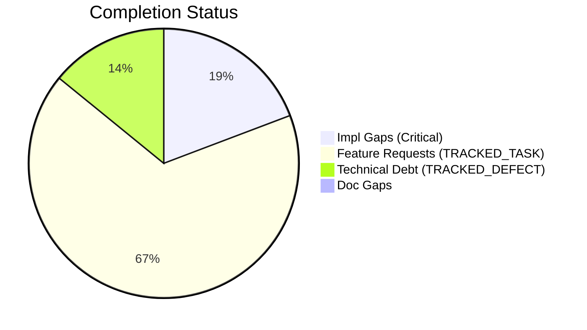
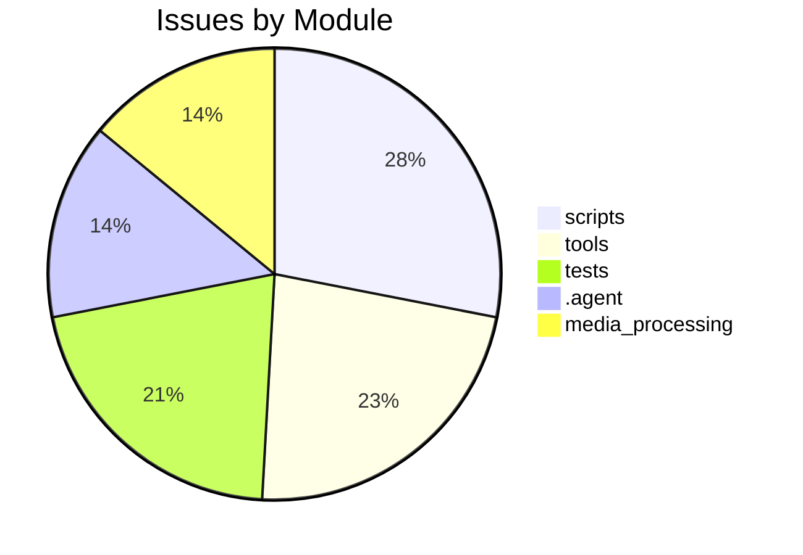

# Completist Report: 2026-03-15

## Executive Summary

- **Critical Gaps**: 15
- **Feature Gaps (TRACKED_TASK)**: 52
- **Technical Debt**: 11
- **Documentation Gaps**: 0

## Visualization

### Status Overview

### Top Impacted Modules

## Critical Incomplete (Top 50)

| File                                                            | Line | Type                | Impact | Coverage | Complexity |
| --------------------------------------------------------------- | ---- | ------------------- | ------ | -------- | ---------- |
| `src/tools/quality_utils.py`                                    | 39   | NotImplementedError | 3      | 2        | 4          |
| `src/tools/README.md`                                           | 26   | NotImplementedError | 3      | 2        | 4          |
| `scripts/legacy_tools/code_quality_check.py`                    | 37   | NotImplementedError | 3      | 2        | 4          |
| `src/pendulum_simulator/pendulum-core/python/physics_native.py` | 343  | NotImplementedError | 1      | 2        | 4          |
| `src/pendulum_simulator/pendulum-core/python/physics_native.py` | 361  | NotImplementedError | 1      | 2        | 4          |
| `src/pendulum_simulator/pendulum-core/python/physics_native.py` | 379  | NotImplementedError | 1      | 2        | 4          |
| `src/pendulum_simulator/pendulum-core/python/physics_native.py` | 394  | NotImplementedError | 1      | 2        | 4          |
| `src/pendulum_simulator/pendulum-core/python/physics_native.py` | 409  | NotImplementedError | 1      | 2        | 4          |
| `.agent/workflows/lint.md`                                      | 34   | NotImplementedError | 1      | 2        | 4          |
| `.agent/skills/lint/SKILL.md`                                   | 34   | NotImplementedError | 1      | 2        | 4          |
| `.agent/skills/lint/SKILL.md`                                   | 38   | NotImplementedError | 1      | 2        | 4          |
| `AGENTS.md`                                                     | 417  | NotImplementedError | 1      | 2        | 4          |
| `.cursor/rules/.cursorrules.md`                                 | 14   | NotImplementedError | 1      | 2        | 4          |
| `.claude/skills/lint/SKILL.md`                                  | 34   | NotImplementedError | 1      | 2        | 4          |
| `.claude/skills/lint/SKILL.md`                                  | 38   | NotImplementedError | 1      | 2        | 4          |

## Feature Gap Matrix

| Module                                                                              | Feature Gap                                                                                                           | Type                                         |
| ----------------------------------------------------------------------------------- | --------------------------------------------------------------------------------------------------------------------- | -------------------------------------------- | ------------ | ------ | --------------------- | -------------------------- | ------------ |
| `drafts/Jules-Code-Quality-Reviewer.yml`                                            | 5. **Placeholders**: Identify placeholder code (TRACKED_TASK, TRACKED_DEFECT, NotImplemented, pass statements)        | TRACKED_TASK                                 |
| `src/data_processing/data_processor/python/data_processor/core/script_generator.py` | f"{prefix}# TRACKED_TASK: Implement custom operation",                                                                | TRACKED_TASK                                 |
| `src/media_processing/video_processor/javascript/README.md`                         | - No placeholders (no TRACKED_TASK, TRACKED_DEFECT, etc.)                                                             | TRACKED_TASK                                 |
| `src/media_processing/video_processor/JULES_ARCHITECTURE.md`                        | if grep -r "TRACKED_TASK\\                                                                                            | TRACKED_DEFECT" --include="\*.py" src/; then | TRACKED_TASK |
| `src/media_processing/video_processor/apps/web/app/page.tsx`                        | // TRACKED_TASK: Move fps to client-side config or use from video metadata                                            | TRACKED_TASK                                 |
| `src/media_processing/video_processor/apps/web/app/page.tsx`                        | // TRACKED_TASK(#663): Save to database when backend API is available.                                                | TRACKED_TASK                                 |
| `src/media_processing/video_processor/apps/web/app/page.tsx`                        | // TRACKED_TASK(#663): Save pose data to database when backend API is available.                                      | TRACKED_TASK                                 |
| `src/media_processing/video_processor/apps/web/lib/golf/swingAnalyzer.ts`           | swingType: SwingType.UNKNOWN, // TRACKED_TASK: Implement swing type detection                                         | TRACKED_TASK                                 |
| `src/media_processing/video_processor/apps/web/lib/golf/swingAnalyzer.ts`           | armHang: 'good', // TRACKED_TASK: Implement arm hang detection                                                        | TRACKED_TASK                                 |
| `src/media_processing/video_processor/apps/web/lib/sanitize.ts`                     | // TRACKED_TASK: Parse and validate RGB values                                                                        | TRACKED_TASK                                 |
| `src/pendulum_simulator/src/double_pendulum_golf/gui/controls_utils.py`             | # TRACKED_TASK(#1042): Derive from fleet ThemeManager palette when it's a hard dep.                                   | TRACKED_TASK                                 |
| `src/glass_bath_fea/matlab/core/applyBoundaryConditions.m`                          | % TRACKED_TASK: Implement proper face identification based on geometry                                                | TRACKED_TASK                                 |
| `src/tools/matlab_quality_utils.py`                                                 | """Check for TRACKED_TASK, TRACKED_DEFECT, HACK, XXX, and placeholders."""                                            | TRACKED_TASK                                 |
| `src/tools/matlab_quality_utils.py`                                                 | (r"\bTODO\b", "TRACKED_TASK placeholder found"),                                                                      | TRACKED_TASK                                 |
| `src/tools/matlab_utilities/README.md`                                              | - TRACKED_TASK, TRACKED_DEFECT, HACK, XXX placeholders                                                                | TRACKED_TASK                                 |
| `src/tools/quality_utils.py`                                                        | (re.compile(r"\bTODO\b"), "TRACKED_TASK placeholder found"),                                                          | TRACKED_TASK                                 |
| `src/tools/quality_utils.py`                                                        | re.compile(r"<[^<>]_TRACKED_TASK[^<>]_>", re.IGNORECASE),                                                             | TRACKED_TASK                                 |
| `src/tools/quality_utils.py`                                                        | "Angle bracket TRACKED_TASK placeholder",                                                                             | TRACKED_TASK                                 |
| `src/tools/README.md`                                                               | - **Banned Patterns**: TRACKED_TASK, TRACKED_DEFECT, placeholders, NotImplementedError                                | TRACKED_TASK                                 |
| `scripts/legacy_tools/code_quality_check.py`                                        | (re.compile(r"\bTODO\b"), "TRACKED_TASK placeholder found"),                                                          | TRACKED_TASK                                 |
| `scripts/pragmatic_programmer_review.py`                                            | if "TRACKED_TASK" in content:                                                                                         | TRACKED_TASK                                 |
| `scripts/pragmatic_programmer_review.py`                                            | "title": f"High TRACKED_TASK count ({len(todos)})",                                                                   | TRACKED_TASK                                 |
| `scripts/generate_assessments.py`                                                   | - **Markers**: 445 `TRACKED_TASK` and 140 `TRACKED_DEFECT` markers indicate significant unfinished work.              | TRACKED_TASK                                 |
| `scripts/generate_assessments.py`                                                   | - 445 `TRACKED_TASK` markers.                                                                                         | TRACKED_TASK                                 |
| `scripts/generate_assessments.py`                                                   | - Convert valid `TRACKED_TASK` items into GitHub Issues.                                                              | TRACKED_TASK                                 |
| `scripts/generate_assessments.py`                                                   | f.write(" - **Issue**: 445 `TRACKED_TASK` markers.\n")                                                                | TRACKED_TASK                                 |
| `scripts/generate_comprehensive_assessment.py`                                      | stats["todos"] += content.count("TRACKED_TASK")                                                                       | TRACKED_TASK                                 |
| `scripts/generate_comprehensive_assessment.py`                                      | grades["O"] = (max(0, score_o), f"Technical Debt (TRACKED_TASK+TRACKED_DEFECT): {debt}")                              | TRACKED_TASK                                 |
| `scripts/generate_fresh_assessments.py`                                             | stats["todos"] += content.count("TRACKED_TASK")                                                                       | TRACKED_TASK                                 |
| `.agent/workflows/lint.md`                                                          | description: Run linting tools (ruff, black, mypy) and fix placeholder/TRACKED_TASK statements                        | TRACKED_TASK                                 |
| `.agent/workflows/lint.md`                                                          | grep -rn "TRACKED_TASK\\                                                                                              | TRACKED_DEFECT\\                             | XXX\\        | HACK\\ | NotImplementedError\\ | pass$" --include="\*.py" . | TRACKED_TASK |
| `.agent/skills/lint/SKILL.md`                                                       | description: Run linting tools (ruff, black, mypy) and fix placeholder/TRACKED_TASK statements                        | TRACKED_TASK                                 |
| `.agent/skills/lint/SKILL.md`                                                       | - Search for `TRACKED_TASK`, `TRACKED_DEFECT`, `XXX`, `HACK` comments                                                 | TRACKED_TASK                                 |
| `.agent/skills/lint/SKILL.md`                                                       | grep -rn "TRACKED_TASK\\                                                                                              | TRACKED_DEFECT\\                             | XXX\\        | HACK\\ | NotImplementedError\\ | pass$" --include="\*.py" . | TRACKED_TASK |
| `AGENTS.md`                                                                         | - ❌ **DO NOT** leave `TRACKED_TASK`/`TRACKED_DEFECT` markers for more than one sprint.                               | TRACKED_TASK                                 |
| `AGENTS.md`                                                                         | - **Read:** Codebase for TRACKED_TASK, TRACKED_DEFECT, NotImplementedError, pass statements                           | TRACKED_TASK                                 |
| `.cursor/rules/.cursorrules.md`                                                     | - **NEVER USE PLACEHOLDERS** → No `TRACKED_TASK`, `TRACKED_DEFECT`, `...`, `pass`, `NotImplementedError`, `<your-valu | TRACKED_TASK                                 |
| `.cursor/rules/.cursorrules.md`                                                     | - [X] Zero TRACKED_TASK/TRACKED_DEFECT/pass in diff                                                                   | TRACKED_TASK                                 |
| `.cursor/rules/.cursorrules.md`                                                     | # TRACKED_TASK: implement this properly                                                                               | TRACKED_TASK                                 |
| `.claude/skills/lint/SKILL.md`                                                      | description: Run linting tools (ruff, black, mypy) and fix placeholder/TRACKED_TASK statements                        | TRACKED_TASK                                 |
| `.claude/skills/lint/SKILL.md`                                                      | - Search for `TRACKED_TASK`, `TRACKED_DEFECT`, `XXX`, `HACK` comments                                                 | TRACKED_TASK                                 |
| `.claude/skills/lint/SKILL.md`                                                      | grep -rn "TRACKED_TASK\\                                                                                              | TRACKED_DEFECT\\                             | XXX\\        | HACK\\ | NotImplementedError\\ | pass$" --include="\*.py" . | TRACKED_TASK |
| `tests/tools/test_quality_utils.py`                                                 | lines = ["# TRACKED_TASK: fix this eventually"]                                                                       | TRACKED_TASK                                 |
| `tests/tools/test_quality_utils.py`                                                 | assert "TRACKED_TASK" in issues[0][1]                                                                                 | TRACKED_TASK                                 |
| `tests/tools/test_quality_utils.py`                                                 | lines = ["# TRACKED_TASK: something"]                                                                                 | TRACKED_TASK                                 |
| `tests/tools/test_quality_utils.py`                                                 | f.write_text("# TRACKED_TASK: clean me up\n", encoding="utf-8")                                                       | TRACKED_TASK                                 |
| `tests/tools/test_matlab_quality_utils.py`                                          | Path("script.m"), "% TRACKED_TASK: fix this", 5, issues                                                               | TRACKED_TASK                                 |
| `tests/tools/test_matlab_quality_utils.py`                                          | assert "TRACKED_TASK" in issues[0]                                                                                    | TRACKED_TASK                                 |
| `tests/tools/test_matlab_quality_utils.py`                                          | "% TRACKED_TASK",                                                                                                     | TRACKED_TASK                                 |
| `tests/tools/test_matlab_quality_utils.py`                                          | """m-file with TRACKED_TASK must produce at least one issue."""                                                       | TRACKED_TASK                                 |

## Technical Debt Register

| File                                           | Line | Issue                                                              | Type           |
| ---------------------------------------------- | ---- | ------------------------------------------------------------------ | -------------- |
| `src/tools/matlab_quality_utils.py`            | 325  | (r"\bFIXME\b", "TRACKED_DEFECT placeholder found"),                | TRACKED_DEFECT |
| `src/tools/quality_utils.py`                   | 37   | (re.compile(r"\bFIXME\b"), "TRACKED_DEFECT placeholder found"),    | TRACKED_DEFECT |
| `src/tools/quality_utils.py`                   | 50   | re.compile(r"<[^<>]_TRACKED_DEFECT[^<>]_>", re.IGNORECASE),        | TRACKED_DEFECT |
| `src/tools/quality_utils.py`                   | 51   | "Angle bracket TRACKED_DEFECT placeholder",                        | TRACKED_DEFECT |
| `scripts/legacy_tools/code_quality_check.py`   | 35   | (re.compile(r"\bFIXME\b"), "TRACKED_DEFECT placeholder found"),    | TRACKED_DEFECT |
| `scripts/generate_assessments.py`              | 214  | - 140 `TRACKED_DEFECT` markers.                                    | TRACKED_DEFECT |
| `scripts/generate_assessments.py`              | 217  | - Audit all `TRACKED_DEFECT` items and resolve high-priority ones. | TRACKED_DEFECT |
| `scripts/generate_comprehensive_assessment.py` | 143  | stats["fixmes"] += content.count("TRACKED_DEFECT")                 | TRACKED_DEFECT |
| `scripts/generate_fresh_assessments.py`        | 121  | stats["fixmes"] += content.count("TRACKED_DEFECT")                 | TRACKED_DEFECT |
| `tests/tools/test_matlab_quality_utils.py`     | 95   | Path("script.m"), "% TRACKED_DEFECT: broken", 3, issues            | TRACKED_DEFECT |
| `tests/tools/test_matlab_quality_utils.py`     | 97   | assert any("TRACKED_DEFECT" in i for i in issues)                  | TRACKED_DEFECT |

## Recommended Implementation Order

Prioritized by Impact (High) and Complexity (Low).
| Priority | File | Issue | Metrics (I/C/C) |
|---|---|---|---|
| 1 | `src/tools/matlab_quality_utils.py` | """Check for TRACKED_TASK, TRACKED_DEFECT, HACK, XXX, and placeholders.""" | 3/2/3 |
| 2 | `src/tools/matlab_quality_utils.py` | (r"\bTODO\b", "TRACKED_TASK placeholder found"), | 3/2/3 |
| 3 | `src/tools/matlab_utilities/README.md` | - TRACKED_TASK, TRACKED_DEFECT, HACK, XXX placeholders | 3/2/3 |
| 4 | `src/tools/quality_utils.py` | (re.compile(r"\bTODO\b"), "TRACKED_TASK placeholder found"), | 3/2/3 |
| 5 | `src/tools/quality_utils.py` | re.compile(r"<[^<>]_TRACKED_TASK[^<>]_>", re.IGNORECASE), | 3/2/3 |
| 6 | `src/tools/quality_utils.py` | "Angle bracket TRACKED_TASK placeholder", | 3/2/3 |
| 7 | `src/tools/README.md` | - **Banned Patterns**: TRACKED_TASK, TRACKED_DEFECT, placeholders, NotImplementedError | 3/2/3 |
| 8 | `scripts/legacy_tools/code_quality_check.py` | (re.compile(r"\bTODO\b"), "TRACKED_TASK placeholder found"), | 3/2/3 |
| 9 | `tests/tools/test_quality_utils.py` | lines = ["# TRACKED_TASK: fix this eventually"] | 3/5/3 |
| 10 | `tests/tools/test_quality_utils.py` | assert "TRACKED_TASK" in issues[0][1] | 3/5/3 |
| 11 | `tests/tools/test_quality_utils.py` | lines = ["# TRACKED_TASK: something"] | 3/5/3 |
| 12 | `tests/tools/test_quality_utils.py` | f.write_text("# TRACKED_TASK: clean me up\n", encoding="utf-8") | 3/5/3 |
| 13 | `tests/tools/test_matlab_quality_utils.py` | Path("script.m"), "% TRACKED_TASK: fix this", 5, issues | 3/5/3 |
| 14 | `tests/tools/test_matlab_quality_utils.py` | assert "TRACKED_TASK" in issues[0] | 3/5/3 |
| 15 | `tests/tools/test_matlab_quality_utils.py` | "% TRACKED_TASK", | 3/5/3 |
| 16 | `tests/tools/test_matlab_quality_utils.py` | """m-file with TRACKED_TASK must produce at least one issue.""" | 3/5/3 |
| 17 | `tests/tools/test_matlab_quality_utils.py` | (matlab / "dirty.m").write_text("function y = foo(x)\n% TRACKED_TASK: fix\ny = x;\nend\n | 3/5/3 |
| 18 | `tests/tools/test_matlab_quality_utils.py` | "function bad()\n% TRACKED_TASK: fill in\nglobal myVar\neval('x+1');\nend\n" | 3/5/3 |
| 19 | `src/tools/quality_utils.py` | (re.compile(r"NotImplementedError"), "NotImplementedError placeholder"), | 3/2/4 |
| 20 | `src/tools/README.md` | - **Banned Patterns**: TRACKED_TASK, TRACKED_DEFECT, placeholders, NotImplementedError | 3/2/4 |

## Issues Created
