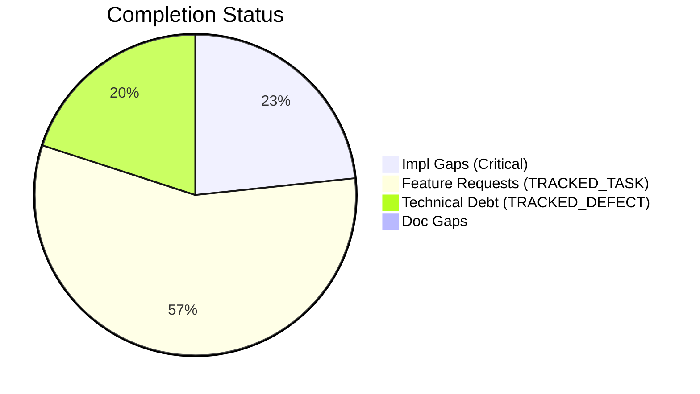
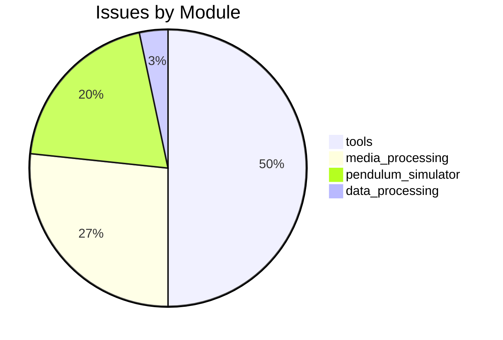

# Completist Report: 2026-03-19

## Executive Summary
- **Critical Gaps**: 7
- **Feature Gaps (TRACKED_TASK)**: 17
- **Technical Debt**: 6
- **Documentation Gaps**: 0

## Visualization
### Status Overview

### Top Impacted Modules

## Critical Incomplete (Top 50)
| File | Line | Type | Impact | Coverage | Complexity |
|---|---|---|---|---|---|
| `src/tools/quality_utils.py` | 39 | NotImplementedError | 3 | 2 | 4 |
| `src/tools/README.md` | 26 | NotImplementedError | 3 | 2 | 4 |
| `src/pendulum_simulator/pendulum-core/python/physics_native.py` | 343 | NotImplementedError | 1 | 2 | 4 |
| `src/pendulum_simulator/pendulum-core/python/physics_native.py` | 361 | NotImplementedError | 1 | 2 | 4 |
| `src/pendulum_simulator/pendulum-core/python/physics_native.py` | 379 | NotImplementedError | 1 | 2 | 4 |
| `src/pendulum_simulator/pendulum-core/python/physics_native.py` | 394 | NotImplementedError | 1 | 2 | 4 |
| `src/pendulum_simulator/pendulum-core/python/physics_native.py` | 409 | NotImplementedError | 1 | 2 | 4 |

## Feature Gap Matrix
| Module | Feature Gap | Type |
|---|---|---|
| `src/data_processing/data_processor/python/data_processor/core/script_generator.py` | f"{prefix}# TRACKED_TASK: Implement custom operation", | TRACKED_TASK |
| `src/media_processing/video_processor/javascript/README.md` | - No placeholders (no TRACKED_TASK, TRACKED_DEFECT, etc.) | TRACKED_TASK |
| `src/media_processing/video_processor/JULES_ARCHITECTURE.md` | if grep -r "TRACKED_TASK\\|TRACKED_DEFECT" --include="*.py" src/; then | TRACKED_TASK |
| `src/media_processing/video_processor/apps/web/app/page.tsx` | // TRACKED_TASK: Move fps to client-side config or use from video metadata | TRACKED_TASK |
| `src/media_processing/video_processor/apps/web/app/page.tsx` | // TRACKED_TASK(#663): Save to database when backend API is available. | TRACKED_TASK |
| `src/media_processing/video_processor/apps/web/app/page.tsx` | // TRACKED_TASK(#663): Save pose data to database when backend API is available. | TRACKED_TASK |
| `src/media_processing/video_processor/apps/web/lib/golf/swingAnalyzer.ts` | swingType: SwingType.UNKNOWN, // TRACKED_TASK: Implement swing type detection | TRACKED_TASK |
| `src/media_processing/video_processor/apps/web/lib/golf/swingAnalyzer.ts` | armHang: 'good', // TRACKED_TASK: Implement arm hang detection | TRACKED_TASK |
| `src/media_processing/video_processor/apps/web/lib/sanitize.ts` | // TRACKED_TASK: Parse and validate RGB values | TRACKED_TASK |
| `src/pendulum_simulator/src/double_pendulum_golf/gui/controls_utils.py` | # TRACKED_TASK(#1042): Derive from fleet ThemeManager palette when it's a hard dep. | TRACKED_TASK |
| `src/tools/matlab_quality_utils.py` | """Check for TRACKED_TASK, TRACKED_DEFECT, HACK, XXX, and placeholders.""" | TRACKED_TASK |
| `src/tools/matlab_quality_utils.py` | (r"\bTODO\b", "TRACKED_TASK placeholder found"), | TRACKED_TASK |
| `src/tools/matlab_utilities/README.md` | - TRACKED_TASK, TRACKED_DEFECT, HACK, XXX placeholders | TRACKED_TASK |
| `src/tools/quality_utils.py` | (re.compile(r"\bTODO\b"), "TRACKED_TASK placeholder found"), | TRACKED_TASK |
| `src/tools/quality_utils.py` | re.compile(r"<[^<>]*TRACKED_TASK[^<>]*>", re.IGNORECASE), | TRACKED_TASK |
| `src/tools/quality_utils.py` | "Angle bracket TRACKED_TASK placeholder", | TRACKED_TASK |
| `src/tools/README.md` | - **Banned Patterns**: TRACKED_TASK, TRACKED_DEFECT, placeholders, NotImplementedError | TRACKED_TASK |

## Technical Debt Register
| File | Line | Issue | Type |
|---|---|---|---|
| `src/tools/matlab_quality_utils.py` | 325 | (r"\bFIXME\b", "TRACKED_DEFECT placeholder found"), | TRACKED_DEFECT |
| `src/tools/matlab_quality_utils.py` | 326 | (r"\bHACK\b", "HACK comment found"), | HACK |
| `src/tools/matlab_quality_utils.py` | 327 | (r"\bXXX\b", "XXX comment found"), | XXX |
| `src/tools/quality_utils.py` | 37 | (re.compile(r"\bFIXME\b"), "TRACKED_DEFECT placeholder found"), | TRACKED_DEFECT |
| `src/tools/quality_utils.py` | 50 | re.compile(r"<[^<>]*TRACKED_DEFECT[^<>]*>", re.IGNORECASE), | TRACKED_DEFECT |
| `src/tools/quality_utils.py` | 51 | "Angle bracket TRACKED_DEFECT placeholder", | TRACKED_DEFECT |

## Recommended Implementation Order
Prioritized by Impact (High) and Complexity (Low).
| Priority | File | Issue | Metrics (I/C/C) |
|---|---|---|---|
| 1 | `src/tools/matlab_quality_utils.py` | """Check for TRACKED_TASK, TRACKED_DEFECT, HACK, XXX, and placeholders.""" | 3/2/3 |
| 2 | `src/tools/matlab_quality_utils.py` | (r"\bTODO\b", "TRACKED_TASK placeholder found"), | 3/2/3 |
| 3 | `src/tools/matlab_utilities/README.md` | - TRACKED_TASK, TRACKED_DEFECT, HACK, XXX placeholders | 3/2/3 |
| 4 | `src/tools/quality_utils.py` | (re.compile(r"\bTODO\b"), "TRACKED_TASK placeholder found"), | 3/2/3 |
| 5 | `src/tools/quality_utils.py` | re.compile(r"<[^<>]*TRACKED_TASK[^<>]*>", re.IGNORECASE), | 3/2/3 |
| 6 | `src/tools/quality_utils.py` | "Angle bracket TRACKED_TASK placeholder", | 3/2/3 |
| 7 | `src/tools/README.md` | - **Banned Patterns**: TRACKED_TASK, TRACKED_DEFECT, placeholders, NotImplementedError | 3/2/3 |
| 8 | `src/tools/quality_utils.py` | (re.compile(r"NotImplementedError"), "NotImplementedError placeholder"), | 3/2/4 |
| 9 | `src/tools/README.md` | - **Banned Patterns**: TRACKED_TASK, TRACKED_DEFECT, placeholders, NotImplementedError | 3/2/4 |
| 10 | `src/data_processing/data_processor/python/data_processor/core/script_generator.py` | f"{prefix}# TRACKED_TASK: Implement custom operation", | 1/2/3 |
| 11 | `src/media_processing/video_processor/javascript/README.md` | - No placeholders (no TRACKED_TASK, TRACKED_DEFECT, etc.) | 1/2/3 |
| 12 | `src/media_processing/video_processor/JULES_ARCHITECTURE.md` | if grep -r "TRACKED_TASK\\|TRACKED_DEFECT" --include="*.py" src/; then | 1/2/3 |
| 13 | `src/media_processing/video_processor/apps/web/app/page.tsx` | // TRACKED_TASK: Move fps to client-side config or use from video metadata | 1/2/3 |
| 14 | `src/media_processing/video_processor/apps/web/app/page.tsx` | // TRACKED_TASK(#663): Save to database when backend API is available. | 1/2/3 |
| 15 | `src/media_processing/video_processor/apps/web/app/page.tsx` | // TRACKED_TASK(#663): Save pose data to database when backend API is available. | 1/2/3 |
| 16 | `src/media_processing/video_processor/apps/web/lib/golf/swingAnalyzer.ts` | swingType: SwingType.UNKNOWN, // TRACKED_TASK: Implement swing type detection | 1/2/3 |
| 17 | `src/media_processing/video_processor/apps/web/lib/golf/swingAnalyzer.ts` | armHang: 'good', // TRACKED_TASK: Implement arm hang detection | 1/2/3 |
| 18 | `src/media_processing/video_processor/apps/web/lib/sanitize.ts` | // TRACKED_TASK: Parse and validate RGB values | 1/2/3 |
| 19 | `src/pendulum_simulator/src/double_pendulum_golf/gui/controls_utils.py` | # TRACKED_TASK(#1042): Derive from fleet ThemeManager palette when it's a hard dep. | 1/2/3 |
| 20 | `src/pendulum_simulator/pendulum-core/python/physics_native.py` | raise NotImplementedError( | 1/2/4 |

## Issues Created