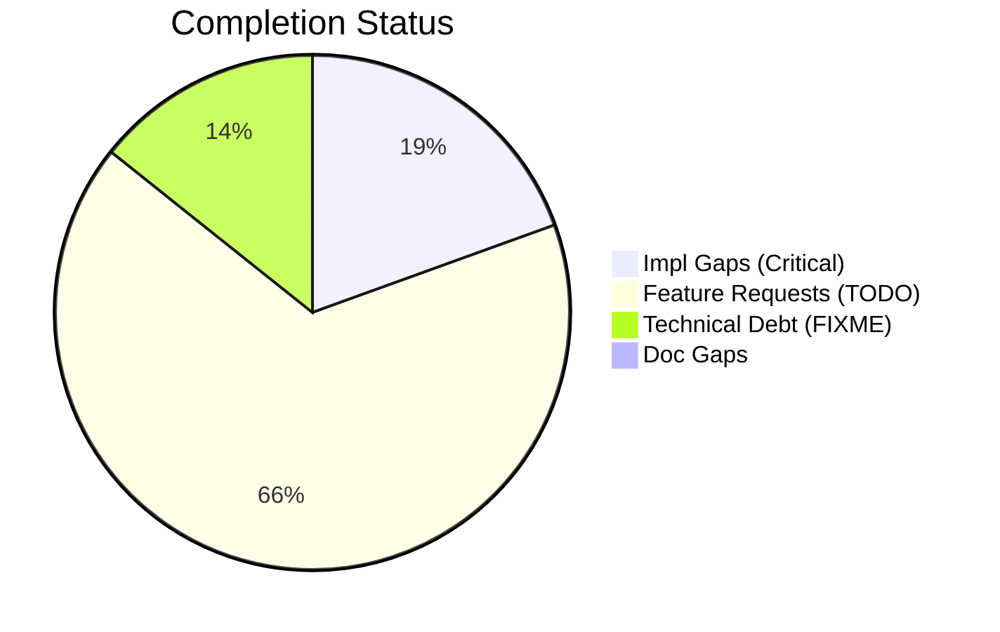
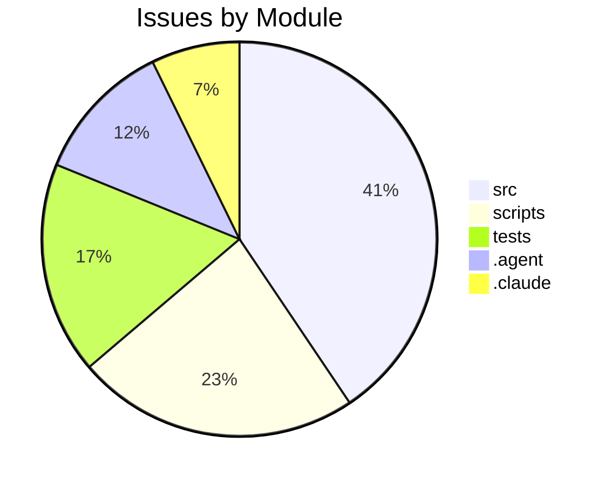

# Completist Report: 2026-03-22

## Executive Summary
- **Critical Gaps**: 15
- **Feature Gaps (TODO)**: 51
- **Technical Debt**: 11
- **Documentation Gaps**: 0

## Visualization
### Status Overview

### Top Impacted Modules

## Critical Incomplete (Top 50)
| File | Line | Type | Impact | Coverage | Complexity |
|---|---|---|---|---|---|
| `./src/tools/quality_utils.py` | 39 | NotImplementedError | 3 | 2 | 4 |
| `./src/tools/README.md` | 26 | NotImplementedError | 3 | 2 | 4 |
| `./scripts/legacy_tools/code_quality_check.py` | 37 | NotImplementedError | 3 | 2 | 4 |
| `./src/pendulum_simulator/pendulum-core/python/physics_native.py` | 343 | NotImplementedError | 1 | 2 | 4 |
| `./src/pendulum_simulator/pendulum-core/python/physics_native.py` | 361 | NotImplementedError | 1 | 2 | 4 |
| `./src/pendulum_simulator/pendulum-core/python/physics_native.py` | 379 | NotImplementedError | 1 | 2 | 4 |
| `./src/pendulum_simulator/pendulum-core/python/physics_native.py` | 394 | NotImplementedError | 1 | 2 | 4 |
| `./src/pendulum_simulator/pendulum-core/python/physics_native.py` | 409 | NotImplementedError | 1 | 2 | 4 |
| `./.agent/workflows/lint.md` | 34 | NotImplementedError | 1 | 2 | 4 |
| `./.agent/skills/lint/SKILL.md` | 34 | NotImplementedError | 1 | 2 | 4 |
| `./.agent/skills/lint/SKILL.md` | 38 | NotImplementedError | 1 | 2 | 4 |
| `./AGENTS.md` | 417 | NotImplementedError | 1 | 2 | 4 |
| `./.cursor/rules/.cursorrules.md` | 14 | NotImplementedError | 1 | 2 | 4 |
| `./.claude/skills/lint/SKILL.md` | 34 | NotImplementedError | 1 | 2 | 4 |
| `./.claude/skills/lint/SKILL.md` | 38 | NotImplementedError | 1 | 2 | 4 |

## Feature Gap Matrix
| Module | Feature Gap | Type |
|---|---|---|
| `./drafts/Jules-Code-Quality-Reviewer.yml` | 5. **Placeholders**: Identify placeholder code (TODO, FIXME, NotImplemented, pass statements) | TODO |
| `./src/data_processing/data_processor/python/data_processor/core/script_generator.py` | f"{prefix}# TODO: Implement custom operation", | TODO |
| `./src/media_processing/video_processor/javascript/README.md` | - No placeholders (no TODO, FIXME, etc.) | TODO |
| `./src/media_processing/video_processor/JULES_ARCHITECTURE.md` | if grep -r "TODO\\|FIXME" --include="*.py" src/; then | TODO |
| `./src/media_processing/video_processor/apps/web/app/page.tsx` | // TODO: Move fps to client-side config or use from video metadata | TODO |
| `./src/media_processing/video_processor/apps/web/app/page.tsx` | // TODO(#663): Save to database when backend API is available. | TODO |
| `./src/media_processing/video_processor/apps/web/app/page.tsx` | // TODO(#663): Save pose data to database when backend API is available. | TODO |
| `./src/media_processing/video_processor/apps/web/lib/golf/swingAnalyzer.ts` | swingType: SwingType.UNKNOWN, // TODO: Implement swing type detection | TODO |
| `./src/media_processing/video_processor/apps/web/lib/golf/swingAnalyzer.ts` | armHang: 'good', // TODO: Implement arm hang detection | TODO |
| `./src/media_processing/video_processor/apps/web/lib/sanitize.ts` | // TODO: Parse and validate RGB values | TODO |
| `./src/pendulum_simulator/src/double_pendulum_golf/gui/controls_utils.py` | # TODO(#1042): Derive from fleet ThemeManager palette when it's a hard dep. | TODO |
| `./src/tools/matlab_quality_utils.py` | """Check for TODO, FIXME, HACK, XXX, and placeholders.""" | TODO |
| `./src/tools/matlab_quality_utils.py` | (r"\bTODO\b", "TODO placeholder found"), | TODO |
| `./src/tools/matlab_utilities/README.md` | - TODO, FIXME, HACK, XXX placeholders | TODO |
| `./src/tools/quality_utils.py` | (re.compile(r"\bTODO\b"), "TODO placeholder found"), | TODO |
| `./src/tools/quality_utils.py` | re.compile(r"<[^<>]*TODO[^<>]*>", re.IGNORECASE), | TODO |
| `./src/tools/quality_utils.py` | "Angle bracket TODO placeholder", | TODO |
| `./src/tools/README.md` | - **Banned Patterns**: TODO, FIXME, placeholders, NotImplementedError | TODO |
| `./scripts/legacy_tools/code_quality_check.py` | (re.compile(r"\bTODO\b"), "TODO placeholder found"), | TODO |
| `./scripts/pragmatic_programmer_review.py` | if "TODO" in content: | TODO |
| `./scripts/pragmatic_programmer_review.py` | "title": f"High TODO count ({len(todos)})", | TODO |
| `./scripts/generate_assessments.py` | - **Markers**: 445 `TODO` and 140 `FIXME` markers indicate significant unfinished work. | TODO |
| `./scripts/generate_assessments.py` | -   445 `TODO` markers. | TODO |
| `./scripts/generate_assessments.py` | -   Convert valid `TODO` items into GitHub Issues. | TODO |
| `./scripts/generate_assessments.py` | f.write("    - **Issue**: 445 `TODO` markers.\n") | TODO |
| `./scripts/generate_comprehensive_assessment.py` | stats["todos"] += content.count("TODO") | TODO |
| `./scripts/generate_comprehensive_assessment.py` | grades["O"] = (max(0, score_o), f"Technical Debt (TODO+FIXME): {debt}") | TODO |
| `./scripts/generate_fresh_assessments.py` | stats["todos"] += content.count("TODO") | TODO |
| `./.agent/workflows/lint.md` | description: Run linting tools (ruff, black, mypy) and fix placeholder/TODO statements | TODO |
| `./.agent/workflows/lint.md` | grep -rn "TODO\\|FIXME\\|XXX\\|HACK\\|NotImplementedError\\|pass$" --include="*.py" . | TODO |
| `./.agent/skills/lint/SKILL.md` | description: Run linting tools (ruff, black, mypy) and fix placeholder/TODO statements | TODO |
| `./.agent/skills/lint/SKILL.md` | - Search for `TODO`, `FIXME`, `XXX`, `HACK` comments | TODO |
| `./.agent/skills/lint/SKILL.md` | grep -rn "TODO\\|FIXME\\|XXX\\|HACK\\|NotImplementedError\\|pass$" --include="*.py" . | TODO |
| `./AGENTS.md` | - ❌ **DO NOT** leave `TODO`/`FIXME` markers for more than one sprint. | TODO |
| `./AGENTS.md` | - **Read:** Codebase for TODO, FIXME, NotImplementedError, pass statements | TODO |
| `./.cursor/rules/.cursorrules.md` | - **NEVER USE PLACEHOLDERS** → No `TODO`, `FIXME`, `...`, `pass`, `NotImplementedError`, `<your-valu | TODO |
| `./.cursor/rules/.cursorrules.md` | - [X] Zero TODO/FIXME/pass in diff | TODO |
| `./.cursor/rules/.cursorrules.md` | # TODO: implement this properly | TODO |
| `./.claude/skills/lint/SKILL.md` | description: Run linting tools (ruff, black, mypy) and fix placeholder/TODO statements | TODO |
| `./.claude/skills/lint/SKILL.md` | - Search for `TODO`, `FIXME`, `XXX`, `HACK` comments | TODO |
| `./.claude/skills/lint/SKILL.md` | grep -rn "TODO\\|FIXME\\|XXX\\|HACK\\|NotImplementedError\\|pass$" --include="*.py" . | TODO |
| `./tests/tools/test_quality_utils.py` | lines = ["# TODO: fix this eventually"] | TODO |
| `./tests/tools/test_quality_utils.py` | assert "TODO" in issues[0][1] | TODO |
| `./tests/tools/test_quality_utils.py` | lines = ["# TODO: something"] | TODO |
| `./tests/tools/test_quality_utils.py` | f.write_text("# TODO: clean me up\n", encoding="utf-8") | TODO |
| `./tests/tools/test_matlab_quality_utils.py` | Path("script.m"), "% TODO: fix this", 5, issues | TODO |
| `./tests/tools/test_matlab_quality_utils.py` | assert "TODO" in issues[0] | TODO |
| `./tests/tools/test_matlab_quality_utils.py` | "% TODO", | TODO |
| `./tests/tools/test_matlab_quality_utils.py` | """m-file with TODO must produce at least one issue.""" | TODO |
| `./tests/tools/test_matlab_quality_utils.py` | (matlab / "dirty.m").write_text("function y = foo(x)\n% TODO: fix\ny = x;\nend\n") | TODO |

## Technical Debt Register
| File | Line | Issue | Type |
|---|---|---|---|
| `./src/tools/matlab_quality_utils.py` | 325 | (r"\bFIXME\b", "FIXME placeholder found"), | FIXME |
| `./src/tools/quality_utils.py` | 37 | (re.compile(r"\bFIXME\b"), "FIXME placeholder found"), | FIXME |
| `./src/tools/quality_utils.py` | 50 | re.compile(r"<[^<>]*FIXME[^<>]*>", re.IGNORECASE), | FIXME |
| `./src/tools/quality_utils.py` | 51 | "Angle bracket FIXME placeholder", | FIXME |
| `./scripts/legacy_tools/code_quality_check.py` | 35 | (re.compile(r"\bFIXME\b"), "FIXME placeholder found"), | FIXME |
| `./scripts/generate_assessments.py` | 214 | -   140 `FIXME` markers. | FIXME |
| `./scripts/generate_assessments.py` | 217 | -   Audit all `FIXME` items and resolve high-priority ones. | FIXME |
| `./scripts/generate_comprehensive_assessment.py` | 143 | stats["fixmes"] += content.count("FIXME") | FIXME |
| `./scripts/generate_fresh_assessments.py` | 121 | stats["fixmes"] += content.count("FIXME") | FIXME |
| `./tests/tools/test_matlab_quality_utils.py` | 95 | Path("script.m"), "% FIXME: broken", 3, issues | FIXME |
| `./tests/tools/test_matlab_quality_utils.py` | 97 | assert any("FIXME" in i for i in issues) | FIXME |

## Recommended Implementation Order
Prioritized by Impact (High) and Complexity (Low).
| Priority | File | Issue | Metrics (I/C/C) |
|---|---|---|---|
| 1 | `./src/tools/matlab_quality_utils.py` | """Check for TODO, FIXME, HACK, XXX, and placeholders.""" | 3/2/3 |
| 2 | `./src/tools/matlab_quality_utils.py` | (r"\bTODO\b", "TODO placeholder found"), | 3/2/3 |
| 3 | `./src/tools/matlab_utilities/README.md` | - TODO, FIXME, HACK, XXX placeholders | 3/2/3 |
| 4 | `./src/tools/quality_utils.py` | (re.compile(r"\bTODO\b"), "TODO placeholder found"), | 3/2/3 |
| 5 | `./src/tools/quality_utils.py` | re.compile(r"<[^<>]*TODO[^<>]*>", re.IGNORECASE), | 3/2/3 |
| 6 | `./src/tools/quality_utils.py` | "Angle bracket TODO placeholder", | 3/2/3 |
| 7 | `./src/tools/README.md` | - **Banned Patterns**: TODO, FIXME, placeholders, NotImplementedError | 3/2/3 |
| 8 | `./scripts/legacy_tools/code_quality_check.py` | (re.compile(r"\bTODO\b"), "TODO placeholder found"), | 3/2/3 |
| 9 | `./tests/tools/test_quality_utils.py` | lines = ["# TODO: fix this eventually"] | 3/5/3 |
| 10 | `./tests/tools/test_quality_utils.py` | assert "TODO" in issues[0][1] | 3/5/3 |
| 11 | `./tests/tools/test_quality_utils.py` | lines = ["# TODO: something"] | 3/5/3 |
| 12 | `./tests/tools/test_quality_utils.py` | f.write_text("# TODO: clean me up\n", encoding="utf-8") | 3/5/3 |
| 13 | `./tests/tools/test_matlab_quality_utils.py` | Path("script.m"), "% TODO: fix this", 5, issues | 3/5/3 |
| 14 | `./tests/tools/test_matlab_quality_utils.py` | assert "TODO" in issues[0] | 3/5/3 |
| 15 | `./tests/tools/test_matlab_quality_utils.py` | "% TODO", | 3/5/3 |
| 16 | `./tests/tools/test_matlab_quality_utils.py` | """m-file with TODO must produce at least one issue.""" | 3/5/3 |
| 17 | `./tests/tools/test_matlab_quality_utils.py` | (matlab / "dirty.m").write_text("function y = foo(x)\n% TODO: fix\ny = x;\nend\n | 3/5/3 |
| 18 | `./tests/tools/test_matlab_quality_utils.py` | "function bad()\n% TODO: fill in\nglobal myVar\neval('x+1');\nend\n" | 3/5/3 |
| 19 | `./src/tools/quality_utils.py` | (re.compile(r"NotImplementedError"), "NotImplementedError placeholder"), | 3/2/4 |
| 20 | `./src/tools/README.md` | - **Banned Patterns**: TODO, FIXME, placeholders, NotImplementedError | 3/2/4 |

## Issues Created