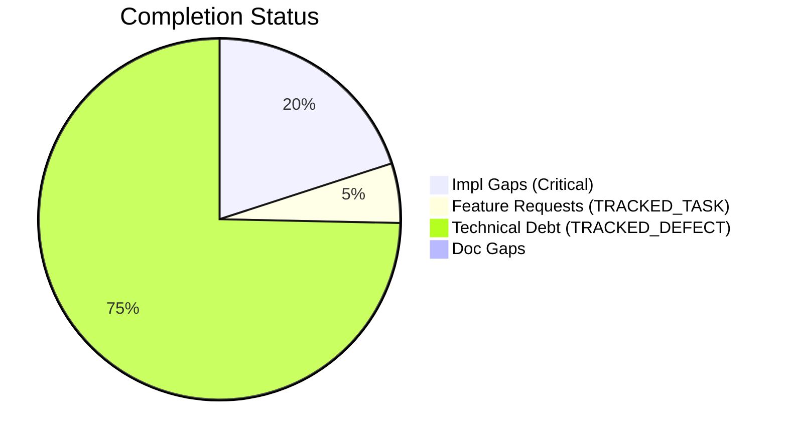
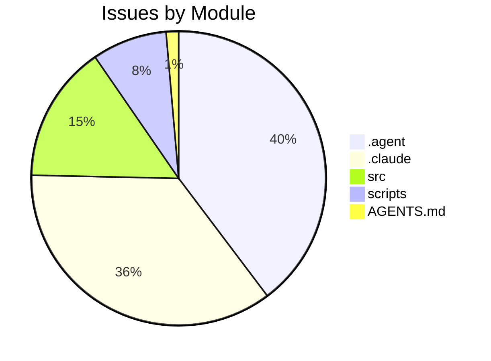

# Completist Report: 2026-03-29

## Executive Summary

- **Critical Gaps**: 15
- **Feature Gaps (TRACKED_TASK)**: 4
- **Technical Debt**: 56
- **Documentation Gaps**: 0

## Visualization

### Status Overview

### Top Impacted Modules

## Critical Incomplete (Top 50)

| File                                                              | Line | Type                | Impact | Coverage | Complexity |
| ----------------------------------------------------------------- | ---- | ------------------- | ------ | -------- | ---------- |
| `./src/tools/quality_utils.py`                                    | 39   | NotImplementedError | 3      | 2        | 4          |
| `./src/tools/README.md`                                           | 26   | NotImplementedError | 3      | 2        | 4          |
| `./scripts/legacy_tools/code_quality_check.py`                    | 37   | NotImplementedError | 3      | 2        | 4          |
| `./src/pendulum_simulator/pendulum-core/python/physics_native.py` | 348  | NotImplementedError | 1      | 2        | 4          |
| `./src/pendulum_simulator/pendulum-core/python/physics_native.py` | 363  | NotImplementedError | 1      | 2        | 4          |
| `./src/pendulum_simulator/pendulum-core/python/physics_native.py` | 380  | NotImplementedError | 1      | 2        | 4          |
| `./src/pendulum_simulator/pendulum-core/python/physics_native.py` | 395  | NotImplementedError | 1      | 2        | 4          |
| `./src/pendulum_simulator/pendulum-core/python/physics_native.py` | 410  | NotImplementedError | 1      | 2        | 4          |
| `./.agent/workflows/lint.md`                                      | 34   | NotImplementedError | 1      | 2        | 4          |
| `./.agent/skills/lint/SKILL.md`                                   | 34   | NotImplementedError | 1      | 2        | 4          |
| `./.agent/skills/lint/SKILL.md`                                   | 38   | NotImplementedError | 1      | 2        | 4          |
| `./AGENTS.md`                                                     | 417  | NotImplementedError | 1      | 2        | 4          |
| `./.cursor/rules/.cursorrules.md`                                 | 14   | NotImplementedError | 1      | 2        | 4          |
| `./.claude/skills/lint/SKILL.md`                                  | 34   | NotImplementedError | 1      | 2        | 4          |
| `./.claude/skills/lint/SKILL.md`                                  | 38   | NotImplementedError | 1      | 2        | 4          |

## Feature Gap Matrix

| Module                                           | Feature Gap                                                                                   | Type         |
| ------------------------------------------------ | --------------------------------------------------------------------------------------------- | ------------ |
| `./drafts/Jules-Code-Quality-Reviewer.yml`       | 5. **Placeholders**: Identify placeholder code (TODO, FIXME, NotImplemented, pass statements) | TRACKED_TASK |
| `./scripts/generate_comprehensive_assessment.py` | stats["todos"] += content.count("TODO")                                                       | TRACKED_TASK |
| `./scripts/generate_comprehensive_assessment.py` | grades["O"] = (max(0, score_o), f"Technical Debt (TODO+FIXME): {debt}")                       | TRACKED_TASK |
| `./scripts/generate_fresh_assessments.py`        | stats["todos"] += content.count("TODO")                                                       | TRACKED_TASK |

## Technical Debt Register

| File                                             | Line | Issue                                                                      | Type             |
| ------------------------------------------------ | ---- | -------------------------------------------------------------------------- | ---------------- | ----- | ------ | --------------------- | ------------------------ | --- |
| `./src/tools/matlab_quality_utils.py`            | 322  | """Check for TRACKED_TASK, TRACKED_DEFECT, HACK, XXX, and placeholders.""" | XXX              |
| `./src/tools/matlab_quality_utils.py`            | 331  | (r"\bHACK\b", "HACK comment found"),                                       | HACK             |
| `./src/tools/matlab_quality_utils.py`            | 332  | (r"\bXXX\b", "XXX comment found"),                                         | XXX              |
| `./src/tools/matlab_utilities/README.md`         | 261  | - TRACKED_TASK, TRACKED_DEFECT, HACK, XXX placeholders                     | XXX              |
| `./scripts/generate_comprehensive_assessment.py` | 143  | stats["fixmes"] += content.count("FIXME")                                  | FIXME            |
| `./scripts/generate_fresh_assessments.py`        | 121  | stats["fixmes"] += content.count("FIXME")                                  | FIXME            |
| `./.agent/workflows/issues-5-combined.md`        | 42   | Closes #XXX, closes #XXX, closes #XXX, closes #XXX, closes #XXX            | XXX              |
| `./.agent/workflows/lint.md`                     | 34   | grep -rn "TRACKED_TASK\\                                                   | TRACKED_DEFECT\\ | XXX\\ | HACK\\ | NotImplementedError\\ | pass$" --include="\*.py" | XXX |
| `./.agent/skills/update-issues/SKILL.md`         | 143  | \| #XXX \| Title \| High \| assessment.md \|                               | XXX              |
| `./.agent/skills/update-issues/SKILL.md`         | 149  | \| #XXX \| Title \| Fixed in commit abc123 \|                              | XXX              |
| `./.agent/skills/update-issues/SKILL.md`         | 155  | \| Description \| #XXX \|                                                  | XXX              |
| `./.agent/skills/issues-10-sequential/SKILL.md`  | 105  | \| 1 \| #XXX - Title \| #YYY \| Merged \|                                  | XXX              |
| `./.agent/skills/issues-10-sequential/SKILL.md`  | 106  | \| 2 \| #XXX - Title \| #YYY \| Merged \|                                  | XXX              |
| `./.agent/skills/lint/SKILL.md`                  | 33   | - Search for `TRACKED_TASK`, `TRACKED_DEFECT`, `XXX`, `HACK` comments      | XXX              |
| `./.agent/skills/lint/SKILL.md`                  | 38   | grep -rn "TRACKED_TASK\\                                                   | TRACKED_DEFECT\\ | XXX\\ | HACK\\ | NotImplementedError\\ | pass$" --include="\*.py" | XXX |
| `./.agent/skills/issues-5-combined/SKILL.md`     | 67   | - #XXX: <brief description>                                                | XXX              |
| `./.agent/skills/issues-5-combined/SKILL.md`     | 68   | - #XXX: <brief description>                                                | XXX              |
| `./.agent/skills/issues-5-combined/SKILL.md`     | 69   | - #XXX: <brief description>                                                | XXX              |
| `./.agent/skills/issues-5-combined/SKILL.md`     | 70   | - #XXX: <brief description>                                                | XXX              |
| `./.agent/skills/issues-5-combined/SKILL.md`     | 71   | - #XXX: <brief description>                                                | XXX              |
| `./.agent/skills/issues-5-combined/SKILL.md`     | 73   | Closes #XXX, closes #XXX, closes #XXX, closes #XXX, closes #XXX            | XXX              |
| `./.agent/skills/issues-5-combined/SKILL.md`     | 88   | \| #XXX \| Title \| Brief fix description \|                               | XXX              |
| `./.agent/skills/issues-5-combined/SKILL.md`     | 89   | \| #XXX \| Title \| Brief fix description \|                               | XXX              |
| `./.agent/skills/issues-5-combined/SKILL.md`     | 90   | \| #XXX \| Title \| Brief fix description \|                               | XXX              |
| `./.agent/skills/issues-5-combined/SKILL.md`     | 91   | \| #XXX \| Title \| Brief fix description \|                               | XXX              |
| `./.agent/skills/issues-5-combined/SKILL.md`     | 92   | \| #XXX \| Title \| Brief fix description \|                               | XXX              |
| `./.agent/skills/issues-5-combined/SKILL.md`     | 99   | Closes #XXX, closes #XXX, closes #XXX, closes #XXX, closes #XXX"           | XXX              |
| `./.agent/skills/issues-5-combined/SKILL.md`     | 145  | \| #XXX \| Title \| Fixed \|                                               | XXX              |
| `./.agent/skills/issues-5-combined/SKILL.md`     | 146  | \| #XXX \| Title \| Fixed \|                                               | XXX              |
| `./.agent/skills/issues-5-combined/SKILL.md`     | 147  | \| #XXX \| Title \| Fixed \|                                               | XXX              |
| `./.agent/skills/issues-5-combined/SKILL.md`     | 148  | \| #XXX \| Title \| Fixed \|                                               | XXX              |
| `./.agent/skills/issues-5-combined/SKILL.md`     | 149  | \| #XXX \| Title \| Fixed \|                                               | XXX              |
| `./.claude/skills/update-issues/SKILL.md`        | 143  | \| #XXX \| Title \| High \| assessment.md \|                               | XXX              |
| `./.claude/skills/update-issues/SKILL.md`        | 149  | \| #XXX \| Title \| Fixed in commit abc123 \|                              | XXX              |
| `./.claude/skills/update-issues/SKILL.md`        | 155  | \| Description \| #XXX \|                                                  | XXX              |
| `./.claude/skills/issues-10-sequential/SKILL.md` | 105  | \| 1 \| #XXX - Title \| #YYY \| Merged \|                                  | XXX              |
| `./.claude/skills/issues-10-sequential/SKILL.md` | 106  | \| 2 \| #XXX - Title \| #YYY \| Merged \|                                  | XXX              |
| `./.claude/skills/lint/SKILL.md`                 | 33   | - Search for `TRACKED_TASK`, `TRACKED_DEFECT`, `XXX`, `HACK` comments      | XXX              |
| `./.claude/skills/lint/SKILL.md`                 | 38   | grep -rn "TRACKED_TASK\\                                                   | TRACKED_DEFECT\\ | XXX\\ | HACK\\ | NotImplementedError\\ | pass$" --include="\*.py" | XXX |
| `./.claude/skills/issues-5-combined/SKILL.md`    | 67   | - #XXX: <brief description>                                                | XXX              |
| `./.claude/skills/issues-5-combined/SKILL.md`    | 68   | - #XXX: <brief description>                                                | XXX              |
| `./.claude/skills/issues-5-combined/SKILL.md`    | 69   | - #XXX: <brief description>                                                | XXX              |
| `./.claude/skills/issues-5-combined/SKILL.md`    | 70   | - #XXX: <brief description>                                                | XXX              |
| `./.claude/skills/issues-5-combined/SKILL.md`    | 71   | - #XXX: <brief description>                                                | XXX              |
| `./.claude/skills/issues-5-combined/SKILL.md`    | 73   | Closes #XXX, closes #XXX, closes #XXX, closes #XXX, closes #XXX            | XXX              |
| `./.claude/skills/issues-5-combined/SKILL.md`    | 88   | \| #XXX \| Title \| Brief fix description \|                               | XXX              |
| `./.claude/skills/issues-5-combined/SKILL.md`    | 89   | \| #XXX \| Title \| Brief fix description \|                               | XXX              |
| `./.claude/skills/issues-5-combined/SKILL.md`    | 90   | \| #XXX \| Title \| Brief fix description \|                               | XXX              |
| `./.claude/skills/issues-5-combined/SKILL.md`    | 91   | \| #XXX \| Title \| Brief fix description \|                               | XXX              |
| `./.claude/skills/issues-5-combined/SKILL.md`    | 92   | \| #XXX \| Title \| Brief fix description \|                               | XXX              |
| `./.claude/skills/issues-5-combined/SKILL.md`    | 99   | Closes #XXX, closes #XXX, closes #XXX, closes #XXX, closes #XXX"           | XXX              |
| `./.claude/skills/issues-5-combined/SKILL.md`    | 145  | \| #XXX \| Title \| Fixed \|                                               | XXX              |
| `./.claude/skills/issues-5-combined/SKILL.md`    | 146  | \| #XXX \| Title \| Fixed \|                                               | XXX              |
| `./.claude/skills/issues-5-combined/SKILL.md`    | 147  | \| #XXX \| Title \| Fixed \|                                               | XXX              |
| `./.claude/skills/issues-5-combined/SKILL.md`    | 148  | \| #XXX \| Title \| Fixed \|                                               | XXX              |
| `./.claude/skills/issues-5-combined/SKILL.md`    | 149  | \| #XXX \| Title \| Fixed \|                                               | XXX              |

## Recommended Implementation Order

Prioritized by Impact (High) and Complexity (Low).
| Priority | File | Issue | Metrics (I/C/C) |
|---|---|---|---|
| 1 | `./src/tools/quality_utils.py` | (re.compile(r"NotImplementedError"), "NotImplementedError placeholder"), | 3/2/4 |
| 2 | `./src/tools/README.md` | - **Banned Patterns**: TRACKED_TASK, TRACKED_DEFECT, placeholders, NotImplemente | 3/2/4 |
| 3 | `./scripts/legacy_tools/code_quality_check.py` | (re.compile(r"NotImplementedError"), "NotImplementedError placeholder"), | 3/2/4 |
| 4 | `./drafts/Jules-Code-Quality-Reviewer.yml` | 5. **Placeholders**: Identify placeholder code (TODO, FIXME, NotImplemented, pas | 1/2/3 |
| 5 | `./scripts/generate_comprehensive_assessment.py` | stats["todos"] += content.count("TODO") | 1/2/3 |
| 6 | `./scripts/generate_comprehensive_assessment.py` | grades["O"] = (max(0, score_o), f"Technical Debt (TODO+FIXME): {debt}") | 1/2/3 |
| 7 | `./scripts/generate_fresh_assessments.py` | stats["todos"] += content.count("TODO") | 1/2/3 |
| 8 | `./src/pendulum_simulator/pendulum-core/python/physics_native.py` | raise NotImplementedError("NumPy fallback for golfer mass matrix not yet impleme | 1/2/4 |
| 9 | `./src/pendulum_simulator/pendulum-core/python/physics_native.py` | raise NotImplementedError("NumPy fallback for golfer gravity not yet implemented | 1/2/4 |
| 10 | `./src/pendulum_simulator/pendulum-core/python/physics_native.py` | raise NotImplementedError("NumPy fallback for golfer FK not yet implemented") | 1/2/4 |
| 11 | `./src/pendulum_simulator/pendulum-core/python/physics_native.py` | raise NotImplementedError("NumPy fallback for constraints not yet implemented") | 1/2/4 |
| 12 | `./src/pendulum_simulator/pendulum-core/python/physics_native.py` | raise NotImplementedError("NumPy fallback for constraint Jacobian not yet implem | 1/2/4 |
| 13 | `./.agent/workflows/lint.md` | grep -rn "TRACKED_TASK\\|TRACKED_DEFECT\\|XXX\\|HACK\\|NotImplementedError\\|pass$" - | 1/2/4 |
| 14 | `./.agent/skills/lint/SKILL.md` | - Search for `NotImplementedError` that should be implemented | 1/2/4 |
| 15 | `./.agent/skills/lint/SKILL.md` | grep -rn "TRACKED_TASK\\|TRACKED_DEFECT\\|XXX\\|HACK\\|NotImplementedError\\|pass$" - | 1/2/4 |
| 16 | `./AGENTS.md` | - **Read:** Codebase for TRACKED_TASK, TRACKED_DEFECT, NotImplementedError, pass | 1/2/4 |
| 17 | `./.cursor/rules/.cursorrules.md` | - **NEVER USE PLACEHOLDERS** → No `TRACKED_TASK`, `TRACKED_DEFECT`, `...`, `pass | 1/2/4 |
| 18 | `./.claude/skills/lint/SKILL.md`| - Search for`NotImplementedError`that should be implemented | 1/2/4 |
| 19 |`./.claude/skills/lint/SKILL.md` | grep -rn "TRACKED_TASK\\|TRACKED_DEFECT\\|XXX\\|HACK\\|NotImplementedError\\|pass$" - | 1/2/4 |

## Issues Created
