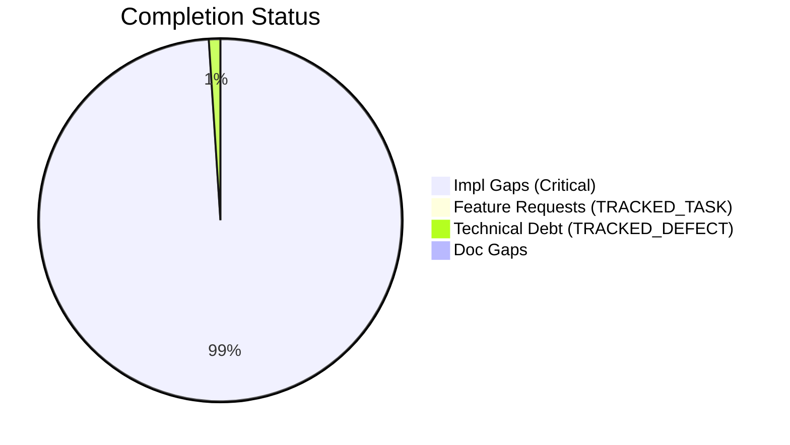
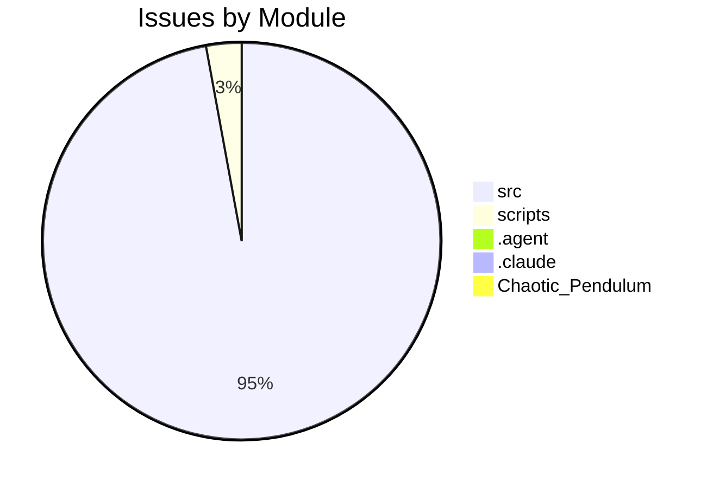

# Completist Report: 2026-04-02

## Executive Summary

- **Critical Gaps**: 5416
- **Feature Gaps (TRACKED_TASK)**: 5
- **Technical Debt**: 56
- **Documentation Gaps**: 1

## Visualization

### Status Overview

### Top Impacted Modules

## Critical Incomplete (Top 50)

| File                                                                                                                         | Line                                      | Type            | Impact | Coverage | Complexity |
| ---------------------------------------------------------------------------------------------------------------------------- | ----------------------------------------- | --------------- | ------ | -------- | ---------- | --- |
| `./src/shared/python/data_processing/processor.py:52`                                                                        | def **init**(self) ->                     | Stub            | 5      | 3        | 4          |
| `./src/shared/python/data_processing/processor.py:62`                                                                        | def dataframe(self) ->                    | Stub            | 5      | 3        | 4          |
| `./src/shared/python/data_processing/processor.py:69:    def dataframe(self, value`                                          | pd.DataFrame) ->                          | Stub            | 5      | 3        | 4          |
| `./src/shared/python/data_processing/processor.py:73`                                                                        | def info(self) ->                         | Stub            | 5      | 3        | 4          |
| `./src/shared/python/data_processing/processor.py:88`                                                                        | def history(self) ->                      | Stub            | 5      | 3        | 4          |
| `./src/shared/python/data_processing/processor.py:143:    def load_dataframe(self, df: pd.DataFrame, name`                   | str = "inline") ->                        | Stub            | 5      | 3        | 4          |
| `./src/shared/python/data_processing/processor.py:273:    def _validate_filter_contract(self, filter_type: str, window_size` | int) ->                                   | Stub            | 5      | 3        | 4          |
| `./src/shared/python/data_processing/processor.py:381:    def drop_columns(self, columns`                                    | list[str]) ->                             | Stub            | 5      | 3        | 4          |
| `./src/shared/python/data_processing/processor.py:393:    def rename_columns(self, mapping`                                  | dict[str, str]) ->                        | Stub            | 5      | 3        | 4          |
| `./src/shared/python/data_processing/processor.py:405:    def sort(self, by: str, ascending`                                 | bool = True) ->                           | Stub            | 5      | 3        | 4          |
| `./src/shared/python/data_processing/processor.py:417:    def dropna(self, columns`                                          | list[str]                                 | None = None) -> | Stub   | 5        | 3          | 4   |
| `./src/shared/python/data_processing/processor.py:430`                                                                       | def describe(self) -> dict[str,           | Stub            | 5      | 3        | 4          |
| `./src/shared/python/data_processing/processor.py:440:    def correlate(self, method`                                        | str = "pearson") ->                       | Stub            | 5      | 3        | 4          |
| `./src/shared/python/data_processing/processor.py:533:    def _detect_time_column(df`                                        | pd.DataFrame) ->                          | Stub            | 5      | 3        | 4          |
| `./src/shared/python/gui_launcher/launcher.py:104:def check_node_dependencies(web_path`                                      | Path) ->                                  | Stub            | 5      | 3        | 4          |
| `./src/shared/python/gui_launcher/launcher.py:164`                                                                           | def check_dependencies(self) ->           | Stub            | 5      | 3        | 4          |
| `./src/shared/python/gui_launcher/launcher.py:185`                                                                           | def launch(self) ->                       | Stub            | 5      | 3        | 4          |
| `./src/shared/python/gui_launcher/launcher.py:209`                                                                           | def \_launch_pyqt6(self) ->               | Stub            | 5      | 3        | 4          |
| `./src/shared/python/gui_launcher/launcher.py:225`                                                                           | def \_launch_react(self) ->               | Stub            | 5      | 3        | 4          |
| `./src/shared/python/gui_launcher/launcher.py:276`                                                                           | def \_launch_tkinter(self) ->             | Stub            | 5      | 3        | 4          |
| `./src/shared/python/gui_launcher/launcher.py:289`                                                                           | def \_launch_browser(self) ->             | Stub            | 5      | 3        | 4          |
| `./src/shared/python/gui_launcher/launcher.py:304:    def _print_missing_deps(self, status`                                  | DependencyStatus) ->                      | Stub            | 5      | 3        | 4          |
| `./src/shared/python/gui_launcher/launcher.py:314`                                                                           | def stop(self) ->                         | Stub            | 5      | 3        | 4          |
| `./src/shared/python/gui_launcher/launcher.py:342:def launch_pyqt6_app(config`                                               | LaunchConfig) ->                          | Stub            | 5      | 3        | 4          |
| `./src/shared/python/gui_launcher/launcher.py:430:def launch_from_gui_info(gui_info`                                         | dict[str, Any]) ->                        | Stub            | 5      | 3        | 4          |
| `./src/shared/python/gui_launcher/launcher.py:488:        npm_args`                                                          | Additional arguments to pass to ``npm run | Stub            | 5      | 3        | 4          |
| `./src/shared/python/gui_launcher/launcher.py:546`                                                                           | def \_open_browser() ->                   | Stub            | 5      | 3        | 4          |
| `./src/shared/python/gui_launcher/launcher.py:560:def launch_web_from_gui_info(gui_info: dict[str, Any], caller_file`        | str) ->                                   | Stub            | 5      | 3        | 4          |
| `./src/shared/python/gui_launcher/launcher.py:594:def launch_tool_by_name(tool_name`                                         | str) ->                                   | Stub            | 5      | 3        | 4          |
| `./src/shared/python/gui_launcher/launcher.py:627:def make_pyqt6_launcher(gui_info_module`                                   | str) ->                                   | Stub            | 5      | 3        | 4          |
| `./src/shared/python/gui_launcher/registry.py:39`                                                                            | def **init**(self) ->                     | Stub            | 5      | 3        | 4          |
| `./src/shared/python/gui_launcher/registry.py:44`                                                                            | def instance(cls) ->                      | Stub            | 5      | 3        | 4          |
| `./src/shared/python/gui_launcher/registry.py:101:    def unregister(self, tool_name`                                        | str) ->                                   | Stub            | 5      | 3        | 4          |
| `./src/shared/python/gui_launcher/registry.py:120:    def get(self, tool_name`                                               | str) -> GUIRegistration                   |                 | Stub   | 5        | 3          | 4   |
| `./src/shared/python/gui_launcher/registry.py:163:    def list_tools(self, category`                                         | str                                       | None = None) -> | Stub   | 5        | 3          | 4   |
| `./src/shared/python/gui_launcher/registry.py:177`                                                                           | def list_categories(self) ->              | Stub            | 5      | 3        | 4          |
| `./src/shared/python/gui_launcher/registry.py:186:    def get_available_gui_types(self, tool_name`                           | str) ->                                   | Stub            | 5      | 3        | 4          |
| `./src/shared/python/gui_launcher/registry.py:202`                                                                           | def clear(self) ->                        | Stub            | 5      | 3        | 4          |
| `./src/shared/python/gui_launcher/registry.py:207`                                                                           | def get_registry() ->                     | Stub            | 5      | 3        | 4          |
| `./src/shared/python/gui_launcher/registry.py:244:def _gui_info_to_registration(gui_info`                                    | dict[str, Any]) ->                        | Stub            | 5      | 3        | 4          |
| `./src/shared/python/gui_launcher/registry.py:301:def auto_discover_guis(search_paths`                                       | list[Path]) ->                            | Stub            | 5      | 3        | 4          |
| `./src/shared/python/model_generation/converters/mjcf_converter.py:164:    def _build_mjcf(self, model`                      | ParsedModel) ->                           | Stub            | 5      | 3        | 4          |
| `./src/shared/python/model_generation/converters/mjcf_converter.py:388:    def _parse_mjcf(self, root`                       | ET.Element) ->                            | Stub            | 5      | 3        | 4          |
| `./src/shared/python/model_generation/converters/mjcf_converter.py:431:    def _parse_body_inertial(body_elem`               | ET.Element) ->                            | Stub            | 5      | 3        | 4          |
| `./src/shared/python/model_generation/converters/mjcf_converter.py:589:    def _parse_mjcf_geom(self, geom_elem`             | ET.Element) -> tuple[Geometry             | None,           | Stub   | 5        | 3          | 4   |
| `./src/shared/python/model_generation/converters/urdf_parser.py:61:    def get_link(self, name`                              | str) -> Link                              |                 | Stub   | 5        | 3          | 4   |
| `./src/shared/python/model_generation/converters/urdf_parser.py:70:    def get_joint(self, name`                             | str) -> Joint                             |                 | Stub   | 5        | 3          | 4   |
| `./src/shared/python/model_generation/converters/urdf_parser.py:79`                                                          | def get_root_link(self) -> Link           |                 | Stub   | 5        | 3          | 4   |
| `./src/shared/python/model_generation/converters/urdf_parser.py:87:    def get_children(self, link_name`                     | str) ->                                   | Stub            | 5      | 3        | 4          |
| `./src/shared/python/model_generation/converters/urdf_parser.py:91:    def get_parent(self, link_name`                       | str) -> str                               |                 | Stub   | 5        | 3          | 4   |

## Feature Gap Matrix

| Module                                           | Feature Gap                                                                                   | Type         |
| ------------------------------------------------ | --------------------------------------------------------------------------------------------- | ------------ |
| `./drafts/Jules-Code-Quality-Reviewer.yml`       | 5. **Placeholders**: Identify placeholder code (TODO, FIXME, NotImplemented, pass statements) | TRACKED_TASK |
| `./SPEC.md`                                      | 2. Fill in every section — leave nothing as "[TODO]"                                          | TRACKED_TASK |
| `./scripts/generate_comprehensive_assessment.py` | stats["todos"] += content.count("TODO")                                                       | TRACKED_TASK |
| `./scripts/generate_comprehensive_assessment.py` | grades["O"] = (max(0, score_o), f"Technical Debt (TODO+FIXME): {debt}")                       | TRACKED_TASK |
| `./scripts/generate_fresh_assessments.py`        | stats["todos"] += content.count("TODO")                                                       | TRACKED_TASK |

## Technical Debt Register

| File                                             | Line | Issue                                                                      | Type             |
| ------------------------------------------------ | ---- | -------------------------------------------------------------------------- | ---------------- | ----- | ------ | --------------------- | ------------------------ | --- |
| `./src/tools/matlab_quality_utils.py`            | 322  | """Check for TRACKED_TASK, TRACKED_DEFECT, HACK, XXX, and placeholders.""" | XXX              |
| `./src/tools/matlab_quality_utils.py`            | 331  | (r"\bHACK\b", "HACK comment found"),                                       | HACK             |
| `./src/tools/matlab_quality_utils.py`            | 332  | (r"\bXXX\b", "XXX comment found"),                                         | XXX              |
| `./src/tools/matlab_utilities/README.md`         | 261  | - TRACKED_TASK, TRACKED_DEFECT, HACK, XXX placeholders                     | XXX              |
| `./scripts/generate_comprehensive_assessment.py` | 143  | stats["fixmes"] += content.count("FIXME")                                  | FIXME            |
| `./scripts/generate_fresh_assessments.py`        | 121  | stats["fixmes"] += content.count("FIXME")                                  | FIXME            |
| `./.agent/workflows/issues-5-combined.md`        | 42   | Closes #XXX, closes #XXX, closes #XXX, closes #XXX, closes #XXX            | XXX              |
| `./.agent/workflows/lint.md`                     | 34   | grep -rn "TRACKED_TASK\\                                                   | TRACKED_DEFECT\\ | XXX\\ | HACK\\ | NotImplementedError\\ | pass$" --include="\*.py" | XXX |
| `./.agent/skills/update-issues/SKILL.md`         | 143  | \| #XXX \| Title \| High \| assessment.md \|                               | XXX              |
| `./.agent/skills/update-issues/SKILL.md`         | 149  | \| #XXX \| Title \| Fixed in commit abc123 \|                              | XXX              |
| `./.agent/skills/update-issues/SKILL.md`         | 155  | \| Description \| #XXX \|                                                  | XXX              |
| `./.agent/skills/issues-10-sequential/SKILL.md`  | 105  | \| 1 \| #XXX - Title \| #YYY \| Merged \|                                  | XXX              |
| `./.agent/skills/issues-10-sequential/SKILL.md`  | 106  | \| 2 \| #XXX - Title \| #YYY \| Merged \|                                  | XXX              |
| `./.agent/skills/lint/SKILL.md`                  | 33   | - Search for `TRACKED_TASK`, `TRACKED_DEFECT`, `XXX`, `HACK` comments      | XXX              |
| `./.agent/skills/lint/SKILL.md`                  | 38   | grep -rn "TRACKED_TASK\\                                                   | TRACKED_DEFECT\\ | XXX\\ | HACK\\ | NotImplementedError\\ | pass$" --include="\*.py" | XXX |
| `./.agent/skills/issues-5-combined/SKILL.md`     | 67   | - #XXX: <brief description>                                                | XXX              |
| `./.agent/skills/issues-5-combined/SKILL.md`     | 68   | - #XXX: <brief description>                                                | XXX              |
| `./.agent/skills/issues-5-combined/SKILL.md`     | 69   | - #XXX: <brief description>                                                | XXX              |
| `./.agent/skills/issues-5-combined/SKILL.md`     | 70   | - #XXX: <brief description>                                                | XXX              |
| `./.agent/skills/issues-5-combined/SKILL.md`     | 71   | - #XXX: <brief description>                                                | XXX              |
| `./.agent/skills/issues-5-combined/SKILL.md`     | 73   | Closes #XXX, closes #XXX, closes #XXX, closes #XXX, closes #XXX            | XXX              |
| `./.agent/skills/issues-5-combined/SKILL.md`     | 88   | \| #XXX \| Title \| Brief fix description \|                               | XXX              |
| `./.agent/skills/issues-5-combined/SKILL.md`     | 89   | \| #XXX \| Title \| Brief fix description \|                               | XXX              |
| `./.agent/skills/issues-5-combined/SKILL.md`     | 90   | \| #XXX \| Title \| Brief fix description \|                               | XXX              |
| `./.agent/skills/issues-5-combined/SKILL.md`     | 91   | \| #XXX \| Title \| Brief fix description \|                               | XXX              |
| `./.agent/skills/issues-5-combined/SKILL.md`     | 92   | \| #XXX \| Title \| Brief fix description \|                               | XXX              |
| `./.agent/skills/issues-5-combined/SKILL.md`     | 99   | Closes #XXX, closes #XXX, closes #XXX, closes #XXX, closes #XXX"           | XXX              |
| `./.agent/skills/issues-5-combined/SKILL.md`     | 145  | \| #XXX \| Title \| Fixed \|                                               | XXX              |
| `./.agent/skills/issues-5-combined/SKILL.md`     | 146  | \| #XXX \| Title \| Fixed \|                                               | XXX              |
| `./.agent/skills/issues-5-combined/SKILL.md`     | 147  | \| #XXX \| Title \| Fixed \|                                               | XXX              |
| `./.agent/skills/issues-5-combined/SKILL.md`     | 148  | \| #XXX \| Title \| Fixed \|                                               | XXX              |
| `./.agent/skills/issues-5-combined/SKILL.md`     | 149  | \| #XXX \| Title \| Fixed \|                                               | XXX              |
| `./.claude/skills/update-issues/SKILL.md`        | 143  | \| #XXX \| Title \| High \| assessment.md \|                               | XXX              |
| `./.claude/skills/update-issues/SKILL.md`        | 149  | \| #XXX \| Title \| Fixed in commit abc123 \|                              | XXX              |
| `./.claude/skills/update-issues/SKILL.md`        | 155  | \| Description \| #XXX \|                                                  | XXX              |
| `./.claude/skills/issues-10-sequential/SKILL.md` | 105  | \| 1 \| #XXX - Title \| #YYY \| Merged \|                                  | XXX              |
| `./.claude/skills/issues-10-sequential/SKILL.md` | 106  | \| 2 \| #XXX - Title \| #YYY \| Merged \|                                  | XXX              |
| `./.claude/skills/lint/SKILL.md`                 | 33   | - Search for `TRACKED_TASK`, `TRACKED_DEFECT`, `XXX`, `HACK` comments      | XXX              |
| `./.claude/skills/lint/SKILL.md`                 | 38   | grep -rn "TRACKED_TASK\\                                                   | TRACKED_DEFECT\\ | XXX\\ | HACK\\ | NotImplementedError\\ | pass$" --include="\*.py" | XXX |
| `./.claude/skills/issues-5-combined/SKILL.md`    | 67   | - #XXX: <brief description>                                                | XXX              |
| `./.claude/skills/issues-5-combined/SKILL.md`    | 68   | - #XXX: <brief description>                                                | XXX              |
| `./.claude/skills/issues-5-combined/SKILL.md`    | 69   | - #XXX: <brief description>                                                | XXX              |
| `./.claude/skills/issues-5-combined/SKILL.md`    | 70   | - #XXX: <brief description>                                                | XXX              |
| `./.claude/skills/issues-5-combined/SKILL.md`    | 71   | - #XXX: <brief description>                                                | XXX              |
| `./.claude/skills/issues-5-combined/SKILL.md`    | 73   | Closes #XXX, closes #XXX, closes #XXX, closes #XXX, closes #XXX            | XXX              |
| `./.claude/skills/issues-5-combined/SKILL.md`    | 88   | \| #XXX \| Title \| Brief fix description \|                               | XXX              |
| `./.claude/skills/issues-5-combined/SKILL.md`    | 89   | \| #XXX \| Title \| Brief fix description \|                               | XXX              |
| `./.claude/skills/issues-5-combined/SKILL.md`    | 90   | \| #XXX \| Title \| Brief fix description \|                               | XXX              |
| `./.claude/skills/issues-5-combined/SKILL.md`    | 91   | \| #XXX \| Title \| Brief fix description \|                               | XXX              |
| `./.claude/skills/issues-5-combined/SKILL.md`    | 92   | \| #XXX \| Title \| Brief fix description \|                               | XXX              |
| `./.claude/skills/issues-5-combined/SKILL.md`    | 99   | Closes #XXX, closes #XXX, closes #XXX, closes #XXX, closes #XXX"           | XXX              |
| `./.claude/skills/issues-5-combined/SKILL.md`    | 145  | \| #XXX \| Title \| Fixed \|                                               | XXX              |
| `./.claude/skills/issues-5-combined/SKILL.md`    | 146  | \| #XXX \| Title \| Fixed \|                                               | XXX              |
| `./.claude/skills/issues-5-combined/SKILL.md`    | 147  | \| #XXX \| Title \| Fixed \|                                               | XXX              |
| `./.claude/skills/issues-5-combined/SKILL.md`    | 148  | \| #XXX \| Title \| Fixed \|                                               | XXX              |
| `./.claude/skills/issues-5-combined/SKILL.md`    | 149  | \| #XXX \| Title \| Fixed \|                                               | XXX              |

## Recommended Implementation Order

Prioritized by Impact (High) and Complexity (Low).
| Priority | File | Issue | Metrics (I/C/C) |
|---|---|---|---|
| 1 | `./src/shared/python/data_processing/processor.py:52` | None: | 5/3/4 |
| 2 | `./src/shared/python/data_processing/processor.py:62` | pd.DataFrame: | 5/3/4 |
| 3 | `./src/shared/python/data_processing/processor.py:69:    def dataframe(self, value` | None: | 5/3/4 |
| 4 | `./src/shared/python/data_processing/processor.py:73` | DatasetInfo: | 5/3/4 |
| 5 | `./src/shared/python/data_processing/processor.py:88` | list[str]: | 5/3/4 |
| 6 | `./src/shared/python/data_processing/processor.py:143:    def load_dataframe(self, df: pd.DataFrame, name` | DataProcessor: | 5/3/4 |
| 7 | `./src/shared/python/data_processing/processor.py:273:    def _validate_filter_contract(self, filter_type: str, window_size` | None: | 5/3/4 |
| 8 | `./src/shared/python/data_processing/processor.py:381:    def drop_columns(self, columns` | DataProcessor: | 5/3/4 |
| 9 | `./src/shared/python/data_processing/processor.py:393:    def rename_columns(self, mapping` | DataProcessor: | 5/3/4 |
| 10 | `./src/shared/python/data_processing/processor.py:405:    def sort(self, by: str, ascending` | DataProcessor: | 5/3/4 |
| 11 | `./src/shared/python/data_processing/processor.py:417:    def dropna(self, columns` | DataProcessor: | 5/3/4 |
| 12 | `./src/shared/python/data_processing/processor.py:430` | Any]: | 5/3/4 |
| 13 | `./src/shared/python/data_processing/processor.py:440:    def correlate(self, method` | pd.DataFrame: | 5/3/4 |
| 14 | `./src/shared/python/data_processing/processor.py:533:    def _detect_time_column(df` | str: | 5/3/4 |
| 15 | `./src/shared/python/gui_launcher/launcher.py:104:def check_node_dependencies(web_path` | DependencyStatus: | 5/3/4 |
| 16 | `./src/shared/python/gui_launcher/launcher.py:164` | DependencyStatus: | 5/3/4 |
| 17 | `./src/shared/python/gui_launcher/launcher.py:185` | int: | 5/3/4 |
| 18 | `./src/shared/python/gui_launcher/launcher.py:209` | int: | 5/3/4 |
| 19 | `./src/shared/python/gui_launcher/launcher.py:225` | int: | 5/3/4 |
| 20 | `./src/shared/python/gui_launcher/launcher.py:276` | int: | 5/3/4 |

## Issues Created

- Created `docs/assessments/issues/Issue_234704_Incomplete_Stub_in_processor_py_52_____def___init___self.md`
- Created `docs/assessments/issues/Issue_234705_Incomplete_Stub_in_processor_py_62_____def_dataframe_self.md`
- Created `docs/assessments/issues/Issue_234706_Incomplete_Stub_in_processor_py_69_____def_dataframe_self__value__pd_DataFrame.md`
- Created `docs/assessments/issues/Issue_234707_Incomplete_Stub_in_processor_py_73_____def_info_self.md`
- Created `docs/assessments/issues/Issue_234708_Incomplete_Stub_in_processor_py_88_____def_history_self.md`
- Created `docs/assessments/issues/Issue_234709_Incomplete_Stub_in_processor_py_143_____def_load_dataframe_self__df__pd_DataFrame__name__str____inline.md`
- Created `docs/assessments/issues/Issue_234710_Incomplete_Stub_in_processor_py_273_____def__validate_filter_contract_self__filter_type__str__window_size__int.md`
- Created `docs/assessments/issues/Issue_234711_Incomplete_Stub_in_processor_py_381_____def_drop_columns_self__columns__list_str.md`
- Created `docs/assessments/issues/Issue_234712_Incomplete_Stub_in_processor_py_393_____def_rename_columns_self__mapping__dict_str__str.md`
- Created `docs/assessments/issues/Issue_234713_Incomplete_Stub_in_processor_py_405_____def_sort_self__by__str__ascending__bool___True.md`
