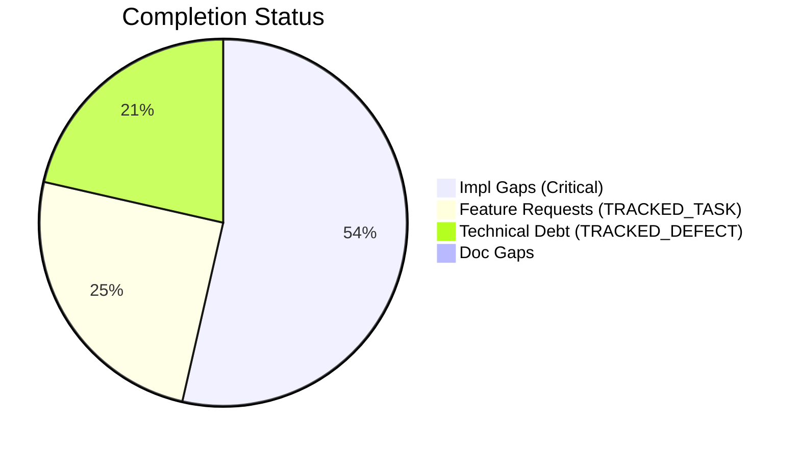
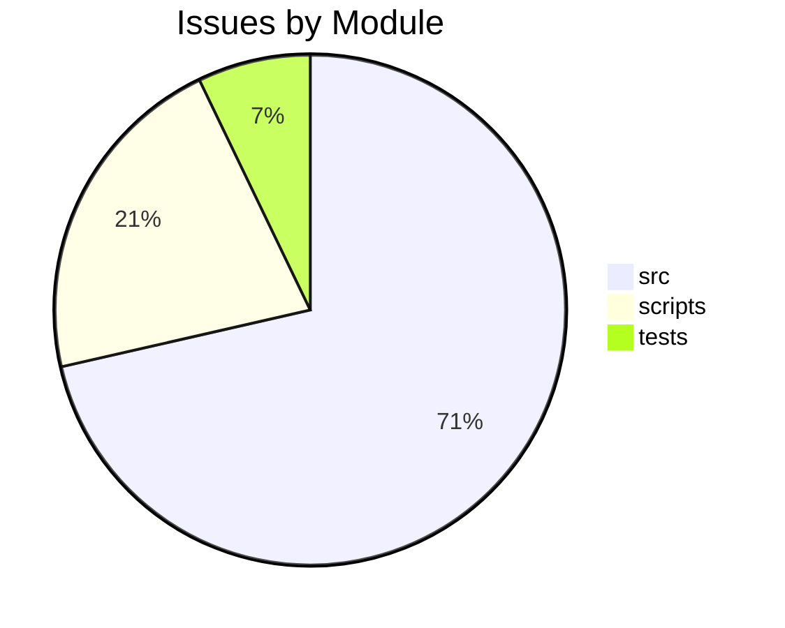

# Completist Report: 2026-05-14

## Executive Summary
- **Critical Gaps**: 15
- **Feature Gaps (TRACKED_TASK)**: 7
- **Technical Debt**: 6
- **Documentation Gaps**: 0

## Visualization
### Status Overview

### Top Impacted Modules

## Critical Incomplete (Top 50)
| File | Line | Type | Impact | Coverage | Complexity |
|---|---|---|---|---|---|
| `./src/shared/python/model_generation/explorer/model_explorer.py` | 59 | NotImplementedError | 5 | 3 | 4 |
| `./src/tools/quality_utils.py` | 39 | NotImplementedError | 3 | 2 | 4 |
| `./scripts/legacy_tools/code_quality_check.py` | 37 | NotImplementedError | 3 | 2 | 4 |
| `./src/pendulum_simulator/src/double_pendulum_golf/gui/simulation_panel/_export_mixin.py` | 318 | NotImplementedError | 1 | 2 | 4 |
| `./src/pendulum_simulator/src/double_pendulum_golf/gui/simulation_panel/_lifecycle_mixin.py` | 311 | NotImplementedError | 1 | 2 | 4 |
| `./src/pendulum_simulator/src/double_pendulum_golf/gui/simulation_panel/_lifecycle_mixin.py` | 317 | NotImplementedError | 1 | 2 | 4 |
| `./src/pendulum_simulator/src/double_pendulum_golf/gui/simulation_panel/_lifecycle_mixin.py` | 320 | NotImplementedError | 1 | 2 | 4 |
| `./src/pendulum_simulator/pendulum-core/python/physics_native.py` | 8 | NotImplementedError | 1 | 2 | 4 |
| `./src/pendulum_simulator/pendulum-core/python/physics_native.py` | 20 | NotImplementedError | 1 | 2 | 4 |
| `./src/pendulum_simulator/pendulum-core/python/physics_native.py` | 22 | NotImplementedError | 1 | 2 | 4 |
| `./src/pendulum_simulator/pendulum-core/python/physics_native.py` | 436 | NotImplementedError | 1 | 2 | 4 |
| `./src/pendulum_simulator/pendulum-core/python/physics_native.py` | 459 | NotImplementedError | 1 | 2 | 4 |
| `./src/pendulum_simulator/pendulum-core/python/physics_native.py` | 482 | NotImplementedError | 1 | 2 | 4 |
| `./src/pendulum_simulator/pendulum-core/python/physics_native.py` | 501 | NotImplementedError | 1 | 2 | 4 |
| `./src/pendulum_simulator/pendulum-core/python/physics_native.py` | 520 | NotImplementedError | 1 | 2 | 4 |

## Feature Gap Matrix
| Module | Feature Gap | Type |
|---|---|---|
| `./src/data_processing/data_processor/python/data_processor/core/script_generator.py` | # The "TODO" below is intentional generated-script content for the user | TRACKED_TASK |
| `./src/shared/python/ai/auth/authentication.py` | # TODO(#5227): Implement OAuth token exchange | TRACKED_TASK |
| `./src/shared/python/ai/auth/authentication.py` | # TODO(#5227): Exchange refresh token for new access token | TRACKED_TASK |
| `./scripts/generate_comprehensive_assessment.py` | stats["todos"] += content.count("TODO") | TRACKED_TASK |
| `./scripts/generate_comprehensive_assessment.py` | grades["O"] = (max(0, score_o), f"Technical Debt (TODO+FIXME): {debt}") | TRACKED_TASK |
| `./scripts/generate_fresh_assessments.py` | stats["todos"] += content.count("TODO") | TRACKED_TASK |
| `./tests/tools/test_matlab_quality_utils.py` | Path("script.m"), "% TODO: fix this", 5, issues | TRACKED_TASK |

## Technical Debt Register
| File | Line | Issue | Type |
|---|---|---|---|
| `./src/tools/matlab_quality_utils.py` | 324 | """Check for TRACKED_TASK, TRACKED_DEFECT, HACK, XXX, and placeholders.""" | XXX |
| `./src/tools/matlab_quality_utils.py` | 333 | (r"\bHACK\b", "HACK comment found"), | HACK |
| `./src/tools/matlab_quality_utils.py` | 334 | (r"\bXXX\b", "XXX comment found"), | XXX |
| `./scripts/generate_comprehensive_assessment.py` | 143 | stats["fixmes"] += content.count("FIXME") | FIXME |
| `./scripts/generate_fresh_assessments.py` | 121 | stats["fixmes"] += content.count("FIXME") | FIXME |
| `./tests/tools/test_matlab_quality_utils.py` | 95 | Path("script.m"), "% FIXME: broken", 3, issues | FIXME |

## Recommended Implementation Order
Prioritized by Impact (High) and Complexity (Low).
| Priority | File | Issue | Metrics (I/C/C) |
|---|---|---|---|
| 1 | `./src/shared/python/ai/auth/authentication.py` | # TODO(#5227): Implement OAuth token exchange | 5/3/3 |
| 2 | `./src/shared/python/ai/auth/authentication.py` | # TODO(#5227): Exchange refresh token for new access token | 5/3/3 |
| 3 | `./src/shared/python/model_generation/explorer/model_explorer.py` | class ModelFileSelectionRequiredError(NotImplementedError): | 5/3/4 |
| 4 | `./tests/tools/test_matlab_quality_utils.py` | Path("script.m"), "% TODO: fix this", 5, issues | 3/5/3 |
| 5 | `./src/tools/quality_utils.py` | (re.compile(r"NotImplementedError"), "NotImplementedError placeholder"), | 3/2/4 |
| 6 | `./scripts/legacy_tools/code_quality_check.py` | (re.compile(r"NotImplementedError"), "NotImplementedError placeholder"), | 3/2/4 |
| 7 | `./src/data_processing/data_processor/python/data_processor/core/script_generator.py` | # The "TODO" below is intentional generated-script content for the user | 1/2/3 |
| 8 | `./scripts/generate_comprehensive_assessment.py` | stats["todos"] += content.count("TODO") | 1/2/3 |
| 9 | `./scripts/generate_comprehensive_assessment.py` | grades["O"] = (max(0, score_o), f"Technical Debt (TODO+FIXME): {debt}") | 1/2/3 |
| 10 | `./scripts/generate_fresh_assessments.py` | stats["todos"] += content.count("TODO") | 1/2/3 |
| 11 | `./src/pendulum_simulator/src/double_pendulum_golf/gui/simulation_panel/_export_mixin.py` | raise NotImplementedError | 1/2/4 |
| 12 | `./src/pendulum_simulator/src/double_pendulum_golf/gui/simulation_panel/_lifecycle_mixin.py` | raise NotImplementedError | 1/2/4 |
| 13 | `./src/pendulum_simulator/src/double_pendulum_golf/gui/simulation_panel/_lifecycle_mixin.py` | Raises NotImplementedError in mixin context where QWidget is not yet | 1/2/4 |
| 14 | `./src/pendulum_simulator/src/double_pendulum_golf/gui/simulation_panel/_lifecycle_mixin.py` | raise NotImplementedError | 1/2/4 |
| 15 | `./src/pendulum_simulator/pendulum-core/python/physics_native.py` | - ``Golfer``: **no NumPy fallback** — raises ``NotImplementedError`` on all meth | 1/2/4 |
| 16 | `./src/pendulum_simulator/pendulum-core/python/physics_native.py` | # Golfer requires the native library — raises NotImplementedError otherwise. | 1/2/4 |
| 17 | `./src/pendulum_simulator/pendulum-core/python/physics_native.py` | M = golfer.mass_matrix(q)  # raises NotImplementedError if no native lib | 1/2/4 |
| 18 | `./src/pendulum_simulator/pendulum-core/python/physics_native.py` | raise NotImplementedError( | 1/2/4 |
| 19 | `./src/pendulum_simulator/pendulum-core/python/physics_native.py` | raise NotImplementedError( | 1/2/4 |
| 20 | `./src/pendulum_simulator/pendulum-core/python/physics_native.py` | raise NotImplementedError( | 1/2/4 |

## Issues Created
- Created `docs/assessments/issues/Issue_234714_Incomplete_NotImplementedError_in_model_explorer_py_59.md`