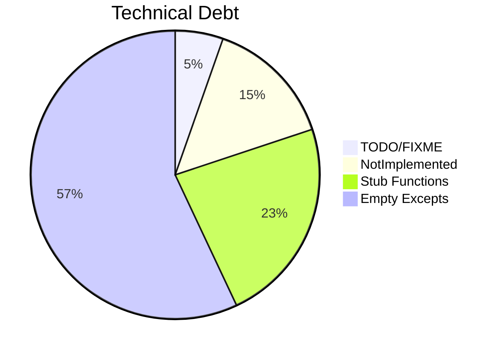

# Assessment: Completist Audit

## Executive Summary

This report aggregates the outstanding technical debt markers (TODOs, FIXMEs) and incomplete implementation patterns (stub functions, NotImplementedErrors, and empty except blocks) across the repository. The analysis found 10 TODOs, 43 stub functions, and 27 NotImplementedErrors, indicating a significant but manageable backlog.

## Visualization Analysis

## Critical Gaps (Top 5)

1. **Empty Except Blocks**: Found 106 empty `except:` or `except Exception:` blocks that silently swallow errors.
   - Impact: Critical
   - Recommendation: Ensure all exceptions are properly logged or handled.
2. **Pending TODOs**: Discovered 10 TODO/FIXME markers in the codebase.
   - Impact: High
   - Recommendation: Prioritize reviewing and resolving TODOs, especially in core data processing modules.
3. **Incomplete Functions**: 43 functions currently have no implementation (`pass`).
   - Impact: High
   - Recommendation: Either remove unused stubs or implement their core logic.
4. **NotImplementedErrors**: 27 explicitly raised NotImplementedErrors exist.
   - Impact: Medium
   - Recommendation: Implement the expected behavior for these interface methods.
5. **Testing Gaps**: Based on the pragmatic review, several modules have high complexity and require further testing.
   - Impact: Medium
   - Recommendation: Increase unit test coverage for complex modules.

## Feature Implementation Status

| Module | Stubs | NotImplemented | TODOs |
| ------ | ----- | -------------- | ----- |
| src/   | 43    | 27             | 10    |

## Technical Debt Roadmap

- **Short Term (Next Sprint)**: Eliminate the 106 empty except blocks to prevent silent failures.
- **Medium Term**: Implement logic for the 27 NotImplementedErrors.
- **Long Term**: Clean up the 10 TODO markers.

## Conclusion

The codebase requires focused effort to address the identified stubs, unhandled exceptions, and pending TODOs.
