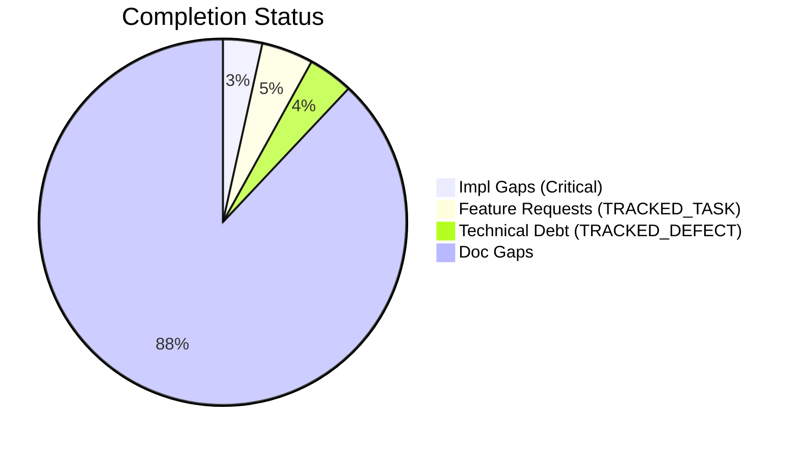
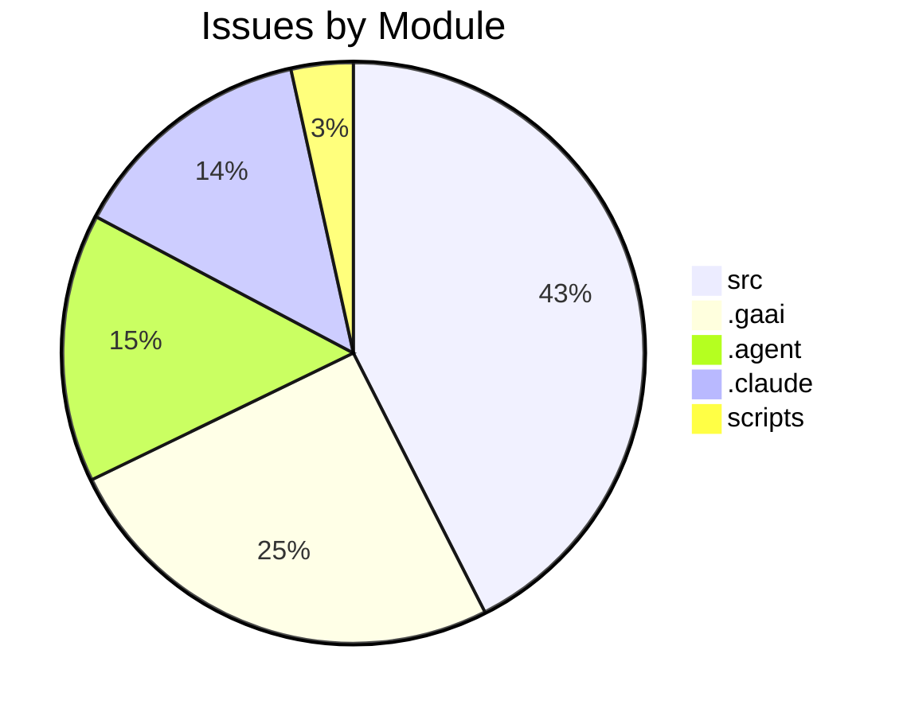

# Completist Report: 2026-06-14

## Executive Summary
- **Critical Gaps**: 53
- **Feature Gaps (TRACKED_TASK)**: 70
- **Technical Debt**: 61
- **Documentation Gaps**: 1351

## Visualization
### Status Overview

### Top Impacted Modules

## Critical Incomplete (Top 50)
| File | Line | Type | Impact | Coverage | Complexity |
|---|---|---|---|---|---|
| `./src/shared/python/model_generation/explorer/model_explorer.py` | 61 | NotImplementedError | 5 | 3 | 4 |
| `./src/shared/python/chat/router_factory.py` | 316 | NotImplementedError | 5 | 3 | 4 |
| `./src/shared/python/chat/router_factory.py` | 351 | NotImplementedError | 5 | 3 | 4 |
| `./src/shared/python/chat/service_base.py` | 409 | NotImplementedError | 5 | 3 | 4 |
| `./src/shared/python/chat/service_base.py` | 418 | NotImplementedError | 5 | 3 | 4 |
| `./src/shared/python/chat/service_base.py` | 423 | NotImplementedError | 5 | 3 | 4 |
| `./src/shared/python/chat/service_base.py` | 435 | NotImplementedError | 5 | 3 | 4 |
| `./src/shared/python/ai/adapters/gemini_adapter.py` | 28 | NotImplementedError | 5 | 3 | 4 |
| `./src/shared/python/ai/adapters/gemini_adapter.py` | 92 | NotImplementedError | 5 | 3 | 4 |
| `./src/shared/python/ai/adapters/gemini_adapter.py` | 169 | NotImplementedError | 5 | 3 | 4 |
| `./src/shared/python/ai/adapters/gemini_adapter.py` | 190 | NotImplementedError | 5 | 3 | 4 |
| `./src/shared/python/ai/adapters/gemini_adapter.py` | 218 | NotImplementedError | 5 | 3 | 4 |
| `./src/shared/python/ai/adapters/base.py` | 201 | NotImplementedError | 5 | 3 | 4 |
| `./src/shared/python/ai/integrations/obsidian.py` | 4 | NotImplementedError | 5 | 3 | 4 |
| `./src/shared/python/ai/gui/_provider_config_widgets.py` | 66 | NotImplementedError | 5 | 3 | 4 |
| `./src/shared/python/ai/auth/authentication.py` | 15 | NotImplementedError | 5 | 3 | 4 |
| `./src/shared/python/ai/auth/authentication.py` | 324 | NotImplementedError | 5 | 3 | 4 |
| `./src/shared/python/ai/auth/authentication.py` | 327 | NotImplementedError | 5 | 3 | 4 |
| `./src/shared/python/ai/auth/authentication.py` | 338 | NotImplementedError | 5 | 3 | 4 |
| `./src/shared/python/ai/auth/authentication.py` | 352 | NotImplementedError | 5 | 3 | 4 |
| `./src/shared/python/ai/auth/authentication.py` | 355 | NotImplementedError | 5 | 3 | 4 |
| `./src/shared/python/ai/auth/authentication.py` | 366 | NotImplementedError | 5 | 3 | 4 |
| `./src/shared/python/ai/auth/authentication.py` | 395 | NotImplementedError | 5 | 3 | 4 |
| `./src/shared/python/data_processor_io/rust_engine.py` | 18 | NotImplementedError | 5 | 3 | 4 |
| `./src/shared/python/data_processor_io/rust_engine.py` | 265 | NotImplementedError | 5 | 3 | 4 |
| `./src/shared/python/data_processor_io/rust_engine.py` | 340 | NotImplementedError | 5 | 3 | 4 |
| `./src/shared/python/data_processor_io/rust_engine.py` | 347 | NotImplementedError | 5 | 3 | 4 |
| `./src/shared/python/data_processor_io/rust_engine.py` | 413 | NotImplementedError | 5 | 3 | 4 |
| `./src/shared/python/sidekick/ui/tools_sidebar/tab_settings_panel.py` | 45 | NotImplementedError | 5 | 3 | 4 |
| `./src/shared/python/sidekick/ui/tools_sidebar/tab_settings_panel.py` | 48 | NotImplementedError | 5 | 3 | 4 |
| `./src/shared/python/sidekick/ui/tools_sidebar/tab_settings_panel.py` | 51 | NotImplementedError | 5 | 3 | 4 |
| `./src/shared/python/sidekick/ui/tools_sidebar/tab_settings_panel.py` | 56 | NotImplementedError | 5 | 3 | 4 |
| `./src/shared/python/sidekick/ui/tools_sidebar/tab_popout.py` | 31 | NotImplementedError | 5 | 3 | 4 |
| `./src/shared/python/sidekick/ui/tools_sidebar/tab_popout.py` | 34 | NotImplementedError | 5 | 3 | 4 |
| `./src/shared/python/sidekick/ui/tools_sidebar/tab_popout.py` | 37 | NotImplementedError | 5 | 3 | 4 |
| `./src/shared/python/sidekick/ui/tools_sidebar/tab_popout.py` | 40 | NotImplementedError | 5 | 3 | 4 |
| `./src/shared/python/sidekick/ui/tools_sidebar/tab_popout.py` | 43 | NotImplementedError | 5 | 3 | 4 |
| `./src/shared/python/sidekick/ui/tools_sidebar/tab_popout.py` | 46 | NotImplementedError | 5 | 3 | 4 |
| `./src/shared/python/sidekick/ui/tools_sidebar/tab_display_names.py` | 78 | NotImplementedError | 5 | 3 | 4 |
| `./src/shared/python/sidekick/ui/tools_sidebar/state_profile_actions.py` | 21 | NotImplementedError | 5 | 3 | 4 |
| `./src/shared/python/sidekick/ui/tools_sidebar/state_profile_actions.py` | 24 | NotImplementedError | 5 | 3 | 4 |
| `./src/tools/quality_utils.py` | 39 | NotImplementedError | 3 | 2 | 4 |
| `./scripts/legacy_tools/code_quality_check.py` | 37 | NotImplementedError | 3 | 2 | 4 |
| `./src/pendulum_simulator/src/double_pendulum_golf/gui/simulation_panel/_export_mixin.py` | 318 | NotImplementedError | 1 | 2 | 4 |
| `./src/pendulum_simulator/src/double_pendulum_golf/gui/simulation_panel/_lifecycle_mixin.py` | 306 | NotImplementedError | 1 | 2 | 4 |
| `./src/pendulum_simulator/src/double_pendulum_golf/gui/simulation_panel/_lifecycle_mixin.py` | 312 | NotImplementedError | 1 | 2 | 4 |
| `./src/pendulum_simulator/src/double_pendulum_golf/gui/simulation_panel/_lifecycle_mixin.py` | 315 | NotImplementedError | 1 | 2 | 4 |
| `./src/pendulum_simulator/pendulum-core/python/physics_native.py` | 453 | NotImplementedError | 1 | 2 | 4 |
| `./src/pendulum_simulator/pendulum-core/python/physics_native.py` | 474 | NotImplementedError | 1 | 2 | 4 |
| `./src/pendulum_simulator/pendulum-core/python/physics_native.py` | 497 | NotImplementedError | 1 | 2 | 4 |

## Feature Gap Matrix
| Module | Feature Gap | Type |
|---|---|---|
| `./assessments/ASSESSMENT-SUMMARY.md` | - TODO audit and linking | TRACKED_TASK |
| `./assessments/2026-04-29-ASSESSMENT-REPORT.md` | - **F — Code Craftsmanship:** 3,775 TODO/FIXME markers; high technical debt density | TRACKED_TASK |
| `./assessments/2026-04-29-ASSESSMENT-REPORT.md` | - **3,775 TODO/FIXME markers** in src/ | TRACKED_TASK |
| `./assessments/2026-04-29-ASSESSMENT-REPORT.md` | - **5,419 TODO/FIXME markers** (5x normal baseline) | TRACKED_TASK |
| `./assessments/2026-04-29-ASSESSMENT-REPORT.md` | \| F         \| TODO audit & linking       \| 3 days \| Tech lead    \| Issue #2360 (draft) \| | TRACKED_TASK |
| `./src/data_processing/data_processor/python/data_processor/core/script_generator.py` | # The "TODO" below is intentional generated-script content for the user | TRACKED_TASK |
| `./src/web_applications/RESPONSIVE_DESIGN_DECISIONS.md` | 2. **[TODO] Touch Target Sizing** | TRACKED_TASK |
| `./src/web_applications/RESPONSIVE_DESIGN_DECISIONS.md` | 3. **[TODO] Mobile Optimizations** | TRACKED_TASK |
| `./src/web_applications/RESPONSIVE_DESIGN_DECISIONS.md` | 4. **[TODO] Error Handling** | TRACKED_TASK |
| `./src/web_applications/RESPONSIVE_DESIGN_DECISIONS.md` | 5. **[TODO] Focus Management** | TRACKED_TASK |
| `./src/web_applications/RESPONSIVE_DESIGN_DECISIONS.md` | 1. **[TODO] Responsive Testing** | TRACKED_TASK |
| `./src/web_applications/RESPONSIVE_DESIGN_DECISIONS.md` | 2. **[TODO] Touch Target Sizing** | TRACKED_TASK |
| `./src/web_applications/RESPONSIVE_DESIGN_DECISIONS.md` | 3. **[TODO] Keyboard Accessibility** | TRACKED_TASK |
| `./src/web_applications/RESPONSIVE_DESIGN_DECISIONS.md` | 4. **[TODO] Error Toast Implementation** | TRACKED_TASK |
| `./src/web_applications/RESPONSIVE_DESIGN_DECISIONS.md` | 5. **[TODO] Mobile Features** | TRACKED_TASK |
| `./src/web_applications/RESPONSIVE_DESIGN_DECISIONS.md` | 1. **[TODO] Responsive 3D Viewport** | TRACKED_TASK |
| `./src/web_applications/RESPONSIVE_DESIGN_DECISIONS.md` | 2. **[TODO] Touch Interactions** | TRACKED_TASK |
| `./src/web_applications/RESPONSIVE_DESIGN_DECISIONS.md` | 3. **[TODO] File Upload Mobile** | TRACKED_TASK |
| `./src/web_applications/RESPONSIVE_DESIGN_DECISIONS.md` | 4. **[TODO] Accessibility for 3D Content** | TRACKED_TASK |
| `./src/shared/python/ai/adapters/gemini_adapter.py` | A future PR (TODO(#2764)) should implement option A: translate | TRACKED_TASK |
| `./src/shared/python/ai/adapters/gemini_adapter.py` | TODO(#2764): replace this with a real translation from | TRACKED_TASK |
| `./src/shared/python/ai/auth/authentication.py` | f"OAuth login for provider {provider!r} is not implemented (TODO #5227). " | TRACKED_TASK |
| `./src/shared/python/ai/auth/authentication.py` | f"Email/password login for {email!r} is not implemented (TODO #5227). " | TRACKED_TASK |
| `./src/shared/python/ai/auth/authentication.py` | # TODO(#5227): Exchange refresh token for new access token | TRACKED_TASK |
| `./SPEC.md` | 2. Fill in every section — leave nothing as "[TODO]" | TRACKED_TASK |
| `./scripts/generate_comprehensive_assessment.py` | stats["todos"] += content.count("TODO") | TRACKED_TASK |
| `./scripts/generate_comprehensive_assessment.py` | grades["O"] = (max(0, score_o), f"Technical Debt (TODO+FIXME): {debt}") | TRACKED_TASK |
| `./scripts/generate_fresh_assessments.py` | stats["todos"] += content.count("TODO") | TRACKED_TASK |
| `./CONTRIBUTING.md` | \| No `TODO`/`FIXME` without issue ref \| CI grep                            \| Traceability         | TRACKED_TASK |
| `./CLAUDE.md` | 8. No TODO/FIXME unless tied to a tracked GitHub issue | TRACKED_TASK |
| `./.gaai/core/skills/cross/delivery-readiness-audit/SKILL.md` | - "TODO", "à remplacer", "à migrer" | TRACKED_TASK |
| `./.gaai/project/contexts/rules/project.rules.md` | 10. No TODO/FIXME comments unless a tracked GitHub issue exists. | TRACKED_TASK |
| `./.gaai/project/contexts/artefacts/impl-reports/GH1736.impl-report.md` | Resolved the PP-BrokenWindows assessment finding for `src/`. The actual scope in this repo was narro | TRACKED_TASK |
| `./.gaai/project/contexts/artefacts/impl-reports/GH1736.impl-report.md` | \| `src/data_processing/data_processor/python/data_processor/core/script_generator.py`        \| Add | TRACKED_TASK |
| `./.gaai/project/contexts/artefacts/impl-reports/GH1736.impl-report.md` | - The fleet assessment counted 747 TODOs + 391 FIXMEs across 2529 files (fleet-wide). This repo's `s | TRACKED_TASK |
| `./.gaai/project/contexts/artefacts/qa-reports/GH1495.qa-report.md` | - No TODO/FIXME without tracked issue — PASS (none added) | TRACKED_TASK |
| `./.gaai/project/contexts/artefacts/qa-reports/GH1496.qa-report.md` | \| No TODO/FIXME without tracked issue \| None added                                             \|  | TRACKED_TASK |
| `./.gaai/project/contexts/artefacts/qa-reports/GH1701.qa-report.md` | \| No TODO/FIXME without issue \| PASS — no TODO added                                   \| | TRACKED_TASK |
| `./.gaai/project/contexts/artefacts/qa-reports/GH1697.qa-report.md` | - No TODO/FIXME without issue references: PASS — none introduced | TRACKED_TASK |
| `./.gaai/project/contexts/artefacts/qa-reports/GH1486.qa-report.md` | - No TODO/FIXME left | TRACKED_TASK |
| `./.gaai/project/contexts/artefacts/qa-reports/GH1547.qa-report.md` | - No TODO/FIXME introduced | TRACKED_TASK |
| `./.gaai/project/contexts/artefacts/qa-reports/GH1707.qa-report.md` | - No TODO/FIXME added without issue reference: PASS (none added) | TRACKED_TASK |
| `./.gaai/project/contexts/artefacts/qa-reports/GH1695.qa-report.md` | - No TODO/FIXME added without issue reference | TRACKED_TASK |
| `./.gaai/project/contexts/artefacts/qa-reports/GH1736.qa-report.md` | \| `src/pendulum_simulator/.../controls_utils.py:83`                 \| `TODO(#1042)`                | TRACKED_TASK |
| `./.gaai/project/contexts/artefacts/qa-reports/GH1736.qa-report.md` | \| `src/tools/quality_utils.py:36-51`                                \| `TODO`/`FIXME` in string lit | TRACKED_TASK |
| `./.gaai/project/contexts/artefacts/qa-reports/GH1736.qa-report.md` | \| `src/tools/matlab_quality_utils.py:319-328`                       \| `TODO`/`FIXME` in string lit | TRACKED_TASK |
| `./.gaai/project/contexts/artefacts/qa-reports/GH1736.qa-report.md` | \| `src/data_processing/.../script_generator.py:559`                 \| `TODO` in f-string           | TRACKED_TASK |
| `./.gaai/project/contexts/artefacts/qa-reports/GH1736.qa-report.md` | 4. Added a clarifying comment to `script_generator.py` for the template TODO | TRACKED_TASK |
| `./.gaai/project/contexts/artefacts/qa-reports/GH1732.qa-report.md` | - No TODO/FIXME without tracked issue: none added | TRACKED_TASK |
| `./.gaai/project/contexts/artefacts/qa-reports/GH1587.qa-report.md` | - No TODO/FIXME without tracked issue — PASS (none present) | TRACKED_TASK |

## Technical Debt Register
| File | Line | Issue | Type |
|---|---|---|---|
| `./src/tools/matlab_quality_utils.py` | 324 | """Check for TRACKED_TASK, TRACKED_DEFECT, HACK, XXX, and placeholders.""" | XXX |
| `./src/tools/matlab_quality_utils.py` | 334 | (r"\bXXX\b", "XXX comment found"), | XXX |
| `./src/tools/matlab_utilities/README.md` | 261 | - TRACKED_TASK, TRACKED_DEFECT, HACK, XXX placeholders | XXX |
| `./scripts/generate_comprehensive_assessment.py` | 143 | stats["fixmes"] += content.count("FIXME") | FIXME |
| `./scripts/generate_fresh_assessments.py` | 121 | stats["fixmes"] += content.count("FIXME") | FIXME |
| `./.agent/workflows/issues-5-combined.md` | 42 | Closes #XXX, closes #XXX, closes #XXX, closes #XXX, closes #XXX | XXX |
| `./.agent/workflows/lint.md` | 34 | grep -rn "TRACKED_TASK\\|TRACKED_DEFECT\\|XXX\\|HACK\\|NotImplementedError\\|pass$" --include="*.py" | XXX |
| `./.agent/skills/update-issues/SKILL.md` | 143 | \| #XXX  \| Title \| High     \| assessment.md \| | XXX |
| `./.agent/skills/update-issues/SKILL.md` | 149 | \| #XXX  \| Title \| Fixed in commit abc123 \| | XXX |
| `./.agent/skills/update-issues/SKILL.md` | 155 | \| Description \| #XXX           \| | XXX |
| `./.agent/skills/issues-10-sequential/SKILL.md` | 105 | \| 1   \| #XXX - Title \| #YYY \| Merged \| | XXX |
| `./.agent/skills/issues-10-sequential/SKILL.md` | 106 | \| 2   \| #XXX - Title \| #YYY \| Merged \| | XXX |
| `./.agent/skills/lint/SKILL.md` | 33 | - Search for `TRACKED_TASK`, `TRACKED_DEFECT`, `XXX`, `HACK` comments | XXX |
| `./.agent/skills/lint/SKILL.md` | 38 | grep -rn "TRACKED_TASK\\|TRACKED_DEFECT\\|XXX\\|HACK\\|NotImplementedError\\|pass$" --include="*.py" | XXX |
| `./.agent/skills/issues-5-combined/SKILL.md` | 67 | - #XXX: <brief description> | XXX |
| `./.agent/skills/issues-5-combined/SKILL.md` | 68 | - #XXX: <brief description> | XXX |
| `./.agent/skills/issues-5-combined/SKILL.md` | 69 | - #XXX: <brief description> | XXX |
| `./.agent/skills/issues-5-combined/SKILL.md` | 70 | - #XXX: <brief description> | XXX |
| `./.agent/skills/issues-5-combined/SKILL.md` | 71 | - #XXX: <brief description> | XXX |
| `./.agent/skills/issues-5-combined/SKILL.md` | 73 | Closes #XXX, closes #XXX, closes #XXX, closes #XXX, closes #XXX | XXX |
| `./.agent/skills/issues-5-combined/SKILL.md` | 88 | \| #XXX \| Title \| Brief fix description \| | XXX |
| `./.agent/skills/issues-5-combined/SKILL.md` | 89 | \| #XXX \| Title \| Brief fix description \| | XXX |
| `./.agent/skills/issues-5-combined/SKILL.md` | 90 | \| #XXX \| Title \| Brief fix description \| | XXX |
| `./.agent/skills/issues-5-combined/SKILL.md` | 91 | \| #XXX \| Title \| Brief fix description \| | XXX |
| `./.agent/skills/issues-5-combined/SKILL.md` | 92 | \| #XXX \| Title \| Brief fix description \| | XXX |
| `./.agent/skills/issues-5-combined/SKILL.md` | 99 | Closes #XXX, closes #XXX, closes #XXX, closes #XXX, closes #XXX" | XXX |
| `./.agent/skills/issues-5-combined/SKILL.md` | 145 | \| #XXX  \| Title \| Fixed  \| | XXX |
| `./.agent/skills/issues-5-combined/SKILL.md` | 146 | \| #XXX  \| Title \| Fixed  \| | XXX |
| `./.agent/skills/issues-5-combined/SKILL.md` | 147 | \| #XXX  \| Title \| Fixed  \| | XXX |
| `./.agent/skills/issues-5-combined/SKILL.md` | 148 | \| #XXX  \| Title \| Fixed  \| | XXX |
| `./.agent/skills/issues-5-combined/SKILL.md` | 149 | \| #XXX  \| Title \| Fixed  \| | XXX |
| `./.gaai/core/skills/cross/friction-retrospective/SKILL.md` | 63 | - `signal: high` → automatic promotion candidate (CAND-XXX) | XXX |
| `./.gaai/core/skills/cross/friction-retrospective/SKILL.md` | 70 | - **High-Signal Events (CAND-XXX):** each candidate with evidence, proposed promotion target, and re | XXX |
| `./.gaai/core/skills/cross/friction-retrospective/SKILL.md` | 97 | - Promotion candidates (CAND-XXX) with evidence and recommended targets | XXX |
| `./.gaai/core/skills/cross/friction-retrospective/SKILL.md` | 104 | - Every CAND-XXX has at least 2 supporting evidence entries (or 1 with `signal: high`) | XXX |
| `./.gaai/project/contexts/artefacts/stories/GH1736.story.md` | 24 | - FIXME/XXX markers: 391 | FIXME |
| `./.claude/skills/update-issues/SKILL.md` | 143 | \| #XXX  \| Title \| High     \| assessment.md \| | XXX |
| `./.claude/skills/update-issues/SKILL.md` | 149 | \| #XXX  \| Title \| Fixed in commit abc123 \| | XXX |
| `./.claude/skills/update-issues/SKILL.md` | 155 | \| Description \| #XXX           \| | XXX |
| `./.claude/skills/issues-10-sequential/SKILL.md` | 105 | \| 1   \| #XXX - Title \| #YYY \| Merged \| | XXX |
| `./.claude/skills/issues-10-sequential/SKILL.md` | 106 | \| 2   \| #XXX - Title \| #YYY \| Merged \| | XXX |
| `./.claude/skills/lint/SKILL.md` | 33 | - Search for `TRACKED_TASK`, `TRACKED_DEFECT`, `XXX`, `HACK` comments | XXX |
| `./.claude/skills/lint/SKILL.md` | 38 | grep -rn "TRACKED_TASK\\|TRACKED_DEFECT\\|XXX\\|HACK\\|NotImplementedError\\|pass$" --include="*.py" | XXX |
| `./.claude/skills/issues-5-combined/SKILL.md` | 67 | - #XXX: <brief description> | XXX |
| `./.claude/skills/issues-5-combined/SKILL.md` | 68 | - #XXX: <brief description> | XXX |
| `./.claude/skills/issues-5-combined/SKILL.md` | 69 | - #XXX: <brief description> | XXX |
| `./.claude/skills/issues-5-combined/SKILL.md` | 70 | - #XXX: <brief description> | XXX |
| `./.claude/skills/issues-5-combined/SKILL.md` | 71 | - #XXX: <brief description> | XXX |
| `./.claude/skills/issues-5-combined/SKILL.md` | 73 | Closes #XXX, closes #XXX, closes #XXX, closes #XXX, closes #XXX | XXX |
| `./.claude/skills/issues-5-combined/SKILL.md` | 88 | \| #XXX \| Title \| Brief fix description \| | XXX |
| `./.claude/skills/issues-5-combined/SKILL.md` | 89 | \| #XXX \| Title \| Brief fix description \| | XXX |
| `./.claude/skills/issues-5-combined/SKILL.md` | 90 | \| #XXX \| Title \| Brief fix description \| | XXX |
| `./.claude/skills/issues-5-combined/SKILL.md` | 91 | \| #XXX \| Title \| Brief fix description \| | XXX |
| `./.claude/skills/issues-5-combined/SKILL.md` | 92 | \| #XXX \| Title \| Brief fix description \| | XXX |
| `./.claude/skills/issues-5-combined/SKILL.md` | 99 | Closes #XXX, closes #XXX, closes #XXX, closes #XXX, closes #XXX" | XXX |
| `./.claude/skills/issues-5-combined/SKILL.md` | 145 | \| #XXX  \| Title \| Fixed  \| | XXX |
| `./.claude/skills/issues-5-combined/SKILL.md` | 146 | \| #XXX  \| Title \| Fixed  \| | XXX |
| `./.claude/skills/issues-5-combined/SKILL.md` | 147 | \| #XXX  \| Title \| Fixed  \| | XXX |
| `./.claude/skills/issues-5-combined/SKILL.md` | 148 | \| #XXX  \| Title \| Fixed  \| | XXX |
| `./.claude/skills/issues-5-combined/SKILL.md` | 149 | \| #XXX  \| Title \| Fixed  \| | XXX |
| `./tests/tools/test_matlab_quality_utils.py` | 95 | Path("script.m"), "% FIXME: broken", 3, issues | FIXME |

## Recommended Implementation Order
Prioritized by Impact (High) and Complexity (Low).
| Priority | File | Issue | Metrics (I/C/C) |
|---|---|---|---|
| 1 | `./src/shared/python/ai/adapters/gemini_adapter.py` | A future PR (TODO(#2764)) should implement option A: translate | 5/3/3 |
| 2 | `./src/shared/python/ai/adapters/gemini_adapter.py` | TODO(#2764): replace this with a real translation from | 5/3/3 |
| 3 | `./src/shared/python/ai/auth/authentication.py` | f"OAuth login for provider {provider!r} is not implemented (TODO #5227). " | 5/3/3 |
| 4 | `./src/shared/python/ai/auth/authentication.py` | f"Email/password login for {email!r} is not implemented (TODO #5227). " | 5/3/3 |
| 5 | `./src/shared/python/ai/auth/authentication.py` | # TODO(#5227): Exchange refresh token for new access token | 5/3/3 |
| 6 | `./src/shared/python/model_generation/explorer/model_explorer.py` | class ModelFileSelectionRequiredError(NotImplementedError): | 5/3/4 |
| 7 | `./src/shared/python/chat/router_factory.py` | except NotImplementedError as exc: | 5/3/4 |
| 8 | `./src/shared/python/chat/router_factory.py` | except NotImplementedError as exc: | 5/3/4 |
| 9 | `./src/shared/python/chat/service_base.py` | Default implementation raises ``NotImplementedError``.  Subclasses | 5/3/4 |
| 10 | `./src/shared/python/chat/service_base.py` | raise NotImplementedError("refresh_models must be implemented by subclass") | 5/3/4 |
| 11 | `./src/shared/python/chat/service_base.py` | Default implementation raises ``NotImplementedError``.  Subclasses | 5/3/4 |
| 12 | `./src/shared/python/chat/service_base.py` | raise NotImplementedError("index_codebase must be implemented by subclass") | 5/3/4 |
| 13 | `./src/shared/python/ai/adapters/gemini_adapter.py` | * raise :class:`NotImplementedError` if a caller passes a non-empty | 5/3/4 |
| 14 | `./src/shared/python/ai/adapters/gemini_adapter.py` | non-empty ``tools`` argument raises :class:`NotImplementedError` rather | 5/3/4 |
| 15 | `./src/shared/python/ai/adapters/gemini_adapter.py` | raise NotImplementedError( | 5/3/4 |
| 16 | `./src/shared/python/ai/adapters/gemini_adapter.py` | NotImplementedError: If ``tools`` is non-empty (see issue #2764). | 5/3/4 |
| 17 | `./src/shared/python/ai/adapters/gemini_adapter.py` | NotImplementedError: If ``tools`` is non-empty (see issue #2764). | 5/3/4 |
| 18 | `./src/shared/python/ai/adapters/base.py` | # sufficient. The default implementations raise NotImplementedError | 5/3/4 |
| 19 | `./src/shared/python/ai/integrations/obsidian.py` | This module replaces the previous ``NotImplementedError`` stubs with a real | 5/3/4 |
| 20 | `./src/shared/python/ai/gui/_provider_config_widgets.py` | raise NotImplementedError | 5/3/4 |

## Issues Created
- Created `docs/assessments/issues/Issue_234725_Incomplete_NotImplementedError_in_model_explorer_py_61.md`
- Created `docs/assessments/issues/Issue_234726_Incomplete_NotImplementedError_in_router_factory_py_316.md`
- Created `docs/assessments/issues/Issue_234727_Incomplete_NotImplementedError_in_router_factory_py_351.md`
- Created `docs/assessments/issues/Issue_234728_Incomplete_NotImplementedError_in_service_base_py_409.md`
- Created `docs/assessments/issues/Issue_234729_Incomplete_NotImplementedError_in_service_base_py_418.md`
- Created `docs/assessments/issues/Issue_234730_Incomplete_NotImplementedError_in_service_base_py_423.md`
- Created `docs/assessments/issues/Issue_234731_Incomplete_NotImplementedError_in_service_base_py_435.md`
- Created `docs/assessments/issues/Issue_234732_Incomplete_NotImplementedError_in_gemini_adapter_py_28.md`
- Created `docs/assessments/issues/Issue_234733_Incomplete_NotImplementedError_in_gemini_adapter_py_92.md`
- Created `docs/assessments/issues/Issue_234734_Incomplete_NotImplementedError_in_gemini_adapter_py_169.md`