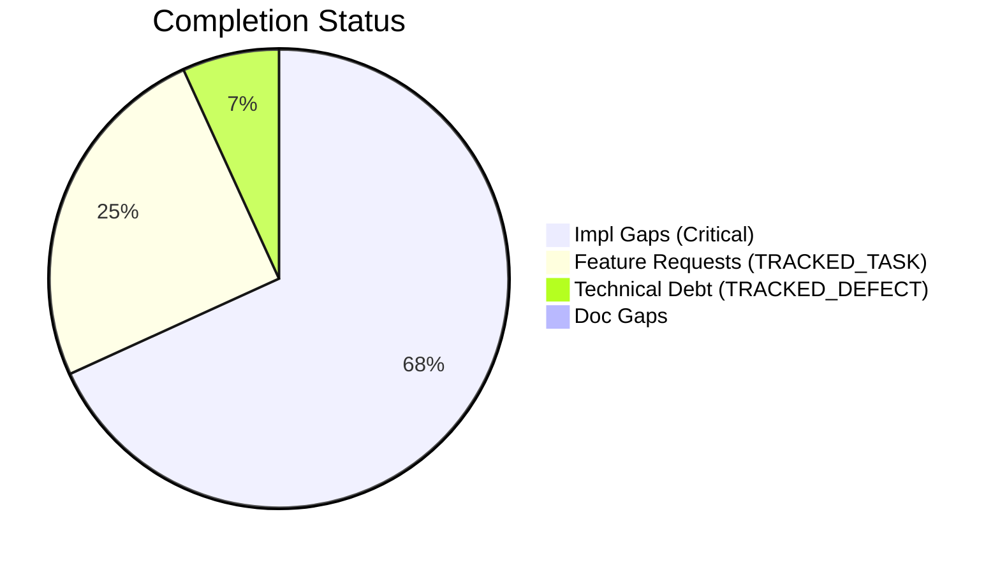
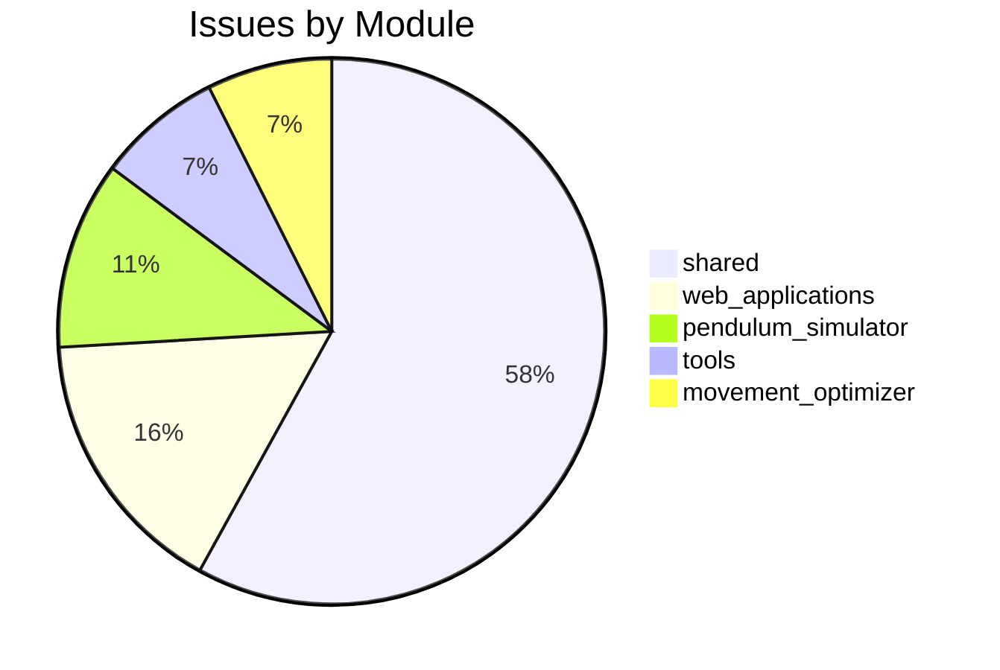

# Completist Report: 2026-07-19

## Executive Summary
- **Critical Gaps**: 60
- **Feature Gaps (TRACKED_TASK)**: 22
- **Technical Debt**: 6
- **Documentation Gaps**: 0

## Visualization
### Status Overview

### Top Impacted Modules

## Critical Incomplete (Top 50)
| File | Line | Type | Impact | Coverage | Complexity |
|---|---|---|---|---|---|
| `src/shared/python/ai/skills/registry.py:77:            async def run(self, invocation)` |  | Stub | 5 | 3 | 4 |
| `src/shared/python/ai/adapters/base.py` | 201 | NotImplementedError | 5 | 3 | 4 |
| `src/shared/python/ai/adapters/gemini_adapter.py` | 28 | NotImplementedError | 5 | 3 | 4 |
| `src/shared/python/ai/adapters/gemini_adapter.py` | 95 | NotImplementedError | 5 | 3 | 4 |
| `src/shared/python/ai/adapters/gemini_adapter.py` | 173 | NotImplementedError | 5 | 3 | 4 |
| `src/shared/python/ai/adapters/gemini_adapter.py` | 194 | NotImplementedError | 5 | 3 | 4 |
| `src/shared/python/ai/adapters/gemini_adapter.py` | 222 | NotImplementedError | 5 | 3 | 4 |
| `src/shared/python/ai/auth/authentication.py` | 15 | NotImplementedError | 5 | 3 | 4 |
| `src/shared/python/ai/auth/authentication.py` | 327 | NotImplementedError | 5 | 3 | 4 |
| `src/shared/python/ai/auth/authentication.py` | 330 | NotImplementedError | 5 | 3 | 4 |
| `src/shared/python/ai/auth/authentication.py` | 341 | NotImplementedError | 5 | 3 | 4 |
| `src/shared/python/ai/auth/authentication.py` | 355 | NotImplementedError | 5 | 3 | 4 |
| `src/shared/python/ai/auth/authentication.py` | 358 | NotImplementedError | 5 | 3 | 4 |
| `src/shared/python/ai/auth/authentication.py` | 369 | NotImplementedError | 5 | 3 | 4 |
| `src/shared/python/ai/auth/authentication.py` | 398 | NotImplementedError | 5 | 3 | 4 |
| `src/shared/python/ai/gui/_provider_config_widgets.py` | 66 | NotImplementedError | 5 | 3 | 4 |
| `src/shared/python/ai/integrations/obsidian.py` | 4 | NotImplementedError | 5 | 3 | 4 |
| `src/shared/python/chat/router_factory.py` | 316 | NotImplementedError | 5 | 3 | 4 |
| `src/shared/python/chat/router_factory.py` | 351 | NotImplementedError | 5 | 3 | 4 |
| `src/shared/python/chat/service_base.py` | 424 | NotImplementedError | 5 | 3 | 4 |
| `src/shared/python/chat/service_base.py` | 433 | NotImplementedError | 5 | 3 | 4 |
| `src/shared/python/chat/service_base.py` | 438 | NotImplementedError | 5 | 3 | 4 |
| `src/shared/python/chat/service_base.py` | 450 | NotImplementedError | 5 | 3 | 4 |
| `src/shared/python/data_processor_io/rust_engine.py` | 18 | NotImplementedError | 5 | 3 | 4 |
| `src/shared/python/data_processor_io/rust_engine.py` | 312 | NotImplementedError | 5 | 3 | 4 |
| `src/shared/python/data_processor_io/rust_engine.py` | 396 | NotImplementedError | 5 | 3 | 4 |
| `src/shared/python/data_processor_io/rust_engine.py` | 403 | NotImplementedError | 5 | 3 | 4 |
| `src/shared/python/data_processor_io/rust_engine.py` | 475 | NotImplementedError | 5 | 3 | 4 |
| `src/shared/python/model_generation/explorer/model_explorer.py` | 61 | NotImplementedError | 5 | 3 | 4 |
| `src/shared/python/sidekick/ui/tools_sidebar/state_profile_actions.py` | 21 | NotImplementedError | 5 | 3 | 4 |
| `src/shared/python/sidekick/ui/tools_sidebar/state_profile_actions.py` | 24 | NotImplementedError | 5 | 3 | 4 |
| `src/shared/python/sidekick/ui/tools_sidebar/tab_display_names.py` | 78 | NotImplementedError | 5 | 3 | 4 |
| `src/shared/python/sidekick/ui/tools_sidebar/tab_popout.py` | 31 | NotImplementedError | 5 | 3 | 4 |
| `src/shared/python/sidekick/ui/tools_sidebar/tab_popout.py` | 34 | NotImplementedError | 5 | 3 | 4 |
| `src/shared/python/sidekick/ui/tools_sidebar/tab_popout.py` | 37 | NotImplementedError | 5 | 3 | 4 |
| `src/shared/python/sidekick/ui/tools_sidebar/tab_popout.py` | 40 | NotImplementedError | 5 | 3 | 4 |
| `src/shared/python/sidekick/ui/tools_sidebar/tab_popout.py` | 43 | NotImplementedError | 5 | 3 | 4 |
| `src/shared/python/sidekick/ui/tools_sidebar/tab_popout.py` | 46 | NotImplementedError | 5 | 3 | 4 |
| `src/shared/python/sidekick/ui/tools_sidebar/tab_settings_panel.py` | 45 | NotImplementedError | 5 | 3 | 4 |
| `src/shared/python/sidekick/ui/tools_sidebar/tab_settings_panel.py` | 48 | NotImplementedError | 5 | 3 | 4 |
| `src/shared/python/sidekick/ui/tools_sidebar/tab_settings_panel.py` | 51 | NotImplementedError | 5 | 3 | 4 |
| `src/shared/python/sidekick/ui/tools_sidebar/tab_settings_panel.py` | 56 | NotImplementedError | 5 | 3 | 4 |
| `scripts/legacy_tools/code_quality_check.py` | 37 | NotImplementedError | 3 | 2 | 4 |
| `src/tools/README.md` | 38 | NotImplementedError | 3 | 2 | 4 |
| `src/tools/quality_utils.py` | 41 | NotImplementedError | 3 | 2 | 4 |
| `src/movement_optimizer/gui/animation_control.py` | 52 | NotImplementedError | 1 | 2 | 4 |
| `src/movement_optimizer/gui/animation_control.py` | 56 | NotImplementedError | 1 | 2 | 4 |
| `src/movement_optimizer/gui/optimization_mixin.py` | 69 | NotImplementedError | 1 | 2 | 4 |
| `src/movement_optimizer/gui/optimization_mixin.py` | 73 | NotImplementedError | 1 | 2 | 4 |
| `src/movement_optimizer/gui/optimization_mixin.py` | 77 | NotImplementedError | 1 | 2 | 4 |

## Feature Gap Matrix
| Module | Feature Gap | Type |
|---|---|---|
| `scripts/generate_comprehensive_assessment.py` | stats["todos"] += content.count("TODO") | TRACKED_TASK |
| `scripts/generate_comprehensive_assessment.py` | grades["O"] = (max(0, score_o), f"Technical Debt (TODO+FIXME): {debt}") | TRACKED_TASK |
| `src/data_processing/data_processor/python/data_processor/core/script_generator.py` | # The "TODO" below is intentional generated-script content for the user | TRACKED_TASK |
| `src/shared/python/ai/adapters/gemini_adapter.py` | A future PR (TODO(#2764)) should implement option A: translate | TRACKED_TASK |
| `src/shared/python/ai/adapters/gemini_adapter.py` | TODO(#2764): replace this with a real translation from | TRACKED_TASK |
| `src/shared/python/ai/auth/authentication.py` | f"OAuth login for provider {provider!r} is not implemented (TODO #5227). " | TRACKED_TASK |
| `src/shared/python/ai/auth/authentication.py` | f"Email/password login for {email!r} is not implemented (TODO #5227). " | TRACKED_TASK |
| `src/shared/python/ai/auth/authentication.py` | # TODO(#5227): Exchange refresh token for new access token | TRACKED_TASK |
| `src/web_applications/RESPONSIVE_DESIGN_DECISIONS.md` | 2. **[TODO] Touch Target Sizing** | TRACKED_TASK |
| `src/web_applications/RESPONSIVE_DESIGN_DECISIONS.md` | 3. **[TODO] Mobile Optimizations** | TRACKED_TASK |
| `src/web_applications/RESPONSIVE_DESIGN_DECISIONS.md` | 4. **[TODO] Error Handling** | TRACKED_TASK |
| `src/web_applications/RESPONSIVE_DESIGN_DECISIONS.md` | 5. **[TODO] Focus Management** | TRACKED_TASK |
| `src/web_applications/RESPONSIVE_DESIGN_DECISIONS.md` | 1. **[TODO] Responsive Testing** | TRACKED_TASK |
| `src/web_applications/RESPONSIVE_DESIGN_DECISIONS.md` | 2. **[TODO] Touch Target Sizing** | TRACKED_TASK |
| `src/web_applications/RESPONSIVE_DESIGN_DECISIONS.md` | 3. **[TODO] Keyboard Accessibility** | TRACKED_TASK |
| `src/web_applications/RESPONSIVE_DESIGN_DECISIONS.md` | 4. **[TODO] Error Toast Implementation** | TRACKED_TASK |
| `src/web_applications/RESPONSIVE_DESIGN_DECISIONS.md` | 5. **[TODO] Mobile Features** | TRACKED_TASK |
| `src/web_applications/RESPONSIVE_DESIGN_DECISIONS.md` | 1. **[TODO] Responsive 3D Viewport** | TRACKED_TASK |
| `src/web_applications/RESPONSIVE_DESIGN_DECISIONS.md` | 2. **[TODO] Touch Interactions** | TRACKED_TASK |
| `src/web_applications/RESPONSIVE_DESIGN_DECISIONS.md` | 3. **[TODO] File Upload Mobile** | TRACKED_TASK |
| `src/web_applications/RESPONSIVE_DESIGN_DECISIONS.md` | 4. **[TODO] Accessibility for 3D Content** | TRACKED_TASK |
| `tests/tools/test_matlab_quality_utils.py` | Path("script.m"), "% TODO: fix this", 5, issues | TRACKED_TASK |

## Technical Debt Register
| File | Line | Issue | Type |
|---|---|---|---|
| `scripts/generate_comprehensive_assessment.py` | 143 | stats["fixmes"] += content.count("FIXME") | FIXME |
| `src/tools/matlab_quality_utils.py` | 324 | """Check for TRACKED_TASK, TRACKED_DEFECT, HACK, XXX, and placeholders.""" | XXX |
| `src/tools/matlab_quality_utils.py` | 333 | (r"\bHACK\b", "HACK comment found"), | HACK |
| `src/tools/matlab_quality_utils.py` | 334 | (r"\bXXX\b", "XXX comment found"), | XXX |
| `src/tools/matlab_utilities/README.md` | 261 | - TRACKED_TASK, TRACKED_DEFECT, HACK, XXX placeholders | XXX |
| `tests/tools/test_matlab_quality_utils.py` | 95 | Path("script.m"), "% FIXME: broken", 3, issues | FIXME |

## Recommended Implementation Order
Prioritized by Impact (High) and Complexity (Low).
| Priority | File | Issue | Metrics (I/C/C) |
|---|---|---|---|
| 1 | `src/shared/python/ai/adapters/gemini_adapter.py` | A future PR (TODO(#2764)) should implement option A: translate | 5/3/3 |
| 2 | `src/shared/python/ai/adapters/gemini_adapter.py` | TODO(#2764): replace this with a real translation from | 5/3/3 |
| 3 | `src/shared/python/ai/auth/authentication.py` | f"OAuth login for provider {provider!r} is not implemented (TODO #5227). " | 5/3/3 |
| 4 | `src/shared/python/ai/auth/authentication.py` | f"Email/password login for {email!r} is not implemented (TODO #5227). " | 5/3/3 |
| 5 | `src/shared/python/ai/auth/authentication.py` | # TODO(#5227): Exchange refresh token for new access token | 5/3/3 |
| 6 | `src/shared/python/ai/skills/registry.py:77:            async def run(self, invocation)` | ... | 5/3/4 |
| 7 | `src/shared/python/ai/adapters/base.py` | # sufficient. The default implementations raise NotImplementedError | 5/3/4 |
| 8 | `src/shared/python/ai/adapters/gemini_adapter.py` | * raise :class:`NotImplementedError` if a caller passes a non-empty | 5/3/4 |
| 9 | `src/shared/python/ai/adapters/gemini_adapter.py` | non-empty ``tools`` argument raises :class:`NotImplementedError` rather | 5/3/4 |
| 10 | `src/shared/python/ai/adapters/gemini_adapter.py` | raise NotImplementedError( | 5/3/4 |
| 11 | `src/shared/python/ai/adapters/gemini_adapter.py` | NotImplementedError: If ``tools`` is non-empty (see issue #2764). | 5/3/4 |
| 12 | `src/shared/python/ai/adapters/gemini_adapter.py` | NotImplementedError: If ``tools`` is non-empty (see issue #2764). | 5/3/4 |
| 13 | `src/shared/python/ai/auth/authentication.py` | ``NotImplementedError`` unconditionally (Phase 1 of issue #2757). | 5/3/4 |
| 14 | `src/shared/python/ai/auth/authentication.py` | Never returns — always raises ``NotImplementedError``. | 5/3/4 |
| 15 | `src/shared/python/ai/auth/authentication.py` | NotImplementedError: Always. Real OAuth (PKCE + token exchange + | 5/3/4 |
| 16 | `src/shared/python/ai/auth/authentication.py` | raise NotImplementedError( | 5/3/4 |
| 17 | `src/shared/python/ai/auth/authentication.py` | Never returns — always raises ``NotImplementedError``. | 5/3/4 |
| 18 | `src/shared/python/ai/auth/authentication.py` | NotImplementedError: Always. Email/password authentication requires | 5/3/4 |
| 19 | `src/shared/python/ai/auth/authentication.py` | raise NotImplementedError( | 5/3/4 |
| 20 | `src/shared/python/ai/auth/authentication.py` | ``login_with_email_password`` raising ``NotImplementedError``) no | 5/3/4 |

## Issues Created
- Created `docs/assessments/issues/Issue_234735_Incomplete_Stub_in_registry_py_77_____________async_def_run_self__invocation.md`
- Created `docs/assessments/issues/Issue_234736_Incomplete_NotImplementedError_in_base_py_201.md`
- Created `docs/assessments/issues/Issue_234732_Incomplete_NotImplementedError_in_gemini_adapter_py_28.md`
- Created `docs/assessments/issues/Issue_234733_Incomplete_NotImplementedError_in_gemini_adapter_py_95.md`
- Created `docs/assessments/issues/Issue_234734_Incomplete_NotImplementedError_in_gemini_adapter_py_173.md`
- Created `docs/assessments/issues/Issue_234740_Incomplete_NotImplementedError_in_gemini_adapter_py_194.md`
- Created `docs/assessments/issues/Issue_234741_Incomplete_NotImplementedError_in_gemini_adapter_py_222.md`
- Created `docs/assessments/issues/Issue_234742_Incomplete_NotImplementedError_in_authentication_py_15.md`
- Created `docs/assessments/issues/Issue_234743_Incomplete_NotImplementedError_in_authentication_py_327.md`
- Created `docs/assessments/issues/Issue_234744_Incomplete_NotImplementedError_in_authentication_py_330.md`