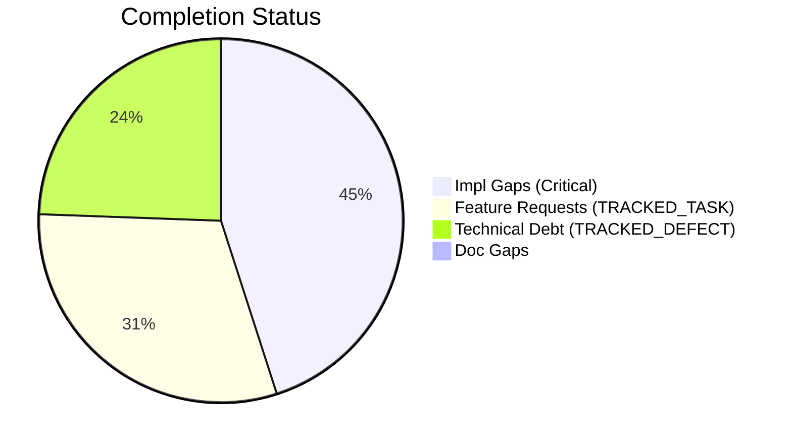
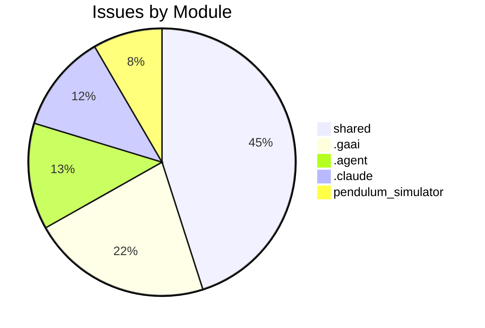

# Completist Report: 2026-07-26

## Executive Summary
- **Critical Gaps**: 118
- **Feature Gaps (TRACKED_TASK)**: 80
- **Technical Debt**: 64
- **Documentation Gaps**: 0

## Visualization
### Status Overview

### Top Impacted Modules

## Critical Incomplete (Top 50)
| File | Line | Type | Impact | Coverage | Complexity |
|---|---|---|---|---|---|
| `src/shared/python/model_generation/editor/editor_clipboard.py` | 36     def get_connecting_joint(self, | Stub | 5 | 3 | 4 |
| `src/shared/python/model_generation/editor/editor_modifications.py` | 50     def _save_state(self) -> | Stub | 5 | 3 | 4 |
| `src/shared/python/model_generation/editor/editor_modifications.py` | 52     def get_connecting_joint(self, | Stub | 5 | 3 | 4 |
| `src/shared/python/model_generation/editor/editor_modifications.py` | 54     def copy_subtree(self, | Stub | 5 | 3 | 4 |
| `src/shared/python/chat/export/copy_clipboard.py` | 29     def set_text(self, | Stub | 5 | 3 | 4 |
| `src/shared/python/chat/condensation/strategy.py` | 32     def summarise(self, | Stub | 5 | 3 | 4 |
| `src/shared/python/ai/integrations/github_mcp/integration.py` | 36     def is_started(self) -> | Stub | 5 | 3 | 4 |
| `src/shared/python/ai/integrations/github_mcp/integration.py` | 38     def add_server(self, | Stub | 5 | 3 | 4 |
| `src/shared/python/ai/mcp/widgets/health_query_api.py` | 68     def connected_count(self) -> | Stub | 5 | 3 | 4 |
| `src/shared/python/ai/mcp/widgets/health_query_api.py` | 69     def total_count(self) -> | Stub | 5 | 3 | 4 |
| `src/shared/python/ai/mcp/notebooklm_server.py` | 72     def search(self, | Stub | 5 | 3 | 4 |
| `src/shared/python/ai/mcp/notebooklm_server.py` | 73     def summarize(self, | Stub | 5 | 3 | 4 |
| `src/shared/python/ai/mcp/notebooklm_server.py` | 74     def metadata(self, | Stub | 5 | 3 | 4 |
| `src/shared/python/ai/mcp/notebooklm_server.py` | 77     def list_notebooks(self) -> list[dict[str, | Stub | 5 | 3 | 4 |
| `src/shared/python/ai/mcp/notebooklm_server.py` | 78     def create_notebook(self, | Stub | 5 | 3 | 4 |
| `src/shared/python/ai/mcp/notebooklm_server.py` | 85     def follow_citation(self, | Stub | 5 | 3 | 4 |
| `src/shared/python/ai/mcp/notebooklm_server.py` | 86     def attach_to_chat(self, | Stub | 5 | 3 | 4 |
| `src/shared/python/ai/mcp/notebooklm_server.py` | 87     def read_source(self, | Stub | 5 | 3 | 4 |
| `src/shared/python/ai/mcp/pool.py` | 38     def is_connected(self) -> | Stub | 5 | 3 | 4 |
| `src/shared/python/ai/mcp/pool.py` | 39     async def connect(self) -> | Stub | 5 | 3 | 4 |
| `src/shared/python/ai/mcp/pool.py` | 40     async def disconnect(self) -> | Stub | 5 | 3 | 4 |
| `src/shared/python/ai/mcp/pool.py` | 41     async def list_tools(self) -> | Stub | 5 | 3 | 4 |
| `src/shared/python/ai/mcp/pool.py` | 42     async def list_resources(self) -> | Stub | 5 | 3 | 4 |
| `src/shared/python/ai/mcp/pool.py` | 43     async def call_tool(self, | Stub | 5 | 3 | 4 |
| `src/shared/python/ai/mcp/client.py` | 51     async def start(self) -> | Stub | 5 | 3 | 4 |
| `src/shared/python/ai/mcp/client.py` | 52     async def stop(self) -> | Stub | 5 | 3 | 4 |
| `src/shared/python/ai/mcp/client.py` | 53     async def request(self, | Stub | 5 | 3 | 4 |
| `src/shared/python/ai/skills/builtin/summarize.py` | 22     async def summarize(self, | Stub | 5 | 3 | 4 |
| `src/shared/python/ai/skills/registry.py` | 77             async def run(self, | Stub | 5 | 3 | 4 |
| `src/shared/python/signal_toolkit/widget_protocol.py` | 127     def _update_plot(self, | Stub | 5 | 3 | 4 |
| `src/shared/python/signal_toolkit/widget_protocol.py` | 128     def _update_secondary_plot(self, | Stub | 5 | 3 | 4 |
| `src/shared/python/signal_toolkit/widget_protocol.py` | 136     def _log(self, | Stub | 5 | 3 | 4 |
| `src/shared/python/sidekick/ui/widgets/mixins/data_processor_ops.py` | 60         def _update_table(self) -> | Stub | 5 | 3 | 4 |
| `src/shared/python/sidekick/ui/widgets/mixins/data_processor_ops.py` | 61         def _update_column_selectors(self) -> | Stub | 5 | 3 | 4 |
| `src/shared/python/sidekick/ui/widgets/mixins/data_processor_ops.py` | 62         def refresh_statistics(self) -> | Stub | 5 | 3 | 4 |
| `src/shared/python/sidekick/ui/widgets/mixins/data_processor_ops.py` | 63         def _set_status(self, | Stub | 5 | 3 | 4 |
| `src/shared/python/sidekick/ui/tools_sidebar/os_terminal.py` | 97     def start(self) -> | Stub | 5 | 3 | 4 |
| `src/shared/python/sidekick/ui/tools_sidebar/os_terminal.py` | 99     def write(self, | Stub | 5 | 3 | 4 |
| `src/shared/python/sidekick/ui/tools_sidebar/os_terminal.py` | 101     def read(self, | Stub | 5 | 3 | 4 |
| `src/shared/python/sidekick/ui/tools_sidebar/os_terminal.py` | 103     def terminate(self) -> | Stub | 5 | 3 | 4 |
| `src/shared/python/sidekick/ui/tools_sidebar/os_terminal.py` | 105     def resize(self, | Stub | 5 | 3 | 4 |
| `src/shared/python/sidekick/ui/tools_sidebar/tab_visibility.py` | 25     def tab_id(self) -> | Stub | 5 | 3 | 4 |
| `src/shared/python/sidekick/ui/tools_sidebar/tab_visibility.py` | 28     def visible(self) -> | Stub | 5 | 3 | 4 |
| `src/shared/python/model_generation/explorer/model_explorer.py` | 61 | NotImplementedError | 5 | 3 | 4 |
| `src/shared/python/chat/router_factory.py` | 316 | NotImplementedError | 5 | 3 | 4 |
| `src/shared/python/chat/router_factory.py` | 351 | NotImplementedError | 5 | 3 | 4 |
| `src/shared/python/chat/service_base.py` | 424 | NotImplementedError | 5 | 3 | 4 |
| `src/shared/python/chat/service_base.py` | 433 | NotImplementedError | 5 | 3 | 4 |
| `src/shared/python/chat/service_base.py` | 438 | NotImplementedError | 5 | 3 | 4 |
| `src/shared/python/chat/service_base.py` | 450 | NotImplementedError | 5 | 3 | 4 |

## Feature Gap Matrix
| Module | Feature Gap | Type |
|---|---|---|
| `assessments/ASSESSMENT-SUMMARY.md` | - TODO audit and linking | TRACKED_TASK |
| `assessments/2026-04-29-ASSESSMENT-REPORT.md` | - **F — Code Craftsmanship:** 3,775 TODO/FIXME markers; high technical debt density | TRACKED_TASK |
| `assessments/2026-04-29-ASSESSMENT-REPORT.md` | - **3,775 TODO/FIXME markers** in src/ | TRACKED_TASK |
| `assessments/2026-04-29-ASSESSMENT-REPORT.md` | - **5,419 TODO/FIXME markers** (5x normal baseline) | TRACKED_TASK |
| `assessments/2026-04-29-ASSESSMENT-REPORT.md` | \| F         \| TODO audit & linking       \| 3 days \| Tech lead    \| Issue #2360 (draft) \| | TRACKED_TASK |
| `CHANGELOG.md` | - refactor: finalize A+ fleet quality (Zero Bare Except / Zero TODO) (#1829) | TRACKED_TASK |
| `CHANGELOG.md` | - refactor: finalize A+ fleet quality (Zero Bare Except / Zero TODO) (#1750) | TRACKED_TASK |
| `CHANGELOG.md` | - refactor: finalize A+ fleet quality (Zero Bare Except / Zero TODO) (#1829) | TRACKED_TASK |
| `CHANGELOG.md` | - refactor: finalize A+ fleet quality (Zero Bare Except / Zero TODO) (#1750) | TRACKED_TASK |
| `CHANGELOG.md` | - refactor: finalize A+ fleet quality (Zero Bare Except / Zero TODO) (#1829) | TRACKED_TASK |
| `CHANGELOG.md` | - refactor: finalize A+ fleet quality (Zero Bare Except / Zero TODO) (#1750) | TRACKED_TASK |
| `CHANGELOG.md` | - refactor: finalize A+ fleet quality (Zero Bare Except / Zero TODO) (#1829) | TRACKED_TASK |
| `CHANGELOG.md` | - refactor: finalize A+ fleet quality (Zero Bare Except / Zero TODO) (#1750) | TRACKED_TASK |
| `CHANGELOG.md` | - refactor: finalize A+ fleet quality (Zero Bare Except / Zero TODO) (#1829) | TRACKED_TASK |
| `CHANGELOG.md` | - refactor: finalize A+ fleet quality (Zero Bare Except / Zero TODO) (#1750) | TRACKED_TASK |
| `src/data_processing/data_processor/python/data_processor/core/script_generator.py` | # The "TODO" below is intentional generated-script content for the user | TRACKED_TASK |
| `src/web_applications/RESPONSIVE_DESIGN_DECISIONS.md` | 2. **[TODO] Touch Target Sizing** | TRACKED_TASK |
| `src/web_applications/RESPONSIVE_DESIGN_DECISIONS.md` | 3. **[TODO] Mobile Optimizations** | TRACKED_TASK |
| `src/web_applications/RESPONSIVE_DESIGN_DECISIONS.md` | 4. **[TODO] Error Handling** | TRACKED_TASK |
| `src/web_applications/RESPONSIVE_DESIGN_DECISIONS.md` | 5. **[TODO] Focus Management** | TRACKED_TASK |
| `src/web_applications/RESPONSIVE_DESIGN_DECISIONS.md` | 1. **[TODO] Responsive Testing** | TRACKED_TASK |
| `src/web_applications/RESPONSIVE_DESIGN_DECISIONS.md` | 2. **[TODO] Touch Target Sizing** | TRACKED_TASK |
| `src/web_applications/RESPONSIVE_DESIGN_DECISIONS.md` | 3. **[TODO] Keyboard Accessibility** | TRACKED_TASK |
| `src/web_applications/RESPONSIVE_DESIGN_DECISIONS.md` | 4. **[TODO] Error Toast Implementation** | TRACKED_TASK |
| `src/web_applications/RESPONSIVE_DESIGN_DECISIONS.md` | 5. **[TODO] Mobile Features** | TRACKED_TASK |
| `src/web_applications/RESPONSIVE_DESIGN_DECISIONS.md` | 1. **[TODO] Responsive 3D Viewport** | TRACKED_TASK |
| `src/web_applications/RESPONSIVE_DESIGN_DECISIONS.md` | 2. **[TODO] Touch Interactions** | TRACKED_TASK |
| `src/web_applications/RESPONSIVE_DESIGN_DECISIONS.md` | 3. **[TODO] File Upload Mobile** | TRACKED_TASK |
| `src/web_applications/RESPONSIVE_DESIGN_DECISIONS.md` | 4. **[TODO] Accessibility for 3D Content** | TRACKED_TASK |
| `src/shared/python/ai/adapters/gemini_adapter.py` | A future PR (TODO(#2764)) should implement option A: translate | TRACKED_TASK |
| `src/shared/python/ai/adapters/gemini_adapter.py` | TODO(#2764): replace this with a real translation from | TRACKED_TASK |
| `src/shared/python/ai/auth/authentication.py` | f"OAuth login for provider {provider!r} is not implemented (TODO #5227). " | TRACKED_TASK |
| `src/shared/python/ai/auth/authentication.py` | f"Email/password login for {email!r} is not implemented (TODO #5227). " | TRACKED_TASK |
| `src/shared/python/ai/auth/authentication.py` | # TODO(#5227): Exchange refresh token for new access token | TRACKED_TASK |
| `generate_real_assessments.py` | todos = run_cmd("grep -rnw 'TODO' src/ \| wc -l").strip() | TRACKED_TASK |
| `SPEC.md` | 2. Fill in every section — leave nothing as "[TODO]" | TRACKED_TASK |
| `scripts/generate_comprehensive_assessment.py` | stats["todos"] += content.count("TODO") | TRACKED_TASK |
| `scripts/generate_comprehensive_assessment.py` | grades["O"] = (max(0, score_o), f"Technical Debt (TODO+FIXME): {debt}") | TRACKED_TASK |
| `CONTRIBUTING.md` | \| No `TODO`/`FIXME` without issue ref \| CI grep                            \| Traceability         | TRACKED_TASK |
| `CLAUDE.md` | 8. No TODO/FIXME unless tied to a tracked GitHub issue | TRACKED_TASK |
| `.gaai/core/skills/cross/delivery-readiness-audit/SKILL.md` | - "TODO", "à remplacer", "à migrer" | TRACKED_TASK |
| `.gaai/project/contexts/rules/project.rules.md` | 10. No TODO/FIXME comments unless a tracked GitHub issue exists. | TRACKED_TASK |
| `.gaai/project/contexts/artefacts/impl-reports/GH1736.impl-report.md` | Resolved the PP-BrokenWindows assessment finding for `src/`. The actual scope in this repo was narro | TRACKED_TASK |
| `.gaai/project/contexts/artefacts/impl-reports/GH1736.impl-report.md` | \| `src/data_processing/data_processor/python/data_processor/core/script_generator.py`        \| Add | TRACKED_TASK |
| `.gaai/project/contexts/artefacts/impl-reports/GH1736.impl-report.md` | - The fleet assessment counted 747 TODOs + 391 FIXMEs across 2529 files (fleet-wide). This repo's `s | TRACKED_TASK |
| `.gaai/project/contexts/artefacts/qa-reports/GH1495.qa-report.md` | - No TODO/FIXME without tracked issue — PASS (none added) | TRACKED_TASK |
| `.gaai/project/contexts/artefacts/qa-reports/GH1496.qa-report.md` | \| No TODO/FIXME without tracked issue \| None added                                             \|  | TRACKED_TASK |
| `.gaai/project/contexts/artefacts/qa-reports/GH1701.qa-report.md` | \| No TODO/FIXME without issue \| PASS — no TODO added                                   \| | TRACKED_TASK |
| `.gaai/project/contexts/artefacts/qa-reports/GH1697.qa-report.md` | - No TODO/FIXME without issue references: PASS — none introduced | TRACKED_TASK |
| `.gaai/project/contexts/artefacts/qa-reports/GH1486.qa-report.md` | - No TODO/FIXME left | TRACKED_TASK |

## Technical Debt Register
| File | Line | Issue | Type |
|---|---|---|---|
| `src/shared/python/chat/terminal_runtime.py` | 46 | "TEMP", | TEMP |
| `src/shared/python/ai/mcp/client.py` | 45 | _ALLOWLIST_ENV_KEYS = ("PATH", "HOME", "USERPROFILE", "SYSTEMROOT", "TEMP", "TMP") | TEMP |
| `src/tools/matlab_quality_utils.py` | 324 | """Check for TRACKED_TASK, TRACKED_DEFECT, HACK, XXX, and placeholders.""" | XXX |
| `src/tools/matlab_quality_utils.py` | 333 | (r"\bHACK\b", "HACK comment found"), | HACK |
| `src/tools/matlab_quality_utils.py` | 334 | (r"\bXXX\b", "XXX comment found"), | XXX |
| `src/tools/matlab_utilities/README.md` | 261 | - TRACKED_TASK, TRACKED_DEFECT, HACK, XXX placeholders | XXX |
| `generate_real_assessments.py` | 38 | fixmes = run_cmd("grep -rnw 'FIXME' src/ \| wc -l").strip() | FIXME |
| `scripts/generate_comprehensive_assessment.py` | 143 | stats["fixmes"] += content.count("FIXME") | FIXME |
| `.agent/workflows/issues-5-combined.md` | 42 | Closes #XXX, closes #XXX, closes #XXX, closes #XXX, closes #XXX | XXX |
| `.agent/workflows/lint.md` | 34 | grep -rn "TRACKED_TASK\\|TRACKED_DEFECT\\|XXX\\|HACK\\|NotImplementedError\\|pass$" --include="*.py" | XXX |
| `.agent/skills/update-issues/SKILL.md` | 143 | \| #XXX  \| Title \| High     \| assessment.md \| | XXX |
| `.agent/skills/update-issues/SKILL.md` | 149 | \| #XXX  \| Title \| Fixed in commit abc123 \| | XXX |
| `.agent/skills/update-issues/SKILL.md` | 155 | \| Description \| #XXX           \| | XXX |
| `.agent/skills/issues-10-sequential/SKILL.md` | 105 | \| 1   \| #XXX - Title \| #YYY \| Merged \| | XXX |
| `.agent/skills/issues-10-sequential/SKILL.md` | 106 | \| 2   \| #XXX - Title \| #YYY \| Merged \| | XXX |
| `.agent/skills/lint/SKILL.md` | 33 | - Search for `TRACKED_TASK`, `TRACKED_DEFECT`, `XXX`, `HACK` comments | XXX |
| `.agent/skills/lint/SKILL.md` | 38 | grep -rn "TRACKED_TASK\\|TRACKED_DEFECT\\|XXX\\|HACK\\|NotImplementedError\\|pass$" --include="*.py" | XXX |
| `.agent/skills/issues-5-combined/SKILL.md` | 67 | - #XXX: <brief description> | XXX |
| `.agent/skills/issues-5-combined/SKILL.md` | 68 | - #XXX: <brief description> | XXX |
| `.agent/skills/issues-5-combined/SKILL.md` | 69 | - #XXX: <brief description> | XXX |
| `.agent/skills/issues-5-combined/SKILL.md` | 70 | - #XXX: <brief description> | XXX |
| `.agent/skills/issues-5-combined/SKILL.md` | 71 | - #XXX: <brief description> | XXX |
| `.agent/skills/issues-5-combined/SKILL.md` | 73 | Closes #XXX, closes #XXX, closes #XXX, closes #XXX, closes #XXX | XXX |
| `.agent/skills/issues-5-combined/SKILL.md` | 88 | \| #XXX \| Title \| Brief fix description \| | XXX |
| `.agent/skills/issues-5-combined/SKILL.md` | 89 | \| #XXX \| Title \| Brief fix description \| | XXX |
| `.agent/skills/issues-5-combined/SKILL.md` | 90 | \| #XXX \| Title \| Brief fix description \| | XXX |
| `.agent/skills/issues-5-combined/SKILL.md` | 91 | \| #XXX \| Title \| Brief fix description \| | XXX |
| `.agent/skills/issues-5-combined/SKILL.md` | 92 | \| #XXX \| Title \| Brief fix description \| | XXX |
| `.agent/skills/issues-5-combined/SKILL.md` | 99 | Closes #XXX, closes #XXX, closes #XXX, closes #XXX, closes #XXX" | XXX |
| `.agent/skills/issues-5-combined/SKILL.md` | 145 | \| #XXX  \| Title \| Fixed  \| | XXX |
| `.agent/skills/issues-5-combined/SKILL.md` | 146 | \| #XXX  \| Title \| Fixed  \| | XXX |
| `.agent/skills/issues-5-combined/SKILL.md` | 147 | \| #XXX  \| Title \| Fixed  \| | XXX |
| `.agent/skills/issues-5-combined/SKILL.md` | 148 | \| #XXX  \| Title \| Fixed  \| | XXX |
| `.agent/skills/issues-5-combined/SKILL.md` | 149 | \| #XXX  \| Title \| Fixed  \| | XXX |
| `.gaai/core/skills/cross/friction-retrospective/SKILL.md` | 63 | - `signal: high` → automatic promotion candidate (CAND-XXX) | XXX |
| `.gaai/core/skills/cross/friction-retrospective/SKILL.md` | 70 | - **High-Signal Events (CAND-XXX):** each candidate with evidence, proposed promotion target, and re | XXX |
| `.gaai/core/skills/cross/friction-retrospective/SKILL.md` | 97 | - Promotion candidates (CAND-XXX) with evidence and recommended targets | XXX |
| `.gaai/core/skills/cross/friction-retrospective/SKILL.md` | 104 | - Every CAND-XXX has at least 2 supporting evidence entries (or 1 with `signal: high`) | XXX |
| `.gaai/project/contexts/artefacts/stories/GH1736.story.md` | 24 | - FIXME/XXX markers: 391 | FIXME |
| `.claude/skills/update-issues/SKILL.md` | 143 | \| #XXX  \| Title \| High     \| assessment.md \| | XXX |
| `.claude/skills/update-issues/SKILL.md` | 149 | \| #XXX  \| Title \| Fixed in commit abc123 \| | XXX |
| `.claude/skills/update-issues/SKILL.md` | 155 | \| Description \| #XXX           \| | XXX |
| `.claude/skills/issues-10-sequential/SKILL.md` | 105 | \| 1   \| #XXX - Title \| #YYY \| Merged \| | XXX |
| `.claude/skills/issues-10-sequential/SKILL.md` | 106 | \| 2   \| #XXX - Title \| #YYY \| Merged \| | XXX |
| `.claude/skills/lint/SKILL.md` | 33 | - Search for `TRACKED_TASK`, `TRACKED_DEFECT`, `XXX`, `HACK` comments | XXX |
| `.claude/skills/lint/SKILL.md` | 38 | grep -rn "TRACKED_TASK\\|TRACKED_DEFECT\\|XXX\\|HACK\\|NotImplementedError\\|pass$" --include="*.py" | XXX |
| `.claude/skills/issues-5-combined/SKILL.md` | 67 | - #XXX: <brief description> | XXX |
| `.claude/skills/issues-5-combined/SKILL.md` | 68 | - #XXX: <brief description> | XXX |
| `.claude/skills/issues-5-combined/SKILL.md` | 69 | - #XXX: <brief description> | XXX |
| `.claude/skills/issues-5-combined/SKILL.md` | 70 | - #XXX: <brief description> | XXX |
| `.claude/skills/issues-5-combined/SKILL.md` | 71 | - #XXX: <brief description> | XXX |
| `.claude/skills/issues-5-combined/SKILL.md` | 73 | Closes #XXX, closes #XXX, closes #XXX, closes #XXX, closes #XXX | XXX |
| `.claude/skills/issues-5-combined/SKILL.md` | 88 | \| #XXX \| Title \| Brief fix description \| | XXX |
| `.claude/skills/issues-5-combined/SKILL.md` | 89 | \| #XXX \| Title \| Brief fix description \| | XXX |
| `.claude/skills/issues-5-combined/SKILL.md` | 90 | \| #XXX \| Title \| Brief fix description \| | XXX |
| `.claude/skills/issues-5-combined/SKILL.md` | 91 | \| #XXX \| Title \| Brief fix description \| | XXX |
| `.claude/skills/issues-5-combined/SKILL.md` | 92 | \| #XXX \| Title \| Brief fix description \| | XXX |
| `.claude/skills/issues-5-combined/SKILL.md` | 99 | Closes #XXX, closes #XXX, closes #XXX, closes #XXX, closes #XXX" | XXX |
| `.claude/skills/issues-5-combined/SKILL.md` | 145 | \| #XXX  \| Title \| Fixed  \| | XXX |
| `.claude/skills/issues-5-combined/SKILL.md` | 146 | \| #XXX  \| Title \| Fixed  \| | XXX |
| `.claude/skills/issues-5-combined/SKILL.md` | 147 | \| #XXX  \| Title \| Fixed  \| | XXX |
| `.claude/skills/issues-5-combined/SKILL.md` | 148 | \| #XXX  \| Title \| Fixed  \| | XXX |
| `.claude/skills/issues-5-combined/SKILL.md` | 149 | \| #XXX  \| Title \| Fixed  \| | XXX |
| `tests/tools/test_matlab_quality_utils.py` | 95 | Path("script.m"), "% FIXME: broken", 3, issues | FIXME |

## Recommended Implementation Order
Prioritized by Impact (High) and Complexity (Low).
| Priority | File | Issue | Metrics (I/C/C) |
|---|---|---|---|
| 1 | `src/shared/python/ai/adapters/gemini_adapter.py` | A future PR (TODO(#2764)) should implement option A: translate | 5/3/3 |
| 2 | `src/shared/python/ai/adapters/gemini_adapter.py` | TODO(#2764): replace this with a real translation from | 5/3/3 |
| 3 | `src/shared/python/ai/auth/authentication.py` | f"OAuth login for provider {provider!r} is not implemented (TODO #5227). " | 5/3/3 |
| 4 | `src/shared/python/ai/auth/authentication.py` | f"Email/password login for {email!r} is not implemented (TODO #5227). " | 5/3/3 |
| 5 | `src/shared/python/ai/auth/authentication.py` | # TODO(#5227): Exchange refresh token for new access token | 5/3/3 |
| 6 | `src/shared/python/model_generation/editor/editor_clipboard.py` | model_id | 5/3/4 |
| 7 | `src/shared/python/model_generation/editor/editor_modifications.py` | None | 5/3/4 |
| 8 | `src/shared/python/model_generation/editor/editor_modifications.py` | model_id | 5/3/4 |
| 9 | `src/shared/python/model_generation/editor/editor_modifications.py` | model_id | 5/3/4 |
| 10 | `src/shared/python/chat/export/copy_clipboard.py` | text | 5/3/4 |
| 11 | `src/shared/python/chat/condensation/strategy.py` | messages | 5/3/4 |
| 12 | `src/shared/python/ai/integrations/github_mcp/integration.py` | bool | 5/3/4 |
| 13 | `src/shared/python/ai/integrations/github_mcp/integration.py` | config | 5/3/4 |
| 14 | `src/shared/python/ai/mcp/widgets/health_query_api.py` | int | 5/3/4 |
| 15 | `src/shared/python/ai/mcp/widgets/health_query_api.py` | int | 5/3/4 |
| 16 | `src/shared/python/ai/mcp/notebooklm_server.py` | notebook_id | 5/3/4 |
| 17 | `src/shared/python/ai/mcp/notebooklm_server.py` | notebook_id | 5/3/4 |
| 18 | `src/shared/python/ai/mcp/notebooklm_server.py` | notebook_id | 5/3/4 |
| 19 | `src/shared/python/ai/mcp/notebooklm_server.py` | Any]] | 5/3/4 |
| 20 | `src/shared/python/ai/mcp/notebooklm_server.py` | title | 5/3/4 |

## Issues Created
- Created `docs/assessments/issues/Issue_234745_Incomplete_Stub_in_editor_clipboard_py_36_____def_get_connecting_joint_self.md`
- Created `docs/assessments/issues/Issue_234746_Incomplete_Stub_in_editor_modifications_py_50_____def__save_state_self.md`
- Created `docs/assessments/issues/Issue_234747_Incomplete_Stub_in_editor_modifications_py_52_____def_get_connecting_joint_self.md`
- Created `docs/assessments/issues/Issue_234748_Incomplete_Stub_in_editor_modifications_py_54_____def_copy_subtree_self.md`
- Created `docs/assessments/issues/Issue_234749_Incomplete_Stub_in_copy_clipboard_py_29_____def_set_text_self.md`
- Created `docs/assessments/issues/Issue_234750_Incomplete_Stub_in_strategy_py_32_____def_summarise_self.md`
- Created `docs/assessments/issues/Issue_234751_Incomplete_Stub_in_integration_py_36_____def_is_started_self.md`
- Created `docs/assessments/issues/Issue_234752_Incomplete_Stub_in_integration_py_38_____def_add_server_self.md`
- Created `docs/assessments/issues/Issue_234753_Incomplete_Stub_in_health_query_api_py_68_____def_connected_count_self.md`
- Created `docs/assessments/issues/Issue_234754_Incomplete_Stub_in_health_query_api_py_69_____def_total_count_self.md`