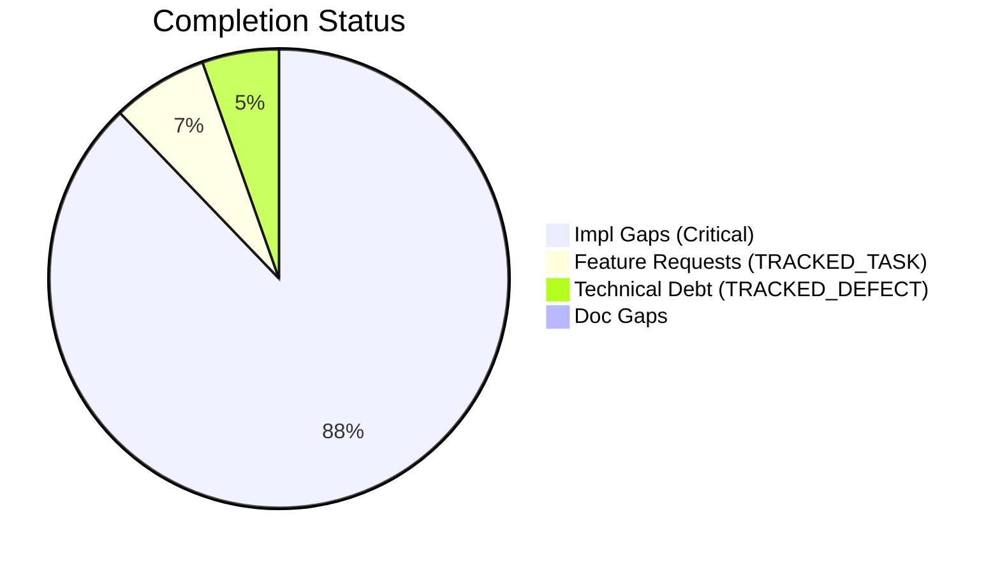
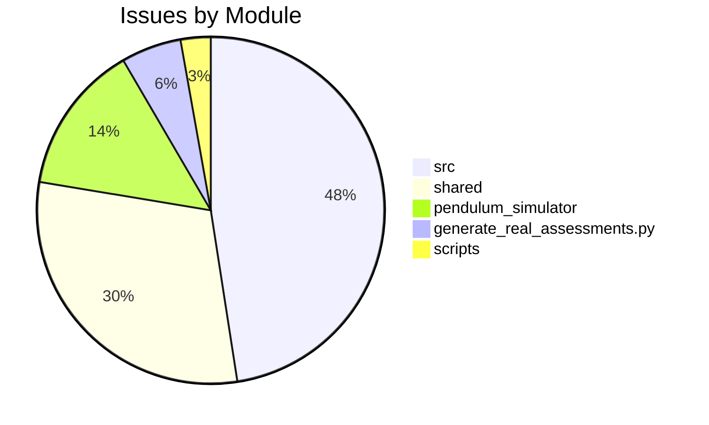

# Completist Report: 2026-08-02

## Executive Summary
- **Critical Gaps**: 130
- **Feature Gaps (TRACKED_TASK)**: 10
- **Technical Debt**: 8
- **Documentation Gaps**: 0

## Visualization
### Status Overview

### Top Impacted Modules

## Critical Incomplete (Top 50)
| File | Line | Type | Impact | Coverage | Complexity |
|---|---|---|---|---|---|
| `src/shared/python/ai/integrations/github_mcp/integration.py` | 36 | Stub | 5 | 3 | 4 |
| `src/shared/python/ai/integrations/github_mcp/integration.py` | 38 | Stub | 5 | 3 | 4 |
| `src/shared/python/ai/mcp/client.py` | 51 | Stub | 5 | 3 | 4 |
| `src/shared/python/ai/mcp/client.py` | 52 | Stub | 5 | 3 | 4 |
| `src/shared/python/ai/mcp/client.py` | 53 | Stub | 5 | 3 | 4 |
| `src/shared/python/ai/mcp/notebooklm_server.py` | 72 | Stub | 5 | 3 | 4 |
| `src/shared/python/ai/mcp/notebooklm_server.py` | 73 | Stub | 5 | 3 | 4 |
| `src/shared/python/ai/mcp/notebooklm_server.py` | 74 | Stub | 5 | 3 | 4 |
| `src/shared/python/ai/mcp/notebooklm_server.py` | 77 | Stub | 5 | 3 | 4 |
| `src/shared/python/ai/mcp/notebooklm_server.py` | 78 | Stub | 5 | 3 | 4 |
| `src/shared/python/ai/mcp/notebooklm_server.py` | 85 | Stub | 5 | 3 | 4 |
| `src/shared/python/ai/mcp/notebooklm_server.py` | 86 | Stub | 5 | 3 | 4 |
| `src/shared/python/ai/mcp/notebooklm_server.py` | 87 | Stub | 5 | 3 | 4 |
| `src/shared/python/ai/mcp/pool.py` | 38 | Stub | 5 | 3 | 4 |
| `src/shared/python/ai/mcp/pool.py` | 39 | Stub | 5 | 3 | 4 |
| `src/shared/python/ai/mcp/pool.py` | 40 | Stub | 5 | 3 | 4 |
| `src/shared/python/ai/mcp/pool.py` | 41 | Stub | 5 | 3 | 4 |
| `src/shared/python/ai/mcp/pool.py` | 42 | Stub | 5 | 3 | 4 |
| `src/shared/python/ai/mcp/pool.py` | 43 | Stub | 5 | 3 | 4 |
| `src/shared/python/ai/mcp/widgets/health_query_api.py` | 68 | Stub | 5 | 3 | 4 |
| `src/shared/python/ai/mcp/widgets/health_query_api.py` | 69 | Stub | 5 | 3 | 4 |
| `src/shared/python/ai/skills/builtin/summarize.py` | 22 | Stub | 5 | 3 | 4 |
| `src/shared/python/ai/skills/registry.py` | 77 | Stub | 5 | 3 | 4 |
| `src/shared/python/chat/condensation/strategy.py` | 32 | Stub | 5 | 3 | 4 |
| `src/shared/python/chat/export/copy_clipboard.py` | 29 | Stub | 5 | 3 | 4 |
| `src/shared/python/model_generation/editor/editor_clipboard.py` | 36 | Stub | 5 | 3 | 4 |
| `src/shared/python/model_generation/editor/editor_modifications.py` | 50 | Stub | 5 | 3 | 4 |
| `src/shared/python/model_generation/editor/editor_modifications.py` | 52 | Stub | 5 | 3 | 4 |
| `src/shared/python/model_generation/editor/editor_modifications.py` | 54 | Stub | 5 | 3 | 4 |
| `src/shared/python/sidekick/ui/tools_sidebar/os_terminal.py` | 97 | Stub | 5 | 3 | 4 |
| `src/shared/python/sidekick/ui/tools_sidebar/os_terminal.py` | 99 | Stub | 5 | 3 | 4 |
| `src/shared/python/sidekick/ui/tools_sidebar/os_terminal.py` | 101 | Stub | 5 | 3 | 4 |
| `src/shared/python/sidekick/ui/tools_sidebar/os_terminal.py` | 103 | Stub | 5 | 3 | 4 |
| `src/shared/python/sidekick/ui/tools_sidebar/os_terminal.py` | 105 | Stub | 5 | 3 | 4 |
| `src/shared/python/sidekick/ui/tools_sidebar/tab_visibility.py` | 25 | Stub | 5 | 3 | 4 |
| `src/shared/python/sidekick/ui/tools_sidebar/tab_visibility.py` | 28 | Stub | 5 | 3 | 4 |
| `src/shared/python/sidekick/ui/widgets/mixins/data_processor_ops.py` | 60 | Stub | 5 | 3 | 4 |
| `src/shared/python/sidekick/ui/widgets/mixins/data_processor_ops.py` | 61 | Stub | 5 | 3 | 4 |
| `src/shared/python/sidekick/ui/widgets/mixins/data_processor_ops.py` | 62 | Stub | 5 | 3 | 4 |
| `src/shared/python/sidekick/ui/widgets/mixins/data_processor_ops.py` | 63 | Stub | 5 | 3 | 4 |
| `src/shared/python/signal_toolkit/widget_protocol.py` | 127 | Stub | 5 | 3 | 4 |
| `src/shared/python/signal_toolkit/widget_protocol.py` | 128 | Stub | 5 | 3 | 4 |
| `src/shared/python/signal_toolkit/widget_protocol.py` | 136 | Stub | 5 | 3 | 4 |
| `./src/shared/python/model_generation/explorer/model_explorer.py` | 61 | NotImplementedError | 5 | 3 | 4 |
| `./src/shared/python/chat/router_factory.py` | 261 | NotImplementedError | 5 | 3 | 4 |
| `./src/shared/python/chat/router_factory.py` | 290 | NotImplementedError | 5 | 3 | 4 |
| `./src/shared/python/chat/service_base.py` | 424 | NotImplementedError | 5 | 3 | 4 |
| `./src/shared/python/chat/service_base.py` | 433 | NotImplementedError | 5 | 3 | 4 |
| `./src/shared/python/chat/service_base.py` | 438 | NotImplementedError | 5 | 3 | 4 |
| `./src/shared/python/chat/service_base.py` | 450 | NotImplementedError | 5 | 3 | 4 |

## Feature Gap Matrix
| Module | Feature Gap | Type |
|---|---|---|
| `./src/data_processing/data_processor/python/data_processor/core/script_generator.py` | # The "TODO" below is intentional generated-script content for the user | TRACKED_TASK |
| `./src/shared/python/ai/adapters/gemini_adapter.py` | A future PR (TODO(#2764)) should implement option A: translate | TRACKED_TASK |
| `./src/shared/python/ai/adapters/gemini_adapter.py` | TODO(#2764): replace this with a real translation from | TRACKED_TASK |
| `./src/shared/python/ai/auth/authentication.py` | f"OAuth login for provider {provider!r} is not implemented (TODO #5227). " | TRACKED_TASK |
| `./src/shared/python/ai/auth/authentication.py` | f"Email/password login for {email!r} is not implemented (TODO #5227). " | TRACKED_TASK |
| `./src/shared/python/ai/auth/authentication.py` | # TODO(#5227): Exchange refresh token for new access token | TRACKED_TASK |
| `./generate_real_assessments.py` | todos = run_cmd("grep -rnw 'TODO' src/ \| wc -l").strip() | TRACKED_TASK |
| `./scripts/generate_comprehensive_assessment.py` | stats["todos"] += content.count("TODO") | TRACKED_TASK |
| `./scripts/generate_comprehensive_assessment.py` | grades["O"] = (max(0, score_o), f"Technical Debt (TODO+FIXME): {debt}") | TRACKED_TASK |
| `./tests/tools/test_matlab_quality_utils.py` | Path("script.m"), "% TODO: fix this", 5, issues | TRACKED_TASK |

## Technical Debt Register
| File | Line | Issue | Type |
|---|---|---|---|
| `./src/shared/python/chat/terminal_runtime.py` | 46 | "TEMP", | TEMP |
| `./src/shared/python/ai/mcp/client.py` | 45 | _ALLOWLIST_ENV_KEYS = ("PATH", "HOME", "USERPROFILE", "SYSTEMROOT", "TEMP", "TMP") | TEMP |
| `./src/tools/matlab_quality_utils.py` | 324 | """Check for TRACKED_TASK, TRACKED_DEFECT, HACK, XXX, and placeholders.""" | XXX |
| `./src/tools/matlab_quality_utils.py` | 333 | (r"\bHACK\b", "HACK comment found"), | HACK |
| `./src/tools/matlab_quality_utils.py` | 334 | (r"\bXXX\b", "XXX comment found"), | XXX |
| `./generate_real_assessments.py` | 38 | fixmes = run_cmd("grep -rnw 'FIXME' src/ \| wc -l").strip() | FIXME |
| `./scripts/generate_comprehensive_assessment.py` | 143 | stats["fixmes"] += content.count("FIXME") | FIXME |
| `./tests/tools/test_matlab_quality_utils.py` | 95 | Path("script.m"), "% FIXME: broken", 3, issues | FIXME |

## Recommended Implementation Order
Prioritized by Impact (High) and Complexity (Low).
| Priority | File | Issue | Metrics (I/C/C) |
|---|---|---|---|
| 1 | `./src/shared/python/ai/adapters/gemini_adapter.py` | A future PR (TODO(#2764)) should implement option A: translate | 5/3/3 |
| 2 | `./src/shared/python/ai/adapters/gemini_adapter.py` | TODO(#2764): replace this with a real translation from | 5/3/3 |
| 3 | `./src/shared/python/ai/auth/authentication.py` | f"OAuth login for provider {provider!r} is not implemented (TODO #5227). " | 5/3/3 |
| 4 | `./src/shared/python/ai/auth/authentication.py` | f"Email/password login for {email!r} is not implemented (TODO #5227). " | 5/3/3 |
| 5 | `./src/shared/python/ai/auth/authentication.py` | # TODO(#5227): Exchange refresh token for new access token | 5/3/3 |
| 6 | `src/shared/python/ai/integrations/github_mcp/integration.py` | name | 5/3/4 |
| 7 | `src/shared/python/ai/integrations/github_mcp/integration.py` | name | 5/3/4 |
| 8 | `src/shared/python/ai/mcp/client.py` | name | 5/3/4 |
| 9 | `src/shared/python/ai/mcp/client.py` | name | 5/3/4 |
| 10 | `src/shared/python/ai/mcp/client.py` | name | 5/3/4 |
| 11 | `src/shared/python/ai/mcp/notebooklm_server.py` | name | 5/3/4 |
| 12 | `src/shared/python/ai/mcp/notebooklm_server.py` | name | 5/3/4 |
| 13 | `src/shared/python/ai/mcp/notebooklm_server.py` | name | 5/3/4 |
| 14 | `src/shared/python/ai/mcp/notebooklm_server.py` | name | 5/3/4 |
| 15 | `src/shared/python/ai/mcp/notebooklm_server.py` | name | 5/3/4 |
| 16 | `src/shared/python/ai/mcp/notebooklm_server.py` | name | 5/3/4 |
| 17 | `src/shared/python/ai/mcp/notebooklm_server.py` | name | 5/3/4 |
| 18 | `src/shared/python/ai/mcp/notebooklm_server.py` | name | 5/3/4 |
| 19 | `src/shared/python/ai/mcp/pool.py` | name | 5/3/4 |
| 20 | `src/shared/python/ai/mcp/pool.py` | name | 5/3/4 |

## Issues Created
- Created `docs/assessments/issues/Issue_001_Incomplete_Stub_in_integration_py_36.md`
- Created `docs/assessments/issues/Issue_002_Incomplete_Stub_in_integration_py_38.md`
- Created `docs/assessments/issues/Issue_003_Incomplete_Stub_in_client_py_51.md`
- Created `docs/assessments/issues/Issue_004_Incomplete_Stub_in_client_py_52.md`
- Created `docs/assessments/issues/Issue_005_Incomplete_Stub_in_client_py_53.md`
- Created `docs/assessments/issues/Issue_006_Incomplete_Stub_in_notebooklm_server_py_72.md`
- Created `docs/assessments/issues/Issue_007_Incomplete_Stub_in_notebooklm_server_py_73.md`
- Created `docs/assessments/issues/Issue_008_Incomplete_Stub_in_notebooklm_server_py_74.md`
- Created `docs/assessments/issues/Issue_009_Incomplete_Stub_in_notebooklm_server_py_77.md`
- Created `docs/assessments/issues/Issue_010_Incomplete_Stub_in_notebooklm_server_py_78.md`