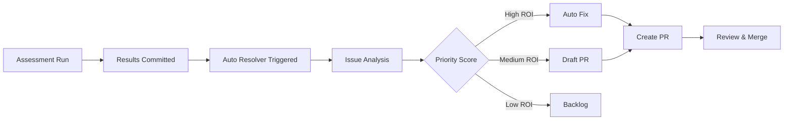

# Auto Issue Resolver System

## Overview

The Auto Issue Resolver is a GitHub Actions workflow that automatically addresses issues identified by repository assessments and creates pull requests to fix the top 5-10 issues based on priority and ROI (Return on Investment).

**Location:** `.github/workflows/auto-issue-resolver.yml`

## How It Works

### 1. Issue Prioritization

The workflow calculates priority scores for all open issues using the formula:

```
Priority Score = (Severity Score) / (Effort Hours)
```

**Severity Scoring:**
- BLOCKER: 100 points
- CRITICAL: 75 points
- MAJOR: 50 points
- MINOR: 25 points

**Examples:**
- CRITICAL issue with 2 hours effort: 75/2 = **37.5 priority** (very high)
- MAJOR issue with 8 hours effort: 50/8 = **6.25 priority** (medium)
- MINOR issue with 4 hours effort: 25/4 = **6.25 priority** (medium)

### 2. Automated Fix Strategies

The workflow implements intelligent fix strategies for common issue types:

| Issue Type | Detection | Fix Strategy |
|------------|-----------|--------------|
| **README Requirements** | Title contains "python requirements" or "readme" | Add Python version requirements section |
| **Print Statement Cleanup** | Title contains "print" and "logging" | Replace print() with logging calls |
| **Git Hygiene** | Title contains "hygiene" or body mentions `__pycache__` | Remove temp files, update .gitignore |
| **Path Validation** | Title contains "path validation" | Add validation logic to plugin manager |
| **Security Scanning** | Title contains "security" and body mentions "pip-audit" | Remove `\|\| true` from CI workflow |
| **Type Checking** | Title contains "mypy" | Remove `\|\| true` from CI workflow |

### 3. Pull Request Creation

For each issue resolved:
1. Creates a new branch: `auto-fix/issue-{number}-{timestamp}`
2. Applies automated fixes
3. Runs quality checks (Ruff, Black, pytest)
4. Commits changes with conventional commit format
5. Creates PR with detailed description
6. Links PR to original issue

## Triggering the Workflow

### Manual Trigger (Recommended)

```bash
# Via GitHub UI:
# 1. Go to Actions → Auto Issue Resolver → Run workflow
# 2. Configure options:
#    - Max issues: 5, 10, or 15
#    - Severity filter: BLOCKER, CRITICAL, MAJOR, or MINOR
#    - Mode: auto-fix, draft-pr, or analysis-only

# Via GitHub CLI:
gh workflow run auto-issue-resolver.yml \
  -f max_issues=5 \
  -f severity_filter=MAJOR \
  -f mode=auto-fix
```

### Automatic Triggers

**On Assessment Updates:**
- Triggers when new assessment results are committed to `docs/assessments/`
- Automatically processes top issues from latest assessment

**Weekly Schedule:**
- Runs every Monday at 3 AM UTC
- Processes backlog of open issues

## Workflow Modes

### 1. Auto-Fix Mode (Default)
- Automatically creates and merges fixes for low-risk issues
- Creates standard PRs for review
- Best for: Quick wins like documentation updates, hygiene fixes

### 2. Draft PR Mode
- Creates draft PRs for all fixes
- Requires manual review before marking ready
- Best for: MAJOR/CRITICAL issues requiring human oversight

### 3. Analysis Only Mode
- Analyzes and prioritizes issues
- Creates summary report
- Does NOT create PRs
- Best for: Understanding backlog, planning sprints

## Configuration

### Customizing Fix Strategies

Edit the `generate_fix.py` script in the workflow to add new fix strategies:

```python
elif 'your-pattern' in title_lower:
    print("Strategy: Your custom fix")
    fixes_applied.append("your_custom_fix")
```

Then implement the fix in the `apply-fixes` step:

```bash
if [[ "$STRATEGIES" == *"your_custom_fix"* ]]; then
  echo "Applying your custom fix..."
  # Your fix commands here
fi
```

### Adjusting Priority Weights

Modify severity scores in `prioritize_issues.py`:

```python
severity_scores = {
    'BLOCKER': 100,   # Increase to prioritize blockers more
    'CRITICAL': 75,
    'MAJOR': 50,
    'MINOR': 25
}
```

## Integration with Assessments

The workflow integrates with the assessment framework:

1. **Assessment Run** → Generates `Assessment_*_Results_*.md`
2. **Commit to main** → Triggers Auto Issue Resolver
3. **Gap Analysis** → Identifies missing GitHub issues
4. **Prioritization** → Ranks issues by ROI
5. **Resolution** → Creates fixes and PRs

### Assessment-Driven Flow



## Safety & Guardrails

### What the Workflow WON'T Do

- Modify production data or configurations
- Make breaking API changes
- Delete code without review
- Bypass CI/CD quality gates
- Auto-merge PRs (requires manual approval)

### Quality Gates

All PRs must pass:
- ✅ Ruff linting
- ✅ Black formatting
- ✅ Pytest collection (minimum check)
- ✅ Manual review approval

### Rollback Strategy

If an automated fix causes issues:
1. Close the PR
2. Revert the commit
3. Add issue to exclusion list (see below)
4. Create manual issue for investigation

### Excluding Issues from Auto-Resolution

Add labels to issues to prevent auto-resolution:
- `manual-only`: Never auto-resolve
- `needs-design`: Requires design discussion first
- `breaking-change`: Requires careful review

## Monitoring & Reporting

### Summary Reports

After each run, the workflow creates:
1. **GitHub Step Summary** - Visible in Actions UI
2. **Summary Issue** - Created in repository with label `report`

Example summary:
```
# Auto Issue Resolver - Run Summary

**Date:** 2026-01-17
**Mode:** auto-fix
**Total Issues Analyzed:** 24

## Issues Processed

1. #223: Update Documentation for Python Requirements
   - Priority: 100.00 | Severity: CRITICAL | Effort: 0.25h

2. #226: Repository Hygiene Cleanup
   - Priority: 50.00 | Severity: MINOR | Effort: 0.5h
```

### Metrics Tracked

- Issues resolved per run
- Average resolution time
- PR merge rate
- Fix success rate by strategy

## Best Practices

### For Repository Maintainers

1. **Review Draft PRs Promptly** - Auto-generated PRs should be reviewed within 24-48 hours
2. **Provide Feedback** - Comment on PRs to improve fix strategies
3. **Update Exclusions** - Mark issues that shouldn't be auto-resolved
4. **Monitor Patterns** - Track which fix strategies work best

### For Issue Authors

When creating issues that should be auto-resolvable:

1. **Use Standard Format** - Include severity in title (e.g., "CRITICAL: Fix X")
2. **Estimate Effort** - Add effort estimate in body (e.g., "Effort: M (4 hours)")
3. **Provide Context** - Include file paths and specific details
4. **Link Assessments** - Reference assessment finding IDs

Example issue template:
```markdown
## MAJOR: Add Input Validation to Tool Launcher

### Assessment Reference
- **Finding ID:** A-002
- **Risk Rank:** #5

### Current Behavior
No validation of tool paths...

### Proposed Solution
Add validation in python/src/core/plugin_manager.py...

### Effort: M (4 hours)
```

## Troubleshooting

### Workflow Fails to Create PR

**Symptom:** Workflow completes but no PR created

**Possible Causes:**
1. No changes committed (fix strategy didn't modify files)
2. Branch already exists with same name
3. Insufficient GitHub token permissions

**Solution:**
- Check workflow logs for "No changes to commit"
- Verify GitHub Actions has write permissions
- Manually trigger workflow with different timestamp

### Fix Strategy Not Applied

**Symptom:** PR created but expected changes missing

**Possible Causes:**
1. Issue title/body doesn't match detection pattern
2. Target files don't exist
3. Files already contain the fix

**Solution:**
- Review `generate_fix.py` detection logic
- Update issue title to match pattern
- Verify file paths in repository

### Quality Checks Fail

**Symptom:** Workflow fails at "Run quality checks" step

**Possible Causes:**
1. Automated fix introduced linting errors
2. Tests broken by changes
3. Black formatting not applied

**Solution:**
- Review Ruff/Black output in logs
- Fix strategy may need refinement
- Consider using draft-pr mode for complex fixes

## Future Enhancements

Planned improvements:

- [ ] Machine learning-based fix suggestions
- [ ] Integration with Copilot for code generation
- [ ] Multi-file refactoring support
- [ ] Dependency update automation
- [ ] Security vulnerability auto-patching
- [ ] Performance optimization suggestions

## Related Documentation

- [Assessment Framework](../assessments/README.md)
- [Gap Analysis Process](../assessments/Issue_Gap_Analysis_2026-01-17.md)
- [CI/CD Pipeline](./JULES_ARCHITECTURE.md)
- [Contributing Guidelines](../../CONTRIBUTING.md)

---

**Last Updated:** 2026-01-17
**Owner:** DevOps Team
**Status:** Active
